# Item list
All of the items currently in the game, with English localizations applied
This file is automatically generated from Valheim 0.218.15 using the JotunnDoc mod found on our GitHub.

|Item |Token |Name |Type |Description |
|---|---|---|---|---|
|Abomination_attack1|Swing attack|Swing attack|OneHandedWeapon|NULL|
|Abomination_attack2|Slam attack|Slam attack|OneHandedWeapon|NULL|
|Abomination_attack3|Stub to the ground|Stub to the ground|OneHandedWeapon|NULL|
|Acorn |$item_oakseeds|Acorns|Material|Plant them to grow an oak tree.|
|Amber |$item_amber|Amber|Material|<color=yellow>Valuable</color>|
|AmberPearl |$item_amberpearl|Amber Pearl|Material|<color=yellow>Valuable</color>|
|AncientSeed |$item_ancientseed|Ancient Seed|Material|Held against your ear, you hear tiny whisperings within...|
|ArmorAshlandsMediumChest |$item_chest_medium_ashlands|Breastplate of Ask|Chest|The first man in Midgard knew how to guard his most vital organs, perhaps with a breastplate just like this one.|
|ArmorAshlandsMediumlegs 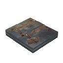|$item_legs_medium_ashlands|Trousers of Ask|Legs|The first man to roam Midgard preferred to tread lightly. Wearers of these trousers could learn a thing or two from him.|
|ArmorBronzeChest |$item_chest_bronze|Bronze Plate Tunic|Chest|A breastplate of hammered bronze.|
|ArmorBronzeLegs |$item_legs_bronze|Bronze plate Leggings|Legs|Bronze greaves to shield your legs.|
|ArmorCarapaceChest |$item_chest_carapace|Carapace Breastplate|Chest|A breastplate crafted from the burnished carapace of a giant insect.|
|ArmorCarapaceLegs |$item_legs_carapace|Carapace Greaves|Legs|Leg guards of a rigid carapace.|
|ArmorDress1 |$item_chest_dress1|Simple Dress Brown|Chest|A simple brown dress.|
|ArmorDress10 |$item_chest_dress10|Simple Dress Natural|Chest|A simple dress.|
|ArmorDress2 |$item_chest_dress2|Shawl Dress Brown|Chest|A brown dress accompanied by a warm shawl.|
|ArmorDress3 |$item_chest_dress3|Beaded Dress Brown|Chest|A brown dress accompanied by beads and silver.|
|ArmorDress4 |$item_chest_dress4|Simple Dress Blue|Chest|A simple blue dress.|
|ArmorDress5 |$item_chest_dress5|Shawl Dress Blue|Chest|A blue dress accompanied by a warm shawl.|
|ArmorDress6 |$item_chest_dress6|Beaded Dress Blue|Chest|A blue dress accompanied by beads and bronze.|
|ArmorDress7 |$item_chest_dress7|Simple Dress yellow|Chest|A simple yellow dress.|
|ArmorDress8 |$item_chest_dress8|Shawl Dress Yellow|Chest|A yellow dress accompanied by a warm shawl.|
|ArmorDress9 |$item_chest_dress9|Beaded Dress Yellow|Chest|A yellow dress accompanied by beads and silver.|
|ArmorFenringChest |$item_chest_fenris|Fenris Coat|Chest|The beast could draw deep breaths, so that its howl could be heard far across the land.|
|ArmorFenringLegs |$item_legs_fenris|Fenris Leggings|Legs|The legs of the beast were lean and strong, so that it could leap great strides.|
|ArmorFlametalChest |$item_chest_flametal|Flametal Breastplate|Chest|This fusion of mysterious flametal and charred bones serves as a protective layer more resilient than anything you could ever find in Midgard.|
|ArmorFlametalLegs 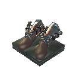|$item_legs_flametal|Flametal Greaves|Legs|Heavy trousers insulate against the heat, while solid greaves keep your shins safe from low blows.|
|ArmorIronChest |$item_chest_iron|Iron Scale Mail|Chest|An iron scale mail, this will turn all but the strongest of blows.|
|ArmorIronLegs |$item_legs_iron|Iron Greaves|Legs|Iron greaves to protect your legs.|
|ArmorLeatherChest |$item_chest_leather|Leather Tunic|Chest|A tunic made from animal hide.|
|ArmorLeatherLegs |$item_legs_leather|Leather Trousers|Legs|They squeak a little when you walk.|
|ArmorMageChest |$item_chest_mage|Eitr-weave Robe|Chest|These artfully layered robes have spells and charms sewn into every seam and fold.|
|ArmorMageChest_Ashlands |$item_chest_mage_ashlands|Robes of Embla|Chest|Imbued with the power of the first sorceress, these robes will grant a boon to any who seeks to wield the ancient art of magic.|
|ArmorMageLegs |$item_legs_mage|Eitr-weave Trousers|Legs|The trousers worn by mages are always especially tight. Discomfort fuels the focus that is needed for magic...|
|ArmorMageLegs_Ashlands |$item_legs_mage_ashlands|Trousers of Embla|Legs|Whether or not the first sorceress actually wore trousers exactly like these, we can never know.|
|ArmorPaddedCuirass |$item_chest_pcuirass|Padded Cuirass|Chest|Finely wrought and strong enough to turn even the sharpest blades.|
|ArmorPaddedGreaves |$item_legs_pgreaves|Padded Greaves|Legs|Expertly crafted leg protection.|
|ArmorRagsChest |$item_chest_rags|Rag Tunic|Chest|Better than nothing.|
|ArmorRagsLegs |$item_legs_rags|Rag Trousers|Legs|A simple remedy for nudity.|
|ArmorRootChest |$item_chest_root|Root Harnesk|Chest|Finely wrought and strong enough to turn even the sharpest blades.|
|ArmorRootLegs |$item_legs_root|Root Leggings|Legs|A light armor oddly woven together by ancient roots and bark.|
|ArmorTrollLeatherChest |$item_chest_trollleather|Troll Leather Tunic|Chest|Trolls are hard to skin but their leather is tough and warm.|
|ArmorTrollLeatherLegs |$item_legs_trollleather|Troll Leather Trousers|Legs|Leggings of tough troll hide.|
|ArmorTunic1 |$item_chest_tunic1|Simple Tunic Blue|Chest|A simple blue tunic.|
|ArmorTunic10 |$item_chest_tunic10|Simple Tunic Natural|Chest|A simple tunic.|
|ArmorTunic2 |$item_chest_tunic2|Cape Tunic Blue|Chest|A blue tunic accompanied by a cape.|
|ArmorTunic3 |$item_chest_tunic3|Beaded Tunic Blue|Chest|A blue tunic accompanied by beads and silver.|
|ArmorTunic4 |$item_chest_tunic4|Simple Tunic Red|Chest|A simple red tunic.|
|ArmorTunic5 |$item_chest_tunic5|Cape Tunic Red|Chest|A red tunic accompanied by a cape.|
|ArmorTunic6 |$item_chest_tunic6|Beaded Tunic Red|Chest|A red tunic accompanied by beads and bronze.|
|ArmorTunic7 |$item_chest_tunic7|Simple Tunic Yellow|Chest|A simple yellow tunic.|
|ArmorTunic8 |$item_chest_tunic8|Cape Tunic Yellow|Chest|A yellow tunic accompanied by a cape.|
|ArmorTunic9 |$item_chest_tunic9|Beaded Tunic Yellow|Chest|A yellow tunic accompanied by beads and silver.|
|ArmorWolfChest |$item_chest_wolf|Wolf Hide Chestpiece|Chest|A wolfskin jerkin, warm and wild-looking. It protects against the cold.|
|ArmorWolfLegs |$item_legs_wolf|Wolf Hide Trousers|Legs|Shaggy breeches of wolfskin.|
|ArrowBronze |$item_arrow_bronze|Bronzehead Arrow|Ammo|Sharper than flint. A sleek messenger of death.|
|ArrowCarapace |$item_arrow_carapace|Carapace Arrow|Ammo|Heavy and pointy, this one's gonna hurt.|
|ArrowCharred |$item_arrow_charred|Charred Arrow|Ammo|This arrow has been whittled into shape from a charred femur, and it's as hard as any metal.|
|ArrowFire |$item_arrow_fire|Fire Arrow|Ammo|This arrow burns whatever it pierces.|
|ArrowFlint |$item_arrow_flint|Flinthead Arrow|Ammo|A hide-breaker with a head of flint.|
|ArrowFrost |$item_arrow_frost|Frost Arrow|Ammo|A shard of piercing ice.|
|ArrowIron |$item_arrow_iron|Ironhead Arrow|Ammo|Capped with iron and flighted with dark feathers.|
|ArrowNeedle |$item_arrow_needle|Needle Arrow|Ammo|The final stitch.|
|ArrowObsidian |$item_arrow_obsidian|Obsidian Arrow|Ammo|A sliver of darkness.|
|ArrowPoison |$item_arrow_poison|Poison Arrow|Ammo|A bitter sting from afar.|
|ArrowSilver |$item_arrow_silver|Silver Arrow|Ammo|A needle to calm restless spirits.|
|ArrowWood |$item_arrow_wood|Wood Arrow|Ammo|An arrow of sharpened wood.|
|AskBladder |$item_askbladder|Asksvin Bladder|Material|An acidic smell still lingers. Prominently.|
|AskHide |$item_askhide|Asksvin Hide|Material|This sturdy leather is thick, and still warm to the touch.|
|Asksvin_Bite|lox bite|lox bite|OneHandedWeapon|NULL|
|Asksvin_Headbutt|Dragon claw left|Dragon claw left|OneHandedWeapon|NULL|
|Asksvin_Pounce|lox bite|lox bite|OneHandedWeapon|NULL|
|Asksvin_Turnaround|lox bite|lox bite|OneHandedWeapon|NULL|
|AsksvinCarrionNeck 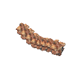|$item_asksvincarrionneck|Asksvin Neck|Material|A neck in its final stage of life.|
|AsksvinCarrionPelvic |$item_asksvincarrionpelvic|Asksvin Pelvis|Material|The pelvic bone of a four legged creature.|
|AsksvinCarrionRibcage 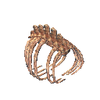|$item_asksvincarrionribcage|Asksvin Ribcage|Material|These ribs have already been stripped clean of any meat.|
|AsksvinCarrionSkull |$item_asksvincarrionskull|Asksvin Skull|Material|A thick skull, with room for a surprisingly large brain.|
|AsksvinEgg |$item_asksvin_egg|Asksvin Egg|Misc|Hard as rock, yet you can sense the presence of something inside. This should be kept warm.|
|AsksvinMeat |$item_asksvin_meat|Asksvin Tail|Material|Smells a bit smokey, even when raw.|
|AtgeirBlackmetal |$item_atgeir_blackmetal|Black Metal Atgeir|TwoHandedWeapon|A vicious hewing-axe of almost unbreakable black metal.|
|AtgeirBronze |$item_atgeir_bronze|Bronze Atgeir|TwoHandedWeapon|A true warrior's tool.|
|AtgeirHimminAfl |$item_atgeir_himminafl|Himminafl|TwoHandedWeapon|It might not be a hammer, but Thor himself would still approve of this weapon.|
|AtgeirIron |$item_atgeir_iron|Iron Atgeir|TwoHandedWeapon|Blood-drinker, skull-cracker, death-bringer.|
|AxeBerzerkr 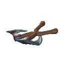|$item_axe_berzerkr|Berserkir Axes|TwoHandedWeapon|Let your rage take over and face the slaughter.|
|AxeBerzerkrBlood 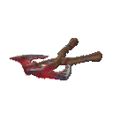|$item_axe_berzerkr_blood|Bleeding Berserkir Axes|TwoHandedWeapon|The closer you are to death, the harder you are sure to hit.|
|AxeBerzerkrLightning 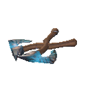|$item_axe_berzerkr_lightning|Thundering Berserkir Axes|TwoHandedWeapon|Carnage spreads around you when you wield these axes, such that Thor himself would be proud.|
|AxeBerzerkrNature 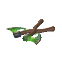|$item_axe_berzerkr_nature|Primal Berserkir Axes|TwoHandedWeapon|Your most primal instincts take over, and the nature around you reaches out to aid you.|
|AxeBlackMetal |$item_axe_blackmetal|Black Metal Axe|OneHandedWeapon|A perfectly-balanced axe forged from dark metal with an emerald sheen.|
|AxeBronze |$item_axe_bronze|Bronze Axe|OneHandedWeapon|A bright and burnished blade, curved like a smile.|
|AxeFlint |$item_axe_flint|Flint Axe|OneHandedWeapon|Sharper than stone.|
|AxeIron |$item_axe_iron|Iron Axe|OneHandedWeapon|Sharp and strong, a woodcutter's friend.|
|AxeJotunBane |$item_axe_jotunbane|Jotun Bane|OneHandedWeapon|Not even the giants of old could weather the poisonous bite of this weapon.|
|AxeStone |$item_axe_stone|Stone Axe|OneHandedWeapon|A crude axe for tree-felling.|
|babyseeker_attack|Dragon claw left|Dragon claw left|OneHandedWeapon|NULL|
|BarberKit |$item_barberkit|Barber Kit|Misc|A kit fit for the finest of barbers.|
|Barley |$item_barley|Barley|Material|A bundle of barley.|
|BarleyFlour |$item_barleyflour|Barley Flour|Material|Great for baking bread.|
|BarleyWine |$item_barleywine|Fire Resistance Barley Wine|Consumable|Fortifies you against fire.|
|BarleyWineBase |$item_barleywinebase|Barley Wine Base: Fire Resistance|Material|Needs to be fermented.|
|bat_melee|Bat melee|Bat melee|OneHandedWeapon|NULL|
|Battleaxe |$item_battleaxe|Battleaxe|TwoHandedWeapon|Skull-splitter, a warrior's joy.|
|BattleaxeCrystal |$item_battleaxe_crystal|Crystal Battleaxe|TwoHandedWeapon|It's see-through and tears through.|
|Beard1 |$customization_beard01|Long 1|Customization|NULL|
|Beard10 |$customization_beard10|Braided 4|Customization|NULL|
|Beard11 |$customization_beard11|Thick 2|Customization|NULL|
|Beard12 |$customization_beard12|Royal 1|Customization|NULL|
|Beard13 |$customization_beard13|Royal 2|Customization|NULL|
|Beard14 |$customization_beard14|Braided 5|Customization|NULL|
|Beard15 |$customization_beard15|Short 4|Customization|NULL|
|Beard16 |$customization_beard16|Stonedweller|Customization|NULL|
|Beard17 |$customization_beard17|Neat|Customization|NULL|
|Beard18 |$customization_beard18|Royal 3|Customization|NULL|
|Beard19 |$customization_beard19|Bushy|Customization|NULL|
|Beard2 |$customization_beard02|Long 2|Customization|NULL|
|Beard20 |$customization_beard20|Spiky|Customization|NULL|
|Beard21 |$customization_beard21|Short 5|Customization|NULL|
|Beard3 |$customization_beard03|Short 1|Customization|NULL|
|Beard4 |$customization_beard04|Short 2|Customization|NULL|
|Beard5 |$customization_beard05|Braided 1|Customization|NULL|
|Beard6 |$customization_beard06|Braided 2|Customization|NULL|
|Beard7 |$customization_beard07|Short 3|Customization|NULL|
|Beard8 |$customization_beard08|Thick 1|Customization|NULL|
|Beard9 |$customization_beard09|Braided 3|Customization|NULL|
|BeardNone|$customization_nobeard|No Beard|Customization|NULL|
|BeechSeeds |$item_beechseeds|Beech Seeds|Material|Plant them to grow a beech tree.|
|Bell |$item_bell|Bell|Misc|For whom does the bell toll?|
|BellFragment 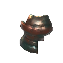|$item_bellfragment|Bell Fragment|Material|This ancient fragment appears to be a piece of a broken bell...|
|BeltStrength |$item_beltstrength|Megingjord|Utility|Gives the wearer superhuman strength.|
|Bilebag |$item_bilebag|Bilebag|Material|Caustic bile drawn from the corpse of a gjall.|
|BirchSeeds |$item_birchseeds|Birch Seeds|Material|Plant them to grow a birch tree.|
|BlackCore |$item_blackcore|Black Core|Material|Filled to the brim with ancient power.|
|BlackMarble |$item_blackmarble|Black Marble|Material|A block of solid stone, seamed with shifting colors.|
|BlackMetal |$item_blackmetal|Black Metal|Material|A heavy bar of dark metal.|
|BlackMetalScrap |$item_blackmetalscrap|Black Metal Scrap|Material|A twisted hunk of dark metal.|
|BlackSoup |$item_blacksoup|Black Soup|Consumable|A perfect balance of sweetness and acidity.|
|Blackwood 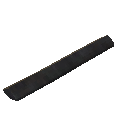|$item_blackwood|Ashwood|Material|Wood hardened by fire and ash.|
|blob_attack_aoe|fart|fart|OneHandedWeapon|NULL|
|blobelite_attack_aoe|fart|fart|OneHandedWeapon|NULL|
|blobLava_attack_aoe||NULL|OneHandedWeapon|NULL|
|blobtar_attack|fireballattack|fireballattack|OneHandedWeapon|NULL|
|Bloodbag |$item_bloodbag|Bloodbag|Material|The contents of a leech. Ick!|
|BloodPudding |$item_bloodpudding|Blood Pudding|Consumable|It's bloody tasty.|
|Blueberries |$item_blueberries|Blueberries|Consumable|Tiny but tasty.|
|boar_base_attack|boar attack1|boar attack1|OneHandedWeapon|NULL|
|BoarJerky |$item_boarjerky|Boar Jerky|Consumable|Lean and salty.|
|BoltBlackmetal |$item_bolt_blackmetal|Blackmetal Bolt|Ammo|A sleek bolt of dark metal.|
|BoltBone |$item_bolt_bone|Bone Bolt|Ammo|A crude bolt of yellowed bone.|
|BoltCarapace |$item_bolt_carapace|Carapace Bolt|Ammo|A heavy and solid bolt.|
|BoltCharred |$item_bolt_charred|Charred Bolt|Ammo|A sturdy bone from a forearm, shaped into a deadly bolt.|
|BoltIron |$item_bolt_iron|Iron Bolt|Ammo|A sturdy iron missile.|
|BombBile |$item_bilebomb|Bile Bomb|OneHandedWeapon|Handle with care.|
|BombLava |$item_lavabomb|Basalt Bomb|OneHandedWeapon|With enough heat, it solidifies upon explosion.|
|BombOoze |$item_oozebomb|Ooze Bomb|OneHandedWeapon|The stench is unbearable...|
|BombSiege |$item_catapult_ammo|Explosive Payload|Material|Best used with a catapult. Handle with care.|
|BombSmoke 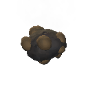|$item_smokebomb|Smoke Bomb|OneHandedWeapon|Everyone knows you can't breathe in the smoke.|
|BoneFragments |$item_bonefragments|Bone Fragments|Material|A pile of shattered bones.|
|bonemass_attack_aoe|heal|heal|OneHandedWeapon|NULL|
|bonemass_attack_punch|slap|slap|OneHandedWeapon|NULL|
|bonemass_attack_spawn|heal|heal|OneHandedWeapon|NULL|
|bonemass_attack_throw|slime throw|slime throw|OneHandedWeapon|NULL|
|BonemawSerpent_bite|Serpent bite|Serpent bite|OneHandedWeapon|NULL|
|BonemawSerpent_breath|Fallen Valkyrie Poison Breath|Fallen Valkyrie Poison Breath|OneHandedWeapon|NULL|
|BonemawSerpent_ram|Serpent bite|Serpent bite|OneHandedWeapon|NULL|
|BonemawSerpent_spit|bonemaw spit|bonemaw spit|OneHandedWeapon|NULL|
|BonemawSerpent_taunt|Serpent Taunt|Serpent Taunt|OneHandedWeapon|NULL|
|BoneMawSerpentMeat |$item_bonemawmeat|Bonemaw Meat|Material|A tasty, white fish meat. Very good for your bones!|
|BonemawSerpentScale 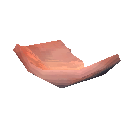|$item_bonemawscale|Bonemaw Scale|Material|It looks just like bone. Best not to question the anatomy of this creature too much...|
|BonemawSerpentTooth 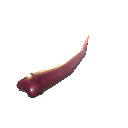|$item_bonemawtooth|Bonemaw Tooth|Material|This has caused the death of many a brave sailor.|
|Bow |$item_bow|Crude Bow|Bow|A crude but functional bow.|
|BowAshlands 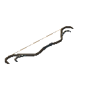|$item_bow_ashlands|Ash Fang|Bow|Risen again from the ashes, this bow holds unyielding strength.|
|BowAshlandsBlood |$item_bow_ashlandsblood|Blood Fang|Bow|Arrows loosed from this bow will tear into flesh with unmatched ferocity.|
|BowAshlandsRoot |$item_bow_ashlandsroot|Root Fang|Bow|Like the twisting branch was made to seek the sun, this bow was made to seek the slaughter.|
|BowAshlandsStorm |$item_bow_ashlandsstorm|Storm Fang|Bow|Let your arrows fly as swift as the lightning strikes.|
|BowDraugrFang |$item_bow_draugrfang|Draugr Fang|Bow|Dark wood strung with glistening sinew. A vicious thing.|
|BowFineWood |$item_bow_finewood|Finewood Bow|Bow|A simple bow of strong and supple wood.|
|BowHuntsman |$item_bow_huntsman|Huntsman Bow|Bow|Finely worked and strung. A huntsman's joy.|
|BowSpineSnap |$item_bow_snipesnap|Spinesnap|Bow|Using this bow is backbreaking work but so worth it.|
|Bread |$item_bread|Bread|Consumable|A tasty loaf of bread.|
|BreadDough |$item_breaddough|Bread Dough|Material|Ready for the oven.|
|Bronze |$item_bronze|Bronze|Material|A strong alloy of copper and tin.|
|BronzeNails |$item_bronzenails|Bronze Nails|Material|Used in construction of ships and furniture.|
|BronzeScrap |$item_bronzescrap|Scrap Bronze|Material|It's old and oxidized but can be smelted and used again.|
|BugMeat |$item_bug_meat|Seeker Meat|Material|When you crack open their shells, the meat within is tender and succulent.|
|CapeAsh |$item_cape_ash|Ashen Cape|Shoulder|Thin metal threads are woven into this cape to create an intricate pattern, like a destiny woven by the Norns themselves.|
|CapeAsksvin |$item_cape_asksvin|Asksvin Cloak|Shoulder|This thick cape catches the wind, not unlike the sail of a ship.|
|CapeDeerHide |$item_cape_deerhide|Deer Hide Cape|Shoulder|Rustic chic.|
|CapeFeather |$item_cape_feather|Feather Cape|Shoulder|Donning this cape makes you feel lighter, almost as if you could fly!|
|CapeLinen |$item_cape_linen|Linen Cape|Shoulder|A simple traveler's cape.|
|CapeLox |$item_cape_lox|Lox Cape|Shoulder|A pelt from one of the great beasts, thick and warm.|
|CapeOdin |$item_cape_odin|Cape of Odin|Shoulder|Odin's finest warriors deserve the finest cloth.|
|CapeTest |CAPE TEST|CAPE TEST|Shoulder|Da cape|
|CapeTrollHide |$item_cape_trollhide|Troll Hide Cape|Shoulder|Trollskin is tough and supple.|
|CapeWolf |$item_cape_wolf|Wolf Fur Cape|Shoulder|Wolves are natural survivors. This one was just unlucky. Now its pelt will warm you in the snow.|
|Carapace |$item_carapace|Carapace|Material|A plate of chitinous armor.|
|Carrot |$item_carrot|Carrot|Consumable|An orange treat.|
|CarrotSeeds |$item_carrotseeds|Carrot Seeds|Material|Plant these if you like carrots...|
|CarrotSoup |$item_carrotsoup|Carrot Soup|Consumable|A warm tasty soup made of mostly carrots.|
|Catapult_ammo |$item_catapult_training_ammo|Grausten Payload|Material|Best used with a catapult. Make sure nothing fragile is in the way. |
|CelestialFeather 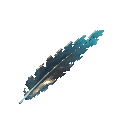|$item_celestialfeather|Celestial Feather|Material|The only remnant of the fallen valkyrie's former self.|
|CeramicPlate 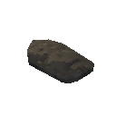|$item_ceramicplate|Ceramic Plate|Material|No matter how hot this gets, the other side of it remains strangely cool.|
|Chain |$item_chain|Chain|Material|A link of iron chain.|
|CharcoalResin |$item_charcoalresin|Charcoal Resin|Material|The resin from a tree that was set ablaze a long time ago. It's still ready to burn some more.|
|charred_bow |Bow|Bow|Bow|A simple bow. |
|charred_bow_Fader |Bow|Bow|Bow|A simple bow. |
|charred_bow_volley |Bow|Bow|Bow|A simple bow. |
|charred_bow_volley_Fader 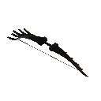|Bow|Bow|Bow|A simple bow. |
|Charred_Breastplate 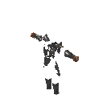|Iron plate armor|Iron plate armor|Chest|An iron scale mail, this will turn all but the strongest of blows.|
|charred_dyrnwyn_greatsword_feint |Charred Sword|Charred Sword|TwoHandedWeapon|NULL|
|charred_dyrnwyn_greatsword_swing 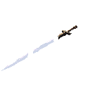|Charred Sword|Charred Sword|TwoHandedWeapon|NULL|
|charred_dyrnwyn_greatsword_thrust |Charred Sword|Charred Sword|TwoHandedWeapon|NULL|
|charred_dyrnwyn_greatsword_thrustfeint |Charred Sword|Charred Sword|TwoHandedWeapon|NULL|
|charred_fader_greatsword_feint |Charred Sword|Charred Sword|TwoHandedWeapon|NULL|
|charred_fader_greatsword_swing |Charred Sword|Charred Sword|TwoHandedWeapon|NULL|
|charred_fader_greatsword_thrust |Charred Sword|Charred Sword|TwoHandedWeapon|NULL|
|charred_fader_greatsword_thrustfeint |Charred Sword|Charred Sword|TwoHandedWeapon|NULL|
|charred_greatsword_feint |Charred Sword|Charred Sword|TwoHandedWeapon|NULL|
|charred_greatsword_swing |Charred Sword|Charred Sword|TwoHandedWeapon|NULL|
|charred_greatsword_thrust |Charred Sword|Charred Sword|TwoHandedWeapon|NULL|
|charred_greatsword_thrustfeint 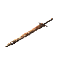|Charred Sword|Charred Sword|TwoHandedWeapon|NULL|
|Charred_Helmet |Iron plate armor|Iron plate armor|Helmet|An iron scale mail, this will turn all but the strongest of blows.|
|Charred_HipCloth |Iron plate armor|Iron plate armor|Legs|An iron scale mail, this will turn all but the strongest of blows.|
|Charred_MageCloths |Iron plate armor|Iron plate armor|Chest|An iron scale mail, this will turn all but the strongest of blows.|
|charred_magestaff_fire |Bow|Bow|TwoHandedWeapon|A simple bow. |
|charred_magestaff_summon |Bow|Bow|TwoHandedWeapon|A simple bow. |
|charred_twitcher_scratch_l|Charred Sword|Charred Sword|TwoHandedWeapon|NULL|
|charred_twitcher_scratch_r|Charred Sword|Charred Sword|TwoHandedWeapon|NULL|
|charred_twitcher_throw |Bow|Bow|Bow|A simple bow. |
|CharredBone |$item_charredbone|Charred Bone|Material|Followed by the distinct smell of burnt meat.|
|CharredCogwheel 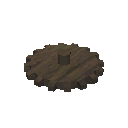|$item_charredcogwheel|Charred Cogwheel|Material|This could be used for some clever machinery...|
|Charredskull |$item_charredskull|Charred Skull|Material|The blackened skull of a long-dead warrior. It's unlikely that a proper burial would grant them any peace.|
|chest_hildir1 |$item_chest_hildir1|Hildir's Brass Chest|Misc|Property of Hildir, please return if found.|
|chest_hildir2 |$item_chest_hildir2|Hildir's Silver Chest|Misc|Property of Hildir, please return if found.|
|chest_hildir3 |$item_chest_hildir3|Hildir's Bronze Chest|Misc|Property of Hildir, please return if found.|
|ChickenEgg |$item_chicken_egg|Egg|Misc|Keep it warm to see what comes out.. but what came first, really?|
|ChickenMeat |$item_chicken_meat|Chicken Meat|Material|All chickens bear the ancestral curse of being delicious.|
|Chitin |$item_chitin|Chitin|Material|A shard of crustacean shell.|
|Cloudberry |$item_cloudberries|Cloudberries|Consumable|The gold of the forest.|
|Club |$item_club|Club|OneHandedWeapon|A crude but useful weapon.|
|Coal |$item_coal|Coal|Material|A lump of coal.|
|Coins |$item_coins|Coins|Material|<color=yellow>Valuable</color>|
|CookedAsksvinMeat 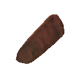|$item_asksvin_meat_cooked|Cooked Asksvin Tail|Consumable|This meat has a potent and mature flavour, but is very tasty when grilled right.|
|CookedBoneMawSerpentMeat 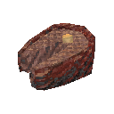|$item_bonemawmeat_cooked|Cooked Bonemaw Meat|Consumable|The boiling sea did nothing to this meat, but grilling it over the fire has given it a delightful crisp.|
|CookedBugMeat |$item_bug_meat_cooked|Cooked Seeker Meat|Consumable|Succulent white meat. A true delicacy.|
|CookedChickenMeat |$item_chicken_meat_cooked|Cooked Chicken Meat|Consumable|It tastes like chicken.|
|CookedDeerMeat |$item_deer_meat_cooked|Cooked Deer Meat|Consumable|All that running paid off.|
|CookedEgg |$item_egg_cooked|Cooked Egg|Consumable|Sunny side up!|
|CookedHareMeat |$item_hare_meat_cooked|Cooked Hare Meat|Consumable|Stringy but flavorful.|
|CookedLoxMeat |$item_loxmeat_cooked|Cooked Lox Meat|Consumable|A great hunk of tender meat, food fit for Valhalla!|
|CookedMeat |$item_boar_meat_cooked|Cooked Boar Meat|Consumable|An earthly taste.|
|CookedVoltureMeat 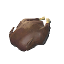|$item_volture_meat_cooked|Cooked Volture Meat|Consumable|A chewy and somewhat dry meat. Some seasoning would probably make it taste better, but it'll fill your stomach regardless.|
|CookedWolfMeat |$item_wolf_meat_cooked|Cooked Wolf Meat|Consumable|A wild taste.|
|Copper |$item_copper|Copper|Material|A bar of pure copper ready to be worked.|
|CopperOre |$item_copperore|Copper Ore|Material|Unrefined copper. Needs to be refined in a smelter.|
|CopperScrap |$item_copperscrap|Copper Scrap|Material|One person's scrap is another person's treasure.|
|CrossbowArbalest |$item_crossbow_arbalest|Arbalest|Bow|A slow but powerful weapon.|
|CrossbowRipper |$item_crossbow_ripper|Ripper|Bow|Rips your foes apart, simple as that.|
|CrossbowRipperBlood |$item_crossbow_ripper_blood|Wound Ripper|Bow|Ready to rend your enemies to pieces.|
|CrossbowRipperLightning |$item_crossbow_ripper_lightning|Storm Ripper|Bow|The bolts will tear through your enemies like a particularly nasty gale.|
|CrossbowRipperNature |$item_crossbow_ripper_nature|Root Ripper|Bow|If the bolt doesn't pin your foe in place, the roots surging up from the ground surely will.|
|CryptKey |$item_cryptkey|Swamp Key|Misc|Partly covered in caked mud, it smells foetid.|
|Crystal |$item_crystal|Crystal|Material|A shard of crystal from deep within the earth.|
|Cultivator |$item_cultivator|Cultivator|Tool|A farming tool for tilling soil.|
|Dandelion |$item_dandelion|Dandelion|Material|Some call it a weed, but it's pretty nonetheless.|
|Deathsquito_sting|Wraith melee|Wraith melee|OneHandedWeapon|NULL|
|DeerHide |$item_deerhide|Deer Hide|Material|A cleaned hide from a deer.|
|DeerMeat |$item_deer_meat|Deer Meat|Material||
|DeerStew |$item_deerstew|Deer Stew|Consumable|Fall-apart tender.|
|Demister |$item_demister|Wisplight|Utility|A bound wisp to guide you through the thickest of mists.|
|dragon_bite|Dragon claw left|Dragon claw left|OneHandedWeapon|NULL|
|dragon_claw_left|Dragon claw left|Dragon claw left|OneHandedWeapon|NULL|
|dragon_claw_right|Dragon claw left|Dragon claw left|OneHandedWeapon|NULL|
|dragon_coldbreath|dragon breath|dragon breath|OneHandedWeapon|NULL|
|dragon_coldbreath_OLD|dragon breath|dragon breath|OneHandedWeapon|NULL|
|dragon_spit_shotgun|cold ball|cold ball|OneHandedWeapon|NULL|
|dragon_taunt|scream|scream|OneHandedWeapon|NULL|
|DragonEgg |$item_dragonegg|Dragon Egg|Misc|Far heavier than it looks, with a faint humming sound from within.|
|DragonTear |$item_dragontear|Dragon Tear|Material|The last frozen tear of a dragon, pulsating with mysterious energy.|
|draugr_arrow |Ironhead arrow|Ironhead arrow|Ammo|Fire it with a bow.|
|draugr_axe |Dragur axe|Dragur axe|OneHandedWeapon|NULL|
|draugr_bow |Bow|Bow|Bow|A simple bow. |
|draugr_sword |Dragur axe|Dragur axe|OneHandedWeapon|NULL|
|Dverger_melee|Club|Club|OneHandedWeapon|A crude but useful weapon.|
|Dverger_meleeAshlands|Club|Club|OneHandedWeapon|A crude but useful weapon.|
|DvergerArbalest |$item_crossbow_arbalest|Arbalest|Utility|A slow but powerful weapon.|
|DvergerArbalest_shoot |$item_crossbow_arbalest|Arbalest|OneHandedWeapon|A slow but powerful weapon.|
|DvergerArbalest_shootAshlands |$item_crossbow_arbalest|Arbalest|OneHandedWeapon|A slow but powerful weapon.|
|DvergerHairFemale |Iron plate armor|Iron plate armor|Legs|An iron scale mail, this will turn all but the strongest of blows.|
|DvergerHairFemale_Redhair |Iron plate armor|Iron plate armor|Legs|An iron scale mail, this will turn all but the strongest of blows.|
|DvergerHairMale |Iron plate armor|Iron plate armor|Helmet|An iron scale mail, this will turn all but the strongest of blows.|
|DvergerHairMale_Redbeard 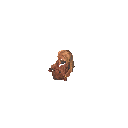|Iron plate armor|Iron plate armor|Helmet|An iron scale mail, this will turn all but the strongest of blows.|
|DvergerMistile|Club|Club|OneHandedWeapon|A crude but useful weapon.|
|DvergerStaffBlocker|Club|Club|OneHandedWeapon|A crude but useful weapon.|
|DvergerStaffFire |Club|Club|Utility|A crude but useful weapon.|
|DvergerStaffFire_clusterbomb|Club|Club|OneHandedWeapon|A crude but useful weapon.|
|DvergerStaffFire_fireball|Club|Club|OneHandedWeapon|A crude but useful weapon.|
|DvergerStaffHeal |Club|Club|Utility|A crude but useful weapon.|
|DvergerStaffHeal_heal|Club|Club|OneHandedWeapon|A crude but useful weapon.|
|DvergerStaffIce |Club|Club|Utility|A crude but useful weapon.|
|DvergerStaffIce_icebolt|Club|Club|OneHandedWeapon|A crude but useful weapon.|
|DvergerStaffNova|Club|Club|OneHandedWeapon|A crude but useful weapon.|
|DvergerStaffSupport |Club|Club|Utility|A crude but useful weapon.|
|DvergerStaffSupport_buff|Club|Club|OneHandedWeapon|A crude but useful weapon.|
|DvergerSuitArbalest |Iron plate armor|Iron plate armor|Chest|An iron scale mail, this will turn all but the strongest of blows.|
|DvergerSuitArbalest_Ashlands 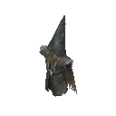|Iron plate armor|Iron plate armor|Chest|An iron scale mail, this will turn all but the strongest of blows.|
|DvergerSuitFire |Iron plate armor|Iron plate armor|Chest|An iron scale mail, this will turn all but the strongest of blows.|
|DvergerSuitIce |Iron plate armor|Iron plate armor|Chest|An iron scale mail, this will turn all but the strongest of blows.|
|DvergerSuitSupport |Iron plate armor|Iron plate armor|Chest|An iron scale mail, this will turn all but the strongest of blows.|
|DvergrKey |$item_dvergrkey|Sealbreaker|Misc|An object used to break a Dverger seal.|
|DvergrKeyFragment |$item_dvergrkeyfragment|Sealbreaker Fragment|Material|A fragment of a Dvergr sealbreaker.|
|DvergrNeedle |$item_dvergrneedle|Dvergr Extractor|Material|Looks like a perfect piece for piercing something...|
|DyrnwynBladeFragment |$item_Dyrnwyn_blade|Dyrnwyn Blade Fragment|Material|Parts of an old blade. If all the pieces were reassembled it could likely be made whole.|
|DyrnwynHiltFragment |$item_Dyrnwyn_hilt|Dyrnwyn Hilt Fragment|Material|The hilt of a long forgotten sword. Perhaps it could be reforged if one had all the pieces...|
|DyrnwynTipFragment 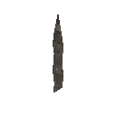|$item_Dyrnwyn_tip|Dyrnwyn Tip Fragment|Material|This shard of metal looks like the tip of a sword. One might be able to reforge the blade if more pieces are found...|
|Eikthyr_antler|StagAttack1|StagAttack1|OneHandedWeapon|NULL|
|Eikthyr_charge|StagAttack2|StagAttack2|OneHandedWeapon|NULL|
|Eikthyr_flegs_OLD|StagAttack1|StagAttack1|OneHandedWeapon|NULL|
|Eikthyr_stomp|slap|slap|OneHandedWeapon|NULL|
|Eitr |$item_eitr|Refined Eitr|Material|This is the stuff of life, the poison that consumes itself. The Dvergr refine it to use in their esoteric designs.|
|ElderBark |$item_elderbark|Ancient Bark|Material|An ancient and sturdy material.|
|Entrails |$item_entrails|Entrails|Material|A slimy length of something's insides.|
|Eyescream |$item_eyescream|Eyescream|Consumable|Crispy cool and creamy.|
|Fader_Bite|Fader Bite|Fader Bite|OneHandedWeapon|NULL|
|Fader_Claw_Left|Fader Claw Left|Fader Claw Left|OneHandedWeapon|NULL|
|Fader_Claw_Right|Fader Claw Right|Fader Claw Right|OneHandedWeapon|NULL|
|Fader_Fissure|Fader Fissure|Fader Fissure|OneHandedWeapon|NULL|
|Fader_Fissure_Intense|Fader Fissure|Fader Fissure|OneHandedWeapon|NULL|
|Fader_Flamebreath|Fader Firebreath|Fader Firebreath|OneHandedWeapon|NULL|
|Fader_Jump|Fader Jump|Fader Jump|OneHandedWeapon|NULL|
|Fader_Jump_Left|Fader Jump|Fader Jump|OneHandedWeapon|NULL|
|Fader_Jump_Right|Fader Jump|Fader Jump|OneHandedWeapon|NULL|
|Fader_Meteors|spawn|spawn|OneHandedWeapon|NULL|
|Fader_Meteors_Intense|spawn|spawn|OneHandedWeapon|NULL|
|Fader_Roar|Fader Roar|Fader Roar|OneHandedWeapon|NULL|
|Fader_Roar_Intense|Fader Roar|Fader Roar|OneHandedWeapon|NULL|
|Fader_Spin|Fader Spin|Fader Spin|OneHandedWeapon|NULL|
|Fader_Taunt|Fader Taunt|Fader Taunt|OneHandedWeapon|NULL|
|Fader_WallOfFire|Fader Wall of Fire|Fader Wall of Fire|OneHandedWeapon|NULL|
|FaderDrop 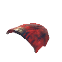|$item_fader_drop|Fader Relic|Material|The mystical power will be revealed another day.|
|fallenvalkyrie_claws|Fallen Valkyrie Claws|Fallen Valkyrie Claws|OneHandedWeapon|NULL|
|fallenvalkyrie_poisonbreath|Fallen Valkyrie Poison Breath|Fallen Valkyrie Poison Breath|OneHandedWeapon|NULL|
|fallenvalkyrie_screech|Fallen Valkyrie Claws|Fallen Valkyrie Claws|OneHandedWeapon|NULL|
|fallenvalkyrie_spin|Fallen Valkyrie Aoe Spin|Fallen Valkyrie Aoe Spin|OneHandedWeapon|NULL|
|fallenvalkyrie_spit|cold ball|cold ball|OneHandedWeapon|NULL|
|fallenvalkyrie_swoopattack|Fallen Valkyrie swooping|Fallen Valkyrie swooping|OneHandedWeapon|NULL|
|fallenvalkyrie_taunt|Fallen Valkyrie Claws|Fallen Valkyrie Claws|OneHandedWeapon|NULL|
|fallenvalkyrie_wingspin|Fallen Valkyrie Wingspin|Fallen Valkyrie Wingspin|OneHandedWeapon|NULL|
|Feathers |$item_feathers|Feathers|Material|A small pile of feathers.|
|Fenring_attack_claw|claw|claw|OneHandedWeapon|NULL|
|Fenring_attack_fireclaw|claw|claw|OneHandedWeapon|NULL|
|Fenring_attack_fireclaw_double|claw|claw|OneHandedWeapon|NULL|
|Fenring_attack_flames|Fenring cultist flames|Fenring cultist flames|OneHandedWeapon|NULL|
|Fenring_attack_frost|Fenring cultist frost|Fenring cultist frost|OneHandedWeapon|NULL|
|Fenring_attack_iceclaw|claw|claw|OneHandedWeapon|NULL|
|Fenring_attack_iceclaw_double|claw|claw|OneHandedWeapon|NULL|
|Fenring_attack_IceNova|Club|Club|OneHandedWeapon|A crude but useful weapon.|
|Fenring_attack_jump|claw|claw|OneHandedWeapon|NULL|
|Fenring_taunt|scream|scream|OneHandedWeapon|NULL|
|Fiddleheadfern 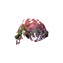|$item_fiddleheadfern|Fiddlehead|Consumable|Veggies with a twist!|
|FierySvinstew |$item_fierysvinstew|Fiery Svinstew|Consumable|This musty stew is a necessity on every adventurer's menu.|
|FineWood |$item_finewood|Finewood|Material|High quality wood for fine carpentry.|
|FirCone |$item_fircone|Fir Cone|Material|Plant it to grow a fir tree.|
|FireworksRocket_Blue |$item_fireworkrocket_blue|Blue Fireworks|Material|This rocket's blasting off again!|
|FireworksRocket_Cyan |$item_fireworkrocket_cyan|Cyan Fireworks|Material|This rocket's blasting off again!|
|FireworksRocket_Green |$item_fireworkrocket_green|Green Fireworks|Material|This rocket's blasting off again!|
|FireworksRocket_Purple |$item_fireworkrocket_purple|Purple Fireworks|Material|This rocket's blasting off again!|
|FireworksRocket_Red |$item_fireworkrocket_red|Red Fireworks|Material|This rocket's blasting off again!|
|FireworksRocket_White |$item_fireworkrocket_white|Basic Fireworks|Material|This rocket's blasting off again!|
|FireworksRocket_Yellow |$item_fireworkrocket_yellow|Yellow Fireworks|Material|This rocket's blasting off again!|
|Fish1 |$animal_fish1|Perch|Fish|A tasty whitemeat fish.|
|Fish10 |$animal_fish10|Northern Salmon|Fish|This fish likes the water to be almost freezing cold.|
|Fish11 |$animal_fish11|Magmafish|Fish|Some say this fish lays its eggs directly in molten lava!|
|Fish12 |$animal_fish12|Pufferfish|Fish|Tasty when cooked right, but the flavour has a bit of a sting.|
|Fish2 |$animal_fish2|Pike|Fish|A freshwater fish that needs a lot of seasoning.|
|Fish3 |$animal_fish3|Tuna|Fish|Chicken of the sea...|
|Fish4_cave |$animal_fish4|Tetra|Fish|Spending its whole life in the dark, it has no need for eyes.|
|Fish5 |$animal_fish5|Trollfish|Fish|This fish is a nuisance in the local streams.|
|Fish6 |$animal_fish6|Giant Herring|Fish|Fermented, this fish will smell worse than the swamp it came from.|
|Fish7 |$animal_fish7|Grouper|Fish|Best served with lots of carbs!|
|Fish8 |$animal_fish8|Coral Cod|Fish|It has seen some things... Some very haunting things...|
|Fish9 |$animal_fish9|Anglerfish|Fish|The dangling light makes it easier to see that pretty little face!|
|FishAndBread |$item_fishandbread|Fish 'n' Bread|Consumable|Bounty from both land and sea.|
|FishAndBreadUncooked |$item_fishandbreaduncooked|Uncooked fish n' bread|Material|Ready for the oven.|
|FishAnglerRaw |$item_fish_raw|Raw Fish|Material|A good catch.|
|FishCooked |$item_fish_cooked|Cooked Fish|Consumable|A tasty side of smoked fish.|
|FishingBait |$item_fishingbait|Fishing Bait|Ammo|Common dvergr fishing bait. Fishing rod sold separately.|
|FishingBaitAshlands |$item_fishingbait_ashlands|Hot Fishing Bait|Ammo|Some fish already like it where the waters are warm, and this bait brings the temperature close to boiling.|
|FishingBaitCave |$item_fishingbait_cave|Cold Fishing Bait|Ammo|This bait doesn't look like much, but it's a treat to fish that live where it's cold and dark.|
|FishingBaitDeepNorth |$item_fishingbait_deepnorth|Frosty Fishing Bait|Ammo|It's not very nutritious, so the only fish that'll take this bait are the ones that are used to just eating ice.|
|FishingBaitForest |$item_fishingbait_forest|Mossy Fishing Bait|Ammo|Dead trolls in the forest often attract a fish or two, speed up the process with this bait!|
|FishingBaitMistlands |$item_fishingbait_mistlands|Misty Fishing Bait|Ammo|A bait to guide the fish to you through shrouded waters.|
|FishingBaitOcean |$item_fishingbait_ocean|Heavy Fishing Bait|Ammo|This bait sinks deep, deep enough to lure the fish swimming along the very bottom of the sea.|
|FishingBaitPlains |$item_fishingbait_plains|Stingy Fishing Bait|Ammo|You're not immune to deathsquito bites, and the fish here aren't immune to this snack!|
|FishingBaitSwamp |$item_fishingbait_swamp|Sticky Fishing Bait|Ammo|It might smell foul, but the fish drawn to this bait are used to so much worse.|
|FishingRod |$item_fishingrod|Fishing Rod|TwoHandedWeapon|Standard issue dvergr fishing rod.|
|FishRaw |$item_fish_raw|Raw Fish|Material|A good catch.|
|FishWraps |$item_fishwraps|Fish Wraps|Consumable|Bread and fish, what more to wish?|
|FistFenrirClaw |$item_fistweapon_fenris|Flesh Rippers|TwoHandedWeapon|If claws work for wolves, why not for a viking?|
|Flametal |$item_flametal_old|Ancient Metal|Material|A withered metal from ancient times. No one knows what it was once used for.|
|FlametalNew |$item_flametal|Flametal|Material|According to legend, this metal was used by the gods themselves to craft powerful weapons.|
|FlametalOre |$item_flametalore_old|Glowing Metal Ore|Material|A withered metal from ancient times. No one knows what it was once used for.|
|FlametalOreNew 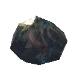|$item_flametalore|Flametal Ore|Material|Warm to the touch with glowing veins of strange metal. Needs to be refined in a blast furnace.|
|Flax |$item_flax|Flax|Material|Unspun fibers from a flax plant.|
|Flint |$item_flint|Flint|Material|Can be shaped into sharp blades.|
|FreezeGland |$item_freezegland|Freeze Gland|Material|This mysterious organ keeps a perfect temperature.|
|gd_king_punch|jaws|jaws|OneHandedWeapon|NULL|
|gd_king_rootspawn|spawn|spawn|OneHandedWeapon|NULL|
|gd_king_scream|scream|scream|OneHandedWeapon|NULL|
|gd_king_shoot|shaman attack|shaman attack|OneHandedWeapon|NULL|
|gd_king_stomp|jaws|jaws|OneHandedWeapon|NULL|
|GemstoneBlue |$item_gemstone_blue|Iolite|Material|Light is reflected sharply off of this gem, or does it come from within the stone itself?|
|GemstoneGreen |$item_gemstone_green|Jade|Material|This gem pulses with energy, almost as if it were a living thing.|
|GemstoneRed |$item_gemstone_red|Bloodstone|Material|You wonder how many deals have been made to appease this gem. How many palms have bled onto it in exchange for its power?|
|Ghost_attack|jaws|jaws|OneHandedWeapon|NULL|
|GiantBloodSack |$item_bloodclot|Blood Clot|Material|Be careful not to puncture this while you carry it...|
|gjall_attack_egg|egg drop|egg drop|OneHandedWeapon|NULL|
|gjall_attack_shake|gjall shake|gjall shake|OneHandedWeapon|NULL|
|gjall_attack_spit|gjall spit|gjall spit|OneHandedWeapon|NULL|
|gjall_attack_taunt|gjall taunt|gjall taunt|OneHandedWeapon|NULL|
|GoblinArmband |Iron plate armor|Iron plate armor|Chest|An iron scale mail, this will turn all but the strongest of blows.|
|GoblinBrute_ArmGuard |Iron plate armor|Iron plate armor|Chest|An iron scale mail, this will turn all but the strongest of blows.|
|GoblinBrute_Attack |Brute sword|Brute sword|OneHandedWeapon|NULL|
|GoblinBrute_Backbones |Iron plate armor|Iron plate armor|Helmet|An iron scale mail, this will turn all but the strongest of blows.|
|GoblinBrute_ExecutionerCap |Iron plate armor|Iron plate armor|Helmet|An iron scale mail, this will turn all but the strongest of blows.|
|GoblinBrute_HipCloth |Iron plate armor|Iron plate armor|Legs|An iron scale mail, this will turn all but the strongest of blows.|
|GoblinBrute_LegBones |Iron plate armor|Iron plate armor|Utility|An iron scale mail, this will turn all but the strongest of blows.|
|GoblinBrute_RageAttack |Brute sword|Brute sword|OneHandedWeapon|NULL|
|GoblinBrute_ShoulderGuard |Iron plate armor|Iron plate armor|Shoulder|An iron scale mail, this will turn all but the strongest of blows.|
|GoblinBrute_Taunt |Brute taunt|Brute taunt|OneHandedWeapon|NULL|
|GoblinBruteBros_Attack |Brute sword|Brute sword|OneHandedWeapon|NULL|
|GoblinBruteBros_RageAttack |Brute sword|Brute sword|OneHandedWeapon|NULL|
|GoblinClub |Club|Club|OneHandedWeapon|A crude but useful weapon.|
|GoblinHelmet |Iron plate armor|Iron plate armor|Chest|An iron scale mail, this will turn all but the strongest of blows.|
|GoblinKing_Beam|dragon breath|dragon breath|OneHandedWeapon|NULL|
|GoblinKing_Meteors|spawn|spawn|OneHandedWeapon|NULL|
|GoblinKing_Nova|slap|slap|OneHandedWeapon|NULL|
|GoblinKing_Taunt|scream|scream|OneHandedWeapon|NULL|
|GoblinLegband |Iron plate armor|Iron plate armor|Chest|An iron scale mail, this will turn all but the strongest of blows.|
|GoblinLoin |Iron plate armor|Iron plate armor|Legs|An iron scale mail, this will turn all but the strongest of blows.|
|GoblinShaman_attack_fireball|fireballattack|fireballattack|OneHandedWeapon|NULL|
|GoblinShaman_attack_fireball_hildir |fireballattack|fireballattack|OneHandedWeapon|NULL|
|GoblinShaman_attack_poke |Club|Club|OneHandedWeapon|A crude but useful weapon.|
|GoblinShaman_attack_protect|heal|heal|OneHandedWeapon|NULL|
|GoblinShaman_attack_protect_hildir |heal|heal|OneHandedWeapon|NULL|
|GoblinShaman_Headdress_antlers |Club|Club|Helmet|A crude but useful weapon.|
|GoblinShaman_Headdress_feathers |Club|Club|Helmet|A crude but useful weapon.|
|GoblinShaman_Staff_Bones |Club|Club|Utility|A crude but useful weapon.|
|GoblinShaman_Staff_Feathers |Club|Club|Utility|A crude but useful weapon.|
|GoblinShaman_Staff_Hildir |Club|Club|Utility|A crude but useful weapon.|
|GoblinShoulders |Iron plate armor|Iron plate armor|Chest|An iron scale mail, this will turn all but the strongest of blows.|
|GoblinSpear |Flint spear|Flint spear|OneHandedWeapon|[item_spearflint_description]|
|GoblinSword |Bronze sword|Bronze sword|OneHandedWeapon|Blood-drinker. A thirsty friend.|
|GoblinTorch |Torch|Torch|OneHandedWeapon|It brings light and warmth, drives back the darkness.|
|GoblinTotem |$item_goblintotem|Fuling Totem|Misc|Channels the ancient power of Yagluth.|
|Grausten |$item_grausten|Grausten|Material|Porous yet sturdy.|
|Greydwarf_attack|jaws|jaws|OneHandedWeapon|NULL|
|Greydwarf_elite_attack|jaws|jaws|OneHandedWeapon|NULL|
|Greydwarf_shaman_attack|shaman attack|shaman attack|OneHandedWeapon|NULL|
|Greydwarf_shaman_heal|heal|heal|OneHandedWeapon|NULL|
|Greydwarf_throw|throw stone|throw stone|OneHandedWeapon|NULL|
|GreydwarfEye |$item_greydwarfeye|Greydwarf Eye|Material|The milky eyeball of a Greydwarf.|
|Greyling_attack|jaws|jaws|OneHandedWeapon|NULL|
|Guck |$item_guck|Guck|Material|It smells like fermented fish.|
|Hair1 |$customization_hair01|Ponytail 1|Customization|NULL|
|Hair10 |$customization_hair10|Side Swept 2|Customization|NULL|
|Hair10_2 |$customization_hair06|Long 1|Customization|NULL|
|Hair11 |$customization_hair11|Braided 2|Customization|NULL|
|Hair11_2 |$customization_hair06|Long 1|Customization|NULL|
|Hair11_3 |$customization_hair06|Long 1|Customization|NULL|
|Hair12 |$customization_hair12|Braided 3|Customization|NULL|
|Hair12_2 |$customization_hair06|Long 1|Customization|NULL|
|Hair13 |$customization_hair13|Braided 4|Customization|NULL|
|Hair13_2 |$customization_hair06|Long 1|Customization|NULL|
|Hair13_3 |$customization_hair06|Long 1|Customization|NULL|
|Hair14 |$customization_hair14|Side Swept 3|Customization|NULL|
|Hair14_2 |$customization_hair06|Long 1|Customization|NULL|
|Hair15 |$customization_hair15|Pulled Back Curls|Customization|NULL|
|Hair15_2 |$customization_hair06|Long 1|Customization|NULL|
|Hair15_3 |$customization_hair06|Long 1|Customization|NULL|
|Hair16 |$customization_hair16|Gathered Braids|Customization|NULL|
|Hair16_2 |$customization_hair06|Long 1|Customization|NULL|
|Hair17 |$customization_hair17|Neat Braids|Customization|NULL|
|Hair17_2 |$customization_hair06|Long 1|Customization|NULL|
|Hair18 |$customization_hair18|Royal Braids|Customization|NULL|
|Hair18_2 |$customization_hair06|Long 1|Customization|NULL|
|Hair19 |$customization_hair19|Curls 1|Customization|NULL|
|Hair2 |$customization_hair02|Ponytail 2|Customization|NULL|
|Hair20 |$customization_hair20|Curls 2|Customization|NULL|
|Hair21 |$customization_hair21|Twin Buns|Customization|NULL|
|Hair21_2 |$customization_hair06|Long 1|Customization|NULL|
|Hair22 |$customization_hair22|Single Bun|Customization|NULL|
|Hair22_2 |$customization_hair06|Long 1|Customization|NULL|
|Hair23 |$customization_hair23|Short Curls|Customization|NULL|
|Hair24 |$customization_hair24|Shaved and Braided|Customization|NULL|
|Hair24_2 |$customization_hair06|Long 1|Customization|NULL|
|Hair24_3 |$customization_hair06|Long 1|Customization|NULL|
|Hair25 |$customization_hair25|Single Bun 2|Customization|NULL|
|Hair26 |$customization_hair26|Short Locs|Customization|NULL|
|Hair27 |$customization_hair27|Braids of Strength|Customization|NULL|
|Hair27_2 |$customization_hair06|Long 1|Customization|NULL|
|Hair27_3 |$customization_hair06|Long 1|Customization|NULL|
|Hair28 |$customization_hair28|Merchant's Braid|Customization|NULL|
|Hair28_2 |$customization_hair06|Long 1|Customization|NULL|
|Hair28_3 |$customization_hair06|Long 1|Customization|NULL|
|Hair29 |$customization_hair29|Loose 2|Customization|NULL|
|Hair29_2 |$customization_hair06|Long 1|Customization|NULL|
|Hair3 |$customization_hair03|Braided 1|Customization|NULL|
|Hair3_2 |$customization_hair03|Braided 1|Customization|NULL|
|Hair3_3 |$customization_hair03|Braided 1|Customization|NULL|
|Hair30 |$customization_hair30|Loose 3|Customization|NULL|
|Hair30_2 |$customization_hair06|Long 1|Customization|NULL|
|Hair30_3 |$customization_hair06|Long 1|Customization|NULL|
|Hair31 |$customization_hair31|Gathered Locs|Customization|NULL|
|Hair31_2 |$customization_hair06|Long 1|Customization|NULL|
|Hair31_3 |$customization_hair06|Long 1|Customization|NULL|
|Hair4 |$customization_hair04|Ponytail 3|Customization|NULL|
|Hair4_2 |$customization_hair03|Braided 1|Customization|NULL|
|Hair4_3 |$customization_hair03|Braided 1|Customization|NULL|
|Hair5 |$customization_hair05|Short 1|Customization|NULL|
|Hair5_2 |$customization_hair03|Braided 1|Customization|NULL|
|Hair6 |$customization_hair06|Long 1|Customization|NULL|
|Hair6_2 |$customization_hair06|Long 1|Customization|NULL|
|Hair6_3 |$customization_hair06|Long 1|Customization|NULL|
|Hair7 |$customization_hair07|Ponytail 4|Customization|NULL|
|Hair7_2 |$customization_hair06|Long 1|Customization|NULL|
|Hair8 |$customization_hair08|Short 2|Customization|NULL|
|Hair8_2 |$customization_hair06|Long 1|Customization|NULL|
|Hair9 |$customization_hair09|Side Swept 1|Customization|NULL|
|Hair9_2 |$customization_hair06|Long 1|Customization|NULL|
|HairNone|$customization_nohair|No Hair|Customization|NULL|
|Hammer |$item_hammer|Hammer|Tool|With this to your hand, you can raise high halls and mighty fortifications.|
|HardAntler |$item_hardantler|Hard Antler|Material|A piece of very hard antlers.|
|HareMeat |$item_hare_meat|Hare Meat|Material|The meat of a hare is scant but toothsome.|
|hatchling_spit_cold|cold ball|cold ball|OneHandedWeapon|NULL|
|HealthUpgrade_Bonemass |Bonemass heart|Bonemass heart|Consumable|[item_healthupgrade_description]|
|HealthUpgrade_GDKing |Elder heart|Elder heart|Consumable|[item_healthupgrade_description]|
|HelmetAshlandsMediumHood |$item_helmet_medium_ashlands|Hood of Ask|Helmet|As the first man of Midgard, Ask knew it was important to not draw too much attention to himself.|
|HelmetBronze |$item_helmet_bronze|Bronze Helmet|Helmet|This will help to keep your brains inside your skull.|
|HelmetCarapace |$item_helmet_carapace|Carapace Helmet|Helmet|People might say you look like a giant ant. But they will only say it once.|
|HelmetDrake |$item_helmet_drake|Drake Helmet|Helmet|An elaborate and finely-crafted helm.|
|HelmetDverger |$item_helmet_dverger|Dverger Circlet|Helmet|A portable perpetual lightsource for the dungeon explorer.|
|HelmetFenring |$item_helmet_fenris|Fenris Hood|Helmet|The eyes of the beast were wise and knowing, so that it could measure the strength of a warrior in one glance.|
|HelmetFishingHat |$item_helmet_fishinghat|Fishing Hat|Helmet|This catchy hat may only be reeled in by the most seasoned adventurers.|
|HelmetFlametal |$item_helmet_flametal|Flametal Helmet|Helmet|While you're wearing this helmet, your enemies will think twice before trying to bite your head off.|
|HelmetHat1 |$item_helmet_hat1|Tied Headscarf Blue|Helmet|A blue practical headscarf.|
|HelmetHat10 |$item_helmet_hat10|Simple Cap Purple|Helmet|A simple yet fashionable purple cap.|
|HelmetHat2 |$item_helmet_hat2|Twisted Headscarf Green|Helmet|A fancy green headscarf.|
|HelmetHat3 |$item_helmet_hat3|Fur Cap Brown|Helmet|A warm fur cap, made from the finest leather.|
|HelmetHat4 |$item_helmet_hat4|Extravagant Cap Green|Helmet|An extravagant green cap.|
|HelmetHat5 |$item_helmet_hat5|Simple Cap Red|Helmet|A simple yet fashionable red cap.|
|HelmetHat6 |$item_helmet_hat6|Tied Headscarf Yellow|Helmet|A practical yellow headscarf.|
|HelmetHat7 |$item_helmet_hat7|Twisted Headscarf Red|Helmet|A fancy red headscarf.|
|HelmetHat8 |$item_helmet_hat8|Fur Cap Grey|Helmet|A warm fur cap, made from the finest wool.|
|HelmetHat9 |$item_helmet_hat9|Extravagant Cap Orange|Helmet|An extravagant orange cap.|
|HelmetIron |$item_helmet_iron|Iron Helmet|Helmet|A helm of polished iron, fit for a hero.|
|HelmetLeather |$item_helmet_leather|Leather Helmet|Helmet|A hood of toughened leather.|
|HelmetMage |$item_helmet_mage|Eitr-weave Hood|Helmet|Sorcery shows itself in the eyes, so most mages wear cowls to disguise their occult pursuits.|
|HelmetMage_Ashlands |$item_helmet_mage_ashlands|Hood of Embla|Helmet|Even the first sorceress valued the mystique of covering one's face. It is rumoured that honouring her this way will make your spells even more powerful.|
|HelmetMidsummerCrown |$item_helmet_midsummercrown|Midsummer Crown|Helmet|Celebrate summer with a crown woven from flowers.|
|HelmetOdin |$item_helmet_odin|Hood of Odin|Helmet|Odin's finest warriors deserve the finest cloth.|
|HelmetPadded |$item_helmet_padded|Padded Helmet|Helmet|A snug fit, finely made.|
|HelmetPointyHat |$item_helmet_witchhat|Pointy Hat|Helmet|This hat is sure to add a bit of magical flair to any outfit.|
|HelmetRoot |$item_helmet_root|Root Mask|Helmet|Your head fits perfectly inside this knot of roots and bark.|
|HelmetTrollLeather |$item_helmet_trollleather|Troll Leather Hood|Helmet|Trollskin is hard to work but makes exceptional armor.|
|HelmetYule |$item_helmet_yule|Yule Hat|Helmet|A red cap in the style of house gnomes.|
|HildirKey_forestcrypt |$item_hildirkey1|Hildir's Brass Key|Misc|It seems to be missing its owner...|
|HildirKey_mountaincave |$item_hildirkey2|Hildir's Silver Key|Misc|It seems to be missing its owner...|
|HildirKey_plainsfortress |$item_hildirkey3|Hildir's Bronze Key|Misc|It seems to be missing its owner...|
|hive_attack_aoe|heal|heal|OneHandedWeapon|NULL|
|hive_attack_punch|slap|slap|OneHandedWeapon|NULL|
|hive_attack_ranged|dragon breath|dragon breath|OneHandedWeapon|NULL|
|hive_attack_throw|slime throw|slime throw|OneHandedWeapon|NULL|
|Hoe |$item_hoe|Hoe|Tool|A farmer's tool for working the earth.|
|Honey |$item_honey|Honey|Consumable|Sweet and tasty.|
|HoneyGlazedChicken |$item_honeyglazedchicken|Honey Glazed Chicken|Consumable|Grilled to perfection. Makes both eyes and mouths water.|
|HoneyGlazedChickenUncooked |$item_honeyglazedchickenuncooked|Uncooked Honey Glazed Chicken|Material|Ready for the oven.|
|imp_fireball_attack|fireballattack|fireballattack|OneHandedWeapon|NULL|
|Iron |$item_iron|Iron|Material|A bar of pure iron ready to be worked.|
|IronNails |$item_ironnails|Iron Nails|Material|Needed for advanced construction projects.|
|IronOre |$item_ironore|Iron Ore|Material|Unrefined iron. Needs to be refined in a smelter.|
|Ironpit |$item_ironpit|Iron Pit|Material|An empty vessel waiting to be filled with firewood and kindling.|
|IronScrap |$item_ironscrap|Scrap Iron|Material|It's old and rusty but can be smelted and used again.|
|JuteBlue |$item_juteblue|Blue Jute|Material|Made from natural fibers and dvergr hair.|
|JuteRed |$item_jutered|Red Jute|Material|A sturdy, rough fabric.|
|KnifeBlackMetal |$item_knife_blackmetal|Black Metal Knife|OneHandedWeapon|A darkling blade. Strong and sharp.|
|KnifeButcher |$item_knife_butcher|Butcher Knife|OneHandedWeapon|A butcher's knife designed specifically for slaughtering tamed animals.|
|KnifeChitin |$item_knife_chitin|Abyssal Razor|OneHandedWeapon|A knife from the deep.|
|KnifeCopper |$item_knife_copper|Copper Knife|OneHandedWeapon|A glittering copper knife.|
|KnifeFlint |$item_knife_flint|Flint Knife|OneHandedWeapon|Sharpened flint. A reliable tool.|
|KnifeSilver |$item_knife_silver|Silver Knife|OneHandedWeapon|A savage piece of pain.|
|KnifeSkollAndHati |$item_knife_skollandhati|Skoll and Hati|TwoHandedWeapon|Stab once for those who've betrayed you, and twice for those you hate.|
|Lantern |$item_lantern|Dvergr Lantern|Torch|A simple torch would just be so old fashioned.|
|Larva |$item_larva|[item_larva]|Material|[item_larva_description]|
|LeatherScraps |$item_leatherscraps|Leather Scraps|Material|A small pile of leather scraps.|
|Leech_BiteAttack|jaws|jaws|OneHandedWeapon|NULL|
|LinenThread |$item_linenthread|Linen Thread|Material|A fine linen thread made out of a strong flax filament.|
|lox_bite|lox bite|lox bite|OneHandedWeapon|NULL|
|lox_stomp|slap|slap|OneHandedWeapon|NULL|
|LoxMeat |$item_loxmeat|Lox Meat|Material|A raw slab of marbled meat.|
|LoxPelt |$item_loxpelt|Lox Pelt|Material|A heavy pelt of thick, musty fur.|
|LoxPie |$item_loxpie|Lox Meat Pie|Consumable|Break the crust to release a cloud of fragrant steam. Delicious!|
|LoxPieUncooked |$item_loxpie_uncooked|Unbaked Lox Pie|Material|Ready for the oven.|
|MaceBronze |$item_mace_bronze|Bronze Mace|OneHandedWeapon|A headache on a stick.|
|MaceEldner |$item_mace_eldner|Flametal Mace|OneHandedWeapon|Dense yet spiked flametal, perfect for bashing enemy faces in.|
|MaceEldnerBlood 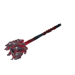|$item_mace_eldner_blood|Bloodgeon|OneHandedWeapon|The blood all but soaks into this mace, and it always yearns for more.|
|MaceEldnerLightning 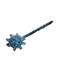|$item_mace_eldner_lightning|Storm Star|OneHandedWeapon|Particularly effective on cloudy mornings.|
|MaceEldnerNature |$item_mace_eldner_nature|Klossen|OneHandedWeapon|If the force of your blow isn't enough to knock your enemies to the ground, perhaps the primal roots will hold them down for you.|
|MaceIron |$item_mace_iron|Iron Mace|OneHandedWeapon|A fist-sized lump of iron on a wooden shaft.|
|MaceNeedle |$item_mace_needle|Porcupine|OneHandedWeapon|A deadly weapon, bristling with fiendish spikes.|
|MaceSilver |$item_mace_silver|Frostner|OneHandedWeapon|The dead fear silver. Remind them why.|
|MagicallyStuffedShroom |$item_magicallystuffedmushroom|Stuffed Mushroom|Consumable|Bursting with magical flavour.|
|MagicallyStuffedShroomUncooked |$item_magicallystuffedmushroomuncooked|Uncooked Stuffed Mushroom|Material|Ready for the oven.|
|Mandible |$item_mandible|Mandible|Material|The hand of man could hardly design a more perfect weapon.|
|MarinatedGreens 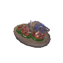|$item_marinatedgreens|Marinated Greens|Consumable|It's spicy, it's chewy, it's sweet This mad dish tickles your tongue as well as your mind.|
|MashedMeat 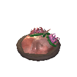|$item_mashedmeat|Mashed Meat|Consumable|Leftover meat can actually be pretty tasty if you just mash it right!|
|MeadBaseEitrLingering |$item_meadbaseeitr_lingering|Mead Base: Lingering Eitr|Material|Needs to be fermented.|
|MeadBaseEitrMinor |$item_meadbaseeitr|Mead Base: Minor Eitr|Material|Needs to be fermented.|
|MeadBaseFrostResist |$item_meadbasefrostresist|Mead Base: Frost Resistance|Material|Needs to be fermented.|
|MeadBaseHealthLingering |$item_meadbasehealth_lingering|Mead Base: Lingering Health|Material|Needs to be fermented.|
|MeadBaseHealthMajor |$item_meadbasehealth_major|Mead Base: Major Healing|Material|Needs to be fermented.|
|MeadBaseHealthMedium |$item_meadbasehealth_medium|Mead Base: Medium Healing|Material|Needs to be fermented.|
|MeadBaseHealthMinor |$item_meadbasehealth|Mead Base: Minor Healing|Material|Needs to be fermented.|
|MeadBasePoisonResist |$item_meadbasepoisonresist|Mead Base: Poison Resistance|Material|Needs to be fermented.|
|MeadBaseStaminaLingering |$item_meadbasestamina_lingering|Mead Base: Lingering Stamina|Material|Needs to be fermented.|
|MeadBaseStaminaMedium |$item_meadbasestamina_medium|Mead Base: Medium Stamina|Material|Needs to be fermented.|
|MeadBaseStaminaMinor |$item_meadbasestamina|Mead Base: Minor Stamina|Material|Needs to be fermented.|
|MeadBaseTasty |$item_meadbasetasty|Mead Base: Tasty|Material|Needs to be fermented.|
|MeadEitrLingering 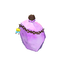|$item_mead_eitr_lingering|Lingering Eitr Mead|Consumable|Increases eitr regeneration.|
|MeadEitrMinor |$item_mead_eitr_minor|Minor Eitr Mead|Consumable|Restores eitr.|
|MeadFrostResist |$item_mead_frostres|Frost Resistance Mead|Consumable|Protects against the cold.|
|MeadHealthLingering 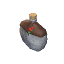|$item_mead_hp_lingering|Lingering Healing Mead|Consumable|Increases health regeneration.|
|MeadHealthMajor |$item_mead_hp_major|Major Healing Mead|Consumable|Restores health.|
|MeadHealthMedium |$item_mead_hp_medium|Medium Healing Mead|Consumable|Restores health.|
|MeadHealthMinor |$item_mead_hp_minor|Minor Healing Mead|Consumable|Restores health.|
|MeadPoisonResist |$item_mead_poisonres|Poison Resistance Mead|Consumable|Fortifies you against poison.|
|MeadStaminaLingering |$item_mead_stamina_lingering|Lingering Stamina Mead|Consumable|Increases stamina regeneration.|
|MeadStaminaMedium |$item_mead_stamina_medium|Medium Stamina Mead|Consumable|Restores stamina.|
|MeadStaminaMinor |$item_mead_stamina_minor|Minor Stamina Mead|Consumable|Restores stamina.|
|MeadTasty |$item_mead_tasty|Tasty Mead|Consumable|The nectar of the Gods, divine mead.|
|MeatPlatter |$item_meatplatter|Meat Platter|Consumable|Battle fuel.|
|MeatPlatterUncooked |$item_meatplatteruncooked|Uncooked Meat Platter|Material|Ready for the oven.|
|MechanicalSpring |$item_mechanicalspring|Mechanical Spring|Material|A mysterious contraption built by the Dvergr. Used to build traps.|
|MinceMeatSauce |$item_mincemeatsauce|Minced Meat Sauce|Consumable|Chunks of goodness in a thick gravy.|
|MisthareSupreme |$item_mistharesupreme|Misthare Supreme|Consumable|One of life's Great Pleasures.|
|MisthareSupremeUncooked |$item_mistharesupremeuncooked|Uncooked Misthare Supreme|Material|Ready for the oven.|
|Mistile_kamikaze|Mistile Kamikaze|Mistile Kamikaze|OneHandedWeapon|NULL|
|MoltenCore |$item_moltencore|Molten Core|Material|Potent energy swirls within, ready to be unleashed.|
|Morgen_bite|Dragon claw left|Dragon claw left|OneHandedWeapon|NULL|
|Morgen_bodyslam|Dragon claw left|Dragon claw left|OneHandedWeapon|NULL|
|Morgen_roll_left|Morgen Roll Left|Morgen Roll Left|OneHandedWeapon|NULL|
|Morgen_roll_right|Morgen Roll Right|Morgen Roll Right|OneHandedWeapon|NULL|
|Morgen_swipe_1|Dragon claw left|Dragon claw left|OneHandedWeapon|NULL|
|Morgen_swipe_2|Dragon claw left|Dragon claw left|OneHandedWeapon|NULL|
|Morgen_swipe_3|Dragon claw left|Dragon claw left|OneHandedWeapon|NULL|
|Morgen_swipe_4|Dragon claw left|Dragon claw left|OneHandedWeapon|NULL|
|Morgen_swipe_5|Dragon claw left|Dragon claw left|OneHandedWeapon|NULL|
|Morgen_swipe_6|Dragon claw left|Dragon claw left|OneHandedWeapon|NULL|
|MorgenHeart |$item_morgenheart|Morgen Heart|Material|It's hard to believe it has ever beaten.|
|MorgenSinew |$item_morgensinew|Morgen Sinew|Material|Chewy.|
|Mushroom |$item_mushroomcommon|Mushroom|Consumable|Bounty of the forest.|
|MushroomBlue |$item_mushroomblue|Blue Mushroom|Consumable|Glows with a soft blue hue.|
|MushroomJotunPuffs |$item_jotunpuffs|Jotun Puffs|Consumable|Swollen with magic, these golden orbs bubble from the ground where the Jotun fell.|
|MushroomMagecap |$item_magecap|Magecap|Consumable|The delicate blue magecaps crackle like nerve-endings with sorcerous vitality.|
|MushroomOmelette |$item_mushroomomelette|Mushroom Omelette|Consumable|A delicious omelette with an earthy aftertaste.|
|MushroomSmokePuff |$item_smokepuff|Smoke Puff|Consumable|Hopefully it tastes better after cooking.|
|MushroomYellow |$item_mushroomyellow|Yellow Mushroom|Consumable|An energetic glowing mushroom.|
|Neck_BiteAttack|jaws|jaws|OneHandedWeapon|NULL|
|NeckTail |$item_necktail|Neck Tail|Material|Inedible when raw, but proves to be quite a tasty snack if cooked.|
|NeckTailGrilled |$item_necktailgrilled|Grilled Neck Tail|Consumable|This savoury, charcoal-grilled meat has a slight aroma of seaweed and grass.|
|Needle |$item_needle|Needle|Material|The pointy end of a Deathsquito.|
|Obsidian |$item_obsidian|Obsidian|Material|Dark volcanic glass.|
|Onion |$item_onion|Onion|Consumable|A crunchy and spicy taste.|
|OnionSeeds |$item_onionseeds|Onion Seeds|Material|Plant to grow a healthy onion.|
|OnionSoup |$item_onionsoup|Onion Soup|Consumable|Deliciously rich.|
|Ooze |$item_ooze|Ooze|Material|Rotten and putrid-smelling. Why do you want this?|
|PickaxeAntler |$item_pickaxe_antler|Antler Pickaxe|TwoHandedWeapon|This tool is hard enough to crack even the most stubborn rocks.|
|PickaxeBlackMetal |$item_pickaxe_blackmetal|Black Metal Pickaxe|TwoHandedWeapon|A good strong pick of glistening dark metal.|
|PickaxeBronze |$item_pickaxe_bronze|Bronze Pickaxe|TwoHandedWeapon|A good bronze pick. Can break very hard rocks.|
|PickaxeIron |$item_pickaxe_iron|Iron Pickaxe|TwoHandedWeapon|A sturdy tool of hardened iron.|
|PickaxeStone |$item_pickaxe_stone|Stone Pickaxe|TwoHandedWeapon|A rock-breaker made of stone.|
|PineCone |$item_pinecone|Pine Cone|Material|Plant it to grow a pine tree.|
|PiquantPie |$item_piquantpie|Piquant Pie|Consumable|It takes some time and effort to make this pie, but the taste is well worth it.|
|PiquantPieUncooked |$item_piquantpie_uncooked|Uncooked Piquant Pie|Material|Ready for the oven.|
|PlayerUnarmed |Unarmed|Unarmed|OneHandedWeapon|NULL|
|Pot_Shard_Green 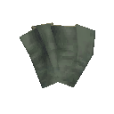|$item_pot_shard_green|Pot Shard|Material|A fragment of something brittle.|
|Pot_Shard_Red 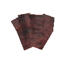|$item_pot_shard_red|[item_pot_shard_red]|Material|A fragment of something brittle.|
|ProustitePowder 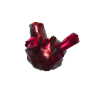|$item_proustitepowder|Proustite Powder|Material|This unstable powder packs great potential.|
|Pukeberries |$item_pukeberries|Bukeperries|Consumable|Allows the consumer to quickly evacuate any misplaced meal and start anew.|
|QueenBee |$item_queenbee|Queen Bee|Material|The queen of the bees!|
|QueenDrop |$item_seekerqueen_drop|Majestic Carapace|Material|Her majesty's will was hard and unrelenting, but this piece of carapace is perhaps even more so.|
|QueensJam |$item_queensjam|Queen's Jam|Consumable|That classic tasty blend of raspberries and blueberries.|
|Raspberry |$item_raspberries|Raspberries|Consumable|Sweet and delicious.|
|RawMeat |$item_boar_meat|Boar Meat|Material||
|Resin |$item_resin|Resin|Material|Sticky tree resin which insulates well. If put to the flame it burns slow and steady.|
|RoastedCrustPie 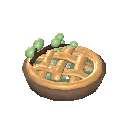|$item_roastedcrustpie|Roasted Crust Pie|Consumable|This dessert keeps you going all day long.|
|RoastedCrustPieUncooked 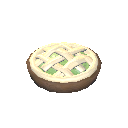|$item_roastedcrustpie_uncooked|Uncooked Roasted Crust Pie|Material|Ready for the oven.|
|Root |$item_root|Root|Material|An old root from an ancient tree stump. It feels both flexible and durable at the same time.|
|RottenMeat |$item_meat_rotten|Rotten Meat|Consumable|There are maggots crawling in the meat. It smells awful.|
|RoundLog |$item_roundlog|Corewood|Material|Perfect for building log cabins.|
|RoyalJelly |$item_royaljelly|Royal Jelly|Consumable|Jelly fit for kings and queens.|
|Ruby |$item_ruby|Ruby|Material|<color=yellow>Valuable</color>|
|SaddleAsksvin 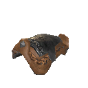|$item_saddleasksvin|Asksvin Saddle|Misc|The back of an asksvin is rather lumpy, so you'll need a saddle if you want to ride one.|
|SaddleLox |$item_saddlelox|Lox Saddle|Misc|Use on a lox to be able to ride it.|
|Salad |$item_salad|Salad|Consumable|Fresh, crisp leaves.|
|Sap |$item_sap|Sap|Material|Sacred blood from the Great Tree.|
|Sausages |$item_sausages|Sausages|Consumable|Links of savory, smoked meat.|
|ScaleHide |$item_scalehide|Scale Hide|Material|A pelt of glittering scales.|
|ScorchingMedley 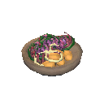|$item_scorchingmedley|Scorching Medley|Consumable|A varied diet is important, so why not try this vegetarian option?|
|seeker_claw_left|Dragon claw left|Dragon claw left|OneHandedWeapon|NULL|
|seeker_claw_right|Dragon claw left|Dragon claw left|OneHandedWeapon|NULL|
|seeker_groundslam|Dragon claw left|Dragon claw left|OneHandedWeapon|NULL|
|seeker_groundslam_flying|Dragon claw left|Dragon claw left|OneHandedWeapon|NULL|
|seeker_land|land|land|OneHandedWeapon|NULL|
|seeker_pincers|Dragon claw left|Dragon claw left|OneHandedWeapon|NULL|
|seeker_takeoff|takeoff|takeoff|OneHandedWeapon|NULL|
|SeekerAspic |$item_seekeraspic|Seeker Aspic|Consumable|A quivering jelly with a taste like gentle electricity.|
|SeekerBrute_bite|Dragon claw left|Dragon claw left|OneHandedWeapon|NULL|
|SeekerBrute_groundslam|slap|slap|OneHandedWeapon|NULL|
|SeekerBrute_ram|Dragon claw left|Dragon claw left|OneHandedWeapon|NULL|
|SeekerBrute_Taunt |Brute taunt|Brute taunt|OneHandedWeapon|NULL|
|SeekerQueen_Bite|slap|slap|OneHandedWeapon|NULL|
|SeekerQueen_Call |Brute taunt|Brute taunt|OneHandedWeapon|NULL|
|SeekerQueen_PierceAOE|slap|slap|OneHandedWeapon|NULL|
|SeekerQueen_Rush|slap|slap|OneHandedWeapon|NULL|
|SeekerQueen_Slap|slap|slap|OneHandedWeapon|NULL|
|SeekerQueen_Spit|dragon breath|dragon breath|OneHandedWeapon|NULL|
|SeekerQueen_Teleport |Brute taunt|Brute taunt|OneHandedWeapon|NULL|
|Serpent_attack|Serpent bite|Serpent bite|OneHandedWeapon|NULL|
|Serpent_taunt|Serpent Taunt|Serpent Taunt|OneHandedWeapon|NULL|
|SerpentMeat |$item_serpentmeat|Serpent Meat|Material|A slice of sea serpent. Smells fishy.|
|SerpentMeatCooked |$item_serpentmeatcooked|Cooked Serpent Meat|Consumable|A cooked slice of sea serpent. Smells good.|
|SerpentScale |$item_serpentscale|Serpent Scale|Material|The shiny metal-like scale from a sea serpent.|
|SerpentStew |$item_serpentstew|Serpent Stew|Consumable|Smells of honey and serpent...|
|SharpeningStone |$item_sharpeningstone|Sharpening Stone|Material|A whetstone wheel ready to spin.|
|ShieldBanded |$item_shield_banded|Banded Shield|Shield|Banded with hoops of iron, a true warrior's companion.|
|ShieldBlackmetal |$item_shield_blackmetal|Black Metal Shield|Shield|Fashioned from the strongest metal, able to turn even the deadliest blades.|
|ShieldBlackmetalTower |$item_shield_blackmetal_tower|Black Metal Tower Shield|Shield|A tower shield of gleaming dark metal.|
|ShieldBoneTower |$item_shield_bonetower|Bone Tower Shield|Shield|The bones of dead warriors make for a good protection.|
|ShieldBronzeBuckler |$item_shield_bronzebuckler|Bronze Buckler|Shield|A shield of burnished bronze, good to turn a blade or two.|
|ShieldCarapace |$item_shield_carapace|Carapace Shield|Shield|The almost unbreakable carapace of your enemies makes an excellent shield.|
|ShieldCarapaceBuckler |$item_shield_carapacebuckler|Carapace Buckler|Shield|The skull of a seeker is solid but not heavy, which makes it perfect for a small and agile shield.|
|ShieldCore 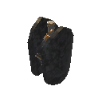|$item_shieldcore|Shield Core|Material|A protective force within is ready to be unleashed.|
|ShieldFlametal 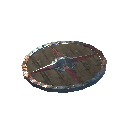|$item_shield_flametal|Flametal Shield|Shield|The shield is and always will be a viking's most important weapon.|
|ShieldFlametalTower 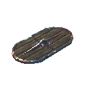|$item_shield_flametal_tower|Flametal Tower Shield|Shield|The best defence is a great defence.|
|ShieldIronBuckler |$item_shield_ironbuckler|Iron Buckler|Shield|Its lightness and curved center makes it excellent for deflecting attacks.|
|ShieldIronSquare |$item_shield_iron_square|Iron Shield|Shield|An iron sword-breaker, tile of the battle-wall.|
|ShieldIronTower |$item_shield_iron_tower|Iron Tower Shield|Shield|A tall shield of strong iron.|
|ShieldKnight |$item_shield_knight|Knight shield UNUSED|Shield|A wooden shield reinforced with iron. UNUSED|
|ShieldSerpentscale |$item_shield_serpentscale|Serpent Scale Shield|Shield|A sturdy shield of overlapping scales.|
|ShieldSilver |$item_shield_silver|Silver Shield|Shield|A shield of radiant silver.|
|ShieldWood |$item_shield_wood|Wood Shield|Shield|A simple wooden shield.|
|ShieldWoodTower |$item_shield_woodtower|Wood Tower Shield|Shield|A rough but heavy wooden shield.|
|ShocklateSmoothie |$item_shocklatesmoothie|Muckshake|Consumable|Wakes you up!|
|Silver |$item_silver|Silver|Material|A bar of pure silver ready to be worked.|
|SilverNecklace |$item_silvernecklace|Silver Necklace|Material|<color=yellow>Valuable</color>|
|SilverOre |$item_silverore|Silver Ore|Material|Unrefined silver. Needs to be refined in a smelter.|
|SizzlingBerryBroth 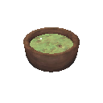|$item_sizzlingberrybroth|Sizzling Berry Broth|Consumable|This soup settles in your stomach with an almost tingly sensation.|
|skeleton_bow |Bow|Bow|Bow|A simple bow. |
|skeleton_bow2 |Bow|Bow|Bow|A simple bow. |
|skeleton_hildir_firenova |Fire Skeleton Sword|Fire Skeleton Sword|OneHandedWeapon|NULL|
|skeleton_mace |Dragur axe|Dragur axe|OneHandedWeapon|NULL|
|skeleton_sword |Dragur axe|Dragur axe|OneHandedWeapon|NULL|
|skeleton_sword_hildir |Fire Skeleton Sword|Fire Skeleton Sword|OneHandedWeapon|NULL|
|skeleton_sword2 |Dragur axe|Dragur axe|OneHandedWeapon|NULL|
|SledgeCheat |Cheat sledge|Cheat sledge|TwoHandedWeapon|Cheater!|
|SledgeDemolisher |$item_sledge_demolisher|Demolisher|TwoHandedWeapon|This mighty sledge yearns to wreak havoc.|
|SledgeIron |$item_sledge_iron|Iron Sledge|TwoHandedWeapon|A mighty hammer, worthy of a champion.|
|SledgeStagbreaker |$item_stagbreaker|Stagbreaker|TwoHandedWeapon|A weapon worthy of the Gods! If you get hit with this, you'll know it...|
|Softtissue |$item_softtissue|Soft Tissue|Material|It still fizzes softly with ancient memories.|
|Sparkler |$item_sparkler|Sparkler|Torch|It's a stick that sparkles. Pretty!|
|SparklingShroomshake 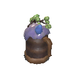|$item_sparklingshroomshake|Sparkling Shroomshake|Consumable|Perhaps it's not the best flavour to start the day with, but it will give you the boost you need.|
|SpearBronze |$item_spear_bronze|Bronze Spear|OneHandedWeapon|A sturdy spear with a head of burnished bronze.|
|SpearCarapace |$item_spear_carapace|Carapace Spear|OneHandedWeapon|Sharpened to jagged perfection, this spear is sure to be deadly.|
|SpearChitin |$item_spear_chitin|Abyssal Harpoon|OneHandedWeapon|The ocean's wrath.|
|SpearElderbark |$item_spear_ancientbark|Ancient Bark Spear|OneHandedWeapon|Despite its gnarled look, this spear is strong and perfectly balanced.|
|SpearFlint |$item_spear_flint|Flint Spear|OneHandedWeapon|If your eye marks a thing for death, let your arm send the messenger.|
|SpearSplitner 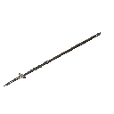|$item_spear_splitner|Splitnir|OneHandedWeapon|Split your enemies' hearts in two.|
|SpearSplitner_Blood |$item_spear_splitner_blood|Splitnir the Bleeding|OneHandedWeapon|A small sacrifice must be made for every battle...|
|SpearSplitner_Lightning 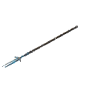|$item_spear_splitner_lightning|Splitnir the Storming|OneHandedWeapon|Let the crack of thunder split the air.|
|SpearSplitner_Nature |$item_spear_splitner_nature|Splitnir the Primal|OneHandedWeapon|Nature's forces burst through the ground wherever this spear strikes.|
|SpearWolfFang |$item_spear_wolffang|Fang Spear|OneHandedWeapon|Even in death, the wolf's tooth aches for flesh.|
|SpicyMarmalade |$item_spicymarmalade|Spicy Marmalade|Consumable|Sugary honey perfectly balanced with tangy fronds and tart berries.|
|staff_greenroots_tentaroot_attack|Dragur axe|Dragur axe|OneHandedWeapon|NULL|
|StaffClusterbomb |$item_staffclusterbomb|Staff of Fracturing|TwoHandedWeapon|Only those with patience and focus will be able to harness the true power of this staff.|
|StaffFireball |$item_stafffireball|Staff of Embers|TwoHandedWeapon|The sweltering heat of Muspelheim seems almost pathetic when compared to what this staff can do...|
|StaffGreenRoots |$item_staffgreenroots|Staff of the Wild|TwoHandedWeapon|Ancient natural forces lie curled and dormant within this staff, ready to be unleashed.|
|StaffIceShards |$item_stafficeshards|Staff of Frost|TwoHandedWeapon|A staff as cold as the three-year winter that will herald the end of times.|
|StaffLightning |$item_staff_lightning|Dundr|TwoHandedWeapon|What happens next may shock you.|
|StaffRedTroll |$item_staffredtroll|Trollstav|TwoHandedWeapon|Summons a raging beast to cause death and destruction.|
|StaffShield |$item_staffshield|Staff of Protection|TwoHandedWeapon|For a slight blood offering it will protect the caster in a magical shell.|
|StaffSkeleton |$item_staffskeleton|Dead Raiser|TwoHandedWeaponLeft|Sacrifice a bit of blood to raise the dead. Upgrade the skull to spawn multiple skeletons, and increase your blood magic to make them stronger.|
|StaminaUpgrade_Greydwarf |Stamina Greydwarf|Stamina Greydwarf|Consumable|[item_staminaupgrade_description]|
|StaminaUpgrade_Troll |Stamina Troll|Stamina Troll|Consumable|[item_staminaupgrade_description]|
|StaminaUpgrade_Wraith |Stamina Wraith|Stamina Wraith|Consumable|[item_staminaupgrade_description]|
|Stone |$item_stone|Stone|Material|It's a rock.|
|stonegolem_attack_doublesmash|slap|slap|OneHandedWeapon|NULL|
|stonegolem_attack_sonicboom_NOTUSED|slap|slap|OneHandedWeapon|NULL|
|stonegolem_attack1_spike|Spike attack|Spike attack|OneHandedWeapon|NULL|
|stonegolem_attack2_left_groundslam|One hand ground slam|One hand ground slam|OneHandedWeapon|NULL|
|stonegolem_attack3_spikesweep|Spike sweep|Spike sweep|OneHandedWeapon|NULL|
|StoneGolem_clubs ||NULL|Chest|NULL|
|StoneGolem_hat ||NULL|Helmet|NULL|
|StoneGolem_spikes ||NULL|Chest|NULL|
|SulfurStone |$item_sulfurstone|Sulfur|Material|Smells like rotten eggs.|
|SurtlingCore |$item_surtlingcore|Surtling Core|Material|It throbs with inner heat.|
|SwordBlackmetal |$item_sword_blackmetal|Black Metal Sword|OneHandedWeapon|A thing of death and beauty. It catches the light with a greenish glow.|
|SwordBronze |$item_sword_bronze|Bronze Sword|OneHandedWeapon|Blood-drinker. A thirsty friend.|
|SwordCheat |Cheat sword|Cheat sword|OneHandedWeapon|Cheater!|
|SwordDyrnwyn |$item_sword_dyrnwyn|Dyrnwyn|OneHandedWeapon|The sword that was broken is whole once more. Its flames burn hot, fuelled by the memories of ancient warriors.|
|SwordIron |$item_sword_iron|Iron Sword|OneHandedWeapon|The straight line between life and death runs along the edge of this blade.|
|SwordIronFire |$item_sword_fire|Dyrnwyn|OneHandedWeapon|Unsheathed, it sizzles and spits with deathless fire, an impossible blade.|
|SwordMistwalker |$item_sword_mistwalker|Mistwalker|OneHandedWeapon|The faint glow seems to slice through the mist.|
|SwordNiedhogg |$item_sword_niedhogg|Nidhgg|OneHandedWeapon|Named after the evil dragon that dwells by the roots of the world tree, this sword heralds doom for those who cross its path.|
|SwordNiedhoggBlood |$item_sword_niedhogg_blood|Nidhgg the Bleeding|OneHandedWeapon|If you bleed, your foes are sure to do so as well.|
|SwordNiedhoggLightning |$item_sword_niedhogg_lightning|Nidhgg the Thundering|OneHandedWeapon|The power of lightning dances along the blade of this sword, a promise of the pain to come.|
|SwordNiedhoggNature |$item_sword_niedhogg_nature|Nidhgg the Primal|OneHandedWeapon|Tangle your foes in roots, like the namesake of this blade.|
|SwordSilver |$item_sword_silver|Silver Sword|OneHandedWeapon|Purest of metals, nothing unclean can abide its touch.|
|Tankard |$item_tankard|Tankard|OneHandedWeapon|Skl!|
|Tankard_dvergr |$item_dvergrtankard|Dvergr Tankard|OneHandedWeapon|It can hold a lot of mead!|
|TankardAnniversary |$item_tankard_anniversary|Horn of Celebration|OneHandedWeapon|One year since we arrived... Skl!|
|TankardOdin |$item_tankard_odin|Mead Horn of Odin|OneHandedWeapon|Odin's finest warriors deserve the finest drinks.|
|Tar |$item_tar|Tar|Material|A sticky lump of tar.|
|tentaroot_attack|Dragur axe|Dragur axe|OneHandedWeapon|NULL|
|Thistle |$item_thistle|Thistle|Material|Beautiful but prickly.|
|THSwordKrom |$item_sword_krom|Krom|TwoHandedWeapon|As deadly as it is shiny, and it's very shiny.|
|THSwordSlayer |$item_sword_slayer|Slayer|TwoHandedWeapon|This mighty blade thirsts for the blood of foes.|
|THSwordSlayerBlood |$item_sword_slayer_blood|Brutal Slayer|TwoHandedWeapon|If it bleeds, you can kill it.|
|THSwordSlayerLightning |$item_sword_slayer_lightning|Scourging Slayer|TwoHandedWeapon|The lightning bound into this blade is erratic, ever searching for something to strike.|
|THSwordSlayerNature |$item_sword_slayer_nature|Primal Slayer|TwoHandedWeapon|The blade works in tandem with the primal forces of the world, seeking death and slaughter.|
|Thunderstone |$item_thunderstone|Thunder Stone|Material|It is crackling with energy.|
|tick_attack|boar attack1|boar attack1|OneHandedWeapon|NULL|
|tick_attack_attach|boar attack1|boar attack1|OneHandedWeapon|NULL|
|Tin |$item_tin|Tin|Material|A bar of pure tin ready to be worked.|
|TinOre |$item_tinore|Tin Ore|Material|Unrefined tin. Needs to be refined in a smelter.|
|Torch |$item_torch|Torch|Torch|It brings light and warmth, drives back the darkness.|
|TorchMist |$item_torchmist|[item_torchmist]|Torch|It brings light and warmth, drives back the darkness.|
|troll_groundslam|slap|slap|OneHandedWeapon|NULL|
|troll_log_swing_h |LOG|LOG|OneHandedWeapon|NULL|
|troll_log_swing_v |LOG|LOG|OneHandedWeapon|NULL|
|troll_punch|slap|slap|OneHandedWeapon|NULL|
|troll_summoned_groundslam|slap|slap|OneHandedWeapon|NULL|
|troll_summoned_log_swing_h |LOG|LOG|OneHandedWeapon|NULL|
|troll_summoned_log_swing_v |LOG|LOG|OneHandedWeapon|NULL|
|troll_summoned_punch|slap|slap|OneHandedWeapon|NULL|
|troll_summoned_throw|fireballattack|fireballattack|OneHandedWeapon|NULL|
|troll_throw|fireballattack|fireballattack|OneHandedWeapon|NULL|
|TrollHide |$item_trollhide|Troll Hide|Material|A thick and sturdy hide. This is why trolls are so hard to kill.|
|TrophyAbomination |$item_trophy_abomination|Abomination Trophy|Trophy|It's been dead so long that it started living again.|
|TrophyAsksvin |$item_trophy_asksvin|Asksvin Trophy|Trophy|Don't let yourself be fooled by the friendly smile, for it could easily bite your arm off.|
|TrophyBlob |$item_trophy_blob|Blob Trophy|Trophy|A smelly lump of sticky matter.|
|TrophyBoar |$item_trophy_boar|Boar Trophy|Trophy|This boar head would make for a nice decoration in any house.|
|TrophyBonemass |$item_trophy_bonemass|Bonemass Trophy|Trophy|Bones and viscous goo, held together by some unseen force.  Offer it to the Sacrificial Stones.|
|TrophyBonemawSerpent |$item_trophy_bonemaw|Bonemaw Trophy|Trophy|A skull made up of dense bone, as dangerous as it is protective.|
|TrophyCharredArcher |$item_trophy_charredarcher|Marksman Trophy|Trophy|These legs could hold infinite power.|
|TrophyCharredMage |$item_trophy_charredmage|Warlock Trophy|Trophy|A warm glow seems to almost emanate from within. Handle with care.|
|TrophyCharredMelee |$item_trophy_charredmelee|Warrior Trophy|Trophy|Fractures line this skull, as if it has taken many hits over the years.|
|TrophyCultist |$item_trophy_cultist|Cultist Trophy|Trophy|The fire in its eyes has still not burned out.|
|TrophyCultist_Hildir |$item_trophy_cultist_hildir|Geirrhafa Trophy|Trophy|He's giving you an icy stare.|
|TrophyDeathsquito |$item_trophy_deathsquito|Deathsquito Trophy|Trophy|You don't like touching this thing even when it's dead.|
|TrophyDeer |$item_trophy_deer|Deer Trophy|Trophy|A fine specimen but you'll need to kill more than deer to enter Valhalla.|
|TrophyDragonQueen |$item_trophy_dragonqueen|Moder Trophy|Trophy|The head of a dragon, majestic even in the rigor of death.  Offer it to the Sacrificial Stones.|
|TrophyDraugr |$item_trophy_draugr|Draugr Trophy|Trophy|Bind up the mouth if it starts to whisper in the night...|
|TrophyDraugrElite |$item_trophy_draugrelite|Draugr Elite Trophy|Trophy|The dead stare of the glowing red eyes sends a shiver through your bones.|
|TrophyDraugrFem |$item_trophy_draugr|Draugr Trophy|Trophy|Bind up the mouth if it starts to whisper in the night...|
|TrophyDvergr |$item_trophy_dvergr|Dvergr Trophy|Trophy|It's frankly a little troubling that you would consider hanging these on your wall...|
|TrophyEikthyr |$item_trophy_eikthyr|Eikthyr Trophy|Trophy|This severed head oozes power.  Offer it to the Sacrificial Stones.|
|TrophyFader |$item_trophy_fader|Fader Trophy|Trophy|The green dragon, corrupted beyond redemption.  Offer him to the sacrificial stones.|
|TrophyFallenValkyrie |$item_trophy_fallenvalkyrie|Fallen Valkyrie Trophy|Trophy|Though she is dead, she yearns for the blood to flow.|
|TrophyFenring |$item_trophy_fenring|Fenring Trophy|Trophy|Half-way between wolf and man, its face frozen in a snarl of pain.|
|TrophyForestTroll |$item_trophy_troll|Troll Trophy|Trophy|The leathery skin bears the faded tracery of ancient symbols.|
|TrophyFrostTroll |$item_trophy_troll|Troll Trophy|Trophy|The leathery skin bears the faded tracery of ancient symbols.|
|TrophyGjall |$item_trophy_gjall|Gjall Trophy|Trophy|Hopefully it won't float away.|
|TrophyGoblin |$item_trophy_goblin|Fuling Trophy|Trophy|Loose folds of greenish skin gathered in around a pair of dark and hateful eyes.|
|TrophyGoblinBrute |$item_trophy_goblinbrute|Fuling Berserker Trophy|Trophy|The huge grizzled head is as heavy as a boulder.|
|TrophyGoblinBruteBrosBrute |$item_trophy_brutebro|Thungr Trophy|Trophy|Not so tough now.|
|TrophyGoblinBruteBrosShaman |$item_trophy_shamanbro|Zil Trophy|Trophy|In the choice of 'ride or die', he picked the latter.|
|TrophyGoblinKing |$item_trophy_goblinking|Yagluth Trophy|Trophy|The crownless head of a dead king.  Offer it to the Sacrificial Stones.|
|TrophyGoblinShaman |$item_trophy_goblinshaman|Fuling Shaman Trophy|Trophy|Even killing it couldn't wipe the knowing smile from its crooked lips...|
|TrophyGreydwarf |$item_trophy_greydwarf|Greydwarf Trophy|Trophy|The mossy, severed head of a Greydwarf.|
|TrophyGreydwarfBrute |$item_trophy_greydwarfbrute|Greydwarf Brute Trophy|Trophy|It took seven blows to hack this gnarled head from its body.|
|TrophyGreydwarfShaman |$item_trophy_greydwarfshaman|Greydwarf Shaman Trophy|Trophy|It may try to come back so be sure to prune any new shoots...|
|TrophyGrowth |$item_trophy_growth|Growth Trophy|Trophy|A black and sticky mess.|
|TrophyHare |$item_trophy_hare|Hare Trophy|Trophy|These are said to bring luck. But not for their original owner.|
|TrophyHatchling |$item_trophy_hatchling|Drake Trophy|Trophy|Still cold to the touch.|
|TrophyLeech |$item_trophy_leech|Leech Trophy|Trophy|Although slimy, the skin is beautifully patterned in red and black.|
|TrophyLox |$item_trophy_lox|Lox Trophy|Trophy|A giant beast's head, thatched with thick fur.|
|TrophyMorgen |$item_trophy_morgen|Morgen Trophy|Trophy|The waking nightmare has met its end.|
|TrophyNeck |$item_trophy_neck|Neck Trophy|Trophy|The beady eyes and razorsharp teeth belies the ostensibly calm nature of this small lizard.|
|TrophySeeker |$item_trophy_seeker|Seeker Trophy|Trophy|Less delicate than they look. The leather of the wings catches the firelight as if remembering flight.|
|TrophySeekerBrute |$item_trophy_seeker_brute|Seeker Soldier Trophy|Trophy|The head of a fallen champion.|
|TrophySeekerQueen |$item_trophy_seekerqueen|The Queen Trophy|Trophy|She has seen enough.  Offer it to the Sacrificial Stones.|
|TrophySerpent |$item_trophy_serpent|Serpent Trophy|Trophy|The scales have dulled but the eyes are still bright.|
|TrophySGolem |$item_trophy_sgolem|Stone Golem Trophy|Trophy|This crystalline rock formation would make for an impressive floor decoration.|
|TrophySkeleton |$item_trophy_skeleton|Skeleton Trophy|Trophy|The expressionless grin of this skull reminds you of the inevitability of death.|
|TrophySkeletonHildir |$item_trophy_skeleton_hildir|Brenna Trophy|Trophy|Still burning, somehow.|
|TrophySkeletonPoison |$item_trophy_skeletonpoison|Rancid Remains Trophy|Trophy|A rank and rotten skull. You're not sure why you kept it...|
|TrophySurtling |$item_trophy_surtling|Surtling Trophy|Trophy|Wreathed in pale flame, it still smolders like an ember.|
|TrophyTheElder |$item_trophy_elder|The Elder Trophy|Trophy|This severed head oozes power.  Offer it to the Sacrificial Stones.|
|TrophyTick |$item_trophy_tick|Tick Trophy|Trophy|It's a conversation piece...|
|TrophyUlv |$item_trophy_ulv|Ulv Trophy|Trophy|A rugged tail from a not so good boy.|
|TrophyVolture |$item_trophy_volture|Volture Trophy|Trophy|It's like a vulture, but it thrives in volcanic climates.|
|TrophyWolf |$item_trophy_wolf|Wolf Trophy|Trophy|Frozen in death, the hair matted with blood and a silent howl lodged in its throat.|
|TrophyWraith |$item_trophy_wraith|Wraith Trophy|Trophy|The shed skin of a wraith, a flowing robe only visible by moonlight.|
|Turnip |$item_turnip|Turnip|Material|A dense vegetable, rich with nutrition.|
|TurnipSeeds |$item_turnipseeds|Turnip Seeds|Material|Plant to grow a healthy turnip.|
|TurnipStew |$item_turnipstew|Turnip Stew|Consumable|Nutritious and restorative.|
|TurretBolt |$item_turretbolt|Black Metal Missile|AmmoNonEquipable|These thick missiles can punch through the hide of even the toughest foes.|
|TurretBoltBone |$item_turretboltbone|[item_turretboltbone]|AmmoNonEquipable|[item_turretboltbone_description]|
|TurretBoltFlametal |$item_turretbolt_flametal|Flametal Missile|AmmoNonEquipable|Forged from one of the hardest metals in all of Valheim, this missile is sure to hold off your enemies.|
|TurretBoltWood |$item_turretboltwood|Wooden Missile|AmmoNonEquipable|Sturdy wooden missiles that can provide a tough defense against foes.|
|Ulv_attack1_bite|Bite Attack|Bite Attack|OneHandedWeapon|NULL|
|Ulv_attack2_slash|Slash Attack|Slash Attack|OneHandedWeapon|NULL|
|VegvisirShard_Bonemass |Yagluth thing|Yagluth thing|Material|Placeholder item for Yagluth item drop.|
|Vineberry |$item_vineberry|Vineberry Cluster|Consumable|These juicy berries are both sour and sweet.|
|VineberrySeeds |$item_vineberryseeds|Vineberry Seeds|Material|Looks like they could crumble at any moment.|
|volture_talons|Volture Talons|Volture Talons|OneHandedWeapon|NULL|
|VoltureEgg |$item_voltureegg|Volture Egg|Material|Warm to the touch, and full of protein.|
|VoltureMeat |$item_volture_meat|Volture Meat|Material|Given that this bird feasts on all kinds of things, you'd better cook its meat before you even think about eating it.|
|Wishbone |$item_wishbone|Wishbone|Utility|This ancient bone remembers the location of many forgotten things.|
|Wisp |$item_wisp|Wisp|Material|It keeps whispering jibberish...|
|WitheredBone |$item_witheredbone|Withered Bone|Material|A giant bone, knotted like old wood.|
|Wolf_Attack1|WolfAttack1|WolfAttack1|OneHandedWeapon|NULL|
|Wolf_Attack2|WolfAttack2|WolfAttack2|OneHandedWeapon|NULL|
|Wolf_Attack3|WolfAttack3|WolfAttack3|OneHandedWeapon|NULL|
|WolfClaw |$item_wolfclaw|Fenris Claw|Material|It is hard and sharp like iron.|
|WolfFang |$item_wolffang|Wolf Fang|Material|Still sharp.|
|WolfHairBundle |$item_wolfhairbundle|Fenris Hair|Material|A bundle of thick, rough hair. It has a strong smell.|
|WolfJerky |$item_wolfjerky|Wolf Jerky|Consumable|Chewy and full of flavor.|
|WolfMeat |$item_wolf_meat|Wolf Meat|Material||
|WolfMeatSkewer |$item_wolf_skewer|Wolf Skewer|Consumable|Dripping with taste.|
|WolfPelt |$item_wolfpelt|Wolf Pelt|Material|A pelt of shaggy fur.|
|Wood |$item_wood|Wood|Material|Good, strong wood to build with.|
|wraith_melee|Wraith melee|Wraith melee|OneHandedWeapon|NULL|
|YagluthDrop |$item_yagluththing|Torn Spirit|Material|The remains of Yagluth, a twisted spirit torn between this world and the next.|
|YggdrasilPorridge |$item_yggdrasilporridge|Yggdrasil Porridge|Consumable|Made with sap from the great tree. Even a mouthful imparts a warm glow to your whole body.|
|YggdrasilWood |$item_yggdrasilwood|Yggdrasil Wood|Material|Godflesh, wood from the Great Tree.|
|YmirRemains |$item_ymirremains|Ymir Flesh|Material|The earthy remains of the giant Ymir.|
