# Piece list
All of the pieces currently in the game.
This file is automatically generated from Valheim 0.218.15 using the JotunnDoc mod found on our GitHub.
## _CultivatorPieceTable

|Piece |Token |Name |Description |Resources required |
|---|---|---|---|---|
|cultivate_v2|$piece_cultivate|Cultivate|NULL|<ul></ul>|
|replant_v2|$piece_replant|Grass|NULL|<ul></ul>|
|sapling_turnip |$piece_sapling_turnip|Turnip|NULL|<ul><li>1 Turnip Seeds</li></ul>|
|sapling_seedturnip |$piece_sapling_seedturnip|Seed-turnip|Plant a turnip to get more seeds|<ul><li>1 Turnip</li></ul>|
|sapling_onion |$piece_sapling_onion|Onion|NULL|<ul><li>1 Onion Seeds</li></ul>|
|sapling_seedonion |$piece_sapling_seedonion|Seed-onion|Plant onion seeds to get even more seeds.|<ul><li>1 Onion</li></ul>|
|sapling_carrot |$piece_sapling_carrot|Carrot|Plant carrot seeds to grow carrots|<ul><li>1 Carrot Seeds</li></ul>|
|sapling_seedcarrot |$piece_sapling_seedcarrot|Seed-carrot|Plant a carrot to get more seeds|<ul><li>1 Carrot</li></ul>|
|sapling_barley |$piece_sapling_barley|Barley|NULL|<ul><li>1 Barley</li></ul>|
|sapling_flax |$piece_sapling_flax|Flax|NULL|<ul><li>1 Flax</li></ul>|
|sapling_jotunpuffs |$item_jotunpuffs|Jotun Puffs|NULL|<ul><li>1 Jotun Puffs</li></ul>|
|sapling_magecap |$item_magecap|Magecap|NULL|<ul><li>1 Magecap</li></ul>|
|FirTree_Sapling |$prop_fir_sapling|Fir Sapling|NULL|<ul><li>1 Fir Cone</li></ul>|
|PineTree_Sapling |$prop_pine_sapling|Pine Sapling|NULL|<ul><li>1 Pine Cone</li></ul>|
|Beech_Sapling |$prop_beech_sapling|Beech sapling|NULL|<ul><li>1 Beech Seeds</li></ul>|
|Birch_Sapling |$prop_birch_sapling|Birch Sapling|NULL|<ul><li>1 Birch Seeds</li></ul>|
|Oak_Sapling |$prop_oak_sapling|Oak Sapling|NULL|<ul><li>1 Acorns</li></ul>|
|VineAsh_sapling |$piece_sapling_vineash|Ashvine|Needs something to cling to.|<ul><li>1 Vineberry Seeds</li></ul>|
## _HammerPieceTable

|Piece |Token |Name |Description |Resources required |
|---|---|---|---|---|
|piece_repair|$piece_repair|Repair|NULL|<ul></ul>|
|fire_pit |$piece_firepit|Campfire|NULL|<ul><li>5 Stone</li><li>2 Wood</li></ul>|
|fire_pit_iron |$piece_firepit_iron|Iron Fire Pit|NULL|<ul><li>1 Iron Pit</li><li>1 Wood</li></ul>|
|bonfire |$piece_bonfire|Bonfire|NULL|<ul><li>1 Surtling Core</li><li>5 Ancient Bark</li><li>5 Finewood</li><li>5 Corewood</li></ul>|
|hearth |$piece_hearth|Hearth|NULL|<ul><li>15 Stone</li></ul>|
|wood_stack |$piece_woodstack|Wood Stack|NULL|<ul><li>50 Wood</li></ul>|
|wood_fine_stack |$piece_woodfinestack|Finewood Stack|NULL|<ul><li>50 Finewood</li></ul>|
|wood_core_stack |$piece_woodcorestack|Corewood Stack|NULL|<ul><li>50 Corewood</li></ul>|
|wood_yggdrasil_stack |$piece_yggdrasilstack|Yggdrasil Wood Stack|NULL|<ul><li>50 Yggdrasil Wood</li></ul>|
|blackwood_stack |$piece_blackwoodstack|Ashwood Stack|NULL|<ul><li>50 Ashwood</li></ul>|
|stone_pile |$piece_stonepile|Stone Pile|NULL|<ul><li>50 Stone</li></ul>|
|coal_pile |$piece_coalpile|Coal Pile|NULL|<ul><li>50 Coal</li></ul>|
|blackmarble_pile |$piece_marblepile|Black Marble Pile|NULL|<ul><li>50 Black Marble</li></ul>|
|grausten_pile |$piece_graustenpile|Grausten Pile|NULL|<ul><li>50 Grausten</li></ul>|
|skull_pile |$piece_skullpile|Pile of Skulls|NULL|<ul><li>50 Charred Skull</li></ul>|
|bone_stack |$piece_bonestack|Bone Stack|NULL|<ul><li>50 Bone Fragments</li></ul>|
|piece_cookingstation |$piece_cookingstation|Cooking Station|NULL|<ul><li>2 Wood</li></ul>|
|piece_cookingstation_iron |$piece_cookingstation_iron|Iron Cooking Station|NULL|<ul><li>3 Iron</li><li>3 Chain</li></ul>|
|piece_cauldron |$piece_cauldron|Cauldron|Crafting station|<ul><li>10 Tin</li></ul>|
|cauldron_ext1_spice |$piece_cauldron_ext1_spice|Spice Rack|Cauldron improvement|<ul><li>3 Dandelion</li><li>2 Carrot</li><li>5 Mushroom</li><li>3 Thistle</li><li>3 Turnip</li></ul>|
|cauldron_ext3_butchertable |$piece_cauldron_ext3_butchertable|Butcher's Table|Cauldron improvement|<ul><li>2 Ancient Bark</li><li>4 Corewood</li><li>4 Finewood</li><li>2 Silver</li></ul>|
|cauldron_ext4_pots |$piece_cauldron_ext4_pans|Pots and Pans|Cauldron improvement|<ul><li>5 Iron</li><li>5 Copper</li><li>5 Black Metal</li><li>10 Finewood</li></ul>|
|cauldron_ext5_mortarandpestle |$piece_cauldron_ext5_mortarandpestle|Mortar and Pestle|Cauldron improvement|<ul><li>8 Black Marble</li><li>6 Finewood</li><li>4 Corewood</li></ul>|
|cauldron_ext6_rollingpins |$piece_cauldron_ext6_rollingpins|Rolling Pins and Cutting Boards|Cauldron improvement|<ul><li>8 Ashwood</li><li>6 Finewood</li><li>4 Flametal</li></ul>|
|piece_oven |$piece_oven|Stone Oven|NULL|<ul><li>15 Iron</li><li>20 Stone</li><li>4 Surtling Core</li></ul>|
|piece_workbench |$piece_workbench|Workbench|Crafting station|<ul><li>10 Wood</li></ul>|
|piece_workbench_ext1 |$piece_workbench_ext1|Chopping Block|Workbench improvement|<ul><li>10 Wood</li><li>10 Flint</li></ul>|
|piece_workbench_ext2 |$piece_workbench_ext2|Tanning Rack|Workbench improvement|<ul><li>10 Wood</li><li>15 Flint</li><li>20 Leather Scraps</li><li>5 Deer Hide</li></ul>|
|piece_workbench_ext3 |$piece_workbench_ext3|Adze|Workbench improvement|<ul><li>10 Finewood</li><li>3 Bronze</li></ul>|
|piece_workbench_ext4 |$piece_workbench_ext4|Tool Shelf|Workbench improvement|<ul><li>4 Iron</li><li>10 Finewood</li><li>4 Obsidian</li></ul>|
|piece_stonecutter |$piece_stonecutter|Stonecutter|Crafting station|<ul><li>10 Wood</li><li>2 Iron</li><li>4 Stone</li></ul>|
|piece_artisanstation |$piece_artisanstation|Artisan Table|Crafting station|<ul><li>10 Wood</li><li>2 Dragon Tear</li></ul>|
|artisan_ext1 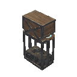|$piece_artisan_ext1|Artisan Press|Artisan Table improvement|<ul><li>5 Black Marble</li><li>5 Bronze</li><li>1 Majestic Carapace</li></ul>|
|forge |$piece_forge|Forge|Crafting station|<ul><li>4 Stone</li><li>4 Coal</li><li>10 Wood</li><li>6 Copper</li></ul>|
|forge_ext1 |$piece_forge_ext1|Forge Bellows|Forge improvement|<ul><li>5 Wood</li><li>5 Deer Hide</li><li>4 Chain</li></ul>|
|forge_ext2 |$piece_forge_ext2|Anvils|Forge improvement|<ul><li>5 Wood</li><li>2 Bronze</li></ul>|
|forge_ext3 |$piece_forge_ext3|Grinding Wheel|Forge improvement|<ul><li>25 Wood</li><li>1 Sharpening Stone</li></ul>|
|forge_ext4 |$piece_forge_ext4|Smith's Anvil|Forge improvement|<ul><li>20 Iron</li><li>5 Wood</li></ul>|
|forge_ext5 |$piece_forge_ext5|Forge Cooler|Forge improvement|<ul><li>25 Finewood</li><li>10 Copper</li></ul>|
|forge_ext6 |$piece_forge_ext6|Forge Tool Rack|Forge improvement|<ul><li>15 Iron</li><li>10 Wood</li></ul>|
|smelter |$piece_smelter|Smelter|NULL|<ul><li>20 Stone</li><li>5 Surtling Core</li></ul>|
|blastfurnace |$piece_blastfurnace|Blast Furnace|NULL|<ul><li>20 Stone</li><li>5 Surtling Core</li><li>10 Iron</li><li>20 Finewood</li></ul>|
|eitrrefinery |$piece_eitrrefinery|Eitr Refinery|NULL|<ul><li>20 Black Marble</li><li>5 Black Metal</li><li>10 Yggdrasil Wood</li><li>5 Black Core</li><li>3 Sap</li></ul>|
|blackforge |$piece_blackforge|Black Forge|Crafting station|<ul><li>10 Black Marble</li><li>10 Yggdrasil Wood</li><li>5 Black Core</li></ul>|
|blackforge_ext1 |$piece_blackforge_ext1|Black Forge Cooler|Black Forge improvement|<ul><li>5 Iron</li><li>5 Copper</li><li>4 Black Marble</li></ul>|
|blackforge_ext2_vise |$piece_blackforge_ext2|Vice|Black Forge improvement|<ul><li>5 Iron</li><li>8 Copper</li><li>2 Mechanical Spring</li></ul>|
|blackforge_ext3_metalcutter |$piece_blackforge_ext3|Metal Cutter|Black Forge improvement|<ul><li>5 Black Marble</li><li>5 Flametal</li><li>5 Ashwood</li><li>4 Charred Bone</li></ul>|
|blackforge_ext4_gemcutter |$piece_blackforge_ext4|Gem Cutter|Black Forge improvement|<ul><li>5 Flametal</li><li>8 Ashwood</li><li>2 Morgen Sinew</li><li>1 Bloodstone</li></ul>|
|charcoal_kiln |$piece_charcoalkiln|Charcoal Kiln|NULL|<ul><li>20 Stone</li><li>5 Surtling Core</li></ul>|
|windmill |$piece_windmill|Windmill|NULL|<ul><li>20 Stone</li><li>30 Wood</li><li>30 Iron Nails</li></ul>|
|piece_spinningwheel |$piece_spinningwheel|Spinning Wheel|NULL|<ul><li>20 Finewood</li><li>10 Iron Nails</li><li>5 Leather Scraps</li></ul>|
|wood_floor_1x1 |$piece_woodfloor1x1|Wood Floor 1x1|NULL|<ul><li>1 Wood</li></ul>|
|wood_floor |$piece_woodfloor2x2|Wood Floor 2x2|NULL|<ul><li>2 Wood</li></ul>|
|wood_stair |$piece_woodstair|Wood Stairs|NULL|<ul><li>2 Wood</li></ul>|
|wood_stepladder |$piece_woodstepladder|Wood Ladder|NULL|<ul><li>2 Wood</li></ul>|
|wood_wall_quarter |$piece_woodwallquarter|Wood Wall 1x1|NULL|<ul><li>1 Wood</li></ul>|
|wood_wall_half |$piece_woodwallhalf|Wood Wall Half|NULL|<ul><li>1 Wood</li></ul>|
|woodwall |$piece_woodwall|Wood Wall|NULL|<ul><li>2 Wood</li></ul>|
|wood_wall_roof |$piece_woodwallroof|Wood Wall 26|NULL|<ul><li>2 Wood</li></ul>|
|wood_wall_roof_upsidedown |$piece_woodwallroof_upsidedown|Wood Wall 26 (Inverted)|NULL|<ul><li>2 Wood</li></ul>|
|wood_wall_roof_top |$piece_woodwallrooftop|Wood Roof Cross 26|NULL|<ul><li>2 Wood</li></ul>|
|wood_wall_roof_45 |$piece_woodwallroof45|Wood Wall 45|NULL|<ul><li>2 Wood</li></ul>|
|wood_wall_roof_45_upsidedown |$piece_woodwallroof45_upsidedown|Wood Wall 45 (Inverted)|NULL|<ul><li>2 Wood</li></ul>|
|wood_wall_roof_top_45 |$piece_woodwallrooftop45|Wood Roof Cross 45|NULL|<ul><li>2 Wood</li></ul>|
|wood_roof |$piece_woodroof26|Thatch Roof 26|NULL|<ul><li>2 Wood</li></ul>|
|wood_roof_top |$piece_woodrooftop|Thatch Roof Ridge 26|NULL|<ul><li>2 Wood</li></ul>|
|wood_roof_ocorner |$piece_woodroofocorner|Thatch Roof Outer Corner 26|NULL|<ul><li>2 Wood</li></ul>|
|wood_roof_icorner |$piece_woodrooficorner|Thatch Roof Inner Corner 26|NULL|<ul><li>2 Wood</li></ul>|
|wood_roof_45 |$piece_woodroof45|Thatch Roof 45|NULL|<ul><li>2 Wood</li></ul>|
|wood_roof_top_45 |$piece_woodrooftop45|Thatch Roof Ridge 45|NULL|<ul><li>2 Wood</li></ul>|
|wood_roof_ocorner_45 |$piece_woodroofocorner45|Thatch Roof Outer Corner 45|NULL|<ul><li>2 Wood</li></ul>|
|wood_roof_icorner_45 |$piece_woodrooficorner45|Thatch Roof Inner Corner 45|NULL|<ul><li>2 Wood</li></ul>|
|wood_pole |$piece_woodpole|Wood Pole 1 m|NULL|<ul><li>1 Wood</li></ul>|
|wood_pole2 |$piece_woodpole2|Wood Pole 2 m|NULL|<ul><li>2 Wood</li></ul>|
|wood_beam_1 |$piece_woodbeam1|Wood Beam 1 m|NULL|<ul><li>1 Wood</li></ul>|
|wood_beam |$piece_woodbeam2|Wood Beam 2 m|NULL|<ul><li>2 Wood</li></ul>|
|wood_beam_26 |$piece_woodbeam26|Wood Beam 26|NULL|<ul><li>2 Wood</li></ul>|
|wood_beam_45 |$piece_woodbeam45|Wood Beam 45|NULL|<ul><li>2 Wood</li></ul>|
|wood_dragon1 |$piece_wooddragon|Wood Dragon Adornment|NULL|<ul><li>10 Finewood</li></ul>|
|wood_door |$piece_wooddoor|Wood Door|NULL|<ul><li>4 Wood</li></ul>|
|wood_gate |$piece_woodgate|Wood Gate|NULL|<ul><li>12 Wood</li></ul>|
|darkwood_gate |$piece_darkwoodgate|Darkwood Gate|NULL|<ul><li>16 Wood</li><li>4 Iron</li><li>2 Tar</li></ul>|
|piece_hexagonal_door |$piece_hexagonalgate|Hexagonal Gate|NULL|<ul><li>8 Yggdrasil Wood</li><li>8 Copper</li></ul>|
|wood_window |$piece_woodwindowshutter|Wood Shutter|NULL|<ul><li>4 Wood</li><li>2 Bronze Nails</li></ul>|
|wood_pole_log |$piece_logpole2|Log Pole 2 m|NULL|<ul><li>1 Corewood</li></ul>|
|wood_pole_log_4 |$piece_logpole4|Log Pole 4 m|NULL|<ul><li>2 Corewood</li></ul>|
|wood_wall_log |$piece_logbeam2|Log Beam 2 m|NULL|<ul><li>1 Corewood</li></ul>|
|wood_wall_log_4x0.5 |$piece_logbeam4|Log Beam 4 m|NULL|<ul><li>2 Corewood</li></ul>|
|wood_log_26 |$piece_woodlog26|Log Beam 26|NULL|<ul><li>2 Corewood</li></ul>|
|wood_log_45 |$piece_woodlog45|Log Beam 45|NULL|<ul><li>2 Corewood</li></ul>|
|darkwood_roof |$piece_darkwoodroof26|Shingle Roof 26|NULL|<ul><li>2 Wood</li><li>1 Tar</li></ul>|
|darkwood_roof_top |$piece_darkwoodrooftop|Shingle Roof Ridge 26|NULL|<ul><li>2 Wood</li><li>1 Tar</li></ul>|
|darkwood_roof_ocorner |$piece_darkwoodroofocorner|Shingle Roof Outer Corner 26|NULL|<ul><li>2 Wood</li><li>1 Tar</li></ul>|
|darkwood_roof_icorner |$piece_darkwoodrooficorner|Shingle Roof Inner Corner 26|NULL|<ul><li>2 Wood</li><li>1 Tar</li></ul>|
|darkwood_roof_45 |$piece_darkwoodroof45|Shingle Roof 45|NULL|<ul><li>2 Wood</li><li>1 Tar</li></ul>|
|darkwood_roof_top_45 |$piece_darkwoodrooftop45|Shingle Roof Ridge 45|NULL|<ul><li>2 Wood</li><li>1 Tar</li></ul>|
|darkwood_roof_ocorner_45 |$piece_darkwoodroofocorner45|Shingle Roof Outer Corner 45|NULL|<ul><li>2 Wood</li><li>1 Tar</li></ul>|
|darkwood_roof_icorner_45 |$piece_darkwoodrooficorner45|Shingle Roof Inner Corner 45|NULL|<ul><li>2 Wood</li><li>1 Tar</li></ul>|
|darkwood_pole |$piece_darkwoodpole|Darkwood Pole 2m|NULL|<ul><li>2 Wood</li><li>1 Tar</li></ul>|
|darkwood_pole4 |$piece_darkwoodpole4|Darkwood Pole 4m|NULL|<ul><li>4 Wood</li><li>1 Tar</li></ul>|
|darkwood_beam |$piece_darkwoodbeam|Darkwood Beam 2 m|NULL|<ul><li>2 Wood</li><li>1 Tar</li></ul>|
|darkwood_beam_26 |$piece_darkwoodbeam_26|Darkwood Beam 26|NULL|<ul><li>2 Wood</li><li>1 Tar</li></ul>|
|darkwood_beam_45 |$piece_darkwoodbeam_45|Darkwood Beam 45|NULL|<ul><li>2 Wood</li><li>1 Tar</li></ul>|
|darkwood_beam4x4 |$piece_darkwoodbeam4|Darkwood Beam 4 m|NULL|<ul><li>4 Wood</li><li>1 Tar</li></ul>|
|darkwood_decowall |$piece_darkwooddecowall|Carved Darkwood Divider|NULL|<ul><li>2 Finewood</li><li>1 Tar</li></ul>|
|darkwood_arch |$piece_darkwoodarch|Darkwood Arch|NULL|<ul><li>2 Wood</li><li>1 Tar</li></ul>|
|darkwood_raven |$piece_darkwoodraven|Raven Adornment|NULL|<ul><li>10 Finewood</li><li>1 Tar</li></ul>|
|darkwood_wolf |$piece_darkwoodwolf|Wolf Adornment|NULL|<ul><li>10 Finewood</li><li>1 Tar</li></ul>|
|wood_fence |$piece_woodfence|Roundpole Fence|NULL|<ul><li>1 Wood</li></ul>|
|stake_wall |$piece_stakewall|Stakewall|NULL|<ul><li>4 Wood</li></ul>|
|piece_dvergr_stake_wall |$piece_dvergr_stake_wall|Dvergr Stakewall|NULL|<ul><li>8 Yggdrasil Wood</li><li>8 Iron</li></ul>|
|piece_sharpstakes |$piece_sharpstakes|Sharp Stakes|NULL|<ul><li>6 Wood</li><li>4 Corewood</li></ul>|
|piece_stakewall_blackwood |$piece_BlackwoodStakewall|Ashwood Stakewall|NULL|<ul><li>6 Ashwood</li></ul>|
|piece_dvergr_sharpstakes |$piece_dvergr_sharpstakes|Dvergr Sharp Stakes|NULL|<ul><li>5 Yggdrasil Wood</li><li>2 Iron</li></ul>|
|stone_wall_1x1 |$piece_stonewall1x1|Stone Wall 1x1|NULL|<ul><li>3 Stone</li></ul>|
|stone_wall_2x1 |$piece_stonewall2x1|Stone Wall 2x1|NULL|<ul><li>4 Stone</li></ul>|
|stone_wall_4x2 |$piece_stonewall4x2|Stone Wall 4x2|NULL|<ul><li>6 Stone</li></ul>|
|stone_pillar |$piece_stonepillar|Stone Pillar|NULL|<ul><li>5 Stone</li></ul>|
|stone_arch |$piece_stonearch|Stone Arch|NULL|<ul><li>4 Stone</li></ul>|
|stone_floor_2x2 |$piece_stonefloor2x2|Stone Floor 2x2|NULL|<ul><li>6 Stone</li></ul>|
|stone_stair |$piece_stonestair|Stone Stair|NULL|<ul><li>8 Stone</li></ul>|
|blackmarble_1x1 |$piece_blackmarble1x1|Black Marble 1x1x1|NULL|<ul><li>2 Black Marble</li></ul>|
|blackmarble_2x1x1 |$piece_blackmarble2x1x1|Black Marble 2x1x1|NULL|<ul><li>4 Black Marble</li></ul>|
|blackmarble_2x2x2 |$piece_blackmarble2x2x2|Black Marble 2x2x2|NULL|<ul><li>8 Black Marble</li></ul>|
|blackmarble_floor |$piece_blackmarble_floor|Black Marble Floor|NULL|<ul><li>4 Black Marble</li></ul>|
|blackmarble_floor_triangle |$piece_blackmarble_floor_triangle|Black Marble Floor Triangle|NULL|<ul><li>3 Black Marble</li></ul>|
|blackmarble_stair |$piece_blackmarble_stair|Black Marble Stair|NULL|<ul><li>8 Black Marble</li></ul>|
|blackmarble_tip |$piece_blackmarble_tip|Black Marble Quarter Spire|NULL|<ul><li>2 Black Marble</li></ul>|
|blackmarble_base_1 |$piece_blackmarble_base1|Black Marble Plinth|NULL|<ul><li>5 Black Marble</li></ul>|
|blackmarble_basecorner |$piece_blackmarble_basecorner|Black Marble Plinth Corner|NULL|<ul><li>6 Black Marble</li></ul>|
|blackmarble_out_1 |$piece_blackmarble_out1|Black Marble Cornice|NULL|<ul><li>5 Black Marble</li></ul>|
|blackmarble_outcorner |$piece_blackmarble_outcorner|Black Marble Cornice Corner|NULL|<ul><li>6 Black Marble</li></ul>|
|blackmarble_arch |$piece_blackmarble_arch|Black Marble Arch|NULL|<ul><li>5 Black Marble</li></ul>|
|blackmarble_column_1 |$piece_blackmarble_column_1|Black Marble Column Small|NULL|<ul><li>2 Black Marble</li></ul>|
|blackmarble_column_2 |$piece_blackmarble_column_2|Black Marble Column Wide|NULL|<ul><li>4 Black Marble</li></ul>|
|iron_floor_1x1_v2 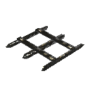|$piece_ironfloorSmall|Cage Floor 1x1|NULL|<ul><li>1 Iron</li></ul>|
|iron_floor_2x2 |$piece_ironfloor|Cage Floor 2x2|NULL|<ul><li>2 Iron</li></ul>|
|iron_wall_1x1 |$piece_ironwallSmall|Cage Wall 1x1|NULL|<ul><li>1 Iron</li></ul>|
|iron_wall_2x2 |$piece_ironwall|Cage Wall 2x2|NULL|<ul><li>2 Iron</li></ul>|
|piece_dvergr_metal_wall_2x2 |$piece_dvergr_metal_wall|Dvergr Metal Wall|NULL|<ul><li>2 Copper</li></ul>|
|woodiron_pole |$piece_woodironpole|Wood Iron Pole|NULL|<ul><li>2 Wood</li><li>1 Iron</li></ul>|
|woodiron_beam |$piece_woodironbeam|Wood Iron Beam|NULL|<ul><li>2 Wood</li><li>1 Iron</li></ul>|
|woodiron_beam_26 |$piece_woodironbeam_26|Wood Iron Beam 26|NULL|<ul><li>2 Wood</li><li>1 Iron</li></ul>|
|woodiron_beam_45 |$piece_woodironbeam_45|Wood Iron Beam 45|NULL|<ul><li>2 Wood</li><li>1 Iron</li></ul>|
|iron_grate |$piece_irongate|Iron Gate|NULL|<ul><li>4 Iron</li></ul>|
|piece_trap_troll |$piece_trap|Trap|NULL|<ul><li>5 Black Metal</li><li>10 Bronze Nails</li><li>1 Mechanical Spring</li></ul>|
|piece_turret |$piece_turret|Ballista|Defensive structure that shoots missiles at anything that gets in its way.|<ul><li>10 Black Metal</li><li>10 Yggdrasil Wood</li><li>3 Mechanical Spring</li></ul>|
|bed |$piece_bed|Bed|NULL|<ul><li>8 Wood</li></ul>|
|piece_bed02 |$piece_bed02|Dragon Bed|NULL|<ul><li>40 Finewood</li><li>7 Deer Hide</li><li>4 Wolf Pelt</li><li>10 Feathers</li><li>15 Iron Nails</li></ul>|
|ashwood_bed 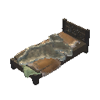|$piece_ashwood_bed|Ashwood Bed|NULL|<ul><li>8 Ashwood</li><li>2 Lox Pelt</li><li>2 Asksvin Hide</li></ul>|
|piece_chest_wood |$piece_chestwood|Chest|NULL|<ul><li>10 Wood</li></ul>|
|piece_chest |$piece_chest|Reinforced Chest|NULL|<ul><li>10 Finewood</li><li>2 Iron</li></ul>|
|piece_chest_private |$piece_chestprivate|Personal Chest|NULL|<ul><li>10 Finewood</li><li>8 Iron</li></ul>|
|piece_chest_blackmetal |$piece_chestblackmetal|Black Metal Chest|NULL|<ul><li>10 Wood</li><li>2 Tar</li><li>6 Black Metal</li></ul>|
|piece_chair |$piece_stool|Stool|NULL|<ul><li>4 Finewood</li></ul>|
|piece_chair02 |$piece_chair|Wood Chair|NULL|<ul><li>4 Finewood</li></ul>|
|piece_chair03 |$piece_darkwoodchair|Darkwood Chair|NULL|<ul><li>4 Finewood</li><li>1 Tar</li><li>5 Iron Nails</li><li>1 Deer Hide</li></ul>|
|piece_bench01 |$piece_bench01|Wood Bench|NULL|<ul><li>6 Finewood</li></ul>|
|piece_logbench01 |$piece_benchlog|Sitting Log|NULL|<ul><li>2 Corewood</li></ul>|
|piece_blackmarble_bench |$piece_blackmarble_bench|Black Marble Bench|NULL|<ul><li>6 Black Marble</li><li>3 Copper</li></ul>|
|piece_throne01 |$piece_throne01|Raven Throne|NULL|<ul><li>20 Finewood</li><li>10 Iron Nails</li></ul>|
|piece_throne02 |$piece_stonethrone|Stone Throne|NULL|<ul><li>20 Stone</li><li>2 Deer Hide</li><li>2 Wolf Pelt</li></ul>|
|piece_blackmarble_throne |$piece_blackmarble_throne|Black Marble Throne|NULL|<ul><li>20 Black Marble</li><li>4 Scale Hide</li><li>2 Deer Hide</li><li>5 Copper</li></ul>|
|piece_bone_throne |$piece_bone_throne|Bone Throne|NULL|<ul><li>15 Charred Bone</li><li>4 Flametal</li><li>20 Grausten</li><li>3 Charred Skull</li></ul>|
|piece_table |$piece_table|Table|NULL|<ul><li>6 Finewood</li></ul>|
|piece_table_round |$piece_table_round|Round Table|NULL|<ul><li>10 Finewood</li><li>2 Tar</li><li>20 Iron Nails</li></ul>|
|piece_table_oak |$piece_table_oak|Long Heavy Table|NULL|<ul><li>20 Finewood</li><li>2 Tar</li><li>20 Iron Nails</li></ul>|
|piece_blackmarble_table |$piece_blackmarble_table|Black Marble Table|NULL|<ul><li>6 Black Marble</li><li>3 Copper</li></ul>|
|piece_walltorch |$piece_sconce|Sconce|NULL|<ul><li>2 Wood</li><li>2 Copper</li><li>2 Resin</li></ul>|
|piece_groundtorch |$piece_groundtorch|Standing Iron Torch|NULL|<ul><li>2 Iron</li><li>2 Resin</li></ul>|
|piece_groundtorch_wood |$piece_groundtorchwood|Standing Wood Torch|NULL|<ul><li>2 Wood</li><li>2 Resin</li></ul>|
|piece_groundtorch_green |$piece_groundtorchgreen|Standing Green-burning Iron Torch|NULL|<ul><li>2 Iron</li><li>2 Guck</li></ul>|
|piece_groundtorch_blue |$piece_groundtorchblue|Standing Blue-burning Iron Torch|NULL|<ul><li>2 Iron</li><li>2 Greydwarf Eye</li></ul>|
|piece_groundtorch_mist |$piece_groundtorchdemister|Wisp Torch|NULL|<ul><li>1 Yggdrasil Wood</li><li>1 Wisp</li></ul>|
|piece_brazierfloor01 |$piece_brazierfloor01|Standing Brazier|NULL|<ul><li>5 Bronze</li><li>2 Coal</li><li>3 Fenris Claw</li></ul>|
|piece_brazierfloor02 |$piece_brazierfloor02|Blue Standing Brazier|NULL|<ul><li>5 Bronze</li><li>5 Greydwarf Eye</li><li>3 Fenris Claw</li></ul>|
|piece_brazierceiling01 |$piece_brazierceiling01|Hanging Brazier|NULL|<ul><li>5 Bronze</li><li>2 Coal</li><li>1 Chain</li></ul>|
|piece_Lavalantern 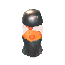|$piece_lavalantern|Lava Lantern|NULL|<ul><li>1 Flametal</li><li>1 Proustite Powder</li><li>1 Sulfur</li></ul>|
|portal_wood |$piece_portal|Portal|Connects to another portal with equal or no tag.|<ul><li>10 Greydwarf Eye</li><li>20 Finewood</li><li>2 Surtling Core</li></ul>|
|portal_stone 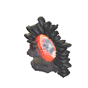|$piece_portal_stone|Portal  Stone|The powerful energy source lets you pass through even with the most valuable of items.|<ul><li>10 Greydwarf Eye</li><li>30 Grausten</li><li>2 Molten Core</li></ul>|
|guard_stone |$piece_guardstone|Ward|Emits a magic seal on the nearby surroundings which prevents other players from constructing buildings or opening doors.|<ul><li>5 Finewood</li><li>5 Greydwarf Eye</li><li>1 Surtling Core</li></ul>|
|Cart |$tool_cart|Cart|NULL|<ul><li>20 Wood</li><li>10 Bronze Nails</li></ul>|
|VikingShip_Ashlands |$ship_longship_ashlands|Drakkar|NULL|<ul><li>100 Iron Nails</li><li>30 Ceramic Plate</li><li>50 Finewood</li><li>25 Yggdrasil Wood</li></ul>|
|VikingShip |$ship_longship|Longship|NULL|<ul><li>100 Iron Nails</li><li>10 Deer Hide</li><li>40 Finewood</li><li>40 Ancient Bark</li></ul>|
|Raft |$ship_raft|Raft|NULL|<ul><li>20 Wood</li><li>6 Leather Scraps</li><li>6 Resin</li></ul>|
|Karve |$ship_karve|Karve|NULL|<ul><li>30 Finewood</li><li>10 Deer Hide</li><li>20 Resin</li><li>80 Bronze Nails</li></ul>|
|itemstand |$piece_itemstand|Item Stand|Vertical|<ul><li>4 Finewood</li><li>1 Bronze Nails</li></ul>|
|itemstandh |$piece_itemstand|Item Stand|Horizontal|<ul><li>4 Finewood</li><li>1 Bronze Nails</li></ul>|
|sign |$piece_sign|Sign|NULL|<ul><li>2 Wood</li><li>1 Coal</li></ul>|
|rug_fur |$piece_rug_lox|Lox Rug|NULL|<ul><li>4 Lox Pelt</li></ul>|
|rug_wolf |$piece_rug_wolf|Wolf Rug|NULL|<ul><li>4 Wolf Pelt</li></ul>|
|rug_deer |$piece_rug_deer|Deer Rug|NULL|<ul><li>4 Deer Hide</li></ul>|
|jute_carpet |$piece_jute_carpet|Red Jute Carpet|NULL|<ul><li>4 Red Jute</li></ul>|
|jute_carpet_blue |$piece_juteblue_carpet|Blue Jute Carpet|NULL|<ul><li>4 Blue Jute</li></ul>|
|rug_hare |$piece_rug_hare|Hare Rug|NULL|<ul><li>4 Scale Hide</li></ul>|
|rug_asksvin 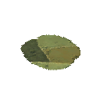|$piece_rug_asksvin|Asksvin Rug|NULL|<ul><li>4 Asksvin Hide</li></ul>|
|rug_straw 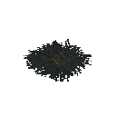|$piece_rug_straw|Straw|NULL|<ul><li>1 Barley</li><li>1 Flax</li></ul>|
|piece_banner01 |$piece_banner01|Black Banner|NULL|<ul><li>6 Leather Scraps</li><li>2 Finewood</li><li>4 Coal</li></ul>|
|piece_banner02 |$piece_banner02|Blue Banner|NULL|<ul><li>6 Leather Scraps</li><li>2 Finewood</li><li>4 Blueberries</li></ul>|
|piece_banner03 |$piece_banner03|White and Red Striped Banner|NULL|<ul><li>6 Leather Scraps</li><li>2 Finewood</li><li>4 Raspberries</li></ul>|
|piece_banner04 |$piece_banner04|Red Banner|NULL|<ul><li>6 Leather Scraps</li><li>2 Finewood</li><li>1 Bloodbag</li></ul>|
|piece_banner05 |$piece_banner05|Green Banner|NULL|<ul><li>6 Leather Scraps</li><li>2 Finewood</li><li>1 Guck</li></ul>|
|piece_banner06 |$piece_banner06|Blue, Red and White Banner|NULL|<ul><li>6 Leather Scraps</li><li>2 Finewood</li><li>2 Blueberries</li><li>2 Raspberries</li><li>1 Cloudberries</li></ul>|
|piece_banner07 |$piece_banner07|White and Blue Striped Banner|NULL|<ul><li>6 Leather Scraps</li><li>2 Finewood</li><li>2 Blueberries</li><li>3 Cloudberries</li></ul>|
|piece_banner08 |$piece_banner08|Yellow Banner|NULL|<ul><li>6 Leather Scraps</li><li>2 Finewood</li><li>4 Dandelion</li><li>2 Coal</li></ul>|
|piece_banner09 |$piece_banner09|Purple Banner|NULL|<ul><li>6 Leather Scraps</li><li>2 Finewood</li><li>2 Blueberries</li><li>3 Raspberries</li></ul>|
|piece_banner10 |$piece_banner10|Orange Banner|NULL|<ul><li>6 Leather Scraps</li><li>2 Finewood</li><li>2 Carrot</li><li>3 Cloudberries</li></ul>|
|piece_banner11 |$piece_banner11|White Banner|NULL|<ul><li>6 Leather Scraps</li><li>2 Finewood</li><li>2 Coal</li><li>4 Cloudberries</li></ul>|
|piece_cloth_hanging_door |$piece_clothdoor|Red Jute Curtain|NULL|<ul><li>4 Red Jute</li><li>1 Finewood</li></ul>|
|piece_cloth_hanging_door_blue |$piece_hanging_cloth_blue1|Blue Jute Drapes|NULL|<ul><li>4 Blue Jute</li><li>1 Finewood</li></ul>|
|piece_cloth_hanging_door_blue2 |$piece_hanging_cloth_blue2|Blue Jute Curtain|NULL|<ul><li>4 Blue Jute</li><li>1 Finewood</li></ul>|
|piece_beehive |$piece_beehive|Beehive|NULL|<ul><li>10 Wood</li><li>1 Queen Bee</li></ul>|
|piece_sapcollector |$piece_sapcollector|Sap Extractor|Extract sap from mysterious branches.|<ul><li>10 Yggdrasil Wood</li><li>5 Black Metal</li><li>1 Dvergr Extractor</li></ul>|
|fermenter |$piece_fermenter|Fermenter|NULL|<ul><li>30 Finewood</li><li>5 Bronze</li><li>10 Resin</li></ul>|
|piece_gift1 |$piece_yuleklapp|Yuleklapp|NULL|<ul><li>2 Finewood</li><li>1 Bone Fragments</li></ul>|
|piece_gift2 |$piece_yuleklapp|Yuleklapp|NULL|<ul><li>3 Finewood</li><li>1 Dandelion</li></ul>|
|piece_gift3 |$piece_yuleklapp|Yuleklapp|NULL|<ul><li>4 Finewood</li><li>1 Raspberries</li></ul>|
|piece_xmastree |$piece_yuletree|Yule Tree|NULL|<ul><li>10 Wood</li><li>1 Fir Cone</li></ul>|
|piece_xmasgarland |$piece_yulegarland|Yule Garland|NULL|<ul><li>2 Finewood</li><li>1 Pine Cone</li></ul>|
|piece_xmascrown |$piece_yulecrown|Yule Wreath|NULL|<ul><li>4 Pine Cone</li><li>1 Red Jute</li><li>1 Finewood</li></ul>|
|piece_mistletoe |$piece_mistletoe|Mistletoe|NULL|<ul><li>1 Finewood</li><li>1 Red Jute</li></ul>|
|piece_maypole |$piece_maypole|Maypole|NULL|<ul><li>10 Wood</li><li>4 Dandelion</li><li>4 Thistle</li></ul>|
|piece_jackoturnip |$piece_jackoturnip|Jack-o-turnip|NULL|<ul><li>4 Turnip</li><li>2 Resin</li></ul>|
|piece_chest_treasure |$piece_chesttreasure|Treasure Chest|NULL|<ul><li>99 Coins</li><li>5 Ruby</li><li>2 Silver Necklace</li><li>8 Finewood</li><li>2 Silver</li></ul>|
|treasure_pile |$piece_treasure_pile|Coin Pile|NULL|<ul><li>999 Coins</li></ul>|
|treasure_stack |$piece_treasure_stack|Coin Stack|NULL|<ul><li>99 Coins</li></ul>|
|piece_bathtub |$piece_bathtub|Hot Tub|NULL|<ul><li>20 Wood</li><li>6 Tar</li><li>10 Iron</li><li>8 Stone</li></ul>|
|crystal_wall_1x1 |$piece_crystalwall1x1|Crystal Wall 1x1|NULL|<ul><li>2 Crystal</li></ul>|
|piece_cartographytable |$piece_cartographytable|Cartography Table|NULL|<ul><li>10 Finewood</li><li>10 Bone Fragments</li><li>2 Bronze</li><li>5 Leather Scraps</li><li>4 Raspberries</li></ul>|
|incinerator |$piece_incinerator|Obliterator|NULL|<ul><li>8 Iron</li><li>4 Copper</li><li>1 Thunder Stone</li></ul>|
|ArmorStand |$piece_armorstand|Armour Stand|NULL|<ul><li>8 Finewood</li><li>4 Iron Nails</li><li>2 Leather Scraps</li></ul>|
|piece_magetable |$piece_magetable|Galdr Table|Crafting station|<ul><li>20 Yggdrasil Wood</li><li>10 Black Metal</li><li>5 Black Core</li><li>5 Refined Eitr</li></ul>|
|piece_magetable_ext |$piece_magetable_ext|Rune Table|Galdr Table improvement|<ul><li>10 Black Marble</li><li>5 Yggdrasil Wood</li><li>10 Refined Eitr</li></ul>|
|piece_magetable_ext2 |$piece_magetable_ext2|Unfading Candles|Galdr Table improvement|<ul><li>10 Black Marble</li><li>3 Skeleton Trophy</li><li>10 Refined Eitr</li><li>15 Resin</li></ul>|
|piece_magetable_ext3 |$piece_magetable_ext3|Feathery Wreath|Galdr Table improvement|<ul><li>8 Celestial Feather</li><li>1 Asksvin Trophy</li><li>10 Refined Eitr</li><li>3 Ashwood</li></ul>|
|piece_wisplure |$piece_wisplure|Wisp Fountain|Attracts wisps. They mostly come at night... mostly.|<ul><li>10 Stone</li><li>1 Torn Spirit</li></ul>|
|piece_dvergr_spiralstair |$piece_dvergr_spiralstair|Dvergr Spiral Staircase Left|NULL|<ul><li>5 Yggdrasil Wood</li><li>2 Copper</li></ul>|
|piece_dvergr_spiralstair_right |$piece_dvergr_spiralstair_right|Dvergr Spiral Staircase Right|NULL|<ul><li>5 Yggdrasil Wood</li><li>2 Copper</li></ul>|
|piece_dvergr_lantern |$piece_dvergr_lantern|Dvergr Wall Lantern|NULL|<ul><li>2 Copper</li><li>1 Dvergr Lantern</li><li>1 Chain</li></ul>|
|piece_dvergr_lantern_pole |$piece_dvergr_lantern_pole|Dvergr Pole Lantern|NULL|<ul><li>3 Copper</li><li>1 Dvergr Lantern</li><li>1 Chain</li></ul>|
|piece_barber |$piece_barber|Barber Station|Helps you stay up to date with the latest viking fashion.|<ul><li>10 Finewood</li><li>1 Barber Kit</li><li>5 Bronze Nails</li><li>5 Troll Hide</li></ul>|
|BatteringRam 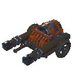|$tool_batteringram|Battering Ram|NULL|<ul><li>20 Ashwood</li><li>10 Flametal</li><li>2 Surtling Core</li></ul>|
|Catapult 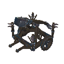|$tool_catapult|Catapult|NULL|<ul><li>20 Ashwood</li><li>10 Flametal</li><li>1 Charred Cogwheel</li></ul>|
|piece_shieldgenerator 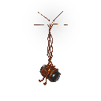|$piece_shieldgenerator|Shield Generator|Creates a shield to protect against weather and incoming projectiles. Fuelled by bones of any kind.|<ul><li>5 Iron</li><li>5 Copper</li><li>1 Shield Core</li></ul>|
|piece_pot3 |$piece_pot_small_green|Small Green Pot|NULL|<ul><li>3 Pot Shard</li><li>1 Charcoal Resin</li></ul>|
|piece_pot1 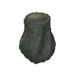|$piece_pot_medium_green|Medium Green Pot|NULL|<ul><li>4 Pot Shard</li><li>1 Charcoal Resin</li></ul>|
|piece_pot2 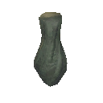|$piece_pot_large_green|Large Green Pot|NULL|<ul><li>5 Pot Shard</li><li>1 Charcoal Resin</li></ul>|
|Piece_grausten_stone_ladder |$piece_grausten_stoneladder|Grausten Steep Stairs|NULL|<ul><li>5 Grausten</li></ul>|
|piece_grausten_stonestair |$piece_grausten_stair|Grausten Stairs|NULL|<ul><li>8 Grausten</li></ul>|
|Piece_grausten_floor_1x1 |$piece_grausten_floor1x1|Grausten Floor 1x1|NULL|<ul><li>2 Grausten</li></ul>|
|Piece_grausten_floor_2x2 |$piece_grausten_floor2x2|Grausten Floor 2x2|NULL|<ul><li>4 Grausten</li></ul>|
|Piece_grausten_floor_4x4 |$piece_grausten_floor4x4|Grausten Floor 4x4|NULL|<ul><li>8 Grausten</li></ul>|
|Piece_grausten_pillarbase_small |$piece_grausten_pillarsmall|Grausten Small Pillar|NULL|<ul><li>1 Grausten</li></ul>|
|Piece_grausten_pillarbase_medium |$piece_grausten_pillarmedium|Grausten Medium Pillar|NULL|<ul><li>3 Grausten</li></ul>|
|Piece_grausten_pillarbase_tapered 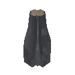|$piece_grausten_pillartapered|Grausten Tapered Pillar|NULL|<ul><li>5 Grausten</li></ul>|
|Piece_grausten_pillarbase_tapered_inverted |$piece_grausten_pillartaperedinverted|Grausten Tapered Pillar (Inverted)|NULL|<ul><li>5 Grausten</li></ul>|
|Piece_grausten_pillarbeam_small |$piece_grausten_beamsmall|Grausten Small Beam|NULL|<ul><li>1 Grausten</li></ul>|
|Piece_grausten_pillarbeam_medium |$piece_grausten_beammedium|Grausten Medium Beam|NULL|<ul><li>3 Grausten</li></ul>|
|Piece_grausten_pillar_arch_small |$piece_grausten_archsmall|Grausten Small Arch|NULL|<ul><li>2 Grausten</li></ul>|
|Piece_grausten_pillar_arch |$piece_grausten_archmedium|Grausten Medium Arch|NULL|<ul><li>4 Grausten</li></ul>|
|Piece_grausten_wall_arch |$piece_grausten_wallarch|Grausten Wall Arch|NULL|<ul><li>2 Grausten</li></ul>|
|Piece_grausten_wall_arch_inverted |$piece_grausten_wallarchinv|Grausten Wall Arch (Inverted)|NULL|<ul><li>2 Grausten</li></ul>|
|Piece_grausten_wall_1x2 |$piece_grausten_wall1x2|Grausten Wall 1x2|NULL|<ul><li>4 Grausten</li></ul>|
|Piece_grausten_wall_2x2 |$piece_grausten_wall2x2|Grausten Wall 2x2|NULL|<ul><li>6 Grausten</li></ul>|
|Piece_grausten_wall_4x2 |$piece_grausten_wall4x2|Grausten Wall 4x2|NULL|<ul><li>12 Grausten</li></ul>|
|Piece_grausten_window_2x2 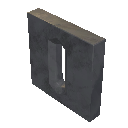|$piece_grausten_window2x2|Grausten Window 2x2|NULL|<ul><li>4 Grausten</li></ul>|
|Piece_grausten_window_4x2 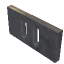|$piece_grausten_window4x2|Grausten Window 4x2|NULL|<ul><li>10 Grausten</li></ul>|
|piece_grausten_roof_45 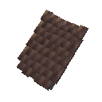|$piece_grausten_roof45|Grausten Roof|NULL|<ul><li>5 Grausten</li></ul>|
|piece_grausten_roof_45_corner 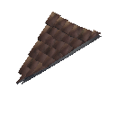|$piece_grausten_roof45_corner|Grausten Roof Corner|NULL|<ul><li>5 Grausten</li></ul>|
|piece_grausten_roof_45_corner2 |$piece_grausten_roof45_corner2|Grausten Roof Corner|NULL|<ul><li>5 Grausten</li></ul>|
|piece_grausten_roof_45_arch 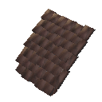|$piece_grausten_roof45_arch|Grausten Arched Roof|NULL|<ul><li>5 Grausten</li></ul>|
|piece_grausten_roof_45_arch_corner |$piece_grausten_roof45_archcorner|Grausten Arched Roof Corner|NULL|<ul><li>5 Grausten</li></ul>|
|piece_grausten_roof_45_arch_corner2 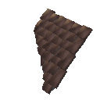|$piece_grausten_roof45_archcorner2|Grausten Arched Roof Corner|NULL|<ul><li>5 Grausten</li></ul>|
|flametal_gate 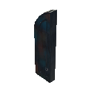|$piece_flametalgate|Flametal Gate|NULL|<ul><li>16 Flametal</li></ul>|
|piece_blackwood_bench01 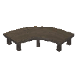|$piece_blackwoodbench01|Ashwood Bench|NULL|<ul><li>6 Ashwood</li></ul>|
|ashwood_wall_2x2 |$piece_ashwood_wall|Ashwood Wall|NULL|<ul><li>2 Ashwood</li></ul>|
|ashwood_halfwall_1x2 |$piece_ashwood_halfwall|Ashwood Half Wall|NULL|<ul><li>1 Ashwood</li></ul>|
|ashwood_quarterwall_1x1 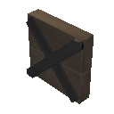|$piece_ashwood_quarterwall|Ashwood Quarter Wall|NULL|<ul><li>1 Ashwood</li></ul>|
|ashwood_wall_arch 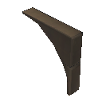|$piece_ashwood_archedwall|Ashwood Arched Wall|NULL|<ul><li>2 Ashwood</li></ul>|
|ashwood_decowall_2x2 |$piece_ashwood_decowall|Ashwood Decorative Wall|NULL|<ul><li>2 Ashwood</li></ul>|
|ashwood_decowall_tree |$piece_ashwood_decowall_tree|Ashwood Decorative Window|NULL|<ul><li>2 Ashwood</li></ul>|
|ashwood_decowall_divider 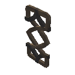|$piece_ashwood_decowall_divider|Ashwood Divider|NULL|<ul><li>2 Ashwood</li></ul>|
|ashwood_floor_2x2 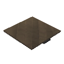|$piece_ashwood_floor_2x2|Ashwood Floor 2x2|NULL|<ul><li>4 Ashwood</li></ul>|
|ashwood_floor_1x1 |$piece_ashwood_floor_1x1|Ashwood Floor 1x1|NULL|<ul><li>2 Ashwood</li></ul>|
|ashwood_deco_floor 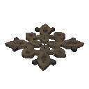|$piece_ashwood_floor_deco|Ashwood Decorative Floor|NULL|<ul><li>4 Ashwood</li></ul>|
|ashwood_arch_big 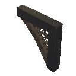|$piece_ashwoodarch_big|Ashwood Arch|NULL|<ul><li>2 Ashwood</li></ul>|
|ashwood_beam_1m |$piece_ashwood_beam_1m|Ashwood Beam 1 m|NULL|<ul><li>2 Ashwood</li></ul>|
|ashwood_beam_2m 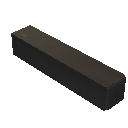|$piece_ashwood_beam_2m|Ashwood Beam 2 m|NULL|<ul><li>4 Ashwood</li></ul>|
|ashwood_pole_1m 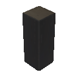|$piece_ashwood_pole_1m|Ashwood Pole 1 m|NULL|<ul><li>2 Ashwood</li></ul>|
|ashwood_pole_2m 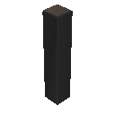|$piece_ashwood_pole_2m|Ashwood Pole 2 m|NULL|<ul><li>4 Ashwood</li></ul>|
|ashwood_wall_beam_26 |$piece_ashwoodbeam26|Ashwood Beam 26|NULL|<ul><li>2 Ashwood</li></ul>|
|ashwood_wall_cross_26 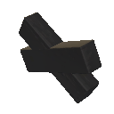|$piece_ashwoodcross26|Ashwood Roof Cross 26|NULL|<ul><li>2 Ashwood</li></ul>|
|ashwood_wall_beam_45 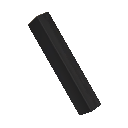|$piece_ashwoodbeam45|Ashwood Beam 45|NULL|<ul><li>2 Ashwood</li></ul>|
|ashwood_wall_cross_45 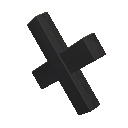|$piece_ashwoodcross45|Ashwood Roof Cross 45|NULL|<ul><li>2 Ashwood</li></ul>|
|ashwood_wall_roof_26 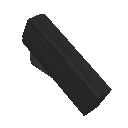|$piece_ashwoodwallroof_26|Ashwood Wall 26|NULL|<ul><li>2 Ashwood</li></ul>|
|ashwood_wall_roof_26_upsidedown 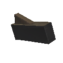|$piece_ashwoodwallroof_26_upsidedown|Ashwood Wall 26 (Inverted)|NULL|<ul><li>2 Ashwood</li></ul>|
|ashwood_wall_roof_45 |$piece_ashwoodwallroof_45|Ashwood Wall 45|NULL|<ul><li>2 Ashwood</li></ul>|
|ashwood_wall_roof_45_upsidedown |$piece_ashwoodwallroof_45_upsidedown|Ashwood Wall 45 (Inverted)|NULL|<ul><li>2 Ashwood</li></ul>|
|ashwood_stair |$piece_ashwoodstair|Ashwood Stair|NULL|<ul><li>2 Ashwood</li></ul>|
|ashwood_door |$piece_ashwood_door|Ashwood Door|NULL|<ul><li>1 Flametal</li><li>5 Ashwood</li></ul>|
|piece_asksvinskeleton |$piece_asksvinskeleton|Asksvin Skeleton|NULL|<ul><li>50 Bone Fragments</li><li>1 Asksvin Neck</li><li>1 Asksvin Pelvis</li><li>1 Asksvin Ribcage</li><li>1 Asksvin Skull</li></ul>|
|Piece_flametal_pillar |$piece_flametal_pillar|Flametal Pillar|NULL|<ul><li>2 Flametal</li></ul>|
|Piece_flametal_beam 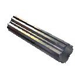|$piece_flametal_beam|Flametal Beam|NULL|<ul><li>2 Flametal</li></ul>|
## _HoePieceTable

|Piece |Token |Name |Description |Resources required |
|---|---|---|---|---|
|mud_road_v2|$piece_levelground|Level Ground|NULL|<ul></ul>|
|raise_v2|$piece_raise|Raise Ground|NULL|<ul><li>2 Stone</li></ul>|
|path_v2|$piece_path|Pathen|NULL|<ul></ul>|
|paved_road_v2|$piece_pavedroad|Paved Road|NULL|<ul><li>1 Stone</li></ul>|
