# Piece list
All of the pieces currently in the game.
This file is automatically generated from Valheim 0.217.38 using the JotunnDoc mod found on our GitHub.
## _CultivatorPieceTable

|Piece |Token |Name |Description |Resources required |
|---|---|---|---|---|
|cultivate_v2|$piece_cultivate|Cultivate|NULL|<ul></ul>|
|replant_v2|$piece_replant|Grass|NULL|<ul></ul>|
|sapling_turnip 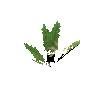|$piece_sapling_turnip|Turnip|NULL|<ul><li>1 Turnip seeds</li></ul>|
|sapling_seedturnip |$piece_sapling_seedturnip|Seed-turnip|Plant a turnip to get more seeds.|<ul><li>1 Turnip</li></ul>|
|sapling_onion 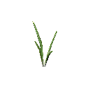|$piece_sapling_onion|Onion|NULL|<ul><li>1 Onion seeds</li></ul>|
|sapling_seedonion 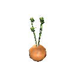|$piece_sapling_seedonion|Seed-onion|Plant onion seeds to get even more seeds.|<ul><li>1 Onion</li></ul>|
|sapling_carrot |$piece_sapling_carrot|Carrot|Plant carrot seeds to grow carrots.|<ul><li>1 Carrot seeds</li></ul>|
|sapling_seedcarrot |$piece_sapling_seedcarrot|Seed-carrot|Plant a carrot to get more seeds.|<ul><li>1 Carrot</li></ul>|
|sapling_barley |$piece_sapling_barley|Barley|NULL|<ul><li>1 Barley</li></ul>|
|sapling_flax |$piece_sapling_flax|Flax|NULL|<ul><li>1 Flax</li></ul>|
|sapling_jotunpuffs 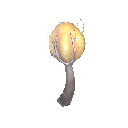|$item_jotunpuffs|Jotun puffs|NULL|<ul><li>1 Jotun puffs</li></ul>|
|sapling_magecap 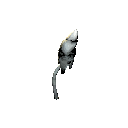|$item_magecap|Magecap|NULL|<ul><li>1 Magecap</li></ul>|
|FirTree_Sapling 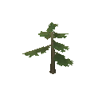|$prop_fir_sapling|Fir sapling|NULL|<ul><li>1 Fir cone</li></ul>|
|PineTree_Sapling 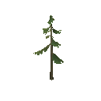|$prop_pine_sapling|Pine sapling|NULL|<ul><li>1 Pine cone</li></ul>|
|Beech_Sapling 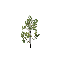|$prop_beech_sapling|Beech sapling|NULL|<ul><li>1 Beech seeds</li></ul>|
|Birch_Sapling 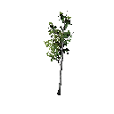|$prop_birch_sapling|Birch sapling|NULL|<ul><li>1 Birch seeds</li></ul>|
|Oak_Sapling 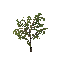|$prop_oak_sapling|Oak sapling|NULL|<ul><li>1 Acorns</li></ul>|
## _HammerPieceTable

|Piece |Token |Name |Description |Resources required |
|---|---|---|---|---|
|piece_repair|$piece_repair|Repair|NULL|<ul></ul>|
|fire_pit 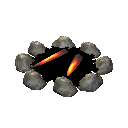|$piece_firepit|Campfire|NULL|<ul><li>5 Stone</li><li>2 Wood</li></ul>|
|fire_pit_iron 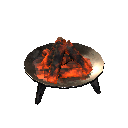|$piece_firepit_iron|Firepit iron|NULL|<ul><li>1 Iron pit</li><li>1 Wood</li></ul>|
|bonfire 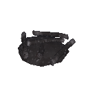|$piece_bonfire|Bonfire|NULL|<ul><li>1 Surtling core</li><li>5 Ancient bark</li><li>5 Fine wood</li><li>5 Core wood</li></ul>|
|hearth 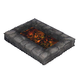|$piece_hearth|Hearth|NULL|<ul><li>15 Stone</li></ul>|
|wood_stack 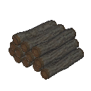|$piece_woodstack|Wood stack|NULL|<ul><li>50 Wood</li></ul>|
|wood_fine_stack 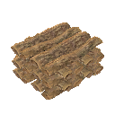|$piece_woodfinestack|Fine wood stack|NULL|<ul><li>50 Fine wood</li></ul>|
|wood_core_stack 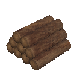|$piece_woodcorestack|Core wood stack|NULL|<ul><li>50 Core wood</li></ul>|
|wood_yggdrasil_stack 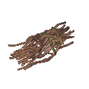|$piece_yggdrasilstack|Yggdrasil wood stack|NULL|<ul><li>50 Yggdrasil wood</li></ul>|
|stone_pile 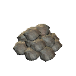|$piece_stonepile|Stone pile|NULL|<ul><li>50 Stone</li></ul>|
|coal_pile 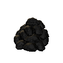|$piece_coalpile|Coal pile|NULL|<ul><li>50 Coal</li></ul>|
|blackmarble_pile |$piece_marblepile|Black marble pile|NULL|<ul><li>50 Black marble</li></ul>|
|piece_cookingstation 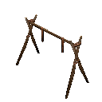|$piece_cookingstation|Cooking station|NULL|<ul><li>2 Wood</li></ul>|
|piece_cookingstation_iron 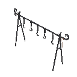|$piece_cookingstation_iron|Iron cooking station|NULL|<ul><li>3 Iron</li><li>3 Chain</li></ul>|
|piece_cauldron |$piece_cauldron|Cauldron|Crafting station|<ul><li>10 Tin</li></ul>|
|cauldron_ext1_spice 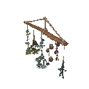|$piece_cauldron_ext1_spice|Spice rack|Cauldron improvement|<ul><li>3 Dandelion</li><li>2 Carrot</li><li>5 Mushroom</li><li>3 Thistle</li><li>3 Turnip</li></ul>|
|cauldron_ext3_butchertable 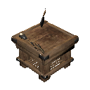|$piece_cauldron_ext3_butchertable|Butcher's table|Cauldron improvement|<ul><li>2 Ancient bark</li><li>4 Core wood</li><li>4 Fine wood</li><li>2 Silver</li></ul>|
|cauldron_ext4_pots 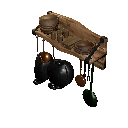|$piece_cauldron_ext4_pans|Pots and pans|Cauldron improvement|<ul><li>5 Iron</li><li>5 Copper</li><li>5 Black metal</li><li>10 Fine wood</li></ul>|
|cauldron_ext5_mortarandpestle 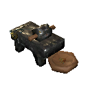|$piece_cauldron_ext5_mortarandpestle|Mortar and pestle|Cauldron improvement|<ul><li>8 Black marble</li><li>6 Fine wood</li><li>4 Core wood</li></ul>|
|piece_oven |$piece_oven|Stone oven|NULL|<ul><li>15 Iron</li><li>20 Stone</li><li>4 Surtling core</li></ul>|
|piece_workbench 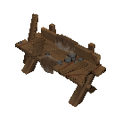|$piece_workbench|Workbench|Crafting station|<ul><li>10 Wood</li></ul>|
|piece_workbench_ext1 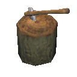|$piece_workbench_ext1|Chopping block|Workbench improvement|<ul><li>10 Wood</li><li>10 Flint</li></ul>|
|piece_workbench_ext2 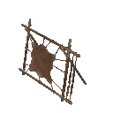|$piece_workbench_ext2|Tanning rack|Workbench improvement|<ul><li>10 Wood</li><li>15 Flint</li><li>20 Leather scraps</li><li>5 Deer hide</li></ul>|
|piece_workbench_ext3 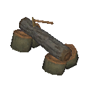|$piece_workbench_ext3|Adze|Workbench improvement|<ul><li>10 Fine wood</li><li>3 Bronze</li></ul>|
|piece_workbench_ext4 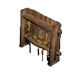|$piece_workbench_ext4|Tool shelf|Workbench improvement|<ul><li>4 Iron</li><li>10 Fine wood</li><li>4 Obsidian</li></ul>|
|piece_stonecutter 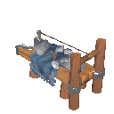|$piece_stonecutter|Stonecutter|Crafting station|<ul><li>10 Wood</li><li>2 Iron</li><li>4 Stone</li></ul>|
|piece_artisanstation 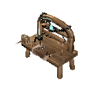|$piece_artisanstation|Artisan table|Crafting station|<ul><li>10 Wood</li><li>2 Dragon tear</li></ul>|
|forge 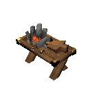|$piece_forge|Forge|Crafting station|<ul><li>4 Stone</li><li>4 Coal</li><li>10 Wood</li><li>6 Copper</li></ul>|
|forge_ext1 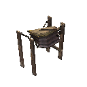|$piece_forge_ext1|Forge bellows|Forge improvement|<ul><li>5 Wood</li><li>5 Deer hide</li><li>4 Chain</li></ul>|
|forge_ext2 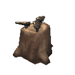|$piece_forge_ext2|Anvils|Forge improvement|<ul><li>5 Wood</li><li>2 Bronze</li></ul>|
|forge_ext3 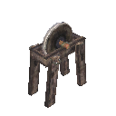|$piece_forge_ext3|Grinding wheel|Forge improvement|<ul><li>25 Wood</li><li>1 Sharpening stone</li></ul>|
|forge_ext4 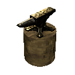|$piece_forge_ext4|Smith's anvil|Forge improvement|<ul><li>20 Iron</li><li>5 Wood</li></ul>|
|forge_ext5 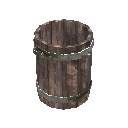|$piece_forge_ext5|Forge cooler|Forge improvement|<ul><li>25 Fine wood</li><li>10 Copper</li></ul>|
|forge_ext6 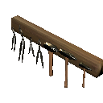|$piece_forge_ext6|Forge toolrack|Forge improvement|<ul><li>15 Iron</li><li>10 Wood</li></ul>|
|smelter 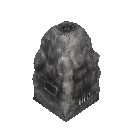|$piece_smelter|Smelter|NULL|<ul><li>20 Stone</li><li>5 Surtling core</li></ul>|
|blastfurnace |$piece_blastfurnace|Blast furnace|NULL|<ul><li>20 Stone</li><li>5 Surtling core</li><li>10 Iron</li><li>20 Fine wood</li></ul>|
|eitrrefinery 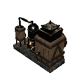|$piece_eitrrefinery|Eitr refinery|NULL|<ul><li>20 Black marble</li><li>5 Black metal</li><li>10 Yggdrasil wood</li><li>5 Black core</li><li>3 Sap</li></ul>|
|blackforge 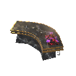|$piece_blackforge|Black forge|Crafting station|<ul><li>10 Black marble</li><li>10 Yggdrasil wood</li><li>5 Black core</li></ul>|
|blackforge_ext1 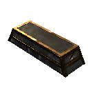|$piece_blackforge_ext1|Black forge cooler|Black forge improvement|<ul><li>5 Iron</li><li>5 Copper</li><li>4 Black marble</li></ul>|
|blackforge_ext2_vise 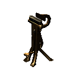|$piece_blackforge_ext2|Vice|Black forge improvement|<ul><li>5 Iron</li><li>8 Copper</li><li>2 Mechanical spring</li></ul>|
|charcoal_kiln 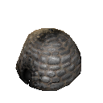|$piece_charcoalkiln|Charcoal kiln|NULL|<ul><li>20 Stone</li><li>5 Surtling core</li></ul>|
|windmill 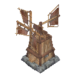|$piece_windmill|Windmill|NULL|<ul><li>20 Stone</li><li>30 Wood</li><li>30 Iron nails</li></ul>|
|piece_spinningwheel 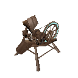|$piece_spinningwheel|Spinning wheel|NULL|<ul><li>20 Fine wood</li><li>10 Iron nails</li><li>5 Leather scraps</li></ul>|
|wood_floor_1x1 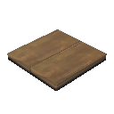|$piece_woodfloor1x1|Wood floor 1x1|NULL|<ul><li>1 Wood</li></ul>|
|wood_floor 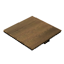|$piece_woodfloor2x2|Wood floor 2x2|NULL|<ul><li>2 Wood</li></ul>|
|wood_stair |$piece_woodstair|Wood stair|NULL|<ul><li>2 Wood</li></ul>|
|wood_stepladder |$piece_woodstepladder|Wood ladder|NULL|<ul><li>2 Wood</li></ul>|
|wood_wall_quarter |$piece_woodwallquarter|Wood wall 1x1|NULL|<ul><li>1 Wood</li></ul>|
|wood_wall_half |$piece_woodwallhalf|Wood wall half|NULL|<ul><li>1 Wood</li></ul>|
|woodwall |$piece_woodwall|Wood wall|NULL|<ul><li>2 Wood</li></ul>|
|wood_wall_roof |$piece_woodwallroof|Wood wall 26|NULL|<ul><li>2 Wood</li></ul>|
|wood_wall_roof_upsidedown |$piece_woodwallroof_upsidedown|Wood wall 26 (inverted)|NULL|<ul><li>2 Wood</li></ul>|
|wood_wall_roof_top |$piece_woodwallrooftop|Wood roof cross 26|NULL|<ul><li>2 Wood</li></ul>|
|wood_wall_roof_45 |$piece_woodwallroof45|Wood wall 45|NULL|<ul><li>2 Wood</li></ul>|
|wood_wall_roof_45_upsidedown |$piece_woodwallroof45_upsidedown|Wood wall 45 (inverted)|NULL|<ul><li>2 Wood</li></ul>|
|wood_wall_roof_top_45 |$piece_woodwallrooftop45|Wood roof cross 45|NULL|<ul><li>2 Wood</li></ul>|
|wood_roof |$piece_woodroof26|Thatch roof 26|NULL|<ul><li>2 Wood</li></ul>|
|wood_roof_top |$piece_woodrooftop|Thatch roof ridge 26|NULL|<ul><li>2 Wood</li></ul>|
|wood_roof_ocorner |$piece_woodroofocorner|Thatch roof o-corner 26|NULL|<ul><li>2 Wood</li></ul>|
|wood_roof_icorner |$piece_woodrooficorner|Thatch roof i-corner 26|NULL|<ul><li>2 Wood</li></ul>|
|wood_roof_45 |$piece_woodroof45|Thatch roof 45|NULL|<ul><li>2 Wood</li></ul>|
|wood_roof_top_45 |$piece_woodrooftop45|Thatch roof ridge 45|NULL|<ul><li>2 Wood</li></ul>|
|wood_roof_ocorner_45 |$piece_woodroofocorner45|Thatch roof o-corner 45|NULL|<ul><li>2 Wood</li></ul>|
|wood_roof_icorner_45 |$piece_woodrooficorner45|Thatch roof i-corner 45|NULL|<ul><li>2 Wood</li></ul>|
|wood_pole |$piece_woodpole|Wood pole 1 m|NULL|<ul><li>1 Wood</li></ul>|
|wood_pole2 |$piece_woodpole2|Wood pole 2 m|NULL|<ul><li>2 Wood</li></ul>|
|wood_beam_1 |$piece_woodbeam1|Wood beam 1 m|NULL|<ul><li>1 Wood</li></ul>|
|wood_beam |$piece_woodbeam2|Wood beam 2 m|NULL|<ul><li>2 Wood</li></ul>|
|wood_beam_26 |$piece_woodbeam26|Wood beam 26|NULL|<ul><li>2 Wood</li></ul>|
|wood_beam_45 |$piece_woodbeam45|Wood beam 45|NULL|<ul><li>2 Wood</li></ul>|
|wood_dragon1 |$piece_wooddragon|Wood dragon adornment|NULL|<ul><li>10 Fine wood</li></ul>|
|wood_door |$piece_wooddoor|Wood door|NULL|<ul><li>4 Wood</li></ul>|
|wood_gate |$piece_woodgate|Wood gate|NULL|<ul><li>12 Wood</li></ul>|
|darkwood_gate |$piece_darkwoodgate|Darkwood gate|NULL|<ul><li>16 Wood</li><li>4 Iron</li><li>2 Tar</li></ul>|
|piece_hexagonal_door |$piece_hexagonalgate|Hexagonal gate|NULL|<ul><li>8 Yggdrasil wood</li><li>8 Copper</li></ul>|
|wood_window |$piece_woodwindowshutter|Wood shutter|NULL|<ul><li>4 Wood</li><li>2 Bronze nails</li></ul>|
|wood_pole_log |$piece_logpole2|Log pole 2 m|NULL|<ul><li>1 Core wood</li></ul>|
|wood_pole_log_4 |$piece_logpole4|Log pole 4 m|NULL|<ul><li>2 Core wood</li></ul>|
|wood_wall_log |$piece_logbeam2|Log beam 2 m|NULL|<ul><li>1 Core wood</li></ul>|
|wood_wall_log_4x0.5 |$piece_logbeam4|Log beam 4 m|NULL|<ul><li>2 Core wood</li></ul>|
|wood_log_26 |$piece_woodlog26|Log beam 26|NULL|<ul><li>2 Core wood</li></ul>|
|wood_log_45 |$piece_woodlog45|Log beam 45|NULL|<ul><li>2 Core wood</li></ul>|
|darkwood_roof |$piece_darkwoodroof26|Shingle roof 26|NULL|<ul><li>2 Wood</li><li>1 Tar</li></ul>|
|darkwood_roof_top |$piece_darkwoodrooftop|Shingle roof ridge 26|NULL|<ul><li>2 Wood</li><li>1 Tar</li></ul>|
|darkwood_roof_ocorner |$piece_darkwoodroofocorner|Shingle roof o-corner 26|NULL|<ul><li>2 Wood</li><li>1 Tar</li></ul>|
|darkwood_roof_icorner |$piece_darkwoodrooficorner|Shingle roof i-corner 26|NULL|<ul><li>2 Wood</li><li>1 Tar</li></ul>|
|darkwood_roof_45 |$piece_darkwoodroof45|Shingle roof 45|NULL|<ul><li>2 Wood</li><li>1 Tar</li></ul>|
|darkwood_roof_top_45 |$piece_darkwoodrooftop45|Shingle roof ridge 45|NULL|<ul><li>2 Wood</li><li>1 Tar</li></ul>|
|darkwood_roof_ocorner_45 |$piece_darkwoodroofocorner45|Shingle roof o-corner 45|NULL|<ul><li>2 Wood</li><li>1 Tar</li></ul>|
|darkwood_roof_icorner_45 |$piece_darkwoodrooficorner45|Shingle roof i-corner 45|NULL|<ul><li>2 Wood</li><li>1 Tar</li></ul>|
|darkwood_pole |$piece_darkwoodpole|Darkwood pole 2m|NULL|<ul><li>2 Wood</li><li>1 Tar</li></ul>|
|darkwood_pole4 |$piece_darkwoodpole4|Darkwood pole 4m|NULL|<ul><li>4 Wood</li><li>1 Tar</li></ul>|
|darkwood_beam |$piece_darkwoodbeam|Darkwood beam 2 m|NULL|<ul><li>2 Wood</li><li>1 Tar</li></ul>|
|darkwood_beam_26 |$piece_darkwoodbeam_26|Darkwood beam 26|NULL|<ul><li>2 Wood</li><li>1 Tar</li></ul>|
|darkwood_beam_45 |$piece_darkwoodbeam_45|Darkwood beam 45|NULL|<ul><li>2 Wood</li><li>1 Tar</li></ul>|
|darkwood_beam4x4 |$piece_darkwoodbeam4|Darkwood beam 4 m|NULL|<ul><li>4 Wood</li><li>1 Tar</li></ul>|
|darkwood_decowall |$piece_darkwooddecowall|Carved Darkwood divider|NULL|<ul><li>2 Fine wood</li><li>1 Tar</li></ul>|
|darkwood_arch |$piece_darkwoodarch|Darkwood arch|NULL|<ul><li>2 Wood</li><li>1 Tar</li></ul>|
|darkwood_raven |$piece_darkwoodraven|Raven adornment|NULL|<ul><li>10 Fine wood</li><li>1 Tar</li></ul>|
|darkwood_wolf |$piece_darkwoodwolf|Wolf adornment|NULL|<ul><li>10 Fine wood</li><li>1 Tar</li></ul>|
|wood_fence |$piece_woodfence|Roundpole fence|NULL|<ul><li>1 Wood</li></ul>|
|stake_wall |$piece_stakewall|Stakewall|NULL|<ul><li>4 Wood</li></ul>|
|piece_dvergr_stake_wall |$piece_dvergr_stake_wall|Dvergr stakewall|NULL|<ul><li>8 Yggdrasil wood</li><li>8 Iron</li></ul>|
|piece_sharpstakes |$piece_sharpstakes|Sharp stakes|NULL|<ul><li>6 Wood</li><li>4 Core wood</li></ul>|
|piece_dvergr_sharpstakes |$piece_dvergr_sharpstakes|Dvergr sharp stakes|NULL|<ul><li>5 Yggdrasil wood</li><li>2 Iron</li></ul>|
|stone_wall_1x1 |$piece_stonewall1x1|Stone wall 1x1|NULL|<ul><li>3 Stone</li></ul>|
|stone_wall_2x1 |$piece_stonewall2x1|Stone wall 2x1|NULL|<ul><li>4 Stone</li></ul>|
|stone_wall_4x2 |$piece_stonewall4x2|Stone wall 4x2|NULL|<ul><li>6 Stone</li></ul>|
|stone_pillar |$piece_stonepillar|Stone pillar|NULL|<ul><li>5 Stone</li></ul>|
|stone_arch |$piece_stonearch|Stone arch|NULL|<ul><li>4 Stone</li></ul>|
|stone_floor_2x2 |$piece_stonefloor2x2|Stone floor 2x2|NULL|<ul><li>6 Stone</li></ul>|
|stone_stair |$piece_stonestair|Stone stair|NULL|<ul><li>8 Stone</li></ul>|
|blackmarble_1x1 |$piece_blackmarble1x1|Black marble 1x1x1|NULL|<ul><li>2 Black marble</li></ul>|
|blackmarble_2x1x1 |$piece_blackmarble2x1x1|Black marble 2x1x1|NULL|<ul><li>4 Black marble</li></ul>|
|blackmarble_2x2x2 |$piece_blackmarble2x2x2|Black marble 2x2x2|NULL|<ul><li>8 Black marble</li></ul>|
|blackmarble_floor |$piece_blackmarble_floor|Black marble floor|NULL|<ul><li>4 Black marble</li></ul>|
|blackmarble_floor_triangle |$piece_blackmarble_floor_triangle|Black marble floor, triangle|NULL|<ul><li>3 Black marble</li></ul>|
|blackmarble_stair |$piece_blackmarble_stair|Black marble stair|NULL|<ul><li>8 Black marble</li></ul>|
|blackmarble_tip |$piece_blackmarble_tip|Black marble quarter spire|NULL|<ul><li>2 Black marble</li></ul>|
|blackmarble_base_1 |$piece_blackmarble_base1|Black marble plinth|NULL|<ul><li>5 Black marble</li></ul>|
|blackmarble_basecorner |$piece_blackmarble_basecorner|Black marble plinth, corner|NULL|<ul><li>6 Black marble</li></ul>|
|blackmarble_out_1 |$piece_blackmarble_out1|Black marble cornice|NULL|<ul><li>5 Black marble</li></ul>|
|blackmarble_outcorner |$piece_blackmarble_outcorner|Black marble cornice, corner|NULL|<ul><li>6 Black marble</li></ul>|
|blackmarble_arch |$piece_blackmarble_arch|Black marble arch|NULL|<ul><li>5 Black marble</li></ul>|
|blackmarble_column_1 |$piece_blackmarble_column_1|Black marble column, small|NULL|<ul><li>2 Black marble</li></ul>|
|blackmarble_column_2 |$piece_blackmarble_column_2|Black marble column, wide|NULL|<ul><li>4 Black marble</li></ul>|
|iron_floor_1x1 |$piece_ironfloorSmall|Cage floor 1x1|NULL|<ul><li>1 Iron</li></ul>|
|iron_floor_2x2 |$piece_ironfloor|Cage floor 2x2|NULL|<ul><li>2 Iron</li></ul>|
|iron_wall_1x1 |$piece_ironwallSmall|Cage wall 1x1|NULL|<ul><li>1 Iron</li></ul>|
|iron_wall_2x2 |$piece_ironwall|Cage wall 2x2|NULL|<ul><li>2 Iron</li></ul>|
|piece_dvergr_metal_wall_2x2 |$piece_dvergr_metal_wall|Dvergr metal wall|NULL|<ul><li>2 Copper</li></ul>|
|woodiron_pole |$piece_woodironpole|Wood iron pole|NULL|<ul><li>2 Wood</li><li>1 Iron</li></ul>|
|woodiron_beam |$piece_woodironbeam|Wood iron beam|NULL|<ul><li>2 Wood</li><li>1 Iron</li></ul>|
|woodiron_beam_26 |$piece_woodironbeam_26|Wood iron beam 26|NULL|<ul><li>2 Wood</li><li>1 Iron</li></ul>|
|woodiron_beam_45 |$piece_woodironbeam_45|Wood iron beam 45|NULL|<ul><li>2 Wood</li><li>1 Iron</li></ul>|
|iron_grate |$piece_irongate|Iron gate|NULL|<ul><li>4 Iron</li></ul>|
|piece_trap_troll |$piece_trap|Trap|NULL|<ul><li>5 Black metal</li><li>10 Bronze nails</li><li>1 Mechanical spring</li></ul>|
|piece_turret |$piece_turret|Ballista|Defensive structure that shoots missiles at anything that gets in its way.|<ul><li>10 Black metal</li><li>10 Yggdrasil wood</li><li>3 Mechanical spring</li></ul>|
|bed |$piece_bed|Bed|NULL|<ul><li>8 Wood</li></ul>|
|piece_bed02 |$piece_bed02|Dragon bed|NULL|<ul><li>40 Fine wood</li><li>7 Deer hide</li><li>4 Wolf pelt</li><li>10 Feathers</li><li>15 Iron nails</li></ul>|
|piece_chest_wood |$piece_chestwood|Chest|NULL|<ul><li>10 Wood</li></ul>|
|piece_chest |$piece_chest|Reinforced chest|NULL|<ul><li>10 Fine wood</li><li>2 Iron</li></ul>|
|piece_chest_private |$piece_chestprivate|Personal chest|NULL|<ul><li>10 Fine wood</li><li>8 Iron</li></ul>|
|piece_chest_blackmetal |$piece_chestblackmetal|Black metal chest|NULL|<ul><li>10 Wood</li><li>2 Tar</li><li>6 Black metal</li></ul>|
|piece_chair |$piece_stool|Stool|NULL|<ul><li>4 Fine wood</li></ul>|
|piece_chair02 |$piece_chair|Chair|NULL|<ul><li>4 Fine wood</li></ul>|
|piece_chair03 |$piece_darkwoodchair|Darkwood chair|NULL|<ul><li>4 Fine wood</li><li>1 Tar</li><li>5 Iron nails</li><li>1 Deer hide</li></ul>|
|piece_bench01 |$piece_bench01|Bench|NULL|<ul><li>6 Fine wood</li></ul>|
|piece_logbench01 |$piece_benchlog|Sitting log|NULL|<ul><li>2 Core wood</li></ul>|
|piece_blackmarble_bench |$piece_blackmarble_bench|Black marble bench|NULL|<ul><li>6 Black marble</li><li>3 Copper</li></ul>|
|piece_throne01 |$piece_throne01|Raven throne|NULL|<ul><li>20 Fine wood</li><li>10 Iron nails</li></ul>|
|piece_throne02 |$piece_stonethrone|Stone throne|NULL|<ul><li>20 Stone</li><li>2 Deer hide</li><li>2 Wolf pelt</li></ul>|
|piece_blackmarble_throne |$piece_blackmarble_throne|Black marble throne|NULL|<ul><li>20 Black marble</li><li>4 Scale hide</li><li>2 Deer hide</li><li>5 Copper</li></ul>|
|piece_table |$piece_table|Table|NULL|<ul><li>6 Fine wood</li></ul>|
|piece_table_round |$piece_table_round|Round table|NULL|<ul><li>10 Fine wood</li><li>2 Tar</li><li>20 Iron nails</li></ul>|
|piece_table_oak |$piece_table_oak|Long heavy table|NULL|<ul><li>20 Fine wood</li><li>2 Tar</li><li>20 Iron nails</li></ul>|
|piece_blackmarble_table |$piece_blackmarble_table|Black marble table|NULL|<ul><li>6 Black marble</li><li>3 Copper</li></ul>|
|piece_walltorch |$piece_sconce|Sconce|NULL|<ul><li>2 Wood</li><li>2 Copper</li><li>2 Resin</li></ul>|
|piece_groundtorch |$piece_groundtorch|Standing iron torch|NULL|<ul><li>2 Iron</li><li>2 Resin</li></ul>|
|piece_groundtorch_wood |$piece_groundtorchwood|Standing wood torch|NULL|<ul><li>2 Wood</li><li>2 Resin</li></ul>|
|piece_groundtorch_green |$piece_groundtorchgreen|Standing green-burning iron torch|NULL|<ul><li>2 Iron</li><li>2 Guck</li></ul>|
|piece_groundtorch_blue |$piece_groundtorchblue|Standing blue-burning iron torch|NULL|<ul><li>2 Iron</li><li>2 Greydwarf eye</li></ul>|
|piece_groundtorch_mist |$piece_groundtorchdemister|Wisp torch|NULL|<ul><li>1 Yggdrasil wood</li><li>1 Wisp</li></ul>|
|piece_brazierfloor01 |$piece_brazierfloor01|Standing brazier|NULL|<ul><li>5 Bronze</li><li>2 Coal</li><li>3 Fenris claw</li></ul>|
|piece_brazierfloor02 |$piece_brazierfloor02|Blue standing brazier|NULL|<ul><li>5 Bronze</li><li>5 Greydwarf eye</li><li>3 Fenris claw</li></ul>|
|piece_brazierceiling01 |$piece_brazierceiling01|Hanging brazier|NULL|<ul><li>5 Bronze</li><li>2 Coal</li><li>1 Chain</li></ul>|
|portal_wood |$piece_portal|Portal|Connects to another portal with equal or no tag.|<ul><li>10 Greydwarf eye</li><li>20 Fine wood</li><li>2 Surtling core</li></ul>|
|guard_stone |$piece_guardstone|Ward|Emits a magic seal on the nearby surroundings which prevents other players from constructing buildings or opening doors.|<ul><li>5 Fine wood</li><li>5 Greydwarf eye</li><li>1 Surtling core</li></ul>|
|Cart |$tool_cart|Cart|NULL|<ul><li>20 Wood</li><li>10 Bronze nails</li></ul>|
|VikingShip |$ship_longship|Longship|NULL|<ul><li>100 Iron nails</li><li>10 Deer hide</li><li>40 Fine wood</li><li>40 Ancient bark</li></ul>|
|Raft |$ship_raft|Raft|NULL|<ul><li>20 Wood</li><li>6 Leather scraps</li><li>6 Resin</li></ul>|
|Karve |$ship_karve|Karve|NULL|<ul><li>30 Fine wood</li><li>10 Deer hide</li><li>20 Resin</li><li>80 Bronze nails</li></ul>|
|itemstand |$piece_itemstand|Item stand|Vertical|<ul><li>4 Fine wood</li><li>1 Bronze nails</li></ul>|
|itemstandh |$piece_itemstand|Item stand|Horizontal|<ul><li>4 Fine wood</li><li>1 Bronze nails</li></ul>|
|sign |$piece_sign|Sign|NULL|<ul><li>2 Wood</li><li>1 Coal</li></ul>|
|rug_fur |$piece_rug_lox|Lox rug|NULL|<ul><li>4 Lox pelt</li></ul>|
|rug_wolf |$piece_rug_wolf|Wolf rug|NULL|<ul><li>4 Wolf pelt</li></ul>|
|rug_deer |$piece_rug_deer|Deer rug|NULL|<ul><li>4 Deer hide</li></ul>|
|jute_carpet |$piece_jute_carpet|Red jute carpet|NULL|<ul><li>4 Red jute</li></ul>|
|jute_carpet_blue |$piece_juteblue_carpet|Blue jute carpet|NULL|<ul><li>4 Blue jute</li></ul>|
|rug_hare |$piece_rug_hare|Hare rug|NULL|<ul><li>4 Scale hide</li></ul>|
|piece_banner01 |$piece_banner01|Black banner|NULL|<ul><li>6 Leather scraps</li><li>2 Fine wood</li><li>4 Coal</li></ul>|
|piece_banner02 |$piece_banner02|Blue banner|NULL|<ul><li>6 Leather scraps</li><li>2 Fine wood</li><li>4 Blueberries</li></ul>|
|piece_banner03 |$piece_banner03|White and red striped banner|NULL|<ul><li>6 Leather scraps</li><li>2 Fine wood</li><li>4 Raspberries</li></ul>|
|piece_banner04 |$piece_banner04|Red banner|NULL|<ul><li>6 Leather scraps</li><li>2 Fine wood</li><li>1 Bloodbag</li></ul>|
|piece_banner05 |$piece_banner05|Green banner|NULL|<ul><li>6 Leather scraps</li><li>2 Fine wood</li><li>1 Guck</li></ul>|
|piece_banner06 |$piece_banner06|Blue, red and white banner|NULL|<ul><li>6 Leather scraps</li><li>2 Fine wood</li><li>2 Blueberries</li><li>2 Raspberries</li><li>1 Cloudberries</li></ul>|
|piece_banner07 |$piece_banner07|White and blue striped banner|NULL|<ul><li>6 Leather scraps</li><li>2 Fine wood</li><li>2 Blueberries</li><li>3 Cloudberries</li></ul>|
|piece_banner08 |$piece_banner08|Yellow banner|NULL|<ul><li>6 Leather scraps</li><li>2 Fine wood</li><li>4 Dandelion</li><li>2 Coal</li></ul>|
|piece_banner09 |$piece_banner09|Purple banner|NULL|<ul><li>6 Leather scraps</li><li>2 Fine wood</li><li>2 Blueberries</li><li>3 Raspberries</li></ul>|
|piece_banner10 |$piece_banner10|Orange banner|NULL|<ul><li>6 Leather scraps</li><li>2 Fine wood</li><li>2 Carrot</li><li>3 Cloudberries</li></ul>|
|piece_banner11 |$piece_banner11|White banner|NULL|<ul><li>6 Leather scraps</li><li>2 Fine wood</li><li>2 Coal</li><li>4 Cloudberries</li></ul>|
|piece_cloth_hanging_door |$piece_clothdoor|Red jute curtain|NULL|<ul><li>4 Red jute</li><li>1 Fine wood</li></ul>|
|piece_cloth_hanging_door_blue |$piece_hanging_cloth_blue1|Blue jute drapes|NULL|<ul><li>4 Blue jute</li><li>1 Fine wood</li></ul>|
|piece_cloth_hanging_door_blue2 |$piece_hanging_cloth_blue2|Blue jute curtain|NULL|<ul><li>4 Blue jute</li><li>1 Fine wood</li></ul>|
|piece_beehive |$piece_beehive|Beehive|NULL|<ul><li>10 Wood</li><li>1 Queen bee</li></ul>|
|piece_sapcollector |$piece_sapcollector|Sap extractor |Extract sap from mysterious branches.|<ul><li>10 Yggdrasil wood</li><li>5 Black metal</li><li>1 Dvergr extractor</li></ul>|
|fermenter |$piece_fermenter|Fermenter|NULL|<ul><li>30 Fine wood</li><li>5 Bronze</li><li>10 Resin</li></ul>|
|piece_gift1 |$piece_yuleklapp|Yuleklapp|NULL|<ul><li>2 Fine wood</li><li>1 Bone fragments</li></ul>|
|piece_gift2 |$piece_yuleklapp|Yuleklapp|NULL|<ul><li>3 Fine wood</li><li>1 Dandelion</li></ul>|
|piece_gift3 |$piece_yuleklapp|Yuleklapp|NULL|<ul><li>4 Fine wood</li><li>1 Raspberries</li></ul>|
|piece_xmastree |$piece_yuletree|Yule tree|NULL|<ul><li>10 Wood</li><li>1 Fir cone</li></ul>|
|piece_xmasgarland |$piece_yulegarland|Yule garland|NULL|<ul><li>2 Fine wood</li><li>1 Pine cone</li></ul>|
|piece_xmascrown |$piece_yulecrown|Yule wreath|NULL|<ul><li>4 Pine cone</li><li>1 Red jute</li><li>1 Fine wood</li></ul>|
|piece_mistletoe |$piece_mistletoe|Mistletoe|NULL|<ul><li>1 Fine wood</li><li>1 Red jute</li></ul>|
|piece_maypole |$piece_maypole|Maypole|NULL|<ul><li>10 Wood</li><li>4 Dandelion</li><li>4 Thistle</li></ul>|
|piece_jackoturnip |$piece_jackoturnip|Jack-o-turnip|NULL|<ul><li>4 Turnip</li><li>2 Resin</li></ul>|
|piece_chest_treasure |$piece_chesttreasure|Treasure chest|NULL|<ul><li>99 Coins</li><li>5 Ruby</li><li>2 Silver Necklace</li><li>8 Fine wood</li><li>2 Silver</li></ul>|
|treasure_pile |$piece_treasure_pile|Coin pile|NULL|<ul><li>999 Coins</li></ul>|
|treasure_stack |$piece_treasure_stack|Coin stack|NULL|<ul><li>99 Coins</li></ul>|
|piece_bathtub |$piece_bathtub|Hot tub|NULL|<ul><li>20 Wood</li><li>6 Tar</li><li>10 Iron</li><li>8 Stone</li></ul>|
|crystal_wall_1x1 |$piece_crystalwall1x1|Crystal wall 1x1|NULL|<ul><li>2 Crystal</li></ul>|
|piece_cartographytable |$piece_cartographytable|Cartography table|NULL|<ul><li>10 Fine wood</li><li>10 Bone fragments</li><li>2 Bronze</li><li>5 Leather scraps</li><li>4 Raspberries</li></ul>|
|incinerator |$piece_incinerator|Obliterator|NULL|<ul><li>8 Iron</li><li>4 Copper</li><li>1 Thunder stone</li></ul>|
|ArmorStand |$piece_armorstand|Armor stand|NULL|<ul><li>8 Fine wood</li><li>4 Iron nails</li><li>2 Leather scraps</li></ul>|
|piece_magetable |$piece_magetable|Galdr table|Crafting station|<ul><li>20 Yggdrasil wood</li><li>10 Black metal</li><li>5 Black core</li><li>5 Refined eitr</li></ul>|
|piece_magetable_ext |$piece_magetable_ext|Rune table|Galdr table improvement|<ul><li>10 Black marble</li><li>5 Yggdrasil wood</li><li>10 Refined eitr</li></ul>|
|piece_magetable_ext2 |$piece_magetable_ext2|Unfading candles|Galdr table improvement|<ul><li>10 Black marble</li><li>3 Skeleton trophy</li><li>10 Refined eitr</li><li>15 Resin</li></ul>|
|piece_wisplure |$piece_wisplure|Wisp fountain|Attracts wisps. They mostly come at night... mostly.|<ul><li>10 Stone</li><li>1 Torn spirit</li></ul>|
|piece_dvergr_spiralstair |$piece_dvergr_spiralstair|Dvergr spiral left stair|NULL|<ul><li>5 Yggdrasil wood</li><li>2 Copper</li></ul>|
|piece_dvergr_spiralstair_right |$piece_dvergr_spiralstair_right|Dvergr spiral right stair|NULL|<ul><li>5 Yggdrasil wood</li><li>2 Copper</li></ul>|
|piece_dvergr_lantern |$piece_dvergr_lantern|Dvergr wall lantern|NULL|<ul><li>2 Copper</li><li>1 Dvergr lantern</li><li>1 Chain</li></ul>|
|piece_dvergr_lantern_pole |$piece_dvergr_lantern_pole|Dvergr lantern pole|NULL|<ul><li>3 Copper</li><li>1 Dvergr lantern</li><li>1 Chain</li></ul>|
|piece_barber |$piece_barber|Barber station|Helps you stay up to date with the latest viking fashion.|<ul><li>10 Fine wood</li><li>1 Barber kit</li><li>5 Bronze nails</li><li>5 Troll hide</li></ul>|
## _HoePieceTable

|Piece |Token |Name |Description |Resources required |
|---|---|---|---|---|
|mud_road_v2|$piece_levelground|Level ground|NULL|<ul></ul>|
|raise_v2|$piece_raise|Raise ground|NULL|<ul><li>2 Stone</li></ul>|
|path_v2|$piece_path|Pathen|NULL|<ul></ul>|
|paved_road_v2|$piece_pavedroad|Paved road|NULL|<ul><li>1 Stone</li></ul>|
