# Piece list
All of the pieces currently in the game.
This file is automatically generated from Valheim 0.221.4 using the JotunnDoc mod found on our GitHub.
## _CultivatorPieceTable

|Piece |AssetID |Token |English Name |Description |Resources required |Material Type |
|---|---|---|---|---|---|---|
|cultivate_v2|2cd125dc88fa8eb5bb0cf208899c310c|$piece_cultivate|Cultivate|NULL|<ul></ul>||
|replant_v2|a722f37b1a9f61732952383305b4b69d|$piece_replant|Grass|NULL|<ul></ul>||
|sapling_turnip 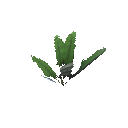|83d79f1ed37184be9a9a00878641014f|$piece_sapling_turnip|Turnip|NULL|<ul><li>1 Turnip Seeds</li></ul>||
|sapling_seedturnip 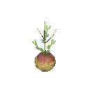|fd11bfbf45f254e8bb234d2b484998cc|$piece_sapling_seedturnip|Seed-turnip|Plant a turnip to get more seeds|<ul><li>1 Turnip</li></ul>||
|sapling_onion 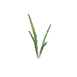|7fde104cefec734829b4c8aa0971a63a|$piece_sapling_onion|Onion|NULL|<ul><li>1 Onion Seeds</li></ul>||
|sapling_seedonion 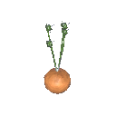|00f18bc5bef95ddc3857268f20a8bc93|$piece_sapling_seedonion|Seed-onion|Plant an onion to get more seeds.|<ul><li>1 Onion</li></ul>||
|sapling_carrot 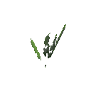|a781bbc5b2e5e4d37a79dacf16d763fc|$piece_sapling_carrot|Carrot|Plant carrot seeds to grow carrots|<ul><li>1 Carrot Seeds</li></ul>||
|sapling_seedcarrot 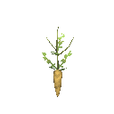|c3836b743789e4c1dbf141bf6ab996d4|$piece_sapling_seedcarrot|Seed-carrot|Plant a carrot to get more seeds|<ul><li>1 Carrot</li></ul>||
|sapling_barley |868c2f708a5ac4bc592909310dd7a7d5|$piece_sapling_barley|Barley|NULL|<ul><li>1 Barley</li></ul>||
|sapling_flax |d3d7be74637fb40a78780d84290739b7|$piece_sapling_flax|Flax|NULL|<ul><li>1 Flax</li></ul>||
|sapling_jotunpuffs 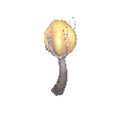|9c713691764e00f4fa2e108e3813e31a|$item_jotunpuffs|Jotun Puffs|NULL|<ul><li>1 Jotun Puffs</li></ul>||
|sapling_magecap 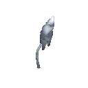|f836746312b02cc48b46b3f818b113dd|$item_magecap|Magecap|NULL|<ul><li>1 Magecap</li></ul>||
|FirTree_Sapling 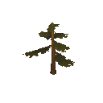|5d109cd6286a94b1991e3374d01cd193|$prop_fir_sapling|Fir Sapling|NULL|<ul><li>1 Fir Cone</li></ul>||
|PineTree_Sapling 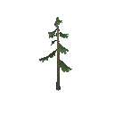|3ba216d94f6bd4d3b873bc5e1daf90c0|$prop_pine_sapling|Pine Sapling|NULL|<ul><li>1 Pine Cone</li></ul>||
|Beech_Sapling 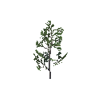|14082565f610e491f8a2625c39ec6cdb|$prop_beech_sapling|Beech sapling|NULL|<ul><li>1 Beech Seeds</li></ul>||
|Birch_Sapling 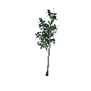|9e07abb0f49c52d49a1e1f626d72e216|$prop_birch_sapling|Birch Sapling|NULL|<ul><li>1 Birch Seeds</li></ul>||
|Oak_Sapling 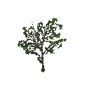|86286b75c8c8dc3428b95e8f35a7054a|$prop_oak_sapling|Oak Sapling|NULL|<ul><li>1 Acorns</li></ul>||
|VineAsh_sapling 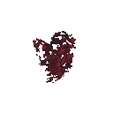|372f1592d262b80488d6d3a48035e1ea|$piece_sapling_vineash|Ashvine|Needs something to cling to.|<ul><li>1 Vineberry Seeds</li></ul>||
|VineGreen_sapling 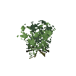|a733bcd966ff9ad498867450a6724339|$piece_sapling_vinegreen|Ivy|Needs something to cling to.|<ul><li>1 Ivy Seeds</li></ul>||
## _FeasterPieceTable

|Piece |AssetID |Token |English Name |Description |Resources required |Material Type |
|---|---|---|---|---|---|---|
|piece_remove_feaster|75bbbb1245ed1c14d83de7f2e5c9037d|$hud_remove|Remove|<color=yellow>Once a feast has been eaten of, it won't return any resources if dismantled.</color>|<ul></ul>||
|MeadTasty 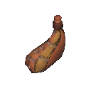|9e70bcaea0f3f4cd6a9dd32763ea0101|$item_mead_tasty|Tasty Mead|The nectar of the Gods, divine mead.|<ul><li>1 Tasty Mead</li></ul>|Wood|
|MeadHealthMinor 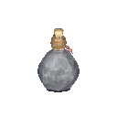|1cf0c7a0a15614baba7de85b967e6e55|$item_mead_hp_minor|Minor Healing Mead|Restores health.|<ul><li>1 Minor Healing Mead</li></ul>|Wood|
|MeadHealthMedium 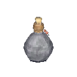|1f6469092ba491c468f8d5f21837cf13|$item_mead_hp_medium|Medium Healing Mead|Restores health.|<ul><li>1 Medium Healing Mead</li></ul>|Wood|
|MeadHealthLingering 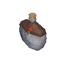|acc917fd2c5716147933dcddf75c241b|$item_mead_hp_lingering|Lingering Healing Mead|Increases health regeneration.|<ul><li>1 Lingering Healing Mead</li></ul>|Wood|
|MeadHealthMajor 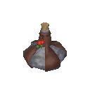|5d4f3e6f1eaf9394b8687d97b0b659b2|$item_mead_hp_major|Major Healing Mead|Restores health.|<ul><li>1 Major Healing Mead</li></ul>|Wood|
|MeadStaminaMinor 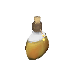|fc200fef828264ae1b34bad23f8aa0d1|$item_mead_stamina_minor|Minor Stamina Mead|Restores stamina.|<ul><li>1 Minor Stamina Mead</li></ul>|Wood|
|MeadStaminaMedium 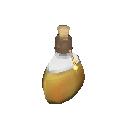|706f96040e6244411afad3734200bfed|$item_mead_stamina_medium|Medium Stamina Mead|Restores stamina.|<ul><li>1 Medium Stamina Mead</li></ul>|Wood|
|MeadStaminaLingering 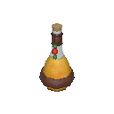|03a3ede695bad0647a0bd233469c2630|$item_mead_stamina_lingering|Lingering Stamina Mead|Increases stamina regeneration.|<ul><li>1 Lingering Stamina Mead</li></ul>|Wood|
|BarleyWine 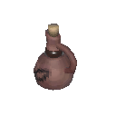|eaef91dd432704e439143fae9f798069|$item_barleywine|Fire Resistance Barley Wine|Fortifies you against fire.|<ul><li>1 Fire Resistance Barley Wine</li></ul>|Wood|
|MeadEitrMinor 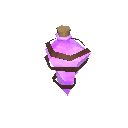|03eb31e34b7f4bb43984ed605051d44c|$item_mead_eitr_minor|Minor Eitr Mead|Restores eitr.|<ul><li>1 Minor Eitr Mead</li></ul>|Wood|
|MeadEitrLingering 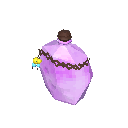|a858b071ffaf6b44196a874cb7170ea8|$item_mead_eitr_lingering|Lingering Eitr Mead|Increases eitr regeneration.|<ul><li>1 Lingering Eitr Mead</li></ul>|Wood|
|MeadPoisonResist 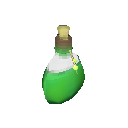|7d09608fba9a8da4686261f1b1d7db78|$item_mead_poisonres|Poison Resistance Mead|Fortifies you against poison.|<ul><li>1 Poison Resistance Mead</li></ul>|Wood|
|MeadFrostResist 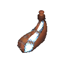|03576871d65a3f84186922bc30ae9e2f|$item_mead_frostres|Frost Resistance Mead|Protects against the cold.|<ul><li>1 Frost Resistance Mead</li></ul>|Wood|
|MeadHasty 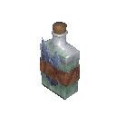|5586c733e7da3444180ec36d23905150|$item_mead_hasty|Tonic of Ratatosk|The squirrel must be quick on its feet as it runs up and down the trunk of the world tree. Although it no longer visits Valheim, there are still those who remember it...|<ul><li>1 Tonic of Ratatosk</li></ul>|Wood|
|MeadStrength 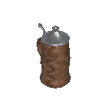|41905d3e487ebc94ab116eb7b79ea56a|$item_mead_strength|Mead of Troll Endurance|What creature can carry more than a troll? Why, a viking with this drink of course!|<ul><li>1 Mead of Troll Endurance</li></ul>|Wood|
|MeadSwimmer 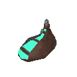|bac2ef570d1b13c4e8ce3da040c40726|$item_mead_swimmer|Draught of Vananidir|You feel invigorated just by holding this, as the ocean beckons you to come for a swim.|<ul><li>1 Draught of Vananidir</li></ul>|Wood|
|MeadBzerker 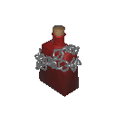|56eb520a91c03494fabfca8c31b296e0|$item_mead_bzerker|Berserkir Mead|Something poisonous stirs within, brewed to the point where its potential can finally be harnessed. But be careful to let the beast out...|<ul><li>1 Berserkir Mead</li></ul>|Wood|
|MeadLightfoot 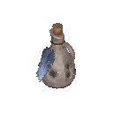|45998809279459b48b692279096dbd53|$item_mead_lightfoot|Lightfoot Mead|This bottle is full, yet it feels like it weighs almost nothing at all.|<ul><li>1 Lightfoot Mead</li></ul>|Wood|
|MeadTrollPheromones 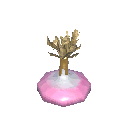|ab5816cb4db26c3458029ee373de088a|$item_mead_trollpheromones|Love Potion|An intense musk permeates the air around this bottle.|<ul><li>1 Love Potion</li></ul>|Wood|
|MeadBugRepellent 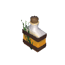|d5f250eae275de84eb83f703aefd1505|$item_mead_bugrepellent|Anti-Sting Concoction|The perfect drink for a day in the Plains.|<ul><li>1 Anti-Sting Concoction</li></ul>|Wood|
|MeadTamer 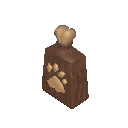|73b9e9d7c7de3f4488d805d99175f4dd|$item_mead_tamer|Brew of Animal Whispers|It smells like a pigsty. Likely the taste won't be much better.|<ul><li>1 Brew of Animal Whispers</li></ul>|Wood|
|FeastMeadows 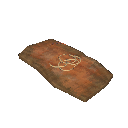|130cdbcd94268d840a10a020b7260414|$item_feastmeadows|Whole Roasted Meadow Boar|A boar that has been roasted to perfection, glazed and served atop a bed of greens, with additional cuts of meat on the side. A feast like this is sure to fill your stomach and brighten your day!|<ul><li>1 Whole Roasted Meadow Boar</li></ul>|Wood|
|FeastBlackforest 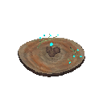|38d422c414096f146a80b9d7284040d8|$item_feastblackforest|Black Forest Buffet Platter|You won't be able to resist this platter of delights from the Black Forest! Venison sirloin steaks are served together with spiced thistles and carrots, and the whole meal is tied together with delicious jams. Just have one more bite!|<ul><li>1 Black Forest Buffet Platter</li></ul>|Wood|
|FeastSwamps 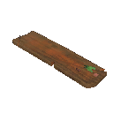|bf977b83c23d5344c986bd6585f13e3e|$item_feastswamps|Swamp Dweller's Delight|Who knew that leeches were edible? With the correct preparation (lots of cooking and lots of seasoning) you will be able to serve them in this feast for the culinary brave. For those who have a sensitive stomach, there are also tasty skewers of sausages and turnips on the side.|<ul><li>1 Swamp Dweller's Delight</li></ul>|Wood|
|FeastOceans 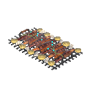|dde589dd8a57ade44b2cc573898dd674|$item_feastoceans|Sailor's Bounty|Fish, fish, and more fish! And also serpent meat, cut to look like fish! Explore the flavours of the Ocean, along with some grilled greens for those still practicing their sea legs.|<ul><li>1 Sailor's Bounty</li></ul>|Wood|
|FeastMountains 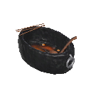|cb68480f4b5f66d4dbda32c496a885be|$item_feastmountains|Hearty Mountain Logger's Stew|Gather around this steaming pot full of deliciousness and warm yourselves up again after a day out in the cold. The usually tough and chewey wolf meat has become tender enough to practically melt in your mouth, and the onions and carrots are made even tastier with exciting spices.|<ul><li>1 Hearty Mountain Logger's Stew</li></ul>|Wood|
|FeastPlains 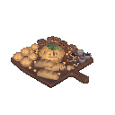|7b2307dc21f78e74892016ec30e58c48|$item_feastplains|Plains Pie Picnic|There's nothing plain about this feast! Enjoy pies and loaves fresh from the oven, both sweet and savoury, and experience the culinary equivalent of a hug.|<ul><li>1 Plains Pie Picnic</li></ul>|Wood|
|FeastMistlands 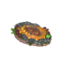|e869ee53dda18ad48b5090f7d1f77b06|$item_feastmistlands|Mushrooms Galore  la Mistlands|The time has come for mushroom enthusiasts to rejoice! Try different kinds of mushrooms, mushroom marinated seeker meat and mushroom-filled misthare, and don't miss out on the tasty sap dressing.|<ul><li>1 Mushrooms Galore  la Mistlands</li></ul>|Wood|
|FeastAshlands 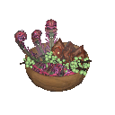|d3cb76c4fb6194049ab7bb687a06d7b4|$item_feastashlands|Ashlands Gourmet Bowl|It's hard to tell whether the steam coming off of this dish is because it's freshly cooked or because of the asksvin meat in it. Either way, the spiced meat together with the vineberries and fiddlehead sprouts is so delicious that it doesn't matter!|<ul><li>1 Ashlands Gourmet Bowl</li></ul>|Wood|
|Mushroom 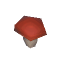|037e1609037c54c1a9f96b8f932101ab|$item_mushroomcommon|Mushroom|Bounty of the forest.|<ul><li>1 Mushroom</li></ul>|Wood|
|Raspberry 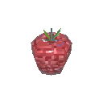|ea090c99b346541b5abc25d35a42d87d|$item_raspberries|Raspberries|Sweet and delicious.|<ul><li>1 Raspberries</li></ul>|Wood|
|Honey 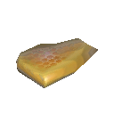|52c96d1c5160f42de8aa6037a2cebf53|$item_honey|Honey|Sweet and tasty.|<ul><li>1 Honey</li></ul>|Wood|
|CookedMeat 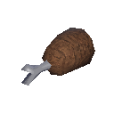|36aa14c035121460384c93ff52b04f01|$item_boar_meat_cooked|Cooked Boar Meat|An earthly taste.|<ul><li>1 Cooked Boar Meat</li></ul>|Wood|
|CookedDeerMeat 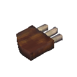|ac9b056b94d63ae41b4c50e49ba9d676|$item_deer_meat_cooked|Cooked Deer Meat|All that running paid off.|<ul><li>1 Cooked Deer Meat</li></ul>|Wood|
|NeckTailGrilled |37c5e6996768b8b41abf868468ec8c66|$item_necktailgrilled|Grilled Neck Tail|This savoury, charcoal-grilled meat has a slight aroma of seaweed and grass.|<ul><li>1 Grilled Neck Tail</li></ul>|Wood|
|CookedBjornMeat 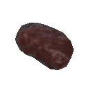|7c20744dc11660245b6eef46f60d9363|$item_bjorn_meat_cooked|Cooked Bear Meat|Tastes like victory.|<ul><li>1 Cooked Bear Meat</li></ul>|Wood|
|Blueberries 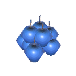|329ca5791daef48e08f8dc65a15c737a|$item_blueberries|Blueberries|Tiny but tasty.|<ul><li>1 Blueberries</li></ul>|Wood|
|Carrot 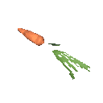|f0d153fe9fad5419c8e5171d9e866947|$item_carrot|Carrot|An orange treat.|<ul><li>1 Carrot</li></ul>|Wood|
|MushroomYellow 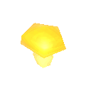|5b21ed0c3433f4b7a9457db2c6598210|$item_mushroomyellow|Yellow Mushroom|An energetic glowing mushroom.|<ul><li>1 Yellow Mushroom</li></ul>|Wood|
|QueensJam 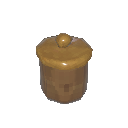|2590ec40a50774f938d7d1f54d0ed54a|$item_queensjam|Queen's Jam|That classic tasty blend of raspberries and blueberries.|<ul><li>1 Queen's Jam</li></ul>|Wood|
|CarrotSoup 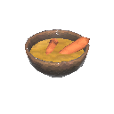|70c6897b051694e299261a1bf2b79bf6|$item_carrotsoup|Carrot Soup|A warm tasty soup made of mostly carrots.|<ul><li>1 Carrot Soup</li></ul>|Wood|
|MinceMeatSauce 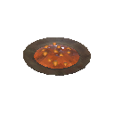|82946e773075a9348b1f8a6d6438fa7f|$item_mincemeatsauce|Minced Meat Sauce|Chunks of goodness in a thick gravy.|<ul><li>1 Minced Meat Sauce</li></ul>|Wood|
|DeerStew 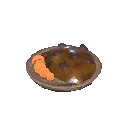|dcfe096cbabc3c54589b7b1cee57d67a|$item_deerstew|Deer Stew|Fall-apart tender.|<ul><li>1 Deer Stew</li></ul>|Wood|
|BoarJerky 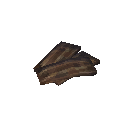|18194663ced4bbe42ba2b755fe44a4f2|$item_boarjerky|Boar Jerky|Lean and salty.|<ul><li>1 Boar Jerky</li></ul>|Wood|
|ShocklateSmoothie 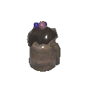|8b03e4f6f651da84391fc5f7718418c3|$item_shocklatesmoothie|Muckshake|Wakes you up!|<ul><li>1 Muckshake</li></ul>|Wood|
|TurnipStew 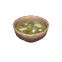|75390d4070afa43a5b7a3e0eed7a7aa0|$item_turnipstew|Turnip Stew|Nutritious and restorative.|<ul><li>1 Turnip Stew</li></ul>|Wood|
|BlackSoup 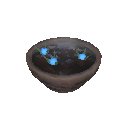|ed5ebb1d6549d0846a49f710bdac90e1|$item_blacksoup|Black Soup|A perfect balance of sweetness and acidity.|<ul><li>1 Black Soup</li></ul>|Wood|
|Sausages 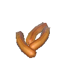|d2be753a591a0421c8a204bec9064735|$item_sausages|Sausages|Links of savory, smoked meat.|<ul><li>1 Sausages</li></ul>|Wood|
|FishCooked 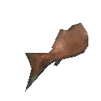|db3e079e90c464ee697420d194ce86e1|$item_fish_cooked|Cooked Fish|A tasty side of smoked fish.|<ul><li>1 Cooked Fish</li></ul>|Wood|
|SerpentMeatCooked 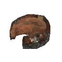|9490ba534c0284d4d8dc520eba342370|$item_serpentmeatcooked|Cooked Serpent Meat|A cooked slice of sea serpent. Smells good.|<ul><li>1 Cooked Serpent Meat</li></ul>|Wood|
|SerpentStew 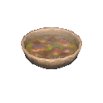|9ed5d9e264c4c4840bc09978b7ea8057|$item_serpentstew|Serpent Stew|Smells of honey and serpent...|<ul><li>1 Serpent Stew</li></ul>|Wood|
|Onion 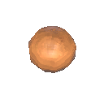|a8b660ca87d916540be290f39f8f0ac9|$item_onion|Onion|A crunchy and spicy taste.|<ul><li>1 Onion</li></ul>|Wood|
|OnionSoup 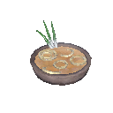|7d0e0609cb6376f4d9579f08b4378a62|$item_onionsoup|Onion Soup|Deliciously rich.|<ul><li>1 Onion Soup</li></ul>|Wood|
|Eyescream 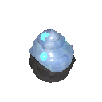|56e913dddff620242a75fd1f9d0305f6|$item_eyescream|Eyescream|Crispy cool and creamy.|<ul><li>1 Eyescream</li></ul>|Wood|
|CookedWolfMeat 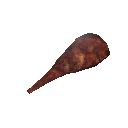|899ba48391c77a140b1db11142d19593|$item_wolf_meat_cooked|Cooked Wolf Meat|A wild taste.|<ul><li>1 Cooked Wolf Meat</li></ul>|Wood|
|WolfMeatSkewer 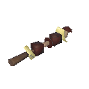|04313b7934eaccd4aaff12e8d08886f7|$item_wolf_skewer|Wolf Skewer|Dripping with taste.|<ul><li>1 Wolf Skewer</li></ul>|Wood|
|WolfJerky 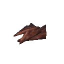|19c2b6110d11b49489c6c366a2a21011|$item_wolfjerky|Wolf Jerky|Chewy and full of flavor.|<ul><li>1 Wolf Jerky</li></ul>|Wood|
|LoxPie 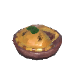|6477d669541ef4347ae4529e76f20a0c|$item_loxpie|Lox Meat Pie|Break the crust to release a cloud of fragrant steam. Delicious!|<ul><li>1 Lox Meat Pie</li></ul>|Wood|
|Cloudberry 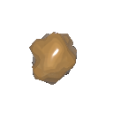|e5976e7a821df4b60ae18f2609a42ba3|$item_cloudberries|Cloudberries|The gold of the forest.|<ul><li>1 Cloudberries</li></ul>|Wood|
|Bread 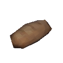|2fee923e08bd4408b81e6a502d2cad16|$item_bread|Bread|A tasty loaf of bread.|<ul><li>1 Bread</li></ul>|Wood|
|BloodPudding 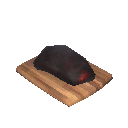|7ab61fd34cba3429083bb343cbaa9cd0|$item_bloodpudding|Blood Pudding|It's bloody tasty.|<ul><li>1 Blood Pudding</li></ul>|Wood|
|CookedLoxMeat 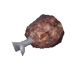|d884967160e5046df8721d20c4456c81|$item_loxmeat_cooked|Cooked Lox Meat|A great hunk of tender meat, food fit for Valhalla!|<ul><li>1 Cooked Lox Meat</li></ul>|Wood|
|FishWraps 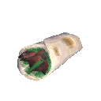|8f6025ebc8a304607b7992ccbb0863cb|$item_fishwraps|Fish Wraps|Bread and fish, what more to wish?|<ul><li>1 Fish Wraps</li></ul>|Wood|
|CookedEgg 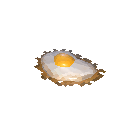|8cb32b646b59626429259729d106fe2c|$item_egg_cooked|Cooked Egg|Sunny side up!|<ul><li>1 Cooked Egg</li></ul>|Wood|
|MushroomJotunPuffs 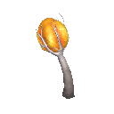|769484eb4b3ae5e489cadcdd08397b29|$item_jotunpuffs|Jotun Puffs|Swollen with magic, these golden orbs bubble from the ground where the Jotun fell.|<ul><li>1 Jotun Puffs</li></ul>|Wood|
|MushroomMagecap 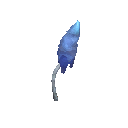|3bf986cd4fea2e04889ccf6602960fb6|$item_magecap|Magecap|The delicate blue magecaps crackle like nerve-endings with sorcerous vitality.|<ul><li>1 Magecap</li></ul>|Wood|
|RoyalJelly 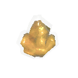|fe720b2c795ba9747bdb5bfc17575eab|$item_royaljelly|Royal Jelly|Jelly fit for kings and queens.|<ul><li>1 Royal Jelly</li></ul>|Wood|
|Salad 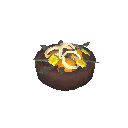|e919c52f7ff11c94dac6914e1803f169|$item_salad|Salad|Fresh, crisp leaves.|<ul><li>1 Salad</li></ul>|Wood|
|MushroomOmelette 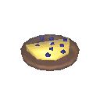|80c0bada5ebea47469d1de2b028a411a|$item_mushroomomelette|Mushroom Omelette|A delicious omelette with an earthy aftertaste.|<ul><li>1 Mushroom Omelette</li></ul>|Wood|
|FishAndBread 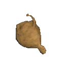|1ca0dc7c08027624cba437830b37dd2c|$item_fishandbread|Fish 'n' Bread|Bounty from both land and sea.|<ul><li>1 Fish 'n' Bread</li></ul>|Wood|
|CookedBugMeat 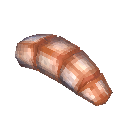|148ebe0b336e15344b7acbd2441c1490|$item_bug_meat_cooked|Cooked Seeker Meat|Succulent white meat. A true delicacy.|<ul><li>1 Cooked Seeker Meat</li></ul>|Wood|
|CookedHareMeat |b8affeec3ffcb554698306b767d545d7|$item_hare_meat_cooked|Cooked Hare Meat|Stringy but flavorful.|<ul><li>1 Cooked Hare Meat</li></ul>|Wood|
|CookedChickenMeat 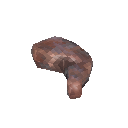|0dda1ef0e466a7a40a8da37ef9c58d62|$item_chicken_meat_cooked|Cooked Chicken Meat|It tastes like chicken.|<ul><li>1 Cooked Chicken Meat</li></ul>|Wood|
|MisthareSupreme 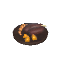|0475aca35086dcf48a539f28c80e3218|$item_mistharesupreme|Misthare Supreme|One of life's Great Pleasures.|<ul><li>1 Misthare Supreme</li></ul>|Wood|
|HoneyGlazedChicken 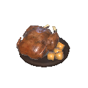|6378e41b996d3034da57eb410b5a389b|$item_honeyglazedchicken|Honey Glazed Chicken|Grilled to perfection. Makes both eyes and mouths water.|<ul><li>1 Honey Glazed Chicken</li></ul>|Wood|
|MeatPlatter 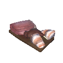|1476c34e4444502459002279b96d45e9|$item_meatplatter|Meat Platter|Battle fuel.|<ul><li>1 Meat Platter</li></ul>|Wood|
|MagicallyStuffedShroom 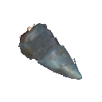|5db00dcb25c30794bbf609e9dc054441|$item_magicallystuffedmushroom|Stuffed Mushroom|Bursting with magical flavour.|<ul><li>1 Stuffed Mushroom</li></ul>|Wood|
|YggdrasilPorridge 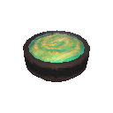|2cebcd97ef6ce514caa81ca8685a0d8e|$item_yggdrasilporridge|Yggdrasil Porridge|Made with sap from the great tree. Even a mouthful imparts a warm glow to your whole body.|<ul><li>1 Yggdrasil Porridge</li></ul>|Wood|
|SeekerAspic 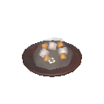|00e47e8d1a44c5f408dd009876884fc9|$item_seekeraspic|Seeker Aspic|A quivering jelly with a taste like gentle electricity.|<ul><li>1 Seeker Aspic</li></ul>|Wood|
|Vineberry 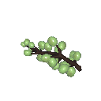|5e09353d3c6ec7d46a2f4658ac336db8|$item_vineberry|Vineberry Cluster|These juicy berries are both sour and sweet.|<ul><li>1 Vineberry Cluster</li></ul>|Wood|
|Fiddleheadfern 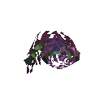|75e2b6e3f2f9e19418f5770108f4eed1|$item_fiddleheadfern|Fiddlehead|Veggies with a twist!|<ul><li>1 Fiddlehead</li></ul>|Wood|
|MushroomSmokePuff 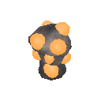|c9a2f515111bdb64a929f5d66cf2590d|$item_smokepuff|Smoke Puff|Hopefully it tastes better after cooking.|<ul><li>1 Smoke Puff</li></ul>|Wood|
|SpicyMarmalade 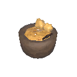|07240f969144d7f4bb36384d96815054|$item_spicymarmalade|Spicy Marmalade|Sugary honey perfectly balanced with tangy fronds and tart berries.|<ul><li>1 Spicy Marmalade</li></ul>|Wood|
|ScorchingMedley 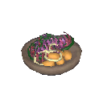|7331d1f5221fa1442a41ad11a679ee04|$item_scorchingmedley|Scorching Medley|A varied diet is important, so why not try this vegetarian option?|<ul><li>1 Scorching Medley</li></ul>|Wood|
|RoastedCrustPie 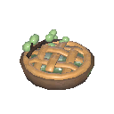|1bb14474c4189af449f4e4162d92e641|$item_roastedcrustpie|Roasted Crust Pie|This dessert keeps you going all day long.|<ul><li>1 Roasted Crust Pie</li></ul>|Wood|
|CookedAsksvinMeat 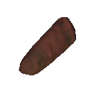|ff8bde0f9de82a9488c43593b6fc60de|$item_asksvin_meat_cooked|Cooked Asksvin Tail|This meat has a potent and mature flavour, but is very tasty when grilled right.|<ul><li>1 Cooked Asksvin Tail</li></ul>|Wood|
|CookedVoltureMeat 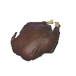|427f6415ea0a9bf46ab6735a03f69325|$item_volture_meat_cooked|Cooked Volture Meat|A chewy and somewhat dry meat. Some seasoning would probably make it taste better, but it'll fill your stomach regardless.|<ul><li>1 Cooked Volture Meat</li></ul>|Wood|
|CookedBoneMawSerpentMeat 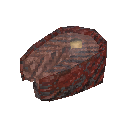|7f9c751e9667df443b25f401d3797611|$item_bonemawmeat_cooked|Cooked Bonemaw Meat|The boiling sea did nothing to this meat, but grilling it over the fire has given it a delightful crisp.|<ul><li>1 Cooked Bonemaw Meat</li></ul>|Wood|
|FierySvinstew 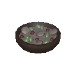|f30b7b6fcc59b5e4ea9a2b9b6a906a8e|$item_fierysvinstew|Fiery Svinstew|This musty stew is a necessity on every adventurer's menu.|<ul><li>1 Fiery Svinstew</li></ul>|Wood|
|MashedMeat 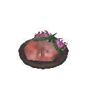|5574990d679e17f4bbffe0f33d2d27e2|$item_mashedmeat|Mashed Meat|Leftover meat can actually be pretty tasty if you just mash it right!|<ul><li>1 Mashed Meat</li></ul>|Wood|
|PiquantPie 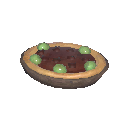|0a59aef8f06faaa4fad60da7badf868e|$item_piquantpie|Piquant Pie|It takes some time and effort to make this pie, but the taste is well worth it.|<ul><li>1 Piquant Pie</li></ul>|Wood|
|SizzlingBerryBroth 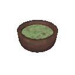|d03de4b118fc34f428c9ca087d5b9064|$item_sizzlingberrybroth|Sizzling Berry Broth|This soup settles in your stomach with an almost tingly sensation.|<ul><li>1 Sizzling Berry Broth</li></ul>|Wood|
|SparklingShroomshake 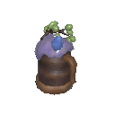|6560b775eb4e6624ea5d58ed2f2e14ee|$item_sparklingshroomshake|Sparkling Shroomshake|Perhaps it's not the best flavour to start the day with, but it will give you the boost you need.|<ul><li>1 Sparkling Shroomshake</li></ul>|Wood|
|MarinatedGreens 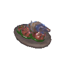|d2a47fb78d8cd65429c95c9da0fcc054|$item_marinatedgreens|Marinated Greens|It's spicy, it's chewy, it's sweet This mad dish tickles your tongue as well as your mind.|<ul><li>1 Marinated Greens</li></ul>|Wood|
|Pukeberries 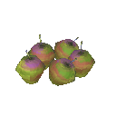|1d1668c1c9c2c9224941a96df6751507|$item_pukeberries|Bukeperries|Allows the consumer to quickly evacuate any misplaced meal and start anew.|<ul><li>1 Bukeperries</li></ul>|Wood|
|MushroomBzerker 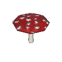|8e9afe44a064c7e4ea30db062437a4ae|$item_mushroom_bzerker|Toadstool|Some say you can eat everything you find in the forest. That is not the case with this mushroom.|<ul><li>1 Toadstool</li></ul>|Wood|
## _HammerPieceTable

|Piece |AssetID |Token |English Name |Description |Resources required |Material Type |
|---|---|---|---|---|---|---|
|piece_repair|06ed17b6ce7cb42f49a55dab65785dbf|$piece_repair|Repair|NULL|<ul></ul>||
|fire_pit 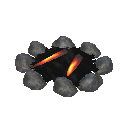|70ba4400e704e49b2a422575fb3ab661|$piece_firepit|Campfire|NULL|<ul><li>5 Stone</li><li>2 Wood</li></ul>|Wood|
|fire_pit_iron 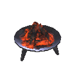|ba64841fbb6c42f19ab51d0c862a1afa|$piece_firepit_iron|Iron Fire Pit|NULL|<ul><li>1 Iron Pit</li><li>1 Wood</li></ul>|Wood|
|bonfire 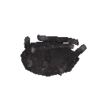|49687903c03a347e7ba3ad2a84cc268f|$piece_bonfire|Bonfire|NULL|<ul><li>1 Surtling Core</li><li>5 Ancient Bark</li><li>5 Finewood</li><li>5 Corewood</li></ul>|Wood|
|hearth 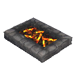|eb03631e573f54af483eecb02ddf1bb2|$piece_hearth|Hearth|NULL|<ul><li>15 Stone</li></ul>|Stone|
|wood_stack 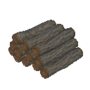|2cc4b9c6e6f654e44b70824accb1bac4|$piece_woodstack|Wood Stack|NULL|<ul><li>50 Wood</li></ul>|Wood|
|wood_fine_stack 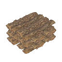|19d7799370f19924e85773651ea54778|$piece_woodfinestack|Finewood Stack|NULL|<ul><li>50 Finewood</li></ul>|Wood|
|wood_core_stack 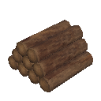|6ff27bd580da57a40a2f05d44e7955a6|$piece_woodcorestack|Corewood Stack|NULL|<ul><li>50 Corewood</li></ul>|Wood|
|wood_yggdrasil_stack 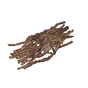|97ca0fd8b81888557abf6eeb2ede448e|$piece_yggdrasilstack|Yggdrasil Wood Stack|NULL|<ul><li>50 Yggdrasil Wood</li></ul>|HardWood|
|blackwood_stack 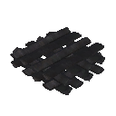|404242e06d4e356628efc367513e4840|$piece_blackwoodstack|Ashwood Stack|NULL|<ul><li>50 Ashwood</li></ul>|Wood|
|stone_pile 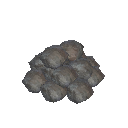|4c81ace38f76f4327be4f49c946dbf3b|$piece_stonepile|Stone Pile|NULL|<ul><li>50 Stone</li></ul>|Wood|
|coal_pile 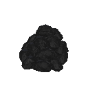|e74c2a06eb4567f43815c60f0a216ec4|$piece_coalpile|Coal Pile|NULL|<ul><li>50 Coal</li></ul>|Wood|
|blackmarble_pile 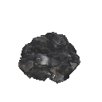|568a3bd9e41ae7a119aa5813ef236624|$piece_marblepile|Black Marble Pile|NULL|<ul><li>50 Black Marble</li></ul>|Wood|
|grausten_pile 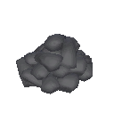|bcdaf0b1b31a77939ac5559226e35137|$piece_graustenpile|Grausten Pile|NULL|<ul><li>50 Grausten</li></ul>|Wood|
|skull_pile 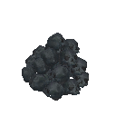|30d2dc4d547bc8e5dbb47c8da6cf15b1|$piece_skullpile|Pile of Skulls|NULL|<ul><li>50 Charred Skull</li></ul>|Wood|
|bone_stack 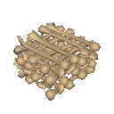|bbd62f65ebcfc3d829ae80c61c8eddc4|$piece_bonestack|Bone Stack|NULL|<ul><li>50 Bone Fragments</li></ul>|Wood|
|piece_cookingstation 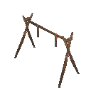|a87cc4aca130d4d36a820342aaf7e360|$piece_cookingstation|Cooking Station|NULL|<ul><li>2 Wood</li></ul>|Wood|
|piece_cookingstation_iron 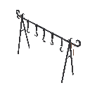|59f1065c85e319a45b152f023548e884|$piece_cookingstation_iron|Iron Cooking Station|NULL|<ul><li>3 Iron</li><li>3 Chain</li></ul>|Iron|
|piece_cauldron 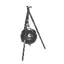|f1bf7d6010e98462893b8543ae46856a|$piece_cauldron|Cauldron|Crafting station|<ul><li>10 Tin</li></ul>|Wood|
|cauldron_ext1_spice 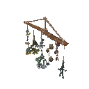|5675ba4a776791741a471972985f1288|$piece_cauldron_ext1_spice|Spice Rack|Cauldron improvement|<ul><li>3 Dandelion</li><li>2 Carrot</li><li>5 Mushroom</li><li>3 Thistle</li><li>3 Turnip</li></ul>|Wood|
|cauldron_ext3_butchertable 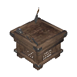|d68c8ee93dde6e343b453c986af053c2|$piece_cauldron_ext3_butchertable|Butcher's Table|Cauldron improvement|<ul><li>2 Ancient Bark</li><li>4 Corewood</li><li>4 Finewood</li><li>2 Silver</li></ul>|Wood|
|cauldron_ext4_pots 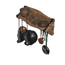|995e1b9da1747d4449234e721df10e89|$piece_cauldron_ext4_pans|Pots and Pans|Cauldron improvement|<ul><li>5 Iron</li><li>5 Copper</li><li>5 Black Metal</li><li>10 Finewood</li></ul>|Wood|
|cauldron_ext5_mortarandpestle 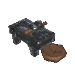|bba2754101cfb9d42b00faa8891567c7|$piece_cauldron_ext5_mortarandpestle|Mortar and Pestle|Cauldron improvement|<ul><li>8 Black Marble</li><li>6 Finewood</li><li>4 Corewood</li></ul>|Wood|
|cauldron_ext6_rollingpins 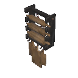|3187f883c29dad54e888529748ce70a9|$piece_cauldron_ext6_rollingpins|Rolling Pins and Cutting Boards|Cauldron improvement|<ul><li>8 Ashwood</li><li>6 Finewood</li><li>4 Flametal</li></ul>|Wood|
|piece_preptable 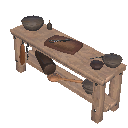|0f1219e275dc9404295675abcc6114f0|$piece_preptable|Food Preparation Table|Crafting station|<ul><li>5 Iron</li><li>20 Finewood</li><li>15 Leather Scraps</li></ul>|Wood|
|piece_oven 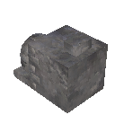|5cad8f7ab5567ec498f63dd0ef28a1e5|$piece_oven|Stone Oven|NULL|<ul><li>15 Iron</li><li>20 Stone</li><li>4 Surtling Core</li></ul>|Stone|
|piece_workbench 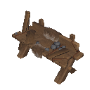|8aa8f18747bb24033bac6d43da077cc7|$piece_workbench|Workbench|Crafting station|<ul><li>10 Wood</li></ul>|Wood|
|piece_workbench_ext1 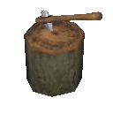|fb92736c0d7d644ce90ce2ab4ac2614a|$piece_workbench_ext1|Chopping Block|Workbench improvement|<ul><li>10 Wood</li><li>10 Flint</li></ul>|Wood|
|piece_workbench_ext2 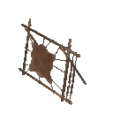|e5a43250f224f4b208e3eca9965560a1|$piece_workbench_ext2|Tanning Rack|Workbench improvement|<ul><li>10 Wood</li><li>15 Flint</li><li>20 Leather Scraps</li><li>5 Deer Hide</li></ul>|Wood|
|piece_workbench_ext3 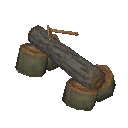|4483597b84fa6824f9992d5af665d428|$piece_workbench_ext3|Adze|Workbench improvement|<ul><li>10 Finewood</li><li>3 Bronze</li></ul>|Wood|
|piece_workbench_ext4 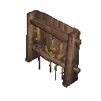|2ec412a0b7b11a158b3ed1185865fb39|$piece_workbench_ext4|Tool Shelf|Workbench improvement|<ul><li>4 Iron</li><li>10 Finewood</li><li>4 Obsidian</li></ul>|Wood|
|piece_stonecutter 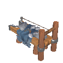|b369b2d8a9e494d27b82902267829904|$piece_stonecutter|Stonecutter|Crafting station|<ul><li>10 Wood</li><li>2 Iron</li><li>4 Stone</li></ul>|Wood|
|piece_artisanstation 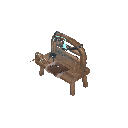|47739655182154664b1927ba002afa11|$piece_artisanstation|Artisan Table|Crafting station|<ul><li>10 Wood</li><li>2 Dragon Tear</li></ul>|Wood|
|artisan_ext1 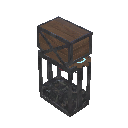|2ce632ba53495e740a4314bc0765f6e1|$piece_artisan_ext1|Artisan Press|Artisan Table improvement|<ul><li>5 Black Marble</li><li>5 Bronze</li><li>1 Majestic Carapace</li></ul>|Wood|
|forge 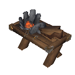|5983ba8568237480f9c931dac464dc0e|$piece_forge|Forge|Crafting station|<ul><li>4 Stone</li><li>4 Coal</li><li>10 Wood</li><li>6 Copper</li></ul>|Wood|
|forge_ext1 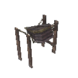|35648e76441d44d9fa3219d1783cdc27|$piece_forge_ext1|Forge Bellows|Forge improvement|<ul><li>5 Wood</li><li>5 Deer Hide</li><li>4 Chain</li></ul>|Wood|
|forge_ext2 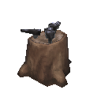|3a599566e5b9b4a529c5afddbdaac6db|$piece_forge_ext2|Anvils|Forge improvement|<ul><li>5 Wood</li><li>2 Bronze</li></ul>|Wood|
|forge_ext3 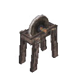|9aeb8a925b5644b3292e362f73eab508|$piece_forge_ext3|Grinding Wheel|Forge improvement|<ul><li>25 Wood</li><li>1 Sharpening Stone</li></ul>|Wood|
|forge_ext4 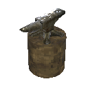|9b504c4f3e5b54e70ab355fe864ef492|$piece_forge_ext4|Smith's Anvil|Forge improvement|<ul><li>20 Iron</li><li>5 Wood</li></ul>|Wood|
|forge_ext5 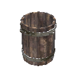|0d6f7df90e3df481abea89f337113de9|$piece_forge_ext5|Forge Cooler|Forge improvement|<ul><li>25 Finewood</li><li>10 Copper</li></ul>|Wood|
|forge_ext6 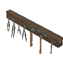|dc7235b5d46ac40bb8230472b6257e2e|$piece_forge_ext6|Forge Tool Rack|Forge improvement|<ul><li>15 Iron</li><li>10 Wood</li></ul>|Wood|
|smelter 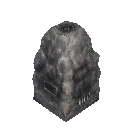|c04e7a906bef34e519e7c880b1dc54e4|$piece_smelter|Smelter|NULL|<ul><li>20 Stone</li><li>5 Surtling Core</li></ul>|Stone|
|blastfurnace 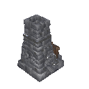|b9078e4a0160627e0a689bff9c20fc9b|$piece_blastfurnace|Blast Furnace|NULL|<ul><li>20 Stone</li><li>5 Surtling Core</li><li>10 Iron</li><li>20 Finewood</li></ul>|Stone|
|eitrrefinery 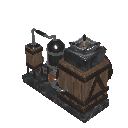|9633271e2f86cfc14b8b28fe21c2cb27|$piece_eitrrefinery|Eitr Refinery|NULL|<ul><li>20 Black Marble</li><li>5 Black Metal</li><li>10 Yggdrasil Wood</li><li>5 Black Core</li><li>3 Sap</li></ul>|Wood|
|blackforge 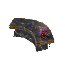|b54ead43818db1b4ba019f9ad1211e90|$piece_blackforge|Black Forge|Crafting station|<ul><li>10 Black Marble</li><li>10 Yggdrasil Wood</li><li>5 Black Core</li></ul>|Wood|
|blackforge_ext1 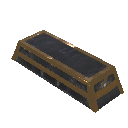|e23070000978e9d418f45e1e9e4bd144|$piece_blackforge_ext1|Black Forge Cooler|Black Forge improvement|<ul><li>5 Iron</li><li>5 Copper</li><li>4 Black Marble</li></ul>|Wood|
|blackforge_ext2_vise 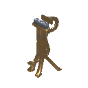|e65a593a872c31743bc4213c75ba5793|$piece_blackforge_ext2|Vice|Black Forge improvement|<ul><li>5 Iron</li><li>8 Copper</li><li>2 Mechanical Spring</li></ul>|Wood|
|blackforge_ext3_metalcutter 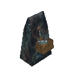|a39f5bb6d05c0144481ae65c14f9268f|$piece_blackforge_ext3|Metal Cutter|Black Forge improvement|<ul><li>5 Black Marble</li><li>5 Flametal</li><li>5 Ashwood</li><li>4 Charred Bone</li></ul>|Wood|
|blackforge_ext4_gemcutter 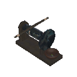|34e35d0424826f54fbbeb831ce363aa3|$piece_blackforge_ext4|Gem Cutter|Black Forge improvement|<ul><li>5 Flametal</li><li>8 Ashwood</li><li>2 Morgen Sinew</li><li>1 Bloodstone</li></ul>|Wood|
|charcoal_kiln 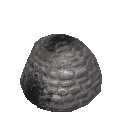|12d273dd5f199490b969fd0a713675b2|$piece_charcoalkiln|Charcoal Kiln|NULL|<ul><li>20 Stone</li><li>5 Surtling Core</li></ul>|Stone|
|windmill 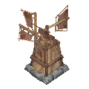|d20c541789946426f9483ca1df70bd4e|$piece_windmill|Windmill|NULL|<ul><li>20 Stone</li><li>30 Wood</li><li>30 Iron Nails</li></ul>|Stone|
|piece_spinningwheel 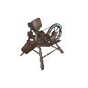|3ea2415d1aade44ac8e7cc0009e2e18e|$piece_spinningwheel|Spinning Wheel|NULL|<ul><li>20 Finewood</li><li>10 Iron Nails</li><li>5 Leather Scraps</li></ul>|Wood|
|wood_floor_1x1 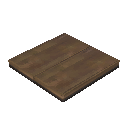|159d6bdea9615485a8aa90f125502f21|$piece_woodfloor1x1|Wood Floor 1x1|NULL|<ul><li>1 Wood</li></ul>|Wood|
|wood_floor 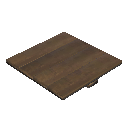|a1d4de6f8ce364ab4a6085a2225b4669|$piece_woodfloor2x2|Wood Floor 2x2|NULL|<ul><li>2 Wood</li></ul>|Wood|
|wood_stair 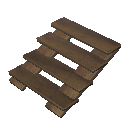|60a7c9362d3ee4b679430603641263ec|$piece_woodstair|Wood Stairs|NULL|<ul><li>2 Wood</li></ul>|Wood|
|wood_stepladder 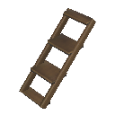|6291e84c015974d43a8100c315701f4e|$piece_woodstepladder|Wood Ladder|NULL|<ul><li>2 Wood</li></ul>|Wood|
|wood_wall_quarter 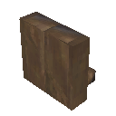|0f9a144fd75eb3642978a731be001868|$piece_woodwallquarter|Wood Wall 1x1|NULL|<ul><li>1 Wood</li></ul>|Wood|
|wood_wall_half 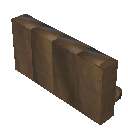|4315c89c7b4bf47c4b68a632376e18d7|$piece_woodwallhalf|Wood Wall Half|NULL|<ul><li>1 Wood</li></ul>|Wood|
|woodwall 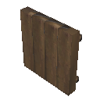|db8c0a09c92ce4027960ab22eaea05bb|$piece_woodwall|Wood Wall|NULL|<ul><li>2 Wood</li></ul>|Wood|
|wood_wall_roof 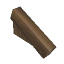|dc609c1ae07bd40439d5105e5b8d33c1|$piece_woodwallroof|Wood Wall 26|NULL|<ul><li>2 Wood</li></ul>|Wood|
|wood_wall_roof_upsidedown 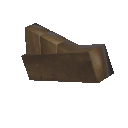|773edddbef9c1744991cc679f437047c|$piece_woodwallroof_upsidedown|Wood Wall 26 (Inverted)|NULL|<ul><li>2 Wood</li></ul>|Wood|
|wood_wall_roof_top 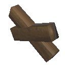|252678d24e3ac47c6b6098797b90b538|$piece_woodwallrooftop|Wood Roof Cross 26|NULL|<ul><li>2 Wood</li></ul>|Wood|
|wood_wall_roof_45 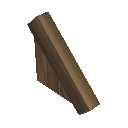|122b2b185bc524a818a4d9571d0ffea7|$piece_woodwallroof45|Wood Wall 45|NULL|<ul><li>2 Wood</li></ul>|Wood|
|wood_wall_roof_45_upsidedown 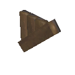|90a879cf05bf2bb44952f3932778a421|$piece_woodwallroof45_upsidedown|Wood Wall 45 (Inverted)|NULL|<ul><li>2 Wood</li></ul>|Wood|
|wood_wall_roof_top_45 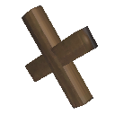|cb607c70601f9472e8b7fd56552cdd6b|$piece_woodwallrooftop45|Wood Roof Cross 45|NULL|<ul><li>2 Wood</li></ul>|Wood|
|wood_roof 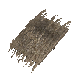|43698603b9a234f5987f762e1d1039b1|$piece_woodroof26|Thatch Roof 26|NULL|<ul><li>2 Wood</li></ul>|Wood|
|wood_roof_top 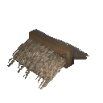|78f639c5704e94d598947881e1248499|$piece_woodrooftop|Thatch Roof Ridge 26|NULL|<ul><li>2 Wood</li></ul>|Wood|
|wood_roof_ocorner 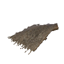|70b2b63e85ead4928b8078f6ea188615|$piece_woodroofocorner|Thatch Roof Outer Corner 26|NULL|<ul><li>2 Wood</li></ul>|Wood|
|wood_roof_icorner 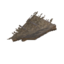|f146b5c99f9cd4c0e8fcad5fd0fa4920|$piece_woodrooficorner|Thatch Roof Inner Corner 26|NULL|<ul><li>2 Wood</li></ul>|Wood|
|wood_roof_45 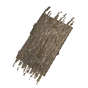|6ddadab83fdf743749a21df88fabed77|$piece_woodroof45|Thatch Roof 45|NULL|<ul><li>2 Wood</li></ul>|Wood|
|wood_roof_top_45 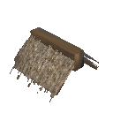|2267254e06be44e9eba2b2e540301384|$piece_woodrooftop45|Thatch Roof Ridge 45|NULL|<ul><li>2 Wood</li></ul>|Wood|
|wood_roof_ocorner_45 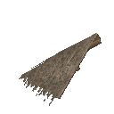|390a7480088494446a1718424dc3230e|$piece_woodroofocorner45|Thatch Roof Outer Corner 45|NULL|<ul><li>2 Wood</li></ul>|Wood|
|wood_roof_icorner_45 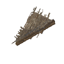|2a8e2516ff4b84194a117a9594dd31dc|$piece_woodrooficorner45|Thatch Roof Inner Corner 45|NULL|<ul><li>2 Wood</li></ul>|Wood|
|wood_pole 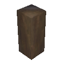|7637dd4b012264b1bb317770a07f8692|$piece_woodpole|Wood Pole 1 m|NULL|<ul><li>1 Wood</li></ul>|Wood|
|wood_pole2 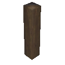|a9411625f489846e7b9c7091ecbf9784|$piece_woodpole2|Wood Pole 2 m|NULL|<ul><li>2 Wood</li></ul>|Wood|
|wood_beam_1 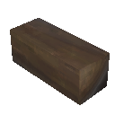|9741cd341b01d4e41b4bc1410e2b9b43|$piece_woodbeam1|Wood Beam 1 m|NULL|<ul><li>1 Wood</li></ul>|Wood|
|wood_beam 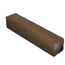|4943f2b1c9c484f03ab1cc8e294e4f92|$piece_woodbeam2|Wood Beam 2 m|NULL|<ul><li>2 Wood</li></ul>|Wood|
|wood_beam_26 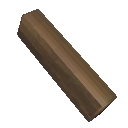|b0a95388438d84e56b54d6e4e3761e60|$piece_woodbeam26|Wood Beam 26|NULL|<ul><li>2 Wood</li></ul>|Wood|
|wood_beam_45 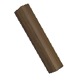|aa897656e8ed44ccb8ed1198ec9b321b|$piece_woodbeam45|Wood Beam 45|NULL|<ul><li>2 Wood</li></ul>|Wood|
|wood_dragon1 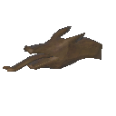|87ed7bcd5c25a4ac8a6ab667957e0514|$piece_wooddragon|Wood Dragon Adornment|NULL|<ul><li>10 Finewood</li></ul>|Wood|
|wood_door 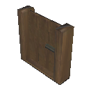|96a888350ec664e9da492f97b4388aec|$piece_wooddoor|Wood Door|NULL|<ul><li>4 Wood</li></ul>|Wood|
|wood_gate 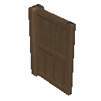|ce871db3a2b404c9a8d78c9c2e6e8210|$piece_woodgate|Wood Gate|NULL|<ul><li>12 Wood</li></ul>|Wood|
|darkwood_gate 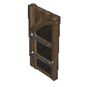|511312a0462cbf7f99500ffb7b13cb3d|$piece_darkwoodgate|Darkwood Gate|NULL|<ul><li>16 Wood</li><li>4 Iron</li><li>2 Tar</li></ul>|HardWood|
|piece_hexagonal_door 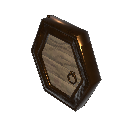|bc917192f0cb37fa99fc53157d80f720|$piece_hexagonalgate|Hexagonal Gate|NULL|<ul><li>8 Yggdrasil Wood</li><li>8 Copper</li></ul>|HardWood|
|wood_window 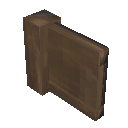|2344d23683154f647b065287b2c9b6d6|$piece_woodwindowshutter|Wood Shutter|NULL|<ul><li>4 Wood</li><li>2 Bronze Nails</li></ul>|Wood|
|wood_pole_log 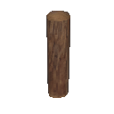|1d803e46e94c7024aac699f98294b653|$piece_logpole2|Log Pole 2 m|NULL|<ul><li>1 Corewood</li></ul>|HardWood|
|wood_pole_log_4 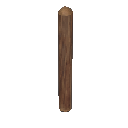|c4c24451e194e4834b7a2604b52704da|$piece_logpole4|Log Pole 4 m|NULL|<ul><li>2 Corewood</li></ul>|HardWood|
|wood_wall_log 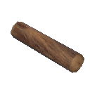|4ff55ea4a6ecf4093bcc6e2335195aa2|$piece_logbeam2|Log Beam 2 m|NULL|<ul><li>1 Corewood</li></ul>|HardWood|
|wood_wall_log_4x0.5 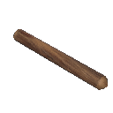|4c71c657a53829448aac09db53da3b50|$piece_logbeam4|Log Beam 4 m|NULL|<ul><li>2 Corewood</li></ul>|HardWood|
|wood_log_26 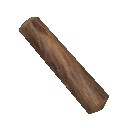|c78458c4f684f4b448fa4f4bd65190f8|$piece_woodlog26|Log Beam 26|NULL|<ul><li>2 Corewood</li></ul>|HardWood|
|wood_log_45 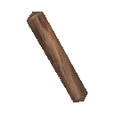|89012f90c5d4c904795ebe367defa894|$piece_woodlog45|Log Beam 45|NULL|<ul><li>2 Corewood</li></ul>|HardWood|
|darkwood_roof 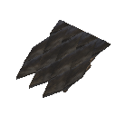|4444eb7410b01d7459f5a979773b698e|$piece_darkwoodroof26|Shingle Roof 26|NULL|<ul><li>2 Wood</li><li>1 Tar</li></ul>|Wood|
|darkwood_roof_top 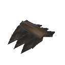|9c8f8b60ccee02f44a0d22e72aed84cf|$piece_darkwoodrooftop|Shingle Roof Ridge 26|NULL|<ul><li>2 Wood</li><li>1 Tar</li></ul>|Wood|
|darkwood_roof_ocorner 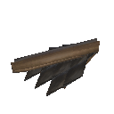|37c849834db8abe48a81a0679636940e|$piece_darkwoodroofocorner|Shingle Roof Outer Corner 26|NULL|<ul><li>2 Wood</li><li>1 Tar</li></ul>|Wood|
|darkwood_roof_icorner 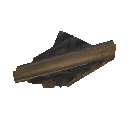|aaa57acf8990e684da6ec813d470cebe|$piece_darkwoodrooficorner|Shingle Roof Inner Corner 26|NULL|<ul><li>2 Wood</li><li>1 Tar</li></ul>|Wood|
|darkwood_roof_45 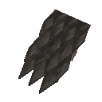|0a0964dc9a88c994b9ff687fafbf8e0e|$piece_darkwoodroof45|Shingle Roof 45|NULL|<ul><li>2 Wood</li><li>1 Tar</li></ul>|Wood|
|darkwood_roof_top_45 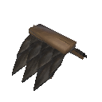|d7c2cc0f3c533924180a2f9628f6c7ae|$piece_darkwoodrooftop45|Shingle Roof Ridge 45|NULL|<ul><li>2 Wood</li><li>1 Tar</li></ul>|Wood|
|darkwood_roof_ocorner_45 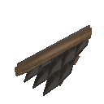|4e7002813a59b9b4b99b43e06869a727|$piece_darkwoodroofocorner45|Shingle Roof Outer Corner 45|NULL|<ul><li>2 Wood</li><li>1 Tar</li></ul>|Wood|
|darkwood_roof_icorner_45 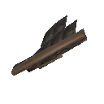|53685bbf3fc8010439103108efbcee22|$piece_darkwoodrooficorner45|Shingle Roof Inner Corner 45|NULL|<ul><li>2 Wood</li><li>1 Tar</li></ul>|Wood|
|darkwood_pole 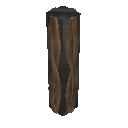|e72e7da7abf0e924dbf482951015afb2|$piece_darkwoodpole|Darkwood Pole 2m|NULL|<ul><li>2 Wood</li><li>1 Tar</li></ul>|Wood|
|darkwood_pole4 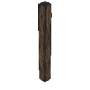|8a1882a138e5f5b42b0b5631ed2c65e8|$piece_darkwoodpole4|Darkwood Pole 4m|NULL|<ul><li>4 Wood</li><li>1 Tar</li></ul>|Wood|
|darkwood_beam 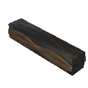|d3bfcabb00ff8b546b08842c97fe0b72|$piece_darkwoodbeam|Darkwood Beam 2 m|NULL|<ul><li>2 Wood</li><li>1 Tar</li></ul>|Wood|
|darkwood_beam_26 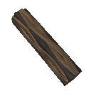|17716acd0f2c2c17094d8af52019ff03|$piece_darkwoodbeam_26|Darkwood Beam 26|NULL|<ul><li>2 Wood</li><li>1 Tar</li></ul>|Wood|
|darkwood_beam_45 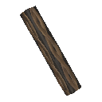|f7593e88471908c458aebe29052d7d6d|$piece_darkwoodbeam_45|Darkwood Beam 45|NULL|<ul><li>2 Wood</li><li>1 Tar</li></ul>|Wood|
|darkwood_beam4x4 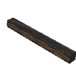|7c2e192c0277e544a8208214e32c8622|$piece_darkwoodbeam4|Darkwood Beam 4 m|NULL|<ul><li>4 Wood</li><li>1 Tar</li></ul>|Wood|
|darkwood_decowall 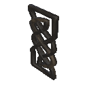|b51946089f078f749a886fcfe7bb9152|$piece_darkwooddecowall|Carved Darkwood Divider|NULL|<ul><li>2 Finewood</li><li>1 Tar</li></ul>|Wood|
|darkwood_arch 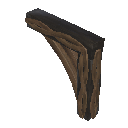|55e0e79db6106da49a2ec46bb9fd5f5c|$piece_darkwoodarch|Darkwood Arch|NULL|<ul><li>2 Wood</li><li>1 Tar</li></ul>|Wood|
|darkwood_raven 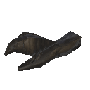|839b948e1f4c4f94c9127cb28c4de58e|$piece_darkwoodraven|Raven Adornment|NULL|<ul><li>10 Finewood</li><li>1 Tar</li></ul>|Wood|
|darkwood_wolf 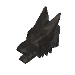|7bbf246140040a04ca31e78ca7cb34e2|$piece_darkwoodwolf|Wolf Adornment|NULL|<ul><li>10 Finewood</li><li>1 Tar</li></ul>|Wood|
|wood_fence 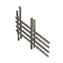|22d1937325c4240f7b4a8c2c02f7a9f5|$piece_woodfence|Roundpole Fence|NULL|<ul><li>1 Wood</li></ul>|Wood|
|stake_wall 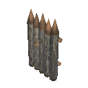|3ea4bf876e5194d54a90532e16ba8600|$piece_stakewall|Stakewall|NULL|<ul><li>4 Wood</li></ul>|Wood|
|piece_dvergr_stake_wall 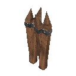|036a678625002f03f97a5b866c666036|$piece_dvergr_stake_wall|Dvergr Stakewall|NULL|<ul><li>8 Yggdrasil Wood</li><li>8 Iron</li></ul>|HardWood|
|piece_sharpstakes 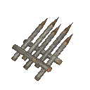|16c816801eb59421093eb61a9b465344|$piece_sharpstakes|Sharp Stakes|NULL|<ul><li>6 Wood</li><li>4 Corewood</li></ul>|Wood|
|piece_stakewall_blackwood 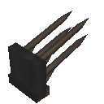|154e60c421896594aba909be0add57a9|$piece_BlackwoodStakewall|Ashwood Stakewall|NULL|<ul><li>6 Ashwood</li></ul>|Wood|
|piece_dvergr_sharpstakes 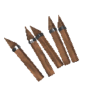|447a95f13957d4b1db52abcae01de28d|$piece_dvergr_sharpstakes|Dvergr Sharp Stakes|NULL|<ul><li>5 Yggdrasil Wood</li><li>2 Iron</li></ul>|HardWood|
|stone_wall_1x1 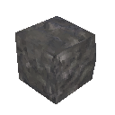|b34c3e5b5f966482eac44bbc2fe7eedf|$piece_stonewall1x1|Stone Wall 1x1|NULL|<ul><li>3 Stone</li></ul>|Stone|
|stone_wall_2x1 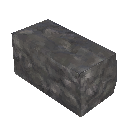|30d8ded92eca649c4b4428f26371a4f2|$piece_stonewall2x1|Stone Wall 2x1|NULL|<ul><li>4 Stone</li></ul>|Stone|
|stone_wall_4x2 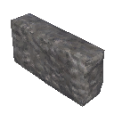|5a0d9f5cab0764652aa173418dfc20ef|$piece_stonewall4x2|Stone Wall 4x2|NULL|<ul><li>6 Stone</li></ul>|Stone|
|stone_pillar 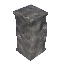|afbb2f91bc6f7428ba6f4ab25725531e|$piece_stonepillar|Stone Pillar|NULL|<ul><li>5 Stone</li></ul>|Stone|
|stone_arch 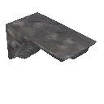|525ee4d5e79044161bfa09463eb9e008|$piece_stonearch|Stone Arch|NULL|<ul><li>4 Stone</li></ul>|Stone|
|stone_floor_2x2 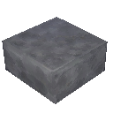|1064a57c1d3ae4c90a65adc981ea3b2a|$piece_stonefloor2x2|Stone Floor 2x2|NULL|<ul><li>6 Stone</li></ul>|Stone|
|stone_stair 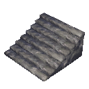|5f9dc6ce6dfb04c40914c6c85fd75c8a|$piece_stonestair|Stone Stair|NULL|<ul><li>8 Stone</li></ul>|Stone|
|blackmarble_1x1 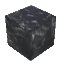|88ef9df01ec464582b055b39ed9daf2c|$piece_blackmarble1x1|Black Marble 1x1x1|NULL|<ul><li>2 Black Marble</li></ul>|Marble|
|blackmarble_2x1x1 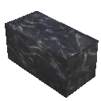|b06aa77b88c4e4059922764f7313dc19|$piece_blackmarble2x1x1|Black Marble 2x1x1|NULL|<ul><li>4 Black Marble</li></ul>|Marble|
|blackmarble_2x2x2 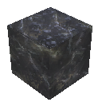|3d022d67f64ea0257b418db273773ba6|$piece_blackmarble2x2x2|Black Marble 2x2x2|NULL|<ul><li>8 Black Marble</li></ul>|Marble|
|blackmarble_floor 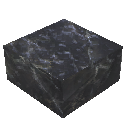|ba54ed6987a1fc71e9fefad8a419b18a|$piece_blackmarble_floor|Black Marble Floor|NULL|<ul><li>4 Black Marble</li></ul>|Marble|
|blackmarble_floor_triangle 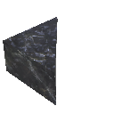|bce3927afe64cbcf387cc0f2e64f254d|$piece_blackmarble_floor_triangle|Black Marble Floor Triangle|NULL|<ul><li>3 Black Marble</li></ul>|Marble|
|blackmarble_stair 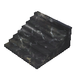|c690501d9fa94b792ac660fddd81764e|$piece_blackmarble_stair|Black Marble Stair|NULL|<ul><li>8 Black Marble</li></ul>|Marble|
|blackmarble_tip 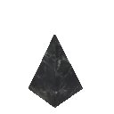|56c7518ace77d55f08cdca31d02f25b7|$piece_blackmarble_tip|Black Marble Quarter Spire|NULL|<ul><li>2 Black Marble</li></ul>|Marble|
|blackmarble_base_1 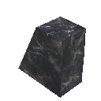|04ad1b5014c940b6393dc0253c32361f|$piece_blackmarble_base1|Black Marble Plinth|NULL|<ul><li>5 Black Marble</li></ul>|Marble|
|blackmarble_basecorner 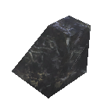|85cd7e1fec3cffc27937bb2efbb6a0a3|$piece_blackmarble_basecorner|Black Marble Plinth Corner|NULL|<ul><li>6 Black Marble</li></ul>|Marble|
|blackmarble_out_1 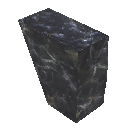|52a42aff34d13fa4d86e3148ae0544a6|$piece_blackmarble_out1|Black Marble Cornice|NULL|<ul><li>5 Black Marble</li></ul>|Marble|
|blackmarble_outcorner 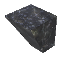|4df75385a4ea4f3c4a43a3696c06aedc|$piece_blackmarble_outcorner|Black Marble Cornice Corner|NULL|<ul><li>6 Black Marble</li></ul>|Marble|
|blackmarble_arch 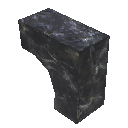|0da7cf13fac75526e8daa971633c98a0|$piece_blackmarble_arch|Black Marble Arch|NULL|<ul><li>5 Black Marble</li></ul>|Marble|
|blackmarble_column_1 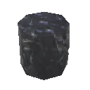|cd8ccf6dda4b4cef5931144bb308af95|$piece_blackmarble_column_1|Black Marble Column Small|NULL|<ul><li>2 Black Marble</li></ul>|Marble|
|blackmarble_column_2 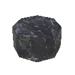|8a74926d3f920e15689ed59d6de65d5b|$piece_blackmarble_column_2|Black Marble Column Wide|NULL|<ul><li>4 Black Marble</li></ul>|Marble|
|iron_floor_1x1_v2 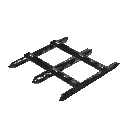|bf90d383a1042764bbec4b75cfddbd12|$piece_ironfloorSmall|Cage Floor 1x1|NULL|<ul><li>1 Iron</li></ul>|Iron|
|iron_floor_2x2 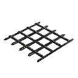|13049d9491a3c6346ac4646a19c2e9fe|$piece_ironfloor|Cage Floor 2x2|NULL|<ul><li>2 Iron</li></ul>|Iron|
|iron_wall_1x1 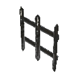|a9ad95bd792fc2740b58b4408d5176a8|$piece_ironwallSmall|Cage Wall 1x1|NULL|<ul><li>1 Iron</li></ul>|Iron|
|iron_wall_2x2 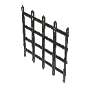|7e11d794297bcf94c8ce8ec4267f4822|$piece_ironwall|Cage Wall 2x2|NULL|<ul><li>2 Iron</li></ul>|Iron|
|piece_dvergr_metal_wall_2x2 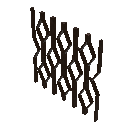|e1fbb0f3ec26bf95f9bd3dbb9df9f7aa|$piece_dvergr_metal_wall|Dvergr Metal Wall|NULL|<ul><li>2 Copper</li></ul>|Iron|
|woodiron_pole 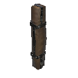|46b22acb75e0d42c895c4f4aec0aee34|$piece_woodironpole|Wood Iron Pole|NULL|<ul><li>2 Wood</li><li>1 Iron</li></ul>|Iron|
|woodiron_beam 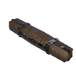|e542b4adb8edc444a8bfb9e139c708ad|$piece_woodironbeam|Wood Iron Beam|NULL|<ul><li>2 Wood</li><li>1 Iron</li></ul>|Iron|
|woodiron_beam_26 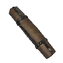|17cf80814a016804083755547f79f8ce|$piece_woodironbeam_26|Wood Iron Beam 26|NULL|<ul><li>2 Wood</li><li>1 Iron</li></ul>|Iron|
|woodiron_beam_45 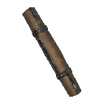|cc3ea3879286df23ba99f39ec21d16e2|$piece_woodironbeam_45|Wood Iron Beam 45|NULL|<ul><li>2 Wood</li><li>1 Iron</li></ul>|Iron|
|iron_grate 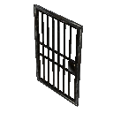|6597169c5c172455cb67886a7cd28a9b|$piece_irongate|Iron Gate|NULL|<ul><li>4 Iron</li></ul>|Iron|
|piece_trap_troll 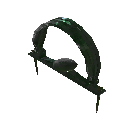|24292e4fb57c6ab4a957c13b3ce04915|$piece_trap|Trap|NULL|<ul><li>5 Black Metal</li><li>10 Bronze Nails</li><li>1 Mechanical Spring</li></ul>|Iron|
|piece_turret 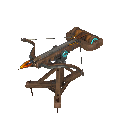|ce38c6d19c32b014d99a3518c8010674|$piece_turret|Ballista|Defensive structure that shoots missiles at anything that gets in its way.|<ul><li>10 Black Metal</li><li>10 Yggdrasil Wood</li><li>3 Mechanical Spring</li></ul>|Wood|
|bed 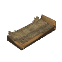|7ea3d17319c0b4681a039adfa1fc2758|$piece_bed|Bed|NULL|<ul><li>8 Wood</li></ul>|Wood|
|piece_bed02 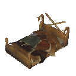|ff7ba57cc4d3474488dfd71fb8787b5b|$piece_bed02|Dragon Bed|NULL|<ul><li>40 Finewood</li><li>7 Deer Hide</li><li>4 Wolf Pelt</li><li>10 Feathers</li><li>15 Iron Nails</li></ul>|Wood|
|ashwood_bed 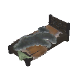|6ce5c48522ee0304388d64bf6082cb5f|$piece_ashwood_bed|Ashwood Bed|NULL|<ul><li>8 Ashwood</li><li>2 Lox Pelt</li><li>2 Asksvin Hide</li></ul>|Wood|
|piece_chest_wood 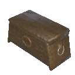|c98a482d15e7f4fada0909282da3747a|$piece_chestwood|Chest|NULL|<ul><li>10 Wood</li></ul>|Wood|
|piece_chest 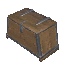|3ddd9f38424df40dbb3ce37d9664d90d|$piece_chest|Reinforced Chest|NULL|<ul><li>10 Finewood</li><li>2 Iron</li></ul>|Wood|
|piece_chest_private 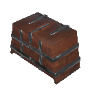|152ae1432e42544bca51272a6aba6c5a|$piece_chestprivate|Personal Chest|NULL|<ul><li>10 Finewood</li><li>8 Iron</li></ul>|Wood|
|piece_chest_blackmetal 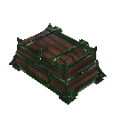|6973dc356b19c404b8905acf5876c0bc|$piece_chestblackmetal|Black Metal Chest|NULL|<ul><li>10 Wood</li><li>2 Tar</li><li>6 Black Metal</li></ul>|Iron|
|piece_chest_barrel 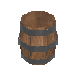|f6ac3d6708f0d9a43ba756289e33387e|$piece_chestbarrel|Barrel|NULL|<ul><li>10 Wood</li><li>1 Barrel Hoops</li></ul>|Iron|
|piece_chair 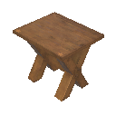|623c3a0c150684f68b2f2308e89c76b0|$piece_stool|Stool|NULL|<ul><li>4 Finewood</li></ul>|Wood|
|piece_chair02 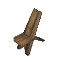|0ab9e76210cbd4b4490f84bb206ce90b|$piece_chair|Wood Chair|NULL|<ul><li>4 Finewood</li></ul>|Wood|
|piece_chair03 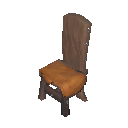|7761f221d4764c64e93490dc53053711|$piece_darkwoodchair|Darkwood Chair|NULL|<ul><li>4 Finewood</li><li>1 Tar</li><li>5 Iron Nails</li><li>1 Deer Hide</li></ul>|Wood|
|piece_bench01 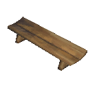|f3e9596916a030b4bb0e0e1df002b8ec|$piece_bench01|Wood Bench|NULL|<ul><li>6 Finewood</li></ul>|Wood|
|piece_logbench01 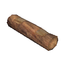|dced64900099c2a4f986b002424a0876|$piece_benchlog|Sitting Log|NULL|<ul><li>2 Corewood</li></ul>|Wood|
|piece_blackmarble_bench 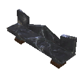|925d7c7f65a911c4597f0606d5870f7f|$piece_blackmarble_bench|Black Marble Bench|NULL|<ul><li>6 Black Marble</li><li>3 Copper</li></ul>|Marble|
|piece_throne01 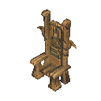|9fd3ca7498c2938469b28255e309c0c9|$piece_throne01|Raven Throne|NULL|<ul><li>20 Finewood</li><li>10 Iron Nails</li></ul>|Wood|
|piece_throne02 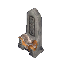|b8fca855ec6075f47bab49569c25fc9a|$piece_stonethrone|Stone Throne|NULL|<ul><li>20 Stone</li><li>2 Deer Hide</li><li>2 Wolf Pelt</li></ul>|Stone|
|piece_blackmarble_throne 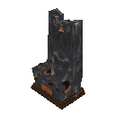|aba79e7b822f76743b600f896064b08b|$piece_blackmarble_throne|Black Marble Throne|NULL|<ul><li>20 Black Marble</li><li>4 Scale Hide</li><li>2 Deer Hide</li><li>5 Copper</li></ul>|Marble|
|piece_bone_throne 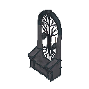|f60f461fe9e3e8a4d93abff0cac0e862|$piece_bone_throne|Bone Throne|NULL|<ul><li>15 Charred Bone</li><li>4 Flametal</li><li>20 Grausten</li><li>3 Charred Skull</li></ul>|Marble|
|piece_table 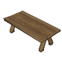|b3f7f89f9e8234781acdb05fbc905e24|$piece_table|Table|NULL|<ul><li>6 Finewood</li></ul>|Wood|
|piece_table_round 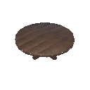|e0fcee9c06453ed4c9615a8eb3646552|$piece_table_round|Round Table|NULL|<ul><li>10 Finewood</li><li>2 Tar</li><li>20 Iron Nails</li></ul>|Wood|
|piece_table_oak 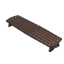|74d6caa163c042b43ba42987735bb7e5|$piece_table_oak|Long Heavy Table|NULL|<ul><li>20 Finewood</li><li>2 Tar</li><li>20 Iron Nails</li></ul>|Wood|
|piece_blackmarble_table 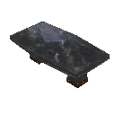|22694a2dba4a19246b3cd160f3d7cfc0|$piece_blackmarble_table|Black Marble Table|NULL|<ul><li>6 Black Marble</li><li>3 Copper</li></ul>|Marble|
|piece_walltorch 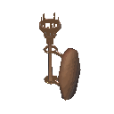|778da688a38474f53ac49b87e1169858|$piece_sconce|Sconce|NULL|<ul><li>2 Wood</li><li>2 Copper</li><li>2 Resin</li></ul>|Wood|
|piece_groundtorch 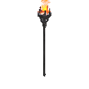|add3320e6c15a4f8482e219dfee2fdce|$piece_groundtorch|Standing Iron Torch|NULL|<ul><li>2 Iron</li><li>2 Resin</li></ul>|Wood|
|piece_groundtorch_wood 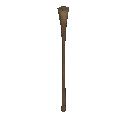|fe89c1d0dd6b143febbcdc20d1be6c89|$piece_groundtorchwood|Standing Wood Torch|NULL|<ul><li>2 Wood</li><li>2 Resin</li></ul>|Wood|
|piece_groundtorch_green 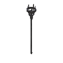|fea47948882764ef1b62392c0bed89a8|$piece_groundtorchgreen|Standing Green-burning Iron Torch|NULL|<ul><li>2 Iron</li><li>2 Guck</li></ul>|Wood|
|piece_groundtorch_blue 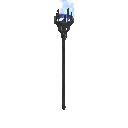|4a7b8bb81be70f076b226ffa8672d5ab|$piece_groundtorchblue|Standing Blue-burning Iron Torch|NULL|<ul><li>2 Iron</li><li>2 Greydwarf Eye</li></ul>|Wood|
|piece_groundtorch_mist |4a5ad5829f02c3f2c896ce1697ff48df|$piece_groundtorchdemister|Wisp Torch|NULL|<ul><li>1 Yggdrasil Wood</li><li>1 Wisp</li></ul>|Wood|
|piece_brazierfloor01 |d4ed67b1b0066ac6aabde0d0cc942ef9|$piece_brazierfloor01|Standing Brazier|NULL|<ul><li>5 Bronze</li><li>2 Coal</li><li>3 Fenris Claw</li></ul>|Wood|
|piece_brazierfloor02 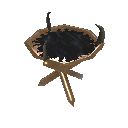|b411a807ea3a906dd89b84a051a8f2a8|$piece_brazierfloor02|Blue Standing Brazier|NULL|<ul><li>5 Bronze</li><li>5 Greydwarf Eye</li><li>3 Fenris Claw</li></ul>|Wood|
|piece_brazierceiling01 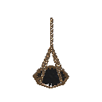|9868abb743f0ae142b322b302b3dfd4c|$piece_brazierceiling01|Hanging Brazier|NULL|<ul><li>5 Bronze</li><li>2 Coal</li><li>1 Chain</li></ul>|Wood|
|Candle_resin 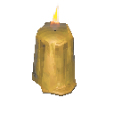|47560b75db5d88e4bb7a7c7bf948e9ce|$piece_candle|Resin Candle|NULL|<ul><li>1 Resin</li><li>1 Candle Wick</li></ul>|Wood|
|piece_Lavalantern 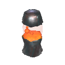|6dd11b919498f3641aaf889a1dbed86d|$piece_lavalantern|Lava Lantern|NULL|<ul><li>1 Flametal</li><li>1 Proustite Powder</li><li>1 Sulfur</li></ul>|Wood|
|portal_wood 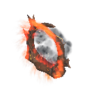|72c23e1c29b4a426a9c38129ad389791|$piece_portal|Portal|Connects to another portal with equal or no tag.|<ul><li>10 Greydwarf Eye</li><li>20 Finewood</li><li>2 Surtling Core</li></ul>|Wood|
|portal_stone 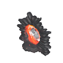|bb9b549991225de4ca2926bfeacf582b|$piece_portal_stone|Portal  Stone|The powerful energy source lets you pass through even with the most valuable of items.|<ul><li>10 Greydwarf Eye</li><li>30 Grausten</li><li>2 Molten Core</li></ul>|Stone|
|guard_stone 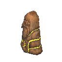|9956b971c266b4e64b7c410027b87532|$piece_guardstone|Ward|Emits a magic seal on the nearby surroundings which prevents other players from constructing buildings or opening doors.|<ul><li>5 Finewood</li><li>5 Greydwarf Eye</li><li>1 Surtling Core</li></ul>|Stone|
|Cart 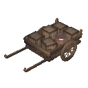|bd7ced1e1b7b94e7f8c59a0d7008a1d4|$tool_cart|Cart|NULL|<ul><li>20 Wood</li><li>10 Bronze Nails</li></ul>|Wood|
|VikingShip_Ashlands 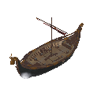|a420f61fbaae18048beb1dd3bdc223d2|$ship_longship_ashlands|Drakkar|NULL|<ul><li>100 Iron Nails</li><li>30 Ceramic Plate</li><li>50 Finewood</li><li>25 Yggdrasil Wood</li></ul>|Wood|
|VikingShip 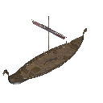|b6effad31ba38473ea35ca303ad411d3|$ship_longship|Longship|NULL|<ul><li>100 Iron Nails</li><li>10 Deer Hide</li><li>40 Finewood</li><li>40 Ancient Bark</li></ul>|Wood|
|Raft 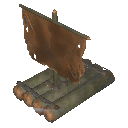|b65169457de244e75b31b05da7d3d9dd|$ship_raft|Raft|NULL|<ul><li>20 Wood</li><li>6 Leather Scraps</li><li>6 Resin</li></ul>|Wood|
|Karve 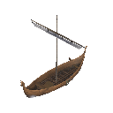|3b9f574b78ca248f28b7f25733995873|$ship_karve|Karve|NULL|<ul><li>30 Finewood</li><li>10 Deer Hide</li><li>20 Resin</li><li>80 Bronze Nails</li></ul>|Wood|
|itemstand 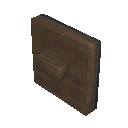|5d470e476b829461e866c1176f3464cf|$piece_itemstand|Item Stand|Vertical|<ul><li>4 Finewood</li><li>1 Bronze Nails</li></ul>|Wood|
|itemstandh 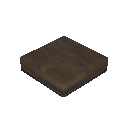|9703a862ea60346aeb308fcf95202477|$piece_itemstand|Item Stand|Horizontal|<ul><li>4 Finewood</li><li>1 Bronze Nails</li></ul>|Wood|
|sign 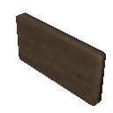|c7c6f01ba8a9147319cfdaef3ac89d36|$piece_sign|Sign|NULL|<ul><li>2 Wood</li><li>1 Coal</li></ul>|Wood|
|rug_Bjorn 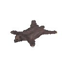|997c322d142fc9b4b89c0a8156e1498c|$piece_rug_bjorn|Bearskin Rug|NULL|<ul><li>1 Bear Hide</li><li>2 Bear Paw</li><li>1 Bear Trophy</li></ul>|Wood|
|rug_wolf 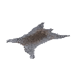|c48bda679ae7ab44fb742b4f6f7127e0|$piece_rug_wolf|Wolf Rug|NULL|<ul><li>4 Wolf Pelt</li></ul>|Wood|
|rug_deer 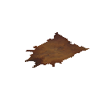|62798ecfa3f8340d9983c91eb5d2c503|$piece_rug_deer|Deer Rug|NULL|<ul><li>4 Deer Hide</li></ul>|Wood|
|rug_fur 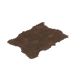|c80bc8ac3c7544f3198dabaf223942fd|$piece_rug_lox|Lox Rug|NULL|<ul><li>4 Lox Pelt</li></ul>|Wood|
|jute_carpet 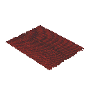|4c87351c227fb85ca855ba776f1a7a6c|$piece_jute_carpet|Red Jute Carpet|NULL|<ul><li>4 Red Jute</li></ul>|Wood|
|jute_carpet_blue |6a4ef9eb4bd2ea2b788c8c86fd29c69a|$piece_juteblue_carpet|Blue Jute Carpet|NULL|<ul><li>4 Blue Jute</li></ul>|Wood|
|rug_hare 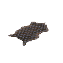|e6504d64b34500c40ab6aa357a4a0d71|$piece_rug_hare|Hare Rug|NULL|<ul><li>4 Scale Hide</li></ul>|Wood|
|rug_asksvin 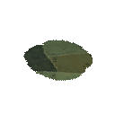|cb1d6f8d1565f644e94b1c9447327b4d|$piece_rug_asksvin|Asksvin Rug|NULL|<ul><li>4 Asksvin Hide</li></ul>|Wood|
|rug_straw 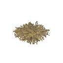|e0741e5c4dd47c24fbb6bdac030a685e|$piece_rug_straw|Straw|NULL|<ul><li>1 Barley</li><li>1 Flax</li></ul>|Wood|
|piece_banner01 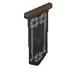|287d856e336259f4e992dbdfdb370c09|$piece_banner01|Black Banner|NULL|<ul><li>6 Leather Scraps</li><li>2 Finewood</li><li>4 Coal</li></ul>|Wood|
|piece_banner02 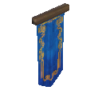|0c3b9e090babadb488b4bd400ff01e14|$piece_banner02|Blue Banner|NULL|<ul><li>6 Leather Scraps</li><li>2 Finewood</li><li>4 Blueberries</li></ul>|Wood|
|piece_banner03 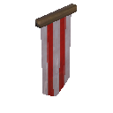|dfb0d13eef872124ab088e23b7072dd8|$piece_banner03|White and Red Striped Banner|NULL|<ul><li>6 Leather Scraps</li><li>2 Finewood</li><li>4 Raspberries</li></ul>|Wood|
|piece_banner04 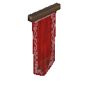|0cb2dc89959fe8b41bc65b51e8b61fac|$piece_banner04|Red Banner|NULL|<ul><li>6 Leather Scraps</li><li>2 Finewood</li><li>1 Bloodbag</li></ul>|Wood|
|piece_banner05 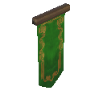|1c4f98d13aec67044ae1fbf803181db2|$piece_banner05|Green Banner|NULL|<ul><li>6 Leather Scraps</li><li>2 Finewood</li><li>1 Guck</li></ul>|Wood|
|piece_banner06 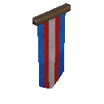|40fdc9ae3e634fd42a8092d11eef0eb2|$piece_banner06|Blue, Red and White Banner|NULL|<ul><li>6 Leather Scraps</li><li>2 Finewood</li><li>2 Blueberries</li><li>2 Raspberries</li><li>1 Cloudberries</li></ul>|Wood|
|piece_banner07 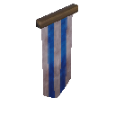|bfd73687afdf561479dbb9d82973a801|$piece_banner07|White and Blue Striped Banner|NULL|<ul><li>6 Leather Scraps</li><li>2 Finewood</li><li>2 Blueberries</li><li>3 Cloudberries</li></ul>|Wood|
|piece_banner08 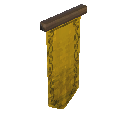|132270cc0d8bfdb43b1f9a5849e8f948|$piece_banner08|Yellow Banner|NULL|<ul><li>6 Leather Scraps</li><li>2 Finewood</li><li>4 Dandelion</li><li>2 Coal</li></ul>|Wood|
|piece_banner09 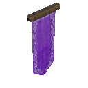|088c512b93911d448b0b08de1dfc778d|$piece_banner09|Purple Banner|NULL|<ul><li>6 Leather Scraps</li><li>2 Finewood</li><li>2 Blueberries</li><li>3 Raspberries</li></ul>|Wood|
|piece_banner10 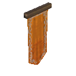|1aeba1501890e3841be1ae2e9311faac|$piece_banner10|Orange Banner|NULL|<ul><li>6 Leather Scraps</li><li>2 Finewood</li><li>2 Carrot</li><li>3 Cloudberries</li></ul>|Wood|
|piece_banner11 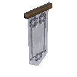|a0e1963b61299f7438e9324573acf4fd|$piece_banner11|White Banner|NULL|<ul><li>6 Leather Scraps</li><li>2 Finewood</li><li>2 Coal</li><li>4 Cloudberries</li></ul>|Wood|
|piece_cloth_hanging_door 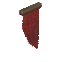|df56dac48ab2895cdaf605b05404ed02|$piece_clothdoor|Red Jute Curtain|NULL|<ul><li>4 Red Jute</li><li>1 Finewood</li></ul>|Wood|
|piece_cloth_hanging_door_blue 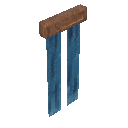|3dc01e010cc2b7a47bcd4acc1cbc6910|$piece_hanging_cloth_blue1|Blue Jute Drapes|NULL|<ul><li>4 Blue Jute</li><li>1 Finewood</li></ul>|Wood|
|piece_cloth_hanging_door_blue2 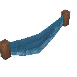|57d32be19b0ff5748bfaa075fd42e46a|$piece_hanging_cloth_blue2|Blue Jute Curtain|NULL|<ul><li>4 Blue Jute</li><li>1 Finewood</li></ul>|Wood|
|piece_beehive 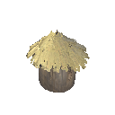|fa038959a79074658b8a6c1a6771a0e3|$piece_beehive|Beehive|NULL|<ul><li>10 Wood</li><li>1 Queen Bee</li></ul>|Wood|
|piece_sapcollector 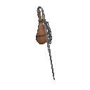|10a037caf14b7724885a1f7b3a722f34|$piece_sapcollector|Sap Extractor|Extract sap from mysterious branches.|<ul><li>10 Yggdrasil Wood</li><li>5 Black Metal</li><li>1 Dvergr Extractor</li></ul>|Wood|
|piece_MeadCauldron 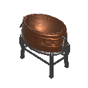|05d06f4abf785ee4aa034e3fd47e61c7|$piece_meadcauldron|Mead Ketill|Crafting station|<ul><li>4 Tin</li><li>6 Copper</li><li>2 Leather Scraps</li></ul>|Wood|
|fermenter 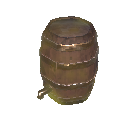|931ace36de99947cc9a2afd23047791c|$piece_fermenter|Fermenter|NULL|<ul><li>30 Finewood</li><li>5 Bronze</li><li>10 Resin</li></ul>|Wood|
|piece_gift1 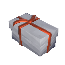|737be72b7b0824d0db10992ae2cffee0|$piece_yuleklapp|Yuleklapp|NULL|<ul><li>2 Finewood</li><li>1 Bone Fragments</li></ul>|Wood|
|piece_gift2 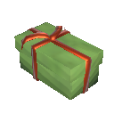|3b8c00290d3734a47ace68e94f63aeee|$piece_yuleklapp|Yuleklapp|NULL|<ul><li>3 Finewood</li><li>1 Dandelion</li></ul>|Wood|
|piece_gift3 |7019b776725e84fd9b8f5177f52e5342|$piece_yuleklapp|Yuleklapp|NULL|<ul><li>4 Finewood</li><li>1 Raspberries</li></ul>|Wood|
|piece_xmastree 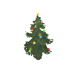|3ae8dd38b26a54204aab7436fd17e9cb|$piece_yuletree|Yule Tree|NULL|<ul><li>10 Wood</li><li>1 Fir Cone</li></ul>|Wood|
|piece_xmasgarland 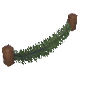|897a02aeaa103d2f994c6fd6c36a7930|$piece_yulegarland|Yule Garland|NULL|<ul><li>2 Finewood</li><li>1 Pine Cone</li></ul>|Wood|
|piece_xmascrown 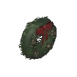|3817dc1b7e4b8e4dbb8d48d6c73a8fbf|$piece_yulecrown|Yule Wreath|NULL|<ul><li>4 Pine Cone</li><li>1 Red Jute</li><li>1 Finewood</li></ul>|Wood|
|piece_mistletoe 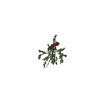|468de38450691d49994f17f79b4093ea|$piece_mistletoe|Mistletoe|NULL|<ul><li>1 Finewood</li><li>1 Red Jute</li></ul>|Wood|
|piece_maypole 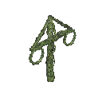|228d5c5e4633041a69edc142fb00bc91|$piece_maypole|Maypole|NULL|<ul><li>10 Wood</li><li>4 Dandelion</li><li>4 Thistle</li></ul>|Wood|
|piece_jackoturnip 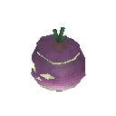|5e754918ee5f4f1178a67f6936e51205|$piece_jackoturnip|Jack-o-turnip|NULL|<ul><li>4 Turnip</li><li>2 Resin</li></ul>|Wood|
|piece_chest_treasure 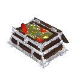|2eea37180951eea48b57426be7198413|$piece_chesttreasure|Treasure Chest|NULL|<ul><li>99 Coins</li><li>5 Ruby</li><li>2 Silver Necklace</li><li>8 Finewood</li><li>2 Silver</li></ul>|Wood|
|treasure_pile 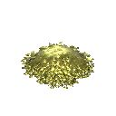|9d2da989f175a7d4595ec395585e1018|$piece_treasure_pile|Coin Pile|NULL|<ul><li>999 Coins</li></ul>|Wood|
|treasure_stack 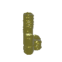|1c76bb3305c33b440a792928962480f0|$piece_treasure_stack|Coin Stack|NULL|<ul><li>99 Coins</li></ul>|Wood|
|piece_bathtub 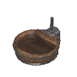|e8de8d8939eef5b48be734ea6e082520|$piece_bathtub|Hot Tub|NULL|<ul><li>20 Wood</li><li>6 Tar</li><li>10 Iron</li><li>8 Stone</li></ul>|Wood|
|crystal_wall_1x1 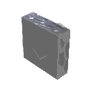|2ec2609b3ba7111b38ccebe5023abb42|$piece_crystalwall1x1|Crystal Wall 1x1|NULL|<ul><li>2 Crystal</li></ul>|Wood|
|piece_cartographytable 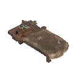|3449de09ba416549383a0728fb2535a1|$piece_cartographytable|Cartography Table|NULL|<ul><li>10 Finewood</li><li>10 Bone Fragments</li><li>2 Bronze</li><li>5 Leather Scraps</li><li>4 Raspberries</li></ul>|Wood|
|incinerator 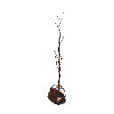|2bedae10b24758b479914984bdb89bd2|$piece_incinerator|Obliterator|NULL|<ul><li>8 Iron</li><li>4 Copper</li><li>1 Thunder Stone</li></ul>|Iron|
|ArmorStand 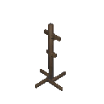|759c31424d4e1514dbf67ca2fc388a01|$piece_armorstand|Armour Stand|NULL|<ul><li>8 Finewood</li><li>4 Iron Nails</li><li>2 Leather Scraps</li></ul>|Wood|
|piece_magetable 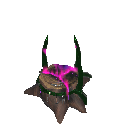|524fccf4a011c0e92a337ff4d2065bae|$piece_magetable|Galdr Table|Crafting station|<ul><li>20 Yggdrasil Wood</li><li>10 Black Metal</li><li>5 Black Core</li><li>5 Refined Eitr</li></ul>|Wood|
|piece_magetable_ext 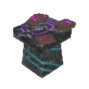|e68a9104efe5a8b26b67f2acc229d630|$piece_magetable_ext|Rune Table|Galdr Table improvement|<ul><li>10 Black Marble</li><li>5 Yggdrasil Wood</li><li>10 Refined Eitr</li></ul>|Wood|
|piece_magetable_ext2 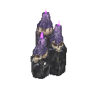|69d774b3eb02a014292cdf0570e55044|$piece_magetable_ext2|Unfading Candles|Galdr Table improvement|<ul><li>10 Black Marble</li><li>3 Skeleton Trophy</li><li>10 Refined Eitr</li><li>15 Resin</li></ul>|Wood|
|piece_magetable_ext3 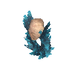|7e4d2789b54a0a94cb442fbc82b6614e|$piece_magetable_ext3|Feathery Wreath|Galdr Table improvement|<ul><li>8 Celestial Feather</li><li>1 Asksvin Trophy</li><li>10 Refined Eitr</li><li>3 Ashwood</li></ul>|Wood|
|piece_wisplure 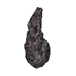|f178fa4be9a2772528642ea5f4b589ac|$piece_wisplure|Wisp Fountain|Attracts wisps. They mostly come at night... mostly.|<ul><li>10 Stone</li><li>1 Torn Spirit</li></ul>|Stone|
|piece_dvergr_spiralstair 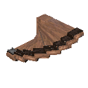|4f0eeb4b64035cf8c952d27c3b6b6857|$piece_dvergr_spiralstair|Dvergr Spiral Staircase Left|NULL|<ul><li>5 Yggdrasil Wood</li><li>2 Copper</li></ul>|HardWood|
|piece_dvergr_spiralstair_right 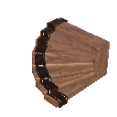|5f69483b28bddb25092abf59d834fe78|$piece_dvergr_spiralstair_right|Dvergr Spiral Staircase Right|NULL|<ul><li>5 Yggdrasil Wood</li><li>2 Copper</li></ul>|HardWood|
|piece_dvergr_lantern 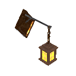|1842baabc90516f479fe6a1425dde543|$piece_dvergr_lantern|Dvergr Wall Lantern|NULL|<ul><li>2 Copper</li><li>1 Dvergr Lantern</li><li>1 Chain</li></ul>|Iron|
|piece_dvergr_lantern_pole 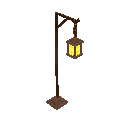|4187b20b206dfb106bfe1a7af7b1586c|$piece_dvergr_lantern_pole|Dvergr Pole Lantern|NULL|<ul><li>3 Copper</li><li>1 Dvergr Lantern</li><li>1 Chain</li></ul>|Iron|
|piece_barber 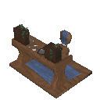|671bfc3cb4cfdf34084a45bee1f0b894|$piece_barber|Barber Station|Helps you stay up to date with the latest viking fashion.|<ul><li>10 Finewood</li><li>1 Barber Kit</li><li>5 Bronze Nails</li><li>5 Troll Hide</li></ul>|Wood|
|BatteringRam 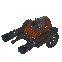|598c937f0b42a0b4fa8fb265b5298a3c|$tool_batteringram|Battering Ram|NULL|<ul><li>20 Ashwood</li><li>10 Flametal</li><li>2 Surtling Core</li></ul>|Wood|
|Catapult 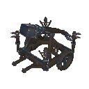|93921a591a27a884e8c48125ea190084|$tool_catapult|Catapult|NULL|<ul><li>20 Ashwood</li><li>10 Flametal</li><li>1 Charred Cogwheel</li></ul>|Wood|
|piece_shieldgenerator 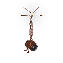|c9f31857976c8ff499a1915491e3be2e|$piece_shieldgenerator|Shield Generator|Creates a shield to protect against weather and incoming projectiles. Fuelled by bones of any kind.|<ul><li>5 Iron</li><li>5 Copper</li><li>1 Shield Core</li></ul>|Stone|
|piece_pot3 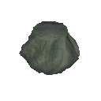|7ff68568dc53e0c65801508f3d82cd55|$piece_pot_small_green|Small Green Pot|NULL|<ul><li>3 Pot Shard</li><li>1 Charcoal Resin</li></ul>|Wood|
|piece_pot1 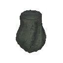|f12fcea1b4ce6ff20927fbd7f8a06173|$piece_pot_medium_green|Medium Green Pot|NULL|<ul><li>4 Pot Shard</li><li>1 Charcoal Resin</li></ul>|Wood|
|piece_pot2 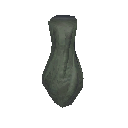|059ae1d064be4dd42be159c9deabd161|$piece_pot_large_green|Large Green Pot|NULL|<ul><li>5 Pot Shard</li><li>1 Charcoal Resin</li></ul>|Wood|
|piece_ArcheryTarget 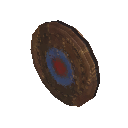|2b9a03c795542b6419431001367e7625|$piece_archerytarget|Archery Target|NULL|<ul><li>4 Finewood</li><li>10 Leather Scraps</li></ul>|Wood|
|piece_TrainingDummy 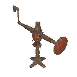|43638f29248196d4db1026765de61f26|$piece_trainingdummy|T.W.I.G.|NULL|<ul><li>5 Finewood</li><li>10 Bronze Nails</li><li>5 Ectoplasm</li></ul>||
|Piece_grausten_stone_ladder 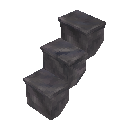|ae0aabd5321b5013aa3e2a6ac465b460|$piece_grausten_stoneladder|Grausten Steep Stairs|NULL|<ul><li>5 Grausten</li></ul>|Ashstone|
|piece_grausten_stonestair 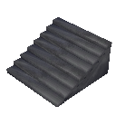|dcb895e52f25e368292b1893681d0194|$piece_grausten_stair|Grausten Stairs|NULL|<ul><li>8 Grausten</li></ul>|Ashstone|
|Piece_grausten_floor_1x1 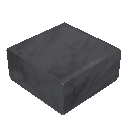|c6f27c5d4a88d8a7b8af159f3cd6c743|$piece_grausten_floor1x1|Grausten Floor 1x1|NULL|<ul><li>2 Grausten</li></ul>|Ashstone|
|Piece_grausten_floor_2x2 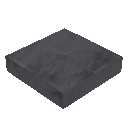|d4845bfa8e5b9a79eb8cf5b50bd0d5f0|$piece_grausten_floor2x2|Grausten Floor 2x2|NULL|<ul><li>4 Grausten</li></ul>|Ashstone|
|Piece_grausten_floor_4x4 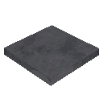|905bc5e83eb08e03bbf4cd53d440c8f4|$piece_grausten_floor4x4|Grausten Floor 4x4|NULL|<ul><li>8 Grausten</li></ul>|Ashstone|
|Piece_grausten_pillarbase_small 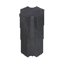|56191b84de1d47e3bb896bd92ca43182|$piece_grausten_pillarsmall|Grausten Small Pillar|NULL|<ul><li>1 Grausten</li></ul>|Ashstone|
|Piece_grausten_pillarbase_medium 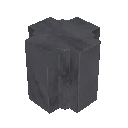|80c937aa837bd787b954e8782e77bd71|$piece_grausten_pillarmedium|Grausten Medium Pillar|NULL|<ul><li>3 Grausten</li></ul>|Ashstone|
|Piece_grausten_pillarbase_tapered 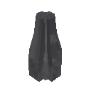|c31aea2d15a13cdcd90117148a8899c6|$piece_grausten_pillartapered|Grausten Tapered Pillar|NULL|<ul><li>5 Grausten</li></ul>|Ashstone|
|Piece_grausten_pillarbase_tapered_inverted 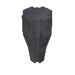|f789580b031a6568783fa9c5d30a05a4|$piece_grausten_pillartaperedinverted|Grausten Tapered Pillar (Inverted)|NULL|<ul><li>5 Grausten</li></ul>|Ashstone|
|Piece_grausten_pillarbeam_small 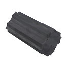|a8495239053baaf8994949f1c8eeacbb|$piece_grausten_beamsmall|Grausten Small Beam|NULL|<ul><li>1 Grausten</li></ul>|Ashstone|
|Piece_grausten_pillarbeam_medium 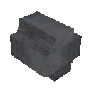|c59dd9b7f4cf053edbe6a009f77e9922|$piece_grausten_beammedium|Grausten Medium Beam|NULL|<ul><li>3 Grausten</li></ul>|Ashstone|
|Piece_grausten_pillar_arch_small 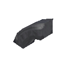|54464b298d43725f7a8d71db0917b4dd|$piece_grausten_archsmall|Grausten Small Arch|NULL|<ul><li>2 Grausten</li></ul>|Ashstone|
|Piece_grausten_pillar_arch 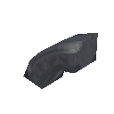|0abfdbe98306783158460bb66a12d8f9|$piece_grausten_archmedium|Grausten Medium Arch|NULL|<ul><li>4 Grausten</li></ul>|Ashstone|
|Piece_grausten_wall_arch 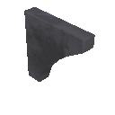|71ba09b7db5e321aa9f9c38f1efa6a20|$piece_grausten_wallarch|Grausten Wall Arch|NULL|<ul><li>2 Grausten</li></ul>|Ashstone|
|Piece_grausten_wall_arch_inverted 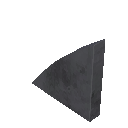|7db2ead38b870767ca824f8e030099a6|$piece_grausten_wallarchinv|Grausten Wall Arch (Inverted)|NULL|<ul><li>2 Grausten</li></ul>|Ashstone|
|Piece_grausten_wall_1x2 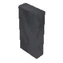|63bf1ada01b6ad72995a172c09aad545|$piece_grausten_wall1x2|Grausten Wall 1x2|NULL|<ul><li>4 Grausten</li></ul>|Ashstone|
|Piece_grausten_wall_2x2 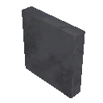|653f0363bd70a2295b61500a36f83a82|$piece_grausten_wall2x2|Grausten Wall 2x2|NULL|<ul><li>6 Grausten</li></ul>|Ashstone|
|Piece_grausten_wall_4x2 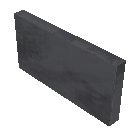|b1ba605e2baeb12e99143dc962e94dc1|$piece_grausten_wall4x2|Grausten Wall 4x2|NULL|<ul><li>12 Grausten</li></ul>|Ashstone|
|Piece_grausten_window_2x2 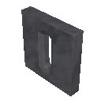|fd03cf416fb5564a78fd39b427af0dde|$piece_grausten_window2x2|Grausten Window 2x2|NULL|<ul><li>4 Grausten</li></ul>|Ashstone|
|Piece_grausten_window_4x2 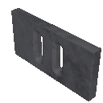|d2fea25d6c91d45c1af8a90fb919268b|$piece_grausten_window4x2|Grausten Window 4x2|NULL|<ul><li>10 Grausten</li></ul>|Ashstone|
|piece_grausten_roof_45 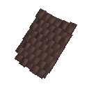|66c9a061a2b553745ba4b9027dcf2b01|$piece_grausten_roof45|Grausten Roof|NULL|<ul><li>5 Grausten</li></ul>|Ashstone|
|piece_grausten_roof_45_corner 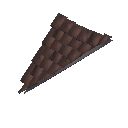|d2495ce39659d5cfe9e28dda324ddf90|$piece_grausten_roof45_corner|Grausten Roof Corner|NULL|<ul><li>5 Grausten</li></ul>|Ashstone|
|piece_grausten_roof_45_corner2 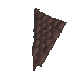|afd8c71cfdbdfd591aa0c6c75c1fea2d|$piece_grausten_roof45_corner2|Grausten Roof Corner|NULL|<ul><li>5 Grausten</li></ul>|Ashstone|
|piece_grausten_roof_45_arch 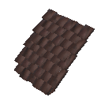|8036e00aae66fa82299848b444b0c00d|$piece_grausten_roof45_arch|Grausten Arched Roof|NULL|<ul><li>5 Grausten</li></ul>|Ashstone|
|piece_grausten_roof_45_arch_corner 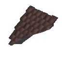|97d6d94c5e0a727d0a458d4f5a22c751|$piece_grausten_roof45_archcorner|Grausten Arched Roof Corner|NULL|<ul><li>5 Grausten</li></ul>|Ashstone|
|piece_grausten_roof_45_arch_corner2 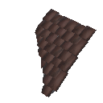|d388e58b5ad39a13b87fb0e9aaf95489|$piece_grausten_roof45_archcorner2|Grausten Arched Roof Corner|NULL|<ul><li>5 Grausten</li></ul>|Ashstone|
|flametal_gate 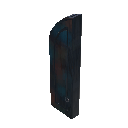|fc5480e05c9b17a4bae4829645f44d68|$piece_flametalgate|Flametal Gate|NULL|<ul><li>16 Flametal</li></ul>|Iron|
|piece_blackwood_bench01 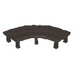|e896889a751d4c7909a5e8260d690eb5|$piece_blackwoodbench01|Ashwood Bench|NULL|<ul><li>6 Ashwood</li></ul>|Wood|
|ashwood_wall_2x2 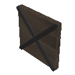|73b3fab02ae7bb45aa4a561d86df69cb|$piece_ashwood_wall|Ashwood Wall|NULL|<ul><li>2 Ashwood</li></ul>|Wood|
|ashwood_halfwall_1x2 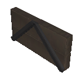|a19cdd60fdf49a7fbb6e997f8bf75f18|$piece_ashwood_halfwall|Ashwood Half Wall|NULL|<ul><li>1 Ashwood</li></ul>|Wood|
|ashwood_quarterwall_1x1 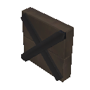|4d4556bfa535b5c159afb6eb85590452|$piece_ashwood_quarterwall|Ashwood Quarter Wall|NULL|<ul><li>1 Ashwood</li></ul>|Wood|
|ashwood_wall_arch 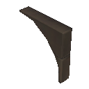|623a569d581943e4cbbab4626c333edf|$piece_ashwood_archedwall|Ashwood Arched Wall|NULL|<ul><li>2 Ashwood</li></ul>|Wood|
|ashwood_decowall_2x2 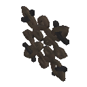|142be2aef5745686d843b568940b8b12|$piece_ashwood_decowall|Ashwood Decorative Wall|NULL|<ul><li>2 Ashwood</li></ul>|Wood|
|ashwood_decowall_tree 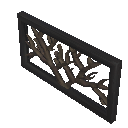|8e661051295cb494fb9c29fddd15bd13|$piece_ashwood_decowall_tree|Ashwood Decorative Window|NULL|<ul><li>2 Ashwood</li></ul>|Wood|
|ashwood_decowall_divider 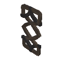|5c562765333f6884583d75e9cc01c0d2|$piece_ashwood_decowall_divider|Ashwood Divider|NULL|<ul><li>2 Ashwood</li></ul>|Wood|
|ashwood_floor_2x2 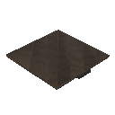|858bb1e5474c1e241a4a778ba38fc370|$piece_ashwood_floor_2x2|Ashwood Floor 2x2|NULL|<ul><li>4 Ashwood</li></ul>|Wood|
|ashwood_floor_1x1 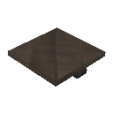|8ba3441fce728b047bf0fed6f2474572|$piece_ashwood_floor_1x1|Ashwood Floor 1x1|NULL|<ul><li>2 Ashwood</li></ul>|Wood|
|ashwood_deco_floor 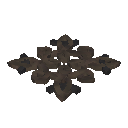|2587a0b3d0c35f749bda59701b016f95|$piece_ashwood_floor_deco|Ashwood Decorative Floor|NULL|<ul><li>4 Ashwood</li></ul>|Wood|
|ashwood_arch_big 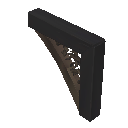|7085655f49f1e0d44bc9a7a1ef2ade64|$piece_ashwoodarch_big|Ashwood Arch|NULL|<ul><li>2 Ashwood</li></ul>|Wood|
|ashwood_beam_1m 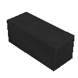|e31400dac2f38d948ab614d1a99f02cc|$piece_ashwood_beam_1m|Ashwood Beam 1 m|NULL|<ul><li>2 Ashwood</li></ul>|Wood|
|ashwood_beam_2m 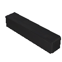|38d3b244885f65b4fab1aa319e330bdf|$piece_ashwood_beam_2m|Ashwood Beam 2 m|NULL|<ul><li>4 Ashwood</li></ul>|Wood|
|ashwood_pole_1m 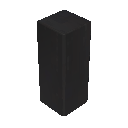|3c33a4a00e742364a8af2818d6b9fa74|$piece_ashwood_pole_1m|Ashwood Pole 1 m|NULL|<ul><li>2 Ashwood</li></ul>|Wood|
|ashwood_pole_2m 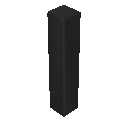|60cc3ed0d74f87044bff8a610d5de6b6|$piece_ashwood_pole_2m|Ashwood Pole 2 m|NULL|<ul><li>4 Ashwood</li></ul>|Wood|
|ashwood_wall_beam_26 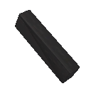|e125972d211b31454bd01f953f3abf82|$piece_ashwoodbeam26|Ashwood Beam 26|NULL|<ul><li>2 Ashwood</li></ul>|Wood|
|ashwood_wall_cross_26 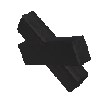|5f7179880542c16e888f8e786c21925a|$piece_ashwoodcross26|Ashwood Roof Cross 26|NULL|<ul><li>2 Ashwood</li></ul>|Wood|
|ashwood_wall_beam_45 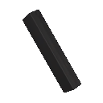|3cfb8d5e8b072c49b8d7722b38e80230|$piece_ashwoodbeam45|Ashwood Beam 45|NULL|<ul><li>2 Ashwood</li></ul>|Wood|
|ashwood_wall_cross_45 |1dafc272d255705c89b52171fe795d3e|$piece_ashwoodcross45|Ashwood Roof Cross 45|NULL|<ul><li>2 Ashwood</li></ul>|Wood|
|ashwood_wall_roof_26 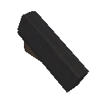|6eb4f36813e29b63482697b9feea7c88|$piece_ashwoodwallroof_26|Ashwood Wall 26|NULL|<ul><li>2 Ashwood</li></ul>|Wood|
|ashwood_wall_roof_26_upsidedown 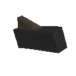|d553a131943aef77eacd4104eceaa09c|$piece_ashwoodwallroof_26_upsidedown|Ashwood Wall 26 (Inverted)|NULL|<ul><li>2 Ashwood</li></ul>|Wood|
|ashwood_wall_roof_45 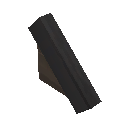|c163fd0c227aacdacb695e59ad15a006|$piece_ashwoodwallroof_45|Ashwood Wall 45|NULL|<ul><li>2 Ashwood</li></ul>|Wood|
|ashwood_wall_roof_45_upsidedown 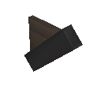|c021bba002348541f815504056dbf3f1|$piece_ashwoodwallroof_45_upsidedown|Ashwood Wall 45 (Inverted)|NULL|<ul><li>2 Ashwood</li></ul>|Wood|
|ashwood_stair 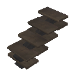|208f5a98ced1c544aadcd934606bebbc|$piece_ashwoodstair|Ashwood Stair|NULL|<ul><li>2 Ashwood</li></ul>|Wood|
|ashwood_door 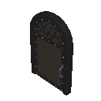|eaf7ab4c310b72244ad5904069071ace|$piece_ashwood_door|Ashwood Door|NULL|<ul><li>1 Flametal</li><li>5 Ashwood</li></ul>|Wood|
|Placeable_HardRock 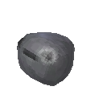|f5042c7f7b27cb342af58a21fdf1638e|$item_hardrock|Mysterious Rock|It's just a rock...|<ul><li>1 Rock</li><li>1 Coal</li></ul>|Wood|
|piece_asksvinskeleton |6581240a0d276d84d84e6e8362d5aeba|$piece_asksvinskeleton|Asksvin Skeleton|NULL|<ul><li>50 Bone Fragments</li><li>1 Asksvin Neck</li><li>1 Asksvin Pelvis</li><li>1 Asksvin Ribcage</li><li>1 Asksvin Skull</li></ul>|Wood|
|Piece_flametal_pillar 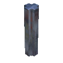|e9f9a247454c3fc438c3179725504367|$piece_flametal_pillar|Flametal Pillar|NULL|<ul><li>2 Flametal</li></ul>|Iron|
|Piece_flametal_beam 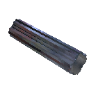|fd72949da7dd35d40bc25638b866f7f5|$piece_flametal_beam|Flametal Beam|NULL|<ul><li>2 Flametal</li></ul>|Iron|
## _HoePieceTable

|Piece |AssetID |Token |English Name |Description |Resources required |Material Type |
|---|---|---|---|---|---|---|
|mud_road_v2|ed80c66b8108b0c11a3bf68086e1c536|$piece_levelground|Level Ground|NULL|<ul></ul>||
|raise_v2|f44128242fde1b48ca3a91a577ee9872|$piece_raise|Raise Ground|NULL|<ul><li>2 Stone</li></ul>||
|path_v2|92740b48761f2a503bc68327aecc5a68|$piece_path|Pathen|NULL|<ul></ul>||
|paved_road_v2|11377d2a6ee724444be5e58d4479f95c|$piece_pavedroad|Paved Road|NULL|<ul><li>1 Stone</li></ul>||
|Placeable_Stone 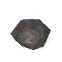|d29a5f6559d02af46835aa2c7cda1e0d|$item_stone|Stone|It's a rock.|<ul><li>1 Stone</li></ul>|Stone|
