# Piece list
All of the pieces currently in the game.
This file is automatically generated from Valheim 1.0.12 using the JotunnDoc mod found on our GitHub.
## _CultivatorPieceTable

|Piece |AssetID |Token |English Name |Description |Resources required |Material Type |Piece Category |Hammer Categories |
|---|---|---|---|---|---|---|---|---|
|cultivate_v2|2cd125dc88fa8eb5bb0cf208899c310c|$piece_cultivate|Cultivate|Make the soil ready for planting.|<ul></ul>||Misc|Misc.|
|replant_v2|a722f37b1a9f61732952383305b4b69d|$piece_replant|Grass|Restore the ground to its original vegetation.|<ul></ul>||Misc|Misc.|
|sapling_turnip |83d79f1ed37184be9a9a00878641014f|$piece_sapling_turnip|Turnip|A hearty vegetable used for cooking.|<ul><li>1 Turnip Seeds</li></ul>||Misc|Misc.|
|sapling_seedturnip |fd11bfbf45f254e8bb234d2b484998cc|$piece_sapling_seedturnip|Seed-turnip|Plant a turnip to get more seeds|<ul><li>1 Turnip</li></ul>||Misc|Misc.|
|sapling_onion |7fde104cefec734829b4c8aa0971a63a|$piece_sapling_onion|Onion|Useful for many cooking recipes.|<ul><li>1 Onion Seeds</li></ul>||Misc|Misc.|
|sapling_seedonion |00f18bc5bef95ddc3857268f20a8bc93|$piece_sapling_seedonion|Seed-onion|Plant an onion to get more seeds.|<ul><li>1 Onion</li></ul>||Misc|Misc.|
|sapling_carrot |a781bbc5b2e5e4d37a79dacf16d763fc|$piece_sapling_carrot|Carrot|Can be eaten as is, or used for more advanced cooking.|<ul><li>1 Carrot Seeds</li></ul>||Misc|Misc.|
|sapling_seedcarrot |c3836b743789e4c1dbf141bf6ab996d4|$piece_sapling_seedcarrot|Seed-carrot|Plant a carrot to get more seeds|<ul><li>1 Carrot</li></ul>||Misc|Misc.|
|sapling_barley |868c2f708a5ac4bc592909310dd7a7d5|$piece_sapling_barley|Barley|A robust grain that can be ground into flour.|<ul><li>1 Barley</li></ul>||Misc|Misc.|
|sapling_flax |d3d7be74637fb40a78780d84290739b7|$piece_sapling_flax|Flax|Pretty flowers with fibres that can be spun into thread.|<ul><li>1 Flax</li></ul>||Misc|Misc.|
|sapling_jotunpuffs |9c713691764e00f4fa2e108e3813e31a|$item_jotunpuffs|Jotun Puffs|An invigorating mushroom that can be used for cooking.|<ul><li>1 Jotun Puffs</li></ul>||Misc|Misc.|
|sapling_magecap |f836746312b02cc48b46b3f818b113dd|$item_magecap|Magecap|A mushroom commonly used in a sorcerer's diet.|<ul><li>1 Magecap</li></ul>||Misc|Misc.|
|sapling_oat 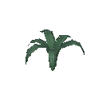|8e0447de3d97f454a9989a418807c188|$piece_sapling_oat|Oat Straw|Plant to grow oats.|<ul><li>1 Oat Seeds</li></ul>||Misc|Misc.|
|sapling_poteitr 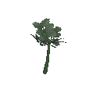|e821ab2da0718e64091c41f9b3937b32|$piece_sapling_poteitr|Poteitr|A potent, otherworldly spud.|<ul><li>1 Seed Poteitr</li></ul>||Misc|Misc.|
|sapling_Kale 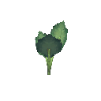|a442324a8ee4b6d41b5aa28127eaeabe|$piece_sapling_kale|Kale|A hardy and nutritious plant.|<ul><li>1 Kale Seeds</li></ul>||Misc|Misc.|
|sapling_seedkale 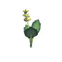|1b84694fd1e05ab44ad70452a704bea1|$piece_sapling_seedkale|Seed Kale|Plant kale seeds to get even more seeds.|<ul><li>1 Kale Seeds</li></ul>||Misc|Misc.|
|Beech_Sapling |14082565f610e491f8a2625c39ec6cdb|$prop_beech_sapling|Beech sapling|A beech yields good old fashioned wood.|<ul><li>1 Beech Seeds</li></ul>||Misc|Misc.|
|Birch_Sapling |9e07abb0f49c52d49a1e1f626d72e216|$prop_birch_sapling|Birch Sapling|A prime source of finewood.|<ul><li>1 Birch Seeds</li></ul>||Misc|Misc.|
|Oak_Sapling |86286b75c8c8dc3428b95e8f35a7054a|$prop_oak_sapling|Oak Sapling|With time, this will grow into a large oak.|<ul><li>1 Acorns</li></ul>||Misc|Misc.|
|FirTree_Sapling |5d109cd6286a94b1991e3374d01cd193|$prop_fir_sapling|Fir Sapling|A pretty tree, all year round.|<ul><li>1 Fir Cone</li></ul>||Misc|Misc.|
|PineTree_Sapling |3ba216d94f6bd4d3b873bc5e1daf90c0|$prop_pine_sapling|Pine Sapling|These tall trees can be chopped down for corewood.|<ul><li>1 Pine Cone</li></ul>||Misc|Misc.|
|FirTree_big_Sapling 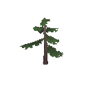|932f17dd92073f04aaa4d3458f2fc148|$prop_fir_big_sapling|Timberwood Sapling|Though native to the northern regions, this tree can grow in most climates.|<ul><li>1 Timberwood Cone</li></ul>||Misc|Misc.|
|VineAsh_sapling |372f1592d262b80488d6d3a48035e1ea|$piece_sapling_vineash|Ashvine|Needs something to cling to.|<ul><li>1 Vineberry Seeds</li></ul>||Misc|Misc.|
|VineGreen_sapling |a733bcd966ff9ad498867450a6724339|$piece_sapling_vinegreen|Ivy|Needs something to cling to.|<ul><li>1 Ivy Seeds</li></ul>||Misc|Misc.|
## _FeasterPieceTable

|Piece |AssetID |Token |English Name |Description |Resources required |Material Type |Piece Category |Hammer Categories |
|---|---|---|---|---|---|---|---|---|
|piece_remove_feaster|75bbbb1245ed1c14d83de7f2e5c9037d|$hud_remove|Remove|<color=yellow>Once a feast has been eaten of, it won't return any resources if dismantled.</color>|<ul></ul>||All|Misc.|
|Raspberry |ea090c99b346541b5abc25d35a42d87d|$item_raspberries|Raspberries|Sweet and delicious.|<ul><li>1 Raspberries</li></ul>|Wood|Feasts|Food|
|Mushroom |037e1609037c54c1a9f96b8f932101ab|$item_mushroomcommon|Mushroom|Bounty of the forest.|<ul><li>1 Mushroom</li></ul>|Wood|Feasts|Food|
|Honey |52c96d1c5160f42de8aa6037a2cebf53|$item_honey|Honey|Sweet and tasty.|<ul><li>1 Honey</li></ul>|Wood|Feasts|Food|
|NeckTailGrilled |37c5e6996768b8b41abf868468ec8c66|$item_necktailgrilled|Grilled Neck Tail|This savoury, charcoal-grilled meat has a slight aroma of seaweed and grass.|<ul><li>1 Grilled Neck Tail</li></ul>|Wood|Feasts|Food|
|CookedMeat |36aa14c035121460384c93ff52b04f01|$item_boar_meat_cooked|Cooked Boar Meat|An earthly taste.|<ul><li>1 Cooked Boar Meat</li></ul>|Wood|Feasts|Food|
|CookedDeerMeat |ac9b056b94d63ae41b4c50e49ba9d676|$item_deer_meat_cooked|Cooked Deer Meat|All that running paid off.|<ul><li>1 Cooked Deer Meat</li></ul>|Wood|Feasts|Food|
|FeastMeadows |130cdbcd94268d840a10a020b7260414|$item_feastmeadows|Whole Roasted Meadow Boar|A boar that has been roasted to perfection, glazed and served atop a bed of greens, with additional cuts of meat on the side. A feast like this is sure to fill your stomach and brighten your day!|<ul><li>1 Whole Roasted Meadow Boar</li></ul>|Wood|DeepNorth|Feasts|
|Blueberries |329ca5791daef48e08f8dc65a15c737a|$item_blueberries|Blueberries|Tiny but tasty.|<ul><li>1 Blueberries</li></ul>|Wood|Feasts|Food|
|MushroomYellow |5b21ed0c3433f4b7a9457db2c6598210|$item_mushroomyellow|Yellow Mushroom|An energetic glowing mushroom.|<ul><li>1 Yellow Mushroom</li></ul>|Wood|Feasts|Food|
|Carrot |f0d153fe9fad5419c8e5171d9e866947|$item_carrot|Carrot|An orange treat.|<ul><li>1 Carrot</li></ul>|Wood|Feasts|Food|
|CookedBjornMeat |7c20744dc11660245b6eef46f60d9363|$item_bjorn_meat_cooked|Cooked Bear Meat|Tastes like victory.|<ul><li>1 Cooked Bear Meat</li></ul>|Wood|Feasts|Food|
|PulledBear 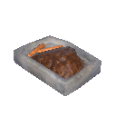|2afa348cdd6562e4d9427b518183bfb4|$item_pulledbear|Pulled Bear|Tender meat cooked for hours upon hours, until it practically falls apart.|<ul><li>1 Pulled Bear</li></ul>|Wood|Feasts|Food|
|QueensJam |2590ec40a50774f938d7d1f54d0ed54a|$item_queensjam|Queen's Jam|That classic tasty blend of raspberries and blueberries.|<ul><li>1 Queen's Jam</li></ul>|Wood|Feasts|Food|
|CarrotSoup |70c6897b051694e299261a1bf2b79bf6|$item_carrotsoup|Carrot Soup|A warm tasty soup made of mostly carrots.|<ul><li>1 Carrot Soup</li></ul>|Wood|Feasts|Food|
|DeerStew |dcfe096cbabc3c54589b7b1cee57d67a|$item_deerstew|Deer Stew|Fall-apart tender.|<ul><li>1 Deer Stew</li></ul>|Wood|Feasts|Food|
|MinceMeatSauce |82946e773075a9348b1f8a6d6438fa7f|$item_mincemeatsauce|Minced Meat Sauce|Chunks of goodness in a thick gravy.|<ul><li>1 Minced Meat Sauce</li></ul>|Wood|Feasts|Food|
|BoarJerky |18194663ced4bbe42ba2b755fe44a4f2|$item_boarjerky|Boar Jerky|Lean and salty.|<ul><li>1 Boar Jerky</li></ul>|Wood|Feasts|Food|
|FeastBlackforest |38d422c414096f146a80b9d7284040d8|$item_feastblackforest|Black Forest Buffet Platter|You won't be able to resist this platter of delights from the Black Forest! Venison sirloin steaks are served together with spiced thistles and carrots, and the whole meal is tied together with delicious jams. Just have one more bite!|<ul><li>1 Black Forest Buffet Platter</li></ul>|Wood|DeepNorth|Feasts|
|FishCooked |db3e079e90c464ee697420d194ce86e1|$item_fish_cooked|Cooked Fish|A tasty side of smoked fish.|<ul><li>1 Cooked Fish</li></ul>|Wood|Feasts|Food|
|ShocklateSmoothie |8b03e4f6f651da84391fc5f7718418c3|$item_shocklatesmoothie|Muckshake|Wakes you up!|<ul><li>1 Muckshake</li></ul>|Wood|Feasts|Food|
|BlackSoup |ed5ebb1d6549d0846a49f710bdac90e1|$item_blacksoup|Black Soup|A perfect balance of sweetness and acidity.|<ul><li>1 Black Soup</li></ul>|Wood|Feasts|Food|
|Sausages |d2be753a591a0421c8a204bec9064735|$item_sausages|Sausages|Links of savory, smoked meat.|<ul><li>1 Sausages</li></ul>|Wood|Feasts|Food|
|TurnipStew |75390d4070afa43a5b7a3e0eed7a7aa0|$item_turnipstew|Turnip Stew|Nutritious and restorative.|<ul><li>1 Turnip Stew</li></ul>|Wood|Feasts|Food|
|SerpentMeatCooked |9490ba534c0284d4d8dc520eba342370|$item_serpentmeatcooked|Cooked Serpent Meat|A cooked slice of sea serpent. Smells good.|<ul><li>1 Cooked Serpent Meat</li></ul>|Wood|Feasts|Food|
|SerpentStew |9ed5d9e264c4c4840bc09978b7ea8057|$item_serpentstew|Serpent Stew|Smells of honey and serpent...|<ul><li>1 Serpent Stew</li></ul>|Wood|Feasts|Food|
|FeastSwamps |bf977b83c23d5344c986bd6585f13e3e|$item_feastswamps|Swamp Dweller's Delight|Who knew that leeches were edible? With the correct preparation (lots of cooking and lots of seasoning) you will be able to serve them in this feast for the culinary brave. For those who have a sensitive stomach, there are also tasty skewers of sausages and turnips on the side.|<ul><li>1 Swamp Dweller's Delight</li></ul>|Wood|DeepNorth|Feasts|
|FeastOceans |dde589dd8a57ade44b2cc573898dd674|$item_feastoceans|Sailor's Bounty|Fish, fish, and more fish! And also serpent meat, cut to look like fish! Explore the flavours of the Ocean, along with some grilled greens for those still practicing their sea legs.|<ul><li>1 Sailor's Bounty</li></ul>|Wood|DeepNorth|Feasts|
|Onion |a8b660ca87d916540be290f39f8f0ac9|$item_onion|Onion|A crunchy and spicy taste.|<ul><li>1 Onion</li></ul>|Wood|Feasts|Food|
|CookedWolfMeat |899ba48391c77a140b1db11142d19593|$item_wolf_meat_cooked|Cooked Wolf Meat|A wild taste.|<ul><li>1 Cooked Wolf Meat</li></ul>|Wood|Feasts|Food|
|OnionSoup |7d0e0609cb6376f4d9579f08b4378a62|$item_onionsoup|Onion Soup|Deliciously rich.|<ul><li>1 Onion Soup</li></ul>|Wood|Feasts|Food|
|WolfMeatSkewer |04313b7934eaccd4aaff12e8d08886f7|$item_wolf_skewer|Wolf Skewer|Dripping with taste.|<ul><li>1 Wolf Skewer</li></ul>|Wood|Feasts|Food|
|Eyescream |56e913dddff620242a75fd1f9d0305f6|$item_eyescream|Eyescream|Crispy cool and creamy.|<ul><li>1 Eyescream</li></ul>|Wood|Feasts|Food|
|WolfJerky |19c2b6110d11b49489c6c366a2a21011|$item_wolfjerky|Wolf Jerky|Chewy and full of flavor.|<ul><li>1 Wolf Jerky</li></ul>|Wood|Feasts|Food|
|FeastMountains |cb68480f4b5f66d4dbda32c496a885be|$item_feastmountains|Hearty Mountain Logger's Stew|Gather around this steaming pot full of deliciousness and warm yourselves up again after a day out in the cold. The usually tough and chewey wolf meat has become tender enough to practically melt in your mouth, and the onions and carrots are made even tastier with exciting spices.|<ul><li>1 Hearty Mountain Logger's Stew</li></ul>|Wood|DeepNorth|Feasts|
|Cloudberry |e5976e7a821df4b60ae18f2609a42ba3|$item_cloudberries|Cloudberries|The gold of the forest.|<ul><li>1 Cloudberries</li></ul>|Wood|Feasts|Food|
|CookedEgg |8cb32b646b59626429259729d106fe2c|$item_egg_cooked|Cooked Egg|Sunny side up!|<ul><li>1 Cooked Egg</li></ul>|Wood|Feasts|Food|
|CookedChickenMeat |0dda1ef0e466a7a40a8da37ef9c58d62|$item_chicken_meat_cooked|Cooked Chicken Meat|It tastes like chicken.|<ul><li>1 Cooked Chicken Meat</li></ul>|Wood|Feasts|Food|
|CookedLoxMeat |d884967160e5046df8721d20c4456c81|$item_loxmeat_cooked|Cooked Lox Meat|A great hunk of tender meat, food fit for Valhalla!|<ul><li>1 Cooked Lox Meat</li></ul>|Wood|Feasts|Food|
|Bread |2fee923e08bd4408b81e6a502d2cad16|$item_bread|Bread|A tasty loaf of bread.|<ul><li>1 Bread</li></ul>|Wood|Feasts|Food|
|FishWraps |8f6025ebc8a304607b7992ccbb0863cb|$item_fishwraps|Fish Wraps|Bread and fish, what more to wish?|<ul><li>1 Fish Wraps</li></ul>|Wood|Feasts|Food|
|BloodPudding |7ab61fd34cba3429083bb343cbaa9cd0|$item_bloodpudding|Blood Pudding|It's bloody tasty.|<ul><li>1 Blood Pudding</li></ul>|Wood|Feasts|Food|
|LoxPie |6477d669541ef4347ae4529e76f20a0c|$item_loxpie|Lox Meat Pie|Break the crust to release a cloud of fragrant steam. Delicious!|<ul><li>1 Lox Meat Pie</li></ul>|Wood|Feasts|Food|
|VikingCupcake 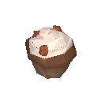|4fdd674b96a8a06419875951875bfbba|$item_vikingcupcake|Frosted Sweetbread|A sweet and tasty treat, to celebrate a feat!|<ul><li>1 Frosted Sweetbread</li></ul>|Wood|Feasts|Food|
|FeastPlains |7b2307dc21f78e74892016ec30e58c48|$item_feastplains|Plains Pie Picnic|There's nothing plain about this feast! Enjoy pies and loaves fresh from the oven, both sweet and savoury, and experience the culinary equivalent of a hug.|<ul><li>1 Plains Pie Picnic</li></ul>|Wood|DeepNorth|Feasts|
|RoyalJelly |fe720b2c795ba9747bdb5bfc17575eab|$item_royaljelly|Royal Jelly|Jelly fit for kings and queens.|<ul><li>1 Royal Jelly</li></ul>|Wood|Feasts|Food|
|MushroomMagecap |3bf986cd4fea2e04889ccf6602960fb6|$item_magecap|Magecap|A mushroom commonly used in a sorcerer's diet.|<ul><li>1 Magecap</li></ul>|Wood|Feasts|Food|
|MushroomJotunPuffs |769484eb4b3ae5e489cadcdd08397b29|$item_jotunpuffs|Jotun Puffs|An invigorating mushroom that can be used for cooking.|<ul><li>1 Jotun Puffs</li></ul>|Wood|Feasts|Food|
|CookedHareMeat |b8affeec3ffcb554698306b767d545d7|$item_hare_meat_cooked|Cooked Hare Meat|Stringy but flavorful.|<ul><li>1 Cooked Hare Meat</li></ul>|Wood|Feasts|Food|
|CookedBugMeat |148ebe0b336e15344b7acbd2441c1490|$item_bug_meat_cooked|Cooked Seeker Meat|Succulent white meat. A true delicacy.|<ul><li>1 Cooked Seeker Meat</li></ul>|Wood|Feasts|Food|
|Salad |e919c52f7ff11c94dac6914e1803f169|$item_salad|Salad|Fresh, crisp leaves.|<ul><li>1 Salad</li></ul>|Wood|Feasts|Food|
|MagicallyStuffedShroom |5db00dcb25c30794bbf609e9dc054441|$item_magicallystuffedmushroom|Stuffed Mushroom|Bursting with magical flavour.|<ul><li>1 Stuffed Mushroom</li></ul>|Wood|Feasts|Food|
|MushroomOmelette |80c0bada5ebea47469d1de2b028a411a|$item_mushroomomelette|Mushroom Omelette|A delicious omelette with an earthy aftertaste.|<ul><li>1 Mushroom Omelette</li></ul>|Wood|Feasts|Food|
|YggdrasilPorridge |2cebcd97ef6ce514caa81ca8685a0d8e|$item_yggdrasilporridge|Yggdrasil Porridge|Made with sap from the great tree. Even a mouthful imparts a warm glow to your whole body.|<ul><li>1 Yggdrasil Porridge</li></ul>|Wood|Feasts|Food|
|MisthareSupreme |0475aca35086dcf48a539f28c80e3218|$item_mistharesupreme|Misthare Supreme|One of life's Great Pleasures.|<ul><li>1 Misthare Supreme</li></ul>|Wood|Feasts|Food|
|SeekerAspic |00e47e8d1a44c5f408dd009876884fc9|$item_seekeraspic|Seeker Aspic|A quivering jelly with a taste like gentle electricity.|<ul><li>1 Seeker Aspic</li></ul>|Wood|Feasts|Food|
|FishAndBread |1ca0dc7c08027624cba437830b37dd2c|$item_fishandbread|Fish 'n' Bread|Bounty from both land and sea.|<ul><li>1 Fish 'n' Bread</li></ul>|Wood|Feasts|Food|
|MeatPlatter |1476c34e4444502459002279b96d45e9|$item_meatplatter|Meat Platter|Battle fuel.|<ul><li>1 Meat Platter</li></ul>|Wood|Feasts|Food|
|HoneyGlazedChicken |6378e41b996d3034da57eb410b5a389b|$item_honeyglazedchicken|Honey Glazed Chicken|Grilled to perfection. Makes both eyes and mouths water.|<ul><li>1 Honey Glazed Chicken</li></ul>|Wood|Feasts|Food|
|FeastMistlands |e869ee53dda18ad48b5090f7d1f77b06|$item_feastmistlands|Mushrooms Galore  la Mistlands|The time has come for mushroom enthusiasts to rejoice! Try different kinds of mushrooms, mushroom marinated seeker meat and mushroom-filled misthare, and don't miss out on the tasty sap dressing.|<ul><li>1 Mushrooms Galore  la Mistlands</li></ul>|Wood|DeepNorth|Feasts|
|MushroomSmokePuff |c9a2f515111bdb64a929f5d66cf2590d|$item_smokepuff|Smoke Puff|Hopefully it tastes better after cooking.|<ul><li>1 Smoke Puff</li></ul>|Wood|Feasts|Food|
|Fiddleheadfern |75e2b6e3f2f9e19418f5770108f4eed1|$item_fiddleheadfern|Fiddlehead|Veggies with a twist!|<ul><li>1 Fiddlehead</li></ul>|Wood|Feasts|Food|
|Vineberry |5e09353d3c6ec7d46a2f4658ac336db8|$item_vineberry|Vineberry Cluster|These juicy berries are both sour and sweet.|<ul><li>1 Vineberry Cluster</li></ul>|Wood|Feasts|Food|
|CookedAsksvinMeat |ff8bde0f9de82a9488c43593b6fc60de|$item_asksvin_meat_cooked|Cooked Asksvin Tail|This meat has a potent and mature flavour, but is very tasty when grilled right.|<ul><li>1 Cooked Asksvin Tail</li></ul>|Wood|Feasts|Food|
|CookedVoltureMeat |427f6415ea0a9bf46ab6735a03f69325|$item_volture_meat_cooked|Cooked Volture Meat|A chewy and somewhat dry meat. Some seasoning would probably make it taste better, but it'll fill your stomach regardless.|<ul><li>1 Cooked Volture Meat</li></ul>|Wood|Feasts|Food|
|CookedBoneMawSerpentMeat |7f9c751e9667df443b25f401d3797611|$item_bonemawmeat_cooked|Cooked Bonemaw Meat|The boiling sea did nothing to this meat, but grilling it over the fire has given it a delightful crisp.|<ul><li>1 Cooked Bonemaw Meat</li></ul>|Wood|Feasts|Food|
|FierySvinstew |f30b7b6fcc59b5e4ea9a2b9b6a906a8e|$item_fierysvinstew|Fiery Svinstew|This musty stew is a necessity on every adventurer's menu.|<ul><li>1 Fiery Svinstew</li></ul>|Wood|Feasts|Food|
|SpicyMarmalade |07240f969144d7f4bb36384d96815054|$item_spicymarmalade|Spicy Marmalade|Sugary honey perfectly balanced with tangy fronds and tart berries.|<ul><li>1 Spicy Marmalade</li></ul>|Wood|Feasts|Food|
|ScorchingMedley |7331d1f5221fa1442a41ad11a679ee04|$item_scorchingmedley|Scorching Medley|A varied diet is important, so why not try this vegetarian option?|<ul><li>1 Scorching Medley</li></ul>|Wood|Feasts|Food|
|MashedMeat |5574990d679e17f4bbffe0f33d2d27e2|$item_mashedmeat|Mashed Meat|Leftover meat can actually be pretty tasty if you just mash it right!|<ul><li>1 Mashed Meat</li></ul>|Wood|Feasts|Food|
|SizzlingBerryBroth |d03de4b118fc34f428c9ca087d5b9064|$item_sizzlingberrybroth|Sizzling Berry Broth|This soup settles in your stomach with an almost tingly sensation.|<ul><li>1 Sizzling Berry Broth</li></ul>|Wood|Feasts|Food|
|SparklingShroomshake |6560b775eb4e6624ea5d58ed2f2e14ee|$item_sparklingshroomshake|Sparkling Shroomshake|Perhaps it's not the best flavour to start the day with, but it will give you the boost you need.|<ul><li>1 Sparkling Shroomshake</li></ul>|Wood|Feasts|Food|
|PiquantPie |0a59aef8f06faaa4fad60da7badf868e|$item_piquantpie|Piquant Pie|It takes some time and effort to make this pie, but the taste is well worth it.|<ul><li>1 Piquant Pie</li></ul>|Wood|Feasts|Food|
|RoastedCrustPie |1bb14474c4189af449f4e4162d92e641|$item_roastedcrustpie|Roasted Crust Pie|This dessert keeps you going all day long.|<ul><li>1 Roasted Crust Pie</li></ul>|Wood|Feasts|Food|
|MarinatedGreens |d2a47fb78d8cd65429c95c9da0fcc054|$item_marinatedgreens|Marinated Greens|It's spicy, it's chewy, it's sweet This mad dish tickles your tongue as well as your mind.|<ul><li>1 Marinated Greens</li></ul>|Wood|Feasts|Food|
|FeastAshlands |d3cb76c4fb6194049ab7bb687a06d7b4|$item_feastashlands|Ashlands Gourmet Bowl|It's hard to tell whether the steam coming off of this dish is because it's freshly cooked or because of the asksvin meat in it. Either way, the spiced meat together with the vineberries and fiddlehead sprouts is so delicious that it doesn't matter!|<ul><li>1 Ashlands Gourmet Bowl</li></ul>|Wood|DeepNorth|Feasts|
|Kale 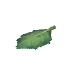|e7abcbe6aeffd7c42b66abd850becf87|$item_kale|Kale|A versatile leafy green.|<ul><li>1 Kale</li></ul>|Wood|Feasts|Food|
|Lingonberry |aa21ecfc3b8f1cc41859a473188d2d69|$item_lingonberries|Lingonberries|NULL|<ul><li>1 Lingonberries</li></ul>|Wood|Feasts|Food|
|Oat 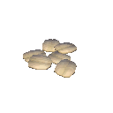|66d1917a0127d1345b06a2b380f1d412|$item_oat|Oats|Tasty grains, to be used as they are or to be ground into flour.|<ul><li>1 Oats</li></ul>|Wood|Feasts|Food|
|Poteitr 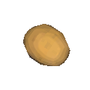|650bebb1eb8b3d44482c89f9fc74da85|$item_poteitr|Poteitr|The possibilities are practically endless. Who wouldn't want a taste?|<ul><li>1 Poteitr</li></ul>|Wood|Feasts|Food|
|CookedSealBlubber 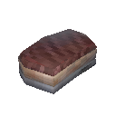|c547e53b1ff7c4149808dc3c5b7b6b96|$item_blubber_cooked|Cooked Seal Blubber|A chewy meat, with an aftertaste of remorse.|<ul><li>1 Cooked Seal Blubber</li></ul>|Wood|Feasts|Food|
|CookedMooseMeat 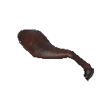|a8d52200e5b23c54694ebbf46265ec0a|$item_moose_meat_cooked|Cooked Moose Meat|This meat is lean yet full of flavour.|<ul><li>1 Cooked Moose Meat</li></ul>|Wood|Feasts|Food|
|KaleChips 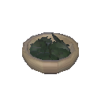|73f922eba326710418fb8cc4955b9ca9|$item_kalechips|Kale Chips|Crispy greens!|<ul><li>1 Kale Chips</li></ul>|Wood|Feasts|Food|
|BakedPoteitr 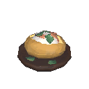|b2b583857a268ee428f430620310438e|$item_bakedpoteitr|Baked Poteitr|Neither boiled nor mashed nor in a stew. Still delicious though!|<ul><li>1 Baked Poteitr</li></ul>|Wood|Feasts|Food|
|OatMilk 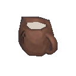|55c4bdf77ccf1a249963cb1598d277dc|$item_oatmilk|Oat Milk|Tastes like innovation.|<ul><li>1 Oat Milk</li></ul>|Wood|Feasts|Food|
|Lingondricka 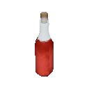|d031495318f148a428f5c24db702fc91|$item_lingondricka|Lingonberry Juice|Pairs well with most foods.|<ul><li>1 Lingonberry Juice</li></ul>|Wood|Feasts|Food|
|SmokedMooseMeat 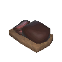|802b2148432978f439b521918cc96a88|$item_smokedmoosemeat|Smoked Moose Meat|The smoke only adds to the wild flavour.|<ul><li>1 Smoked Moose Meat</li></ul>|Wood|Feasts|Food|
|SmokedFish 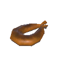|dd13800067cb96f41988ea7e08a17551|$item_smokedfish|Smoked Fish|Fish prepared in the most delicious way.|<ul><li>1 Smoked Fish</li></ul>|Wood|Feasts|Food|
|MeatballsMashedPoteitr 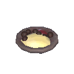|d381c137d23365f4285bfb67e0ea5913|$item_meatballsmashedpoteitr|Meatballs and Poteitr|It doesn't get more iconic than this!|<ul><li>1 Meatballs and Poteitr</li></ul>|Wood|Feasts|Food|
|MooseKebab 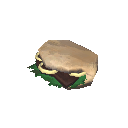|55156ef9b9d7de441a4fb0ce5349f0cd|$item_moosekebab|Meat In Bread|A convenient meal, often favoured by travelling merchants.|<ul><li>1 Meat In Bread</li></ul>|Wood|Feasts|Food|
|FishSoup 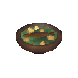|5b50bd17972a6804abf816ff535844a9|$item_fishsoup|Fish Soup|Swimming with flavour!|<ul><li>1 Fish Soup</li></ul>|Wood|Feasts|Food|
|SealSoup 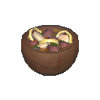|c4cf58f33d97eae4387cf9f512b6d259|$item_sealsoup|Seal Meat Soup|A warm and tasty meal, best enjoyed on a cold day.|<ul><li>1 Seal Meat Soup</li></ul>|Wood|Feasts|Food|
|OatmealLingonberryJam 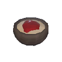|8a0fd313edcda374d9b73e8b628fb972|$item_oatmeallingonberryjam|Oatmeal|Served with a generous helping of lingonberry jam.|<ul><li>1 Oatmeal</li></ul>|Wood|Feasts|Food|
|Pancakes 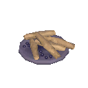|d5bc1850f78419e4691eee44d94cec31|$item_pancakes|Pancakes|Was there ever a more comforting food?|<ul><li>1 Pancakes</li></ul>|Wood|Feasts|Food|
|OvenPancake 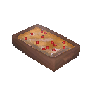|7dd7bce5b97932544827f41370eb7405|$item_ovenpancake|Oven Pancake|Warm and fluffy.|<ul><li>1 Oven Pancake</li></ul>|Wood|Feasts|Food|
|FeastDeepNorth 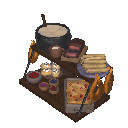|44c3373a11af0d141aeaa30161ecdbe0|$item_feastdeepnorth|Northern Morning Fare|Warming and filling, this meal will sustain you even during the coldest of days. Porridge and pancakes pair well with jams and sausages, making it hard not to come back for a second helping!|<ul><li>1 Northern Morning Fare</li></ul>|Wood|DeepNorth|Feasts|
|Pukeberries |1d1668c1c9c2c9224941a96df6751507|$item_pukeberries|Bukeperries|Allows the consumer to quickly evacuate any misplaced meal and start anew.|<ul><li>1 Bukeperries</li></ul>|Wood|Feasts|Misc.|
|MushroomBzerker |8e9afe44a064c7e4ea30db062437a4ae|$item_mushroom_bzerker|Toadstool|Some say you can eat everything you find in the forest. That is not the case with this mushroom.|<ul><li>1 Toadstool</li></ul>|Wood|Feasts|Misc.|
|RottenMeat 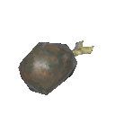|06b36c9c00865d147b7a4cde4e351acf|$item_meat_rotten|Rotten Meat|There are maggots crawling in the meat. It smells awful.|<ul><li>1 Rotten Meat</li></ul>|Wood|Feasts|Misc.|
|MeadTasty |9e70bcaea0f3f4cd6a9dd32763ea0101|$item_mead_tasty|Tasty Mead|The nectar of the Gods, divine mead.|<ul><li>1 Tasty Mead</li></ul>|Wood|Food|Mead|
|MeadHealthMinor |1cf0c7a0a15614baba7de85b967e6e55|$item_mead_hp_minor|Minor Healing Mead|Restores health.|<ul><li>1 Minor Healing Mead</li></ul>|Wood|Food|Mead|
|MeadHealthMedium |1f6469092ba491c468f8d5f21837cf13|$item_mead_hp_medium|Medium Healing Mead|Restores health.|<ul><li>1 Medium Healing Mead</li></ul>|Wood|Food|Mead|
|MeadHealthMajor |5d4f3e6f1eaf9394b8687d97b0b659b2|$item_mead_hp_major|Major Healing Mead|Restores health.|<ul><li>1 Major Healing Mead</li></ul>|Wood|Food|Mead|
|MeadHealthLingering |acc917fd2c5716147933dcddf75c241b|$item_mead_hp_lingering|Lingering Healing Mead|Increases health regeneration.|<ul><li>1 Lingering Healing Mead</li></ul>|Wood|Food|Mead|
|MeadStaminaMinor |fc200fef828264ae1b34bad23f8aa0d1|$item_mead_stamina_minor|Minor Stamina Mead|Restores stamina.|<ul><li>1 Minor Stamina Mead</li></ul>|Wood|Food|Mead|
|MeadStaminaMedium |706f96040e6244411afad3734200bfed|$item_mead_stamina_medium|Medium Stamina Mead|Restores stamina.|<ul><li>1 Medium Stamina Mead</li></ul>|Wood|Food|Mead|
|MeadStaminaLingering |03a3ede695bad0647a0bd233469c2630|$item_mead_stamina_lingering|Lingering Stamina Mead|Increases stamina regeneration.|<ul><li>1 Lingering Stamina Mead</li></ul>|Wood|Food|Mead|
|MeadEitrMinor |03eb31e34b7f4bb43984ed605051d44c|$item_mead_eitr_minor|Minor Eitr Mead|Restores eitr.|<ul><li>1 Minor Eitr Mead</li></ul>|Wood|Food|Mead|
|MeadEitrLingering |a858b071ffaf6b44196a874cb7170ea8|$item_mead_eitr_lingering|Lingering Eitr Mead|Increases eitr regeneration.|<ul><li>1 Lingering Eitr Mead</li></ul>|Wood|Food|Mead|
|MeadPoisonResist |7d09608fba9a8da4686261f1b1d7db78|$item_mead_poisonres|Poison Resistance Mead|Fortifies you against poison.|<ul><li>1 Poison Resistance Mead</li></ul>|Wood|Food|Mead|
|MeadFrostResist |03576871d65a3f84186922bc30ae9e2f|$item_mead_frostres|Frost Resistance Mead|Protects against the cold.|<ul><li>1 Frost Resistance Mead</li></ul>|Wood|Food|Mead|
|BarleyWine |eaef91dd432704e439143fae9f798069|$item_barleywine|Fire Resistance Barley Wine|Fortifies you against fire.|<ul><li>1 Fire Resistance Barley Wine</li></ul>|Wood|Food|Mead|
|MeadBzerker |56eb520a91c03494fabfca8c31b296e0|$item_mead_bzerker|Berserkir Mead|Something poisonous stirs within, brewed to the point where its potential can finally be harnessed. But be careful to let the beast out...|<ul><li>1 Berserkir Mead</li></ul>|Wood|Food|Mead|
|MeadHasty |5586c733e7da3444180ec36d23905150|$item_mead_hasty|Tonic of Ratatosk|The squirrel must be quick on its feet as it runs up and down the trunk of the world tree. Although it no longer visits Valheim, there are still those who remember it...|<ul><li>1 Tonic of Ratatosk</li></ul>|Wood|Food|Mead|
|MeadSwimmer |bac2ef570d1b13c4e8ce3da040c40726|$item_mead_swimmer|Draught of Vananidir|You feel invigorated just by holding this, as the ocean beckons you to come for a swim.|<ul><li>1 Draught of Vananidir</li></ul>|Wood|Food|Mead|
|MeadLightfoot |45998809279459b48b692279096dbd53|$item_mead_lightfoot|Lightfoot Mead|This bottle is full, yet it feels like it weighs almost nothing at all.|<ul><li>1 Lightfoot Mead</li></ul>|Wood|Food|Mead|
|MeadStrength |41905d3e487ebc94ab116eb7b79ea56a|$item_mead_strength|Mead of Troll Endurance|What creature can carry more than a troll? Why, a viking with this drink of course!|<ul><li>1 Mead of Troll Endurance</li></ul>|Wood|Food|Mead|
|MeadTamer |73b9e9d7c7de3f4488d805d99175f4dd|$item_mead_tamer|Brew of Animal Whispers|It smells like a pigsty. Likely the taste won't be much better.|<ul><li>1 Brew of Animal Whispers</li></ul>|Wood|Food|Mead|
|MeadBugRepellent |d5f250eae275de84eb83f703aefd1505|$item_mead_bugrepellent|Anti-Sting Concoction|The perfect drink for a day in the Plains.|<ul><li>1 Anti-Sting Concoction</li></ul>|Wood|Food|Mead|
|MeadTrollPheromones |ab5816cb4db26c3458029ee373de088a|$item_mead_trollpheromones|Love Potion|An intense musk permeates the air around this bottle.|<ul><li>1 Love Potion</li></ul>|Wood|Food|Mead|
## _HammerPieceTable

|Piece |AssetID |Token |English Name |Description |Resources required |Material Type |Piece Category |Hammer Categories |
|---|---|---|---|---|---|---|---|---|
|piece_repair|06ed17b6ce7cb42f49a55dab65785dbf|$piece_repair|Repair|NULL|<ul></ul>||All|Misc.|
|wood_wall_quarter |0f9a144fd75eb3642978a731be001868|$piece_woodwallquarter|Wood Wall 1x1|Walls are an important part of any house!|<ul><li>1 Wood</li></ul>|Wood|BuildingWorkbench|Building, Walls|
|wood_wall_half |4315c89c7b4bf47c4b68a632376e18d7|$piece_woodwallhalf|Wood Wall Half|Walls are an important part of any house!|<ul><li>1 Wood</li></ul>|Wood|BuildingWorkbench|Building, Walls|
|woodwall |db8c0a09c92ce4027960ab22eaea05bb|$piece_woodwall|Wood Wall|Walls are an important part of any house!|<ul><li>2 Wood</li></ul>|Wood|BuildingWorkbench|Building, Walls|
|wood_wall_roof_a 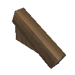|dc609c1ae07bd40439d5105e5b8d33c1|$piece_woodwallroof|Wood Wall 26|Walls are an important part of any house!|<ul><li>2 Wood</li></ul>|Wood|BuildingWorkbench|Building, Walls, Architecture|
|wood_wall_roof_45 |122b2b185bc524a818a4d9571d0ffea7|$piece_woodwallroof45|Wood Wall 45|Walls are an important part of any house!|<ul><li>2 Wood</li></ul>|Wood|BuildingWorkbench|Building, Walls, Architecture|
|wood_wall_roof_67_a 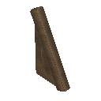|76c27bb762146e244ba1b1b288a3a90d|$piece_woodwallroof67|Wood Wall 67|Walls are an important part of any house!|<ul><li>2 Wood</li></ul>|Wood|DeepNorth|Building, Walls, Architecture|
|wood_wall_roof_upsidedown |773edddbef9c1744991cc679f437047c|$piece_woodwallroof_upsidedown|Wood Wall 26 (Inverted)|Walls are an important part of any house!|<ul><li>2 Wood</li></ul>|Wood|BuildingWorkbench|Building, Architecture|
|wood_wall_roof_45_upsidedown |90a879cf05bf2bb44952f3932778a421|$piece_woodwallroof45_upsidedown|Wood Wall 45 (Inverted)|Walls are an important part of any house!|<ul><li>2 Wood</li></ul>|Wood|BuildingWorkbench|Building, Walls, Architecture|
|wood_wall_roof_67_upsidedown 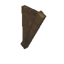|f82e3b8fe578f3742a10b5132c357b90|$piece_woodwallroof67upsidedown|Wood Wall 67 (Inverted)|Walls are an important part of any house!|<ul><li>2 Wood</li></ul>|Wood|DeepNorth|Building, Walls, Architecture|
|wood_floor_1x1 |159d6bdea9615485a8aa90f125502f21|$piece_woodfloor1x1|Wood Floor 1x1|A solid bit of wooden flooring.|<ul><li>1 Wood</li></ul>|Wood|BuildingWorkbench|Building, Flooring|
|wood_floor |a1d4de6f8ce364ab4a6085a2225b4669|$piece_woodfloor2x2|Wood Floor 2x2|A solid bit of wooden flooring.|<ul><li>2 Wood</li></ul>|Wood|BuildingWorkbench|Building, Flooring|
|wood_pole |7637dd4b012264b1bb317770a07f8692|$piece_woodpole|Wood Pole 1 m|A sturdy wooden support.|<ul><li>1 Wood</li></ul>|Wood|BuildingWorkbench|Building, Architecture|
|wood_pole2 |a9411625f489846e7b9c7091ecbf9784|$piece_woodpole2|Wood Pole 2 m|A sturdy wooden support.|<ul><li>2 Wood</li></ul>|Wood|BuildingWorkbench|Building, Architecture|
|wood_beam_1 |9741cd341b01d4e41b4bc1410e2b9b43|$piece_woodbeam1|Wood Beam 1 m|A sturdy wooden support.|<ul><li>1 Wood</li></ul>|Wood|BuildingWorkbench|Building, Architecture|
|wood_beam |113cd5ffbf7cdaf42be33bfc1e0845e4|$piece_woodbeam2|Wood Beam 2 m|A sturdy wooden support.|<ul><li>2 Wood</li></ul>|Wood|BuildingWorkbench|Building, Architecture|
|wood_beam_26 |b0a95388438d84e56b54d6e4e3761e60|$piece_woodbeam26|Wood Beam 26|A sturdy wooden support.|<ul><li>2 Wood</li></ul>|Wood|BuildingWorkbench|Building, Architecture|
|wood_beam_45 |aa897656e8ed44ccb8ed1198ec9b321b|$piece_woodbeam45|Wood Beam 45|A sturdy wooden support.|<ul><li>2 Wood</li></ul>|Wood|BuildingWorkbench|Building, Architecture|
|wood_beam_67 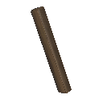|d1ee2259dc783664aacffd726f9f1658|$piece_woodbeam67|Wood Beam 67|A sturdy wooden support.|<ul><li>2 Wood</li></ul>|Wood|DeepNorth|Building, Architecture|
|wood_wall_roof_top |252678d24e3ac47c6b6098797b90b538|$piece_woodwallrooftop|Wood Roof Cross 26|A sturdy wooden support.|<ul><li>2 Wood</li></ul>|Wood|BuildingWorkbench|Building, Architecture|
|wood_wall_roof_top_45 |cb607c70601f9472e8b7fd56552cdd6b|$piece_woodwallrooftop45|Wood Roof Cross 45|A sturdy wooden support.|<ul><li>2 Wood</li></ul>|Wood|BuildingWorkbench|Building, Architecture|
|wood_wall_roof_top_67 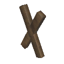|8df1ae4dfa168da4fb7a7a6aeed79f62|$piece_woodwallrooftop67|Wood Roof Cross 67|A sturdy wooden support.|<ul><li>2 Wood</li></ul>|Wood|DeepNorth|Building, Architecture|
|wood_roof |43698603b9a234f5987f762e1d1039b1|$piece_woodroof26|Thatch Roof 26|A simple roof to keep the rain out, built at a shallow angle.|<ul><li>2 Wood</li></ul>|Wood|BuildingWorkbench|Building, Roofing|
|wood_roof_45 |6ddadab83fdf743749a21df88fabed77|$piece_woodroof45|Thatch Roof 45|A simple roof to keep the rain out, with a steeper angle.|<ul><li>2 Wood</li></ul>|Wood|BuildingWorkbench|Building, Roofing|
|wood_roof_67 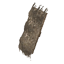|b4240c86efdc18c4ba3b04e995fca68e|$piece_woodroof67|Thatch Roof 67|A simple roof to keep the rain out, built at a very steep angle.|<ul><li>2 Wood</li></ul>|Wood|DeepNorth|Building, Roofing|
|wood_roof_icorner |f146b5c99f9cd4c0e8fcad5fd0fa4920|$piece_woodrooficorner|Thatch Roof Inner Corner 26|A simple roof to keep the rain out, built at a shallow angle.|<ul><li>2 Wood</li></ul>|Wood|BuildingWorkbench|Building, Roofing|
|wood_roof_icorner_45 |2a8e2516ff4b84194a117a9594dd31dc|$piece_woodrooficorner45|Thatch Roof Inner Corner 45|A simple roof to keep the rain out, with a steeper angle.|<ul><li>2 Wood</li></ul>|Wood|BuildingWorkbench|Building, Roofing|
|wood_roof_icorner_67 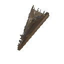|f706617d21cba924eae00c7e89bc9fdd|$piece_woodrooficorner67|Thatch Roof Inner Corner 67|A simple roof to keep the rain out, built at a very steep angle.|<ul><li>2 Wood</li></ul>|Wood|DeepNorth|Building, Roofing|
|wood_roof_ocorner |70b2b63e85ead4928b8078f6ea188615|$piece_woodroofocorner|Thatch Roof Outer Corner 26|A simple roof to keep the rain out, built at a shallow angle.|<ul><li>2 Wood</li></ul>|Wood|BuildingWorkbench|Building, Roofing|
|wood_roof_ocorner_45 |390a7480088494446a1718424dc3230e|$piece_woodroofocorner45|Thatch Roof Outer Corner 45|A simple roof to keep the rain out, with a steeper angle.|<ul><li>2 Wood</li></ul>|Wood|BuildingWorkbench|Building, Roofing|
|wood_roof_ocorner_67 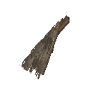|7175424cc35eb4642b908e3629a48a9d|$piece_woodroofocorner67|Thatch Roof Outer Corner 67|A simple roof to keep the rain out, built at a very steep angle.|<ul><li>2 Wood</li></ul>|Wood|DeepNorth|Building, Roofing|
|wood_roof_top |78f639c5704e94d598947881e1248499|$piece_woodrooftop|Thatch Roof Ridge 26|A simple roof to keep the rain out, built at a shallow angle.|<ul><li>2 Wood</li></ul>|Wood|BuildingWorkbench|Building, Roofing|
|wood_roof_top_45 |2267254e06be44e9eba2b2e540301384|$piece_woodrooftop45|Thatch Roof Ridge 45|A simple roof to keep the rain out, with a steeper angle.|<ul><li>2 Wood</li></ul>|Wood|BuildingWorkbench|Building, Roofing|
|wood_roof_top_67 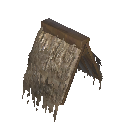|d04d597e9813abc4698f8d618bf2c8d4|$piece_woodrooftop67|Thatch Roof Ridge 67|A simple roof to keep the rain out, built at a very steep angle.|<ul><li>2 Wood</li></ul>|Wood|DeepNorth|Building, Roofing|
|wood_door |96a888350ec664e9da492f97b4388aec|$piece_wooddoor|Wood Door|A simple door for opening and closing.|<ul><li>4 Wood</li></ul>|Wood|BuildingWorkbench|Building, Doors and Windows|
|wood_gate |ce871db3a2b404c9a8d78c9c2e6e8210|$piece_woodgate|Wood Gate|A simple wooden gate. To use by itself or as part of a pair.|<ul><li>12 Wood</li></ul>|Wood|BuildingWorkbench|Building, Doors and Windows|
|wood_window |2344d23683154f647b065287b2c9b6d6|$piece_woodwindowshutter|Wood Shutter|Open or closed, keep it the way you prefer or switch things up whenever you feel like it!|<ul><li>4 Wood</li><li>2 Bronze Nails</li></ul>|Wood|BuildingWorkbench|Building, Doors and Windows|
|wood_dragon1 |87ed7bcd5c25a4ac8a6ab667957e0514|$piece_wooddragon|Wood Dragon Adornment|Make your home legendary by decorating it with a dragon.|<ul><li>10 Finewood</li></ul>|Wood|Misc|Building, Decor|
|wood_fence |22d1937325c4240f7b4a8c2c02f7a9f5|$piece_woodfence|Roundpole Fence|A good fence, for livestock and crops alike!|<ul><li>1 Wood</li></ul>|Wood|Misc|Misc., Walls|
|wood_fence_gate 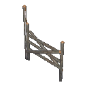|75305043e357e7d478698ad119b67558|$piece_woodfencegate|Roundpole Gate|A gate is far more practical than jumping over the fence every time.|<ul><li>4 Wood</li></ul>|Wood|Misc|Misc., Doors and Windows|
|stone_fence 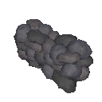|6ed604b883d40d94398f9c06482b0ff8|$piece_stonefence|Stone Fence|Stones carefully pieced together into a sturdy fence.|<ul><li>4 Stone</li></ul>|Stone|Misc|Misc., Walls|
|wood_stair |60a7c9362d3ee4b679430603641263ec|$piece_woodstair|Wood Stairs|Good for getting off the ground.|<ul><li>2 Wood</li></ul>|Wood|BuildingWorkbench|Building, Stairs|
|wood_stepladder |6291e84c015974d43a8100c315701f4e|$piece_woodstepladder|Wood Ladder|Convenient for climbing higher.|<ul><li>2 Wood</li></ul>|Wood|BuildingWorkbench|Building, Stairs|
|stake_wall |3ea4bf876e5194d54a90532e16ba8600|$piece_stakewall|Stakewall|Good for keeping intruders out.|<ul><li>4 Wood</li></ul>|Wood|Misc|Walls, Defence|
|piece_sharpstakes |16c816801eb59421093eb61a9b465344|$piece_sharpstakes|Sharp Stakes|If someone comes too close, they'll get poked.|<ul><li>6 Wood</li><li>4 Corewood</li></ul>|Wood|Misc|Defence|
|wood_pole_log |1d803e46e94c7024aac699f98294b653|$piece_logpole2|Log Pole 2 m|Support your constructions in this rustic style.|<ul><li>1 Corewood</li></ul>|HardWood|BuildingWorkbench|Building, Architecture|
|wood_pole_log_4 |c4c24451e194e4834b7a2604b52704da|$piece_logpole4|Log Pole 4 m|Support your constructions in this rustic style.|<ul><li>2 Corewood</li></ul>|HardWood|BuildingWorkbench|Building, Architecture|
|wood_wall_log |4ff55ea4a6ecf4093bcc6e2335195aa2|$piece_logbeam2|Log Beam 2 m|Support your constructions in this rustic style.|<ul><li>1 Corewood</li></ul>|HardWood|BuildingWorkbench|Building, Architecture|
|wood_wall_log_4x0.5 |4c71c657a53829448aac09db53da3b50|$piece_logbeam4|Log Beam 4 m|Support your constructions in this rustic style.|<ul><li>2 Corewood</li></ul>|HardWood|BuildingWorkbench|Building, Architecture|
|wood_log_26 |c78458c4f684f4b448fa4f4bd65190f8|$piece_woodlog26|Log Beam 26|Support your constructions in this rustic style.|<ul><li>2 Corewood</li></ul>|HardWood|BuildingWorkbench|Building, Architecture|
|wood_log_45 |89012f90c5d4c904795ebe367defa894|$piece_woodlog45|Log Beam 45|Support your constructions in this rustic style.|<ul><li>2 Corewood</li></ul>|HardWood|BuildingWorkbench|Building, Architecture|
|wood_log_67 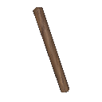|80906c955a03dc14098d7578e276d1e5|$piece_woodlog67|Log Beam 67|Support your constructions in this rustic style.|<ul><li>2 Corewood</li></ul>|HardWood|BuildingWorkbench|Building, Architecture|
|stone_wall_1x1 |b34c3e5b5f966482eac44bbc2fe7eedf|$piece_stonewall1x1|Stone Wall 1x1|A roughly hewn block of stone.|<ul><li>3 Stone</li></ul>|Stone|BuildingStonecutter|Building, Walls, Architecture|
|stone_wall_2x1 |30d8ded92eca649c4b4428f26371a4f2|$piece_stonewall2x1|Stone Wall 2x1|A roughly hewn block of stone.|<ul><li>4 Stone</li></ul>|Stone|BuildingStonecutter|Building, Walls|
|stone_wall_4x2 |5a0d9f5cab0764652aa173418dfc20ef|$piece_stonewall4x2|Stone Wall 4x2|A roughly hewn block of stone.|<ul><li>6 Stone</li></ul>|Stone|BuildingStonecutter|Building, Walls|
|stone_floor_2x2 |1064a57c1d3ae4c90a65adc981ea3b2a|$piece_stonefloor2x2|Stone Floor 2x2|Best to put a rug on it, or it might get cold!|<ul><li>6 Stone</li></ul>|Stone|BuildingStonecutter|Building, Flooring|
|stone_pillar |afbb2f91bc6f7428ba6f4ab25725531e|$piece_stonepillar|Stone Pillar|Stable as a rock.|<ul><li>5 Stone</li></ul>|Stone|BuildingStonecutter|Building, Architecture|
|stone_arch |525ee4d5e79044161bfa09463eb9e008|$piece_stonearch|Stone Arch|Stable as a rock.|<ul><li>4 Stone</li></ul>|Stone|BuildingStonecutter|Building, Architecture|
|stone_stair |5f9dc6ce6dfb04c40914c6c85fd75c8a|$piece_stonestair|Stone Stair|Useful for getting around in a large fortress.|<ul><li>8 Stone</li></ul>|Stone|BuildingStonecutter|Building, Stairs|
|woodiron_pole |46b22acb75e0d42c895c4f4aec0aee34|$piece_woodironpole|Wood Iron Pole|The strongest support you've ever built.|<ul><li>2 Wood</li><li>1 Iron</li></ul>|Iron|BuildingWorkbench|Building, Architecture|
|woodiron_beam |e542b4adb8edc444a8bfb9e139c708ad|$piece_woodironbeam|Wood Iron Beam|The strongest support you've ever built.|<ul><li>2 Wood</li><li>1 Iron</li></ul>|Iron|BuildingWorkbench|Building, Architecture|
|woodiron_beam_26 |17cf80814a016804083755547f79f8ce|$piece_woodironbeam_26|Wood Iron Beam 26|The strongest support you've ever built.|<ul><li>2 Wood</li><li>1 Iron</li></ul>|Iron|BuildingWorkbench|Building, Architecture|
|woodiron_beam_45 |cc3ea3879286df23ba99f39ec21d16e2|$piece_woodironbeam_45|Wood Iron Beam 45|The strongest support you've ever built.|<ul><li>2 Wood</li><li>1 Iron</li></ul>|Iron|BuildingWorkbench|Building, Architecture|
|woodiron_beam_67 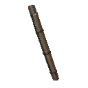|82e6c8bf85244ae4385711d53224d0eb|$piece_ironwoodbeam67|Wood Iron Beam 67|The strongest support you've ever built.|<ul><li>2 Wood</li><li>1 Iron</li></ul>|Iron|BuildingWorkbench|Building, Architecture|
|iron_floor_1x1_v2 |bf90d383a1042764bbec4b75cfddbd12|$piece_ironfloorSmall|Cage Floor 1x1|Finely crafted iron bars, sure to be rattle-proof!|<ul><li>1 Iron</li></ul>|Iron|BuildingStonecutter|Building, Flooring|
|iron_floor_2x2 |13049d9491a3c6346ac4646a19c2e9fe|$piece_ironfloor|Cage Floor 2x2|Finely crafted iron bars, sure to be rattle-proof!|<ul><li>2 Iron</li></ul>|Iron|BuildingStonecutter|Building, Flooring|
|iron_wall_1x1 |a9ad95bd792fc2740b58b4408d5176a8|$piece_ironwallSmall|Cage Wall 1x1|Finely crafted iron bars, sure to be rattle-proof!|<ul><li>1 Iron</li></ul>|Iron|BuildingStonecutter|Building, Walls|
|iron_wall_2x2 |7e11d794297bcf94c8ce8ec4267f4822|$piece_ironwall|Cage Wall 2x2|Finely crafted iron bars, sure to be rattle-proof!|<ul><li>2 Iron</li></ul>|Iron|BuildingStonecutter|Building, Walls|
|iron_grate |6597169c5c172455cb67886a7cd28a9b|$piece_irongate|Iron Gate|A very important gate.|<ul><li>4 Iron</li></ul>|Iron|BuildingStonecutter|Building, Doors and Windows|
|darkwood_decowall |b51946089f078f749a886fcfe7bb9152|$piece_darkwooddecowall|Carved Darkwood Divider|An elegant design for decorating your home, and for keeping prying eyes away.|<ul><li>2 Finewood</li><li>1 Tar</li></ul>|Wood|BuildingWorkbench|Building, Walls, Decor|
|darkwood_pole |e72e7da7abf0e924dbf482951015afb2|$piece_darkwoodpole|Darkwood Pole 2m|Intricate designs run along this support structure.|<ul><li>2 Wood</li><li>1 Tar</li></ul>|Wood|BuildingWorkbench|Building, Architecture|
|darkwood_pole4 |8a1882a138e5f5b42b0b5631ed2c65e8|$piece_darkwoodpole4|Darkwood Pole 4m|Intricate designs run along this support structure.|<ul><li>4 Wood</li><li>1 Tar</li></ul>|Wood|BuildingWorkbench|Building, Architecture|
|darkwood_beam |d3bfcabb00ff8b546b08842c97fe0b72|$piece_darkwoodbeam|Darkwood Beam 2 m|Intricate designs run along this support structure.|<ul><li>2 Wood</li><li>1 Tar</li></ul>|Wood|BuildingWorkbench|Building, Architecture|
|darkwood_beam4x4 |7c2e192c0277e544a8208214e32c8622|$piece_darkwoodbeam4|Darkwood Beam 4 m|Intricate designs run along this support structure.|<ul><li>4 Wood</li><li>1 Tar</li></ul>|Wood|BuildingWorkbench|Building, Architecture|
|darkwood_beam_26 |17716acd0f2c2c17094d8af52019ff03|$piece_darkwoodbeam_26|Darkwood Beam 26|Intricate designs run along this support structure.|<ul><li>2 Wood</li><li>1 Tar</li></ul>|Wood|BuildingWorkbench|Building, Architecture|
|darkwood_beam_45 |f7593e88471908c458aebe29052d7d6d|$piece_darkwoodbeam_45|Darkwood Beam 45|Intricate designs run along this support structure.|<ul><li>2 Wood</li><li>1 Tar</li></ul>|Wood|BuildingWorkbench|Building, Architecture|
|darkwood_beam_67 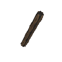|52a6dfbc3cbcc3b438a155f9443e4559|$piece_darkwoodbeam67|[piece_darkwoodbeam67]|Intricate designs run along this support structure.|<ul><li>2 Wood</li><li>1 Tar</li></ul>|Wood|DeepNorth|Building, Architecture|
|darkwood_arch |55e0e79db6106da49a2ec46bb9fd5f5c|$piece_darkwoodarch|Darkwood Arch|Intricate designs run along this support structure.|<ul><li>2 Wood</li><li>1 Tar</li></ul>|Wood|BuildingWorkbench|Building, Architecture|
|darkwood_roof |4444eb7410b01d7459f5a979773b698e|$piece_darkwoodroof26|Shingle Roof 26|This shallow roof is sure to keep the rain out, and look good doing it.|<ul><li>2 Wood</li><li>1 Tar</li></ul>|Wood|BuildingWorkbench|Building, Roofing|
|darkwood_roof_45 |0a0964dc9a88c994b9ff687fafbf8e0e|$piece_darkwoodroof45|Shingle Roof 45|This steeper roof is sure to keep the rain out, and look good doing it.|<ul><li>2 Wood</li><li>1 Tar</li></ul>|Wood|BuildingWorkbench|Building, Roofing|
|darkwood_roof_67 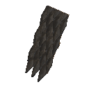|cd0da6327ec0b994687011712ea20206|$piece_darkwoodroof67|Shingle Roof 67|This very steep roof is sure to keep the rain out, and look good doing it.|<ul><li>2 Wood</li><li>1 Tar</li></ul>|Wood|DeepNorth|Building, Roofing|
|darkwood_roof_icorner |aaa57acf8990e684da6ec813d470cebe|$piece_darkwoodrooficorner|Shingle Roof Inner Corner 26|This shallow roof is sure to keep the rain out, and look good doing it.|<ul><li>2 Wood</li><li>1 Tar</li></ul>|Wood|BuildingWorkbench|Building, Roofing|
|darkwood_roof_icorner_45 |53685bbf3fc8010439103108efbcee22|$piece_darkwoodrooficorner45|Shingle Roof Inner Corner 45|This steeper roof is sure to keep the rain out, and look good doing it.|<ul><li>2 Wood</li><li>1 Tar</li></ul>|Wood|BuildingWorkbench|Building, Roofing|
|darkwood_roof_icorner_67 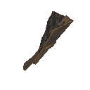|be4c7713903be524ba59ca3949273cfc|$piece_darkwoodrooficorner67|Shingle Roof Inner Corner 67|This very steep roof is sure to keep the rain out, and look good doing it.|<ul><li>2 Wood</li><li>1 Tar</li></ul>|Wood|DeepNorth|Building, Roofing|
|darkwood_roof_ocorner |37c849834db8abe48a81a0679636940e|$piece_darkwoodroofocorner|Shingle Roof Outer Corner 26|This shallow roof is sure to keep the rain out, and look good doing it.|<ul><li>2 Wood</li><li>1 Tar</li></ul>|Wood|BuildingWorkbench|Building, Roofing|
|darkwood_roof_ocorner_45 |4e7002813a59b9b4b99b43e06869a727|$piece_darkwoodroofocorner45|Shingle Roof Outer Corner 45|This steeper roof is sure to keep the rain out, and look good doing it.|<ul><li>2 Wood</li><li>1 Tar</li></ul>|Wood|BuildingWorkbench|Building, Roofing|
|darkwood_roof_ocorner_67 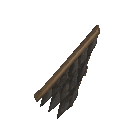|34f93e87947506d46b6ba3a3b639466e|$piece_darkwoodroofocorner67|Shingle Roof Outer Corner 67|This very steep roof is sure to keep the rain out, and look good doing it.|<ul><li>2 Wood</li><li>1 Tar</li></ul>|Wood|DeepNorth|Building, Roofing|
|darkwood_roof_top |9c8f8b60ccee02f44a0d22e72aed84cf|$piece_darkwoodrooftop|Shingle Roof Ridge 26|This shallow roof is sure to keep the rain out, and look good doing it.|<ul><li>2 Wood</li><li>1 Tar</li></ul>|Wood|BuildingWorkbench|Building, Roofing|
|darkwood_roof_top_45 |d7c2cc0f3c533924180a2f9628f6c7ae|$piece_darkwoodrooftop45|Shingle Roof Ridge 45|This steeper roof is sure to keep the rain out, and look good doing it.|<ul><li>2 Wood</li><li>1 Tar</li></ul>|Wood|BuildingWorkbench|Building, Roofing|
|darkwood_roof_top_67 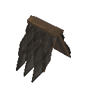|27b49109ed5a826458964f3c1e79f9c2|$piece_darkwoodrooftop67|Shingle Roof Ridge 67|This very steep roof is sure to keep the rain out, and look good doing it.|<ul><li>2 Wood</li><li>1 Tar</li></ul>|Wood|DeepNorth|Building, Roofing|
|darkwood_gate |511312a0462cbf7f99500ffb7b13cb3d|$piece_darkwoodgate|Darkwood Gate|A fancy and sturdy gate. To use by itself or as part of a pair.|<ul><li>16 Wood</li><li>4 Iron</li><li>2 Tar</li></ul>|HardWood|BuildingWorkbench|Building, Walls, Doors and Windows|
|darkwood_raven |839b948e1f4c4f94c9127cb28c4de58e|$piece_darkwoodraven|Raven Adornment|The ravens are trusted companions of the Allfather, of course you would want one in your home as well.|<ul><li>10 Finewood</li><li>1 Tar</li></ul>|Wood|Misc|Building, Decor|
|darkwood_wolf |7bbf246140040a04ca31e78ca7cb34e2|$piece_darkwoodwolf|Wolf Adornment|Wolves are pack animals, but this one seems happy enough by itself.|<ul><li>10 Finewood</li><li>1 Tar</li></ul>|Wood|Misc|Building, Decor|
|blackmarble_1x1 |88ef9df01ec464582b055b39ed9daf2c|$piece_blackmarble1x1|Black Marble 1x1x1|A black marble piece inspired by dwarven architecture. The only limit is your own creativity.|<ul><li>2 Black Marble</li></ul>|Marble|BuildingStonecutter|Building, Flooring, Walls, Architecture|
|blackmarble_2x1x1 |b06aa77b88c4e4059922764f7313dc19|$piece_blackmarble2x1x1|Black Marble 2x1x1|A black marble piece inspired by dwarven architecture. The only limit is your own creativity.|<ul><li>4 Black Marble</li></ul>|Marble|BuildingStonecutter|Building, Flooring, Walls, Architecture|
|blackmarble_2x2x2 |3d022d67f64ea0257b418db273773ba6|$piece_blackmarble2x2x2|Black Marble 2x2x2|A black marble piece inspired by dwarven architecture. The only limit is your own creativity.|<ul><li>8 Black Marble</li></ul>|Marble|BuildingStonecutter|Building, Flooring, Walls, Architecture|
|blackmarble_floor |ba54ed6987a1fc71e9fefad8a419b18a|$piece_blackmarble_floor|Black Marble Floor|Dark floors prevent stains.|<ul><li>4 Black Marble</li></ul>|Marble|BuildingStonecutter|Building, Flooring|
|blackmarble_floor_triangle |bce3927afe64cbcf387cc0f2e64f254d|$piece_blackmarble_floor_triangle|Black Marble Floor Triangle|Dark floors prevent stains.|<ul><li>3 Black Marble</li></ul>|Marble|BuildingStonecutter|Building, Flooring|
|blackmarble_base_1 |04ad1b5014c940b6393dc0253c32361f|$piece_blackmarble_base1|Black Marble Plinth|A black marble piece inspired by dwarven architecture. The only limit is your own creativity.|<ul><li>5 Black Marble</li></ul>|Marble|BuildingStonecutter|Building, Walls, Architecture|
|blackmarble_basecorner |85cd7e1fec3cffc27937bb2efbb6a0a3|$piece_blackmarble_basecorner|Black Marble Plinth Corner|A black marble piece inspired by dwarven architecture. The only limit is your own creativity.|<ul><li>6 Black Marble</li></ul>|Marble|BuildingStonecutter|Building, Architecture|
|blackmarble_tip |56c7518ace77d55f08cdca31d02f25b7|$piece_blackmarble_tip|Black Marble Quarter Spire|A black marble piece inspired by dwarven architecture. The only limit is your own creativity.|<ul><li>2 Black Marble</li></ul>|Marble|BuildingStonecutter|Building|
|blackmarble_out_1 |52a42aff34d13fa4d86e3148ae0544a6|$piece_blackmarble_out1|Black Marble Cornice|A black marble piece inspired by dwarven architecture. The only limit is your own creativity.|<ul><li>5 Black Marble</li></ul>|Marble|BuildingStonecutter|Building, Walls, Architecture|
|blackmarble_outcorner |4df75385a4ea4f3c4a43a3696c06aedc|$piece_blackmarble_outcorner|Black Marble Cornice Corner|A black marble piece inspired by dwarven architecture. The only limit is your own creativity.|<ul><li>6 Black Marble</li></ul>|Marble|BuildingStonecutter|Building, Walls, Architecture|
|blackmarble_column_1 |cd8ccf6dda4b4cef5931144bb308af95|$piece_blackmarble_column_1|Black Marble Column Small|A black marble piece inspired by dwarven architecture. The only limit is your own creativity.|<ul><li>2 Black Marble</li></ul>|Marble|BuildingStonecutter|Building, Architecture|
|blackmarble_column_2 |8a74926d3f920e15689ed59d6de65d5b|$piece_blackmarble_column_2|Black Marble Column Wide|A black marble piece inspired by dwarven architecture. The only limit is your own creativity.|<ul><li>4 Black Marble</li></ul>|Marble|BuildingStonecutter|Building, Architecture|
|blackmarble_arch |0da7cf13fac75526e8daa971633c98a0|$piece_blackmarble_arch|Black Marble Arch|A black marble piece inspired by dwarven architecture. The only limit is your own creativity.|<ul><li>5 Black Marble</li></ul>|Marble|BuildingStonecutter|Building, Architecture|
|blackmarble_stair |c690501d9fa94b792ac660fddd81764e|$piece_blackmarble_stair|Black Marble Stair|Can be used for going both up and down. How convenient!|<ul><li>8 Black Marble</li></ul>|Marble|BuildingStonecutter|Building, Stairs|
|crystal_wall_1x1 |2ec2609b3ba7111b38ccebe5023abb42|$piece_crystalwall1x1|Crystal Wall 1x1|Beautiful and fragile.|<ul><li>2 Crystal</li></ul>|Wood|BuildingStonecutter|Building, Walls, Decor, Doors and Windows|
|piece_dvergr_metal_wall_2x2 |e1fbb0f3ec26bf95f9bd3dbb9df9f7aa|$piece_dvergr_metal_wall|Dvergr Metal Wall|Dvergr design is all the rage these days.|<ul><li>2 Copper</li></ul>|Iron|BuildingStonecutter|Building, Walls, Decor|
|piece_dvergr_stake_wall |036a678625002f03f97a5b866c666036|$piece_dvergr_stake_wall|Dvergr Stakewall|Reinforced with metal, this is sure to be a sturdy defence.|<ul><li>8 Yggdrasil Wood</li><li>8 Iron</li></ul>|HardWood|Misc|Building, Walls, Defence|
|piece_dvergr_sharpstakes |447a95f13957d4b1db52abcae01de28d|$piece_dvergr_sharpstakes|Dvergr Sharp Stakes|The dvergr know how to keep unwanted visitors away.|<ul><li>5 Yggdrasil Wood</li><li>2 Iron</li></ul>|HardWood|Misc|Building, Defence|
|piece_hexagonal_door |bc917192f0cb37fa99fc53157d80f720|$piece_hexagonalgate|Hexagonal Gate|This dwarven design is excellent for keeping unwanted guests out.|<ul><li>8 Yggdrasil Wood</li><li>8 Copper</li></ul>|HardWood|BuildingWorkbench|Building, Doors and Windows|
|piece_dvergr_spiralstair |4f0eeb4b64035cf8c952d27c3b6b6857|$piece_dvergr_spiralstair|Dvergr Spiral Staircase Left|Up and around it goes!|<ul><li>5 Yggdrasil Wood</li><li>2 Copper</li></ul>|HardWood|BuildingWorkbench|Building, Architecture, Stairs|
|piece_dvergr_spiralstair_right |5f69483b28bddb25092abf59d834fe78|$piece_dvergr_spiralstair_right|Dvergr Spiral Staircase Right|Up and around it goes!|<ul><li>5 Yggdrasil Wood</li><li>2 Copper</li></ul>|HardWood|BuildingWorkbench|Building, Architecture, Stairs|
|ashwood_quarterwall_1x1 |4d4556bfa535b5c159afb6eb85590452|$piece_ashwood_quarterwall|Ashwood Quarter Wall|Both sides of this wall have their own charm. The choice is yours!|<ul><li>1 Ashwood</li></ul>|Wood|BuildingWorkbench|Building, Walls|
|ashwood_halfwall_1x2 |249331c0b1ef904478699821dc6ae36e|$piece_ashwood_halfwall|Ashwood Half Wall|Both sides of this wall have their own charm. The choice is yours!|<ul><li>1 Ashwood</li></ul>|Wood|BuildingWorkbench|Building, Walls|
|ashwood_wall_2x2 |73b3fab02ae7bb45aa4a561d86df69cb|$piece_ashwood_wall|Ashwood Wall|Both sides of this wall have their own charm. The choice is yours!|<ul><li>2 Ashwood</li></ul>|Wood|BuildingWorkbench|Building, Walls|
|ashwood_wall_arch |623a569d581943e4cbbab4626c333edf|$piece_ashwood_archedwall|Ashwood Arched Wall|Both sides of this wall have their own charm. The choice is yours!|<ul><li>2 Ashwood</li></ul>|Wood|BuildingWorkbench|Building, Walls, Architecture|
|ashwood_decowall_2x2 |142be2aef5745686d843b568940b8b12|$piece_ashwood_decowall|Ashwood Decorative Wall|You could watch this pattern for hours...|<ul><li>4 Ashwood</li></ul>|Wood|BuildingWorkbench|Building, Walls, Decor|
|ashwood_decowall_divider |5c562765333f6884583d75e9cc01c0d2|$piece_ashwood_decowall_divider|Ashwood Divider|Adds a nice detail to any room.|<ul><li>2 Ashwood</li></ul>|Wood|BuildingWorkbench|Building, Walls, Decor|
|ashwood_decowall_tree |8e661051295cb494fb9c29fddd15bd13|$piece_ashwood_decowall_tree|Ashwood Decorative Window|Are you looking out the window or at the window? Nobody needs to know.|<ul><li>2 Ashwood</li></ul>|Wood|BuildingWorkbench|Building, Walls, Decor|
|ashwood_wall_roof_26 |6eb4f36813e29b63482697b9feea7c88|$piece_ashwoodwallroof_26|Ashwood Wall 26|Both sides of this wall have their own charm. The choice is yours!|<ul><li>2 Ashwood</li></ul>|Wood|BuildingWorkbench|Building, Walls, Architecture|
|ashwood_wall_roof_26_upsidedown |d553a131943aef77eacd4104eceaa09c|$piece_ashwoodwallroof_26_upsidedown|Ashwood Wall 26 (Inverted)|Both sides of this wall have their own charm. The choice is yours!|<ul><li>2 Ashwood</li></ul>|Wood|BuildingWorkbench|Building, Walls, Architecture|
|ashwood_wall_roof_45 |c163fd0c227aacdacb695e59ad15a006|$piece_ashwoodwallroof_45|Ashwood Wall 45|Both sides of this wall have their own charm. The choice is yours!|<ul><li>2 Ashwood</li></ul>|Wood|BuildingWorkbench|Building, Walls, Architecture|
|ashwood_wall_roof_45_upsidedown |c021bba002348541f815504056dbf3f1|$piece_ashwoodwallroof_45_upsidedown|Ashwood Wall 45 (Inverted)|Both sides of this wall have their own charm. The choice is yours!|<ul><li>2 Ashwood</li></ul>|Wood|BuildingWorkbench|Building, Walls, Architecture|
|ashwood_wall_roof_67_a 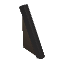|8c0d1cf1c26958f4b9e5016c66c03ce0|$piece_ashwoodwallroof67|Ashwood Wall 67|Both sides of this wall have their own charm. The choice is yours!|<ul><li>2 Ashwood</li></ul>|Wood|DeepNorth|Building, Walls, Architecture|
|ashwood_wall_roof_67_upsidedown 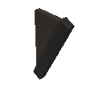|98d42caa05d609f469626f9a2b227a36|$piece_ashwoodwallroof67upsidedown|Ashwood Wall 67 (Inverted)|Both sides of this wall have their own charm. The choice is yours!|<ul><li>2 Ashwood</li></ul>|Wood|DeepNorth|Building, Walls, Architecture|
|ashwood_floor_1x1 |8ba3441fce728b047bf0fed6f2474572|$piece_ashwood_floor_1x1|Ashwood Floor 1x1|Ashwood floorboards, laid diagonally.|<ul><li>1 Ashwood</li></ul>|Wood|BuildingWorkbench|Building, Flooring|
|ashwood_floor_2x2 |858bb1e5474c1e241a4a778ba38fc370|$piece_ashwood_floor_2x2|Ashwood Floor 2x2|Ashwood floorboards, laid diagonally.|<ul><li>2 Ashwood</li></ul>|Wood|BuildingWorkbench|Building, Flooring|
|ashwood_deco_floor |2587a0b3d0c35f749bda59701b016f95|$piece_ashwood_floor_deco|Ashwood Decorative Floor|Patterns work great on the floor as well.|<ul><li>4 Ashwood</li></ul>|Wood|BuildingWorkbench|Building, Flooring, Decor|
|ashwood_arch_big |7085655f49f1e0d44bc9a7a1ef2ade64|$piece_ashwoodarch_big|Ashwood Arch|These supports are always warm to the touch.|<ul><li>2 Ashwood</li></ul>|Wood|BuildingWorkbench|Building, Architecture|
|ashwood_pole_1m |3c33a4a00e742364a8af2818d6b9fa74|$piece_ashwood_pole_1m|Ashwood Pole 1 m|These supports are always warm to the touch.|<ul><li>1 Ashwood</li></ul>|Wood|BuildingWorkbench|Building, Architecture|
|ashwood_pole_2m |60cc3ed0d74f87044bff8a610d5de6b6|$piece_ashwood_pole_2m|Ashwood Pole 2 m|These supports are always warm to the touch.|<ul><li>2 Ashwood</li></ul>|Wood|BuildingWorkbench|Building, Architecture|
|ashwood_beam_1m |e31400dac2f38d948ab614d1a99f02cc|$piece_ashwood_beam_1m|Ashwood Beam 1 m|These supports are always warm to the touch.|<ul><li>1 Ashwood</li></ul>|Wood|BuildingWorkbench|Building, Architecture|
|ashwood_beam_2m |38d3b244885f65b4fab1aa319e330bdf|$piece_ashwood_beam_2m|Ashwood Beam 2 m|These supports are always warm to the touch.|<ul><li>2 Ashwood</li></ul>|Wood|BuildingWorkbench|Building, Architecture|
|ashwood_wall_beam_26 |e125972d211b31454bd01f953f3abf82|$piece_ashwoodbeam26|Ashwood Beam 26|These supports are always warm to the touch.|<ul><li>2 Ashwood</li></ul>|Wood|BuildingWorkbench|Building, Architecture|
|ashwood_wall_beam_45 |3cfb8d5e8b072c49b8d7722b38e80230|$piece_ashwoodbeam45|Ashwood Beam 45|These supports are always warm to the touch.|<ul><li>2 Ashwood</li></ul>|Wood|BuildingWorkbench|Building, Architecture|
|ashwood_wall_beam_67 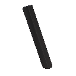|c5fd011fb82328643b60c74c928a3bb1|$piece_ashwoodbeam67|Ashwood Beam 67|These supports are always warm to the touch.|<ul><li>2 Ashwood</li></ul>|Wood|DeepNorth|Building, Architecture|
|ashwood_wall_cross_26 |5f7179880542c16e888f8e786c21925a|$piece_ashwoodcross26|Ashwood Roof Cross 26|These supports are always warm to the touch.|<ul><li>2 Ashwood</li></ul>|Wood|BuildingWorkbench|Building, Architecture|
|ashwood_wall_cross_45 |1dafc272d255705c89b52171fe795d3e|$piece_ashwoodcross45|Ashwood Roof Cross 45|These supports are always warm to the touch.|<ul><li>2 Ashwood</li></ul>|Wood|BuildingWorkbench|Building, Architecture|
|ashwood_wall_cross_67 |27a17f4a6630832419382022f2bcef90|$piece_ashwoodwallrooftop67|Ashwood Roof Cross 67|These supports are always warm to the touch.|<ul><li>2 Ashwood</li></ul>|Wood|DeepNorth|Building, Architecture|
|ashwood_door |eaf7ab4c310b72244ad5904069071ace|$piece_ashwood_door|Ashwood Door|The detailed decorations might make you stop and look instead of actually going through.|<ul><li>1 Flametal</li><li>5 Ashwood</li></ul>|Wood|BuildingWorkbench|Building, Doors and Windows|
|ashwood_stair |208f5a98ced1c544aadcd934606bebbc|$piece_ashwoodstair|Ashwood Stair|These stairs are sturdier than they might appear.|<ul><li>2 Ashwood</li></ul>|Wood|BuildingWorkbench|Building, Stairs|
|piece_stakewall_blackwood |154e60c421896594aba909be0add57a9|$piece_BlackwoodStakewall|Ashwood Stakewall|Good for keeping intruders out.|<ul><li>6 Ashwood</li></ul>|Wood|Misc|Building, Defence|
|Piece_grausten_wall_1x2 |63bf1ada01b6ad72995a172c09aad545|$piece_grausten_wall1x2|Grausten Wall 1x2|Stone walls inspired by a long-gone civilisation.|<ul><li>4 Grausten</li></ul>|Ashstone|BuildingStonecutter|Building, Walls|
|Piece_grausten_wall_2x2 |653f0363bd70a2295b61500a36f83a82|$piece_grausten_wall2x2|Grausten Wall 2x2|Stone walls inspired by a long-gone civilisation.|<ul><li>6 Grausten</li></ul>|Ashstone|BuildingStonecutter|Building, Walls|
|Piece_grausten_window_2x2 |fd03cf416fb5564a78fd39b427af0dde|$piece_grausten_window2x2|Grausten Window 2x2|Stone walls inspired by a long-gone civilisation.|<ul><li>4 Grausten</li></ul>|Ashstone|BuildingStonecutter|Building, Walls, Doors and Windows|
|Piece_grausten_wall_4x2 |b1ba605e2baeb12e99143dc962e94dc1|$piece_grausten_wall4x2|Grausten Wall 4x2|Stone walls inspired by a long-gone civilisation.|<ul><li>12 Grausten</li></ul>|Ashstone|BuildingStonecutter|Building, Walls|
|Piece_grausten_window_4x2 |d2fea25d6c91d45c1af8a90fb919268b|$piece_grausten_window4x2|Grausten Window 4x2|Stone walls inspired by a long-gone civilisation.|<ul><li>10 Grausten</li></ul>|Ashstone|BuildingStonecutter|Building, Walls, Doors and Windows|
|Piece_grausten_wall_arch |71ba09b7db5e321aa9f9c38f1efa6a20|$piece_grausten_wallarch|Grausten Wall Arch|Stone walls inspired by a long-gone civilisation.|<ul><li>2 Grausten</li></ul>|Ashstone|BuildingStonecutter|Building, Walls, Architecture|
|Piece_grausten_wall_arch_inverted |7db2ead38b870767ca824f8e030099a6|$piece_grausten_wallarchinv|Grausten Wall Arch (Inverted)|Stone walls inspired by a long-gone civilisation.|<ul><li>2 Grausten</li></ul>|Ashstone|BuildingStonecutter|Building, Walls, Architecture|
|Piece_grausten_floor_1x1 |c6f27c5d4a88d8a7b8af159f3cd6c743|$piece_grausten_floor1x1|Grausten Floor 1x1|These thin floor tiles are deceptively sturdy.|<ul><li>2 Grausten</li></ul>|Ashstone|BuildingStonecutter|Building, Flooring|
|Piece_grausten_floor_2x2 |d4845bfa8e5b9a79eb8cf5b50bd0d5f0|$piece_grausten_floor2x2|Grausten Floor 2x2|These thin floor tiles are deceptively sturdy.|<ul><li>4 Grausten</li></ul>|Ashstone|BuildingStonecutter|Building, Flooring|
|Piece_grausten_floor_4x4 |905bc5e83eb08e03bbf4cd53d440c8f4|$piece_grausten_floor4x4|Grausten Floor 4x4|These thin floor tiles are deceptively sturdy.|<ul><li>8 Grausten</li></ul>|Ashstone|BuildingStonecutter|Building, Flooring|
|Piece_grausten_pillarbase_small |56191b84de1d47e3bb896bd92ca43182|$piece_grausten_pillarsmall|Grausten Small Pillar|Strong enough to withstand a land of fire.|<ul><li>1 Grausten</li></ul>|Ashstone|BuildingStonecutter|Building, Architecture|
|Piece_grausten_pillarbase_medium |80c937aa837bd787b954e8782e77bd71|$piece_grausten_pillarmedium|Grausten Medium Pillar|Strong enough to withstand a land of fire.|<ul><li>3 Grausten</li></ul>|Ashstone|BuildingStonecutter|Building, Architecture|
|Piece_grausten_pillarbeam_small |a8495239053baaf8994949f1c8eeacbb|$piece_grausten_beamsmall|Grausten Small Beam|Strong enough to withstand a land of fire.|<ul><li>1 Grausten</li></ul>|Ashstone|BuildingStonecutter|Building, Architecture|
|Piece_grausten_pillarbeam_medium |c59dd9b7f4cf053edbe6a009f77e9922|$piece_grausten_beammedium|Grausten Medium Beam|Strong enough to withstand a land of fire.|<ul><li>3 Grausten</li></ul>|Ashstone|BuildingStonecutter|Building, Architecture|
|Piece_grausten_pillarbase_tapered |c31aea2d15a13cdcd90117148a8899c6|$piece_grausten_pillartapered|Grausten Tapered Pillar|Strong enough to withstand a land of fire.|<ul><li>5 Grausten</li></ul>|Ashstone|BuildingStonecutter|Building, Architecture|
|Piece_grausten_pillarbase_tapered_inverted |f789580b031a6568783fa9c5d30a05a4|$piece_grausten_pillartaperedinverted|Grausten Tapered Pillar (Inverted)|Strong enough to withstand a land of fire.|<ul><li>5 Grausten</li></ul>|Ashstone|BuildingStonecutter|Building, Architecture|
|Piece_grausten_pillar_arch_small |54464b298d43725f7a8d71db0917b4dd|$piece_grausten_archsmall|Grausten Small Arch|Strong enough to withstand a land of fire.|<ul><li>2 Grausten</li></ul>|Ashstone|BuildingStonecutter|Building, Architecture|
|Piece_grausten_pillar_arch |0abfdbe98306783158460bb66a12d8f9|$piece_grausten_archmedium|Grausten Medium Arch|Strong enough to withstand a land of fire.|<ul><li>4 Grausten</li></ul>|Ashstone|BuildingStonecutter|Building, Architecture|
|piece_grausten_roof_45 |66c9a061a2b553745ba4b9027dcf2b01|$piece_grausten_roof45|Grausten Roof|A roof design fit for the mightiest of halls.|<ul><li>5 Grausten</li></ul>|Ashstone|BuildingStonecutter|Building, Roofing|
|piece_grausten_roof_45_corner |d2495ce39659d5cfe9e28dda324ddf90|$piece_grausten_roof45_corner|Grausten Roof Corner|A roof design fit for the mightiest of halls.|<ul><li>5 Grausten</li></ul>|Ashstone|BuildingStonecutter|Building, Roofing|
|piece_grausten_roof_45_corner2 |afd8c71cfdbdfd591aa0c6c75c1fea2d|$piece_grausten_roof45_corner2|Grausten Roof Corner|A roof design fit for the mightiest of halls.|<ul><li>5 Grausten</li></ul>|Ashstone|BuildingStonecutter|Building, Roofing|
|piece_grausten_roof_45_arch |8036e00aae66fa82299848b444b0c00d|$piece_grausten_roof45_arch|Grausten Arched Roof|A roof design fit for the mightiest of halls.|<ul><li>5 Grausten</li></ul>|Ashstone|BuildingStonecutter|Building, Roofing|
|piece_grausten_roof_45_arch_corner |97d6d94c5e0a727d0a458d4f5a22c751|$piece_grausten_roof45_archcorner|Grausten Arched Roof Corner|A roof design fit for the mightiest of halls.|<ul><li>5 Grausten</li></ul>|Ashstone|BuildingStonecutter|Building, Roofing|
|piece_grausten_roof_45_arch_corner2 |d388e58b5ad39a13b87fb0e9aaf95489|$piece_grausten_roof45_archcorner2|Grausten Arched Roof Corner|A roof design fit for the mightiest of halls.|<ul><li>5 Grausten</li></ul>|Ashstone|BuildingStonecutter|Building, Roofing|
|piece_grausten_stonestair |dcb895e52f25e368292b1893681d0194|$piece_grausten_stair|Grausten Stairs|Just take one step after the other.|<ul><li>8 Grausten</li></ul>|Ashstone|BuildingStonecutter|Building, Stairs|
|Piece_grausten_stone_ladder |ae0aabd5321b5013aa3e2a6ac465b460|$piece_grausten_stoneladder|Grausten Steep Stairs|Good for getting to higher levels.|<ul><li>5 Grausten</li></ul>|Ashstone|BuildingStonecutter|Building, Stairs|
|Piece_flametal_pillar |e9f9a247454c3fc438c3179725504367|$piece_flametal_pillar|Flametal Pillar|Pure flamin' metal.|<ul><li>2 Flametal</li></ul>|Iron|BuildingStonecutter|Building, Architecture|
|Piece_flametal_beam |fd72949da7dd35d40bc25638b866f7f5|$piece_flametal_beam|Flametal Beam|Pure flamin' metal.|<ul><li>2 Flametal</li></ul>|Iron|BuildingStonecutter|Building, Architecture|
|flametal_gate |fc5480e05c9b17a4bae4829645f44d68|$piece_flametalgate|Flametal Gate|An impressive way to welcome your friends, or to ward off your foes.|<ul><li>16 Flametal</li></ul>|Iron|BuildingStonecutter|Building, Doors and Windows|
|stave_wall_2x2 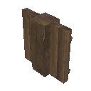|0e9d12b73a294ed4a92cd6f039dbc548|$piece_stave_wall|Timber Wall|Heavy timber walls are good for keeping out the cold.|<ul><li>4 Timberwood</li></ul>|Timberwood|DeepNorth|Building, Walls|
|stave_pole_2m 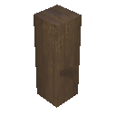|b7cd9c7e9b9338545aa3c9d22d62eaae|$piece_stave_pole_2m|Timber Pole 2m|These thick chunks of wood are sure to support your constructions.|<ul><li>2 Timberwood</li></ul>|Timberwood|DeepNorth|Building, Architecture|
|stave_pole_4m 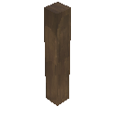|c873cbf169cb6204b92d516bf517d897|$piece_stave_pole_4m|Timber Pole 4m|These thick chunks of wood are sure to support your constructions.|<ul><li>4 Timberwood</li></ul>|Timberwood|DeepNorth|Building, Architecture|
|stave_beam_2m 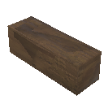|4943f2b1c9c484f03ab1cc8e294e4f92|$piece_stavebeam2|Timber Beam 2m|These thick chunks of wood are sure to support your constructions.|<ul><li>2 Timberwood</li></ul>|Timberwood|DeepNorth|Building, Architecture|
|stave_beam_4m 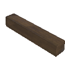|db477e305d61aeb4cbd411c6b80fdfeb|$piece_stavebeam4|Timber Beam 4m|These thick chunks of wood are sure to support your constructions.|<ul><li>4 Timberwood</li></ul>|Timberwood|DeepNorth|Building, Architecture|
|stave_beam_26 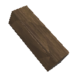|c86c2bac3a5a33c44ba86f79888c28fa|$piece_stavebeam26|Timber Beam 26|These thick chunks of wood are sure to support your constructions.|<ul><li>2 Timberwood</li></ul>|Timberwood|DeepNorth|Building, Architecture|
|stave_beam_45 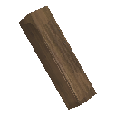|4f52ad93c93f218478f0e2b57e2a83a3|$piece_stavebeam45|Timber Beam 45|These thick chunks of wood are sure to support your constructions.|<ul><li>2 Timberwood</li></ul>|Timberwood|DeepNorth|Building, Architecture|
|stave_beam_67 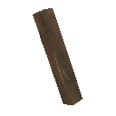|b9af6e0ec8525a14f8a2c714f83fabeb|$piece_stavebeam67|Timber Beam 67|These thick chunks of wood are sure to support your constructions.|<ul><li>2 Timberwood</li></ul>|Timberwood|DeepNorth|Building, Architecture|
|stave_wall_cross_26 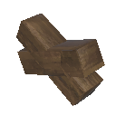|ad3eadda8afb5e5409bd6bb7f12ff3f7|$piece_stavecross26|Timber Roof Cross 26|These thick chunks of wood are sure to support your constructions.|<ul><li>2 Timberwood</li></ul>|Timberwood|DeepNorth|Building, Architecture|
|stave_wall_cross_45 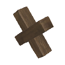|a4fa19e65fc3d894e8ac258def7fa463|$piece_stavecross45|Timber Roof Cross 45|These thick chunks of wood are sure to support your constructions.|<ul><li>2 Timberwood</li></ul>|Timberwood|DeepNorth|Building, Architecture|
|stave_wall_cross_67 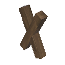|b09cdf6b705bab343a12d89cea9cea01|$piece_stavewallrooftop67|Timber Roof Cross 67|These thick chunks of wood are sure to support your constructions.|<ul><li>2 Timberwood</li></ul>|Timberwood|DeepNorth|Building, Architecture|
|stave_deco_wall_2x2 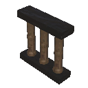|67308f0162d92644fb4e6f35b0022eae|$piece_deco_stave_wall|Lathed Timber Wall|This wall won't do much to keep out the cold, but it's very pretty to look at.|<ul><li>4 Timberwood</li></ul>|Timberwood|DeepNorth|Building, Walls, Decor|
|stave_deco_pole_2m 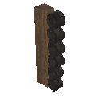|eddfebddfb0735b41822c5a4d118e2ea|$piece_stave_deco_pole_2m|Decorated Timber Pole 2m|These supports add a tasteful and decorative touch.|<ul><li>2 Timberwood</li></ul>|Timberwood|DeepNorth|Building, Architecture|
|stave_deco_beam_2m 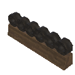|c6a3117dd45590e4586cee06e53f660a|$piece_stave_deco_beam_2m|Decorated Timber Beam 2m|These supports add a tasteful and decorative touch.|<ul><li>2 Timberwood</li></ul>|Timberwood|DeepNorth|Building, Architecture|
|stave_deco_beam_26 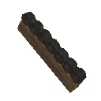|44c80dd9203bf334c957de3736077af3|$piece_stavedecobeam26|Decorated Timber Beam 26|These supports add a tasteful and decorative touch.|<ul><li>2 Timberwood</li></ul>|Timberwood|DeepNorth|Building, Architecture|
|stave_deco_beam_45 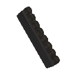|e54b37e750650dd4db2fa0e17391ddd5|$piece_stavedecobeam45|Decorated Timber Beam 45|These supports add a tasteful and decorative touch.|<ul><li>2 Timberwood</li></ul>|Timberwood|DeepNorth|Building, Architecture|
|stave_deco_beam_67 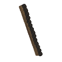|41d7bd205ae7e1141a01a5f8fb9962f1|$piece_stavedecobeam67|Decorated Timber Beam 67|These supports add a tasteful and decorative touch.|<ul><li>2 Timberwood</li></ul>|Timberwood|DeepNorth|Building, Architecture|
|scale_quarterwall_1x1 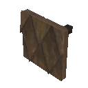|c287022a5faf7a145b6e87857c1aa87c|$piece_scale_quarterwall|Scalewood Quarter Wall|The overlapping wood of these walls provide excellent protection against the elements.|<ul><li>1 Timberwood</li></ul>|Wood|DeepNorth|Building, Walls|
|scale_halfwall_1x2 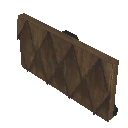|a19cdd60fdf49a7fbb6e997f8bf75f18|$piece_scale_halfwall|Scalewood Half Wall|The overlapping wood of these walls provide excellent protection against the elements.|<ul><li>1 Timberwood</li></ul>|Wood|DeepNorth|Building, Walls|
|scale_wall_2x2 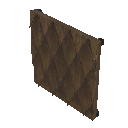|9c90f4d153794304b8f04eb891384c20|$piece_scale_wall|Scalewood Wall|The overlapping wood of these walls provide excellent protection against the elements.|<ul><li>2 Timberwood</li></ul>|Wood|DeepNorth|Building, Walls|
|scale_wall_roof_26 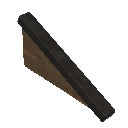|41863efc1c8bc0d419c3ec2c9a2d8353|$piece_scale_26|Scalewood Wall 26 Left|The overlapping wood of these walls provide excellent protection against the elements.|<ul><li>2 Timberwood</li></ul>|Wood|DeepNorth|Building, Walls|
|scale_wall_roof_26_flipped 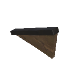|c151d0d2ca26c1a409680b3f623d4b4f|$piece_scale_26_flipped|Scalewood Wall 26 Right|The overlapping wood of these walls provide excellent protection against the elements.|<ul><li>2 Timberwood</li></ul>|Wood|DeepNorth|Building, Walls|
|scale_wall_roof_45 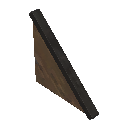|57f656e9db22e0f4592c2e82637582dc|$piece_scale_45|Scalewood Wall 45 Left|The overlapping wood of these walls provide excellent protection against the elements.|<ul><li>2 Timberwood</li></ul>|Wood|DeepNorth|Building, Walls|
|scale_wall_roof_45_flipped 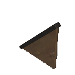|1c45ff53078b53842b222026c5a8b894|$piece_scale_45_flipped|Scalewood Wall 45 Right|The overlapping wood of these walls provide excellent protection against the elements.|<ul><li>2 Timberwood</li></ul>|Wood|DeepNorth|Building, Walls|
|scale_wall_roof_67 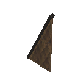|2b5351422c4e643419e66e916d613fc0|$piece_scale_67|Scalewood Wall 67 Left|The overlapping wood of these walls provide excellent protection against the elements.|<ul><li>2 Timberwood</li></ul>|Wood|DeepNorth|Building, Walls|
|scale_wall_roof_67_flipped 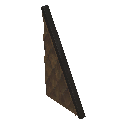|90ef9376f4dc7ab439dedabb1b6fa014|$piece_scale_67_flipped|Scalewood Wall 67 Right|The overlapping wood of these walls provide excellent protection against the elements.|<ul><li>2 Timberwood</li></ul>|Wood|DeepNorth|Building, Walls|
|scale_wall_roof_26_upsidedown 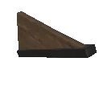|3b9a8c94fc24111478b73a0d9df56340|$piece_scale_26_upsidedown|Scalewood Wall 26 Right (Inverted)|The overlapping wood of these walls provide excellent protection against the elements.|<ul><li>2 Timberwood</li></ul>|Wood|DeepNorth|Building, Walls|
|scale_wall_roof_26_upsidedown_flipped 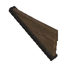|6731ad613858f17429af2f59506322d3|$piece_scale_26_upsidedown_flipped|Scalewood Wall 26 Left (Inverted)|The overlapping wood of these walls provide excellent protection against the elements.|<ul><li>2 Timberwood</li></ul>|Wood|DeepNorth|Building, Walls|
|scale_wall_roof_45_upsidedown 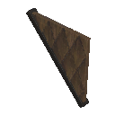|c9e81c123201b9541ac4136f7f0fbf2b|$piece_scale_45_upsidedown|Scalewood Wall 45 Right (Inverted)|The overlapping wood of these walls provide excellent protection against the elements.|<ul><li>2 Timberwood</li></ul>|Wood|DeepNorth|Building, Walls|
|scale_wall_roof_45_upsidedown_flipped 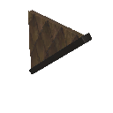|619aab33ea194e34e9612085f372aca8|$piece_scale_45_upsidedown_flipped|Scalewood Wall 45 Left (Inverted)|The overlapping wood of these walls provide excellent protection against the elements.|<ul><li>2 Timberwood</li></ul>|Wood|DeepNorth|Building, Walls|
|scale_wall_roof_67_upsidedown 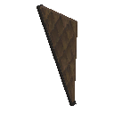|026c3349f540b4f48b24703fd301e412|$piece_scale_67_upsidedown|Scalewood Wall 67 Right (Inverted)|The overlapping wood of these walls provide excellent protection against the elements.|<ul><li>2 Timberwood</li></ul>|Wood|DeepNorth|Building, Walls|
|scale_wall_roof_67_upsidedown_flipped 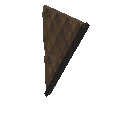|f0e439d4c5c1705488896850d23c9008|$piece_scale_67_upsidedown_flipped|Scalewood Wall 67 Left (Inverted)|The overlapping wood of these walls provide excellent protection against the elements.|<ul><li>2 Timberwood</li></ul>|Wood|DeepNorth|Building, Walls|
|stave_gate 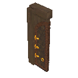|1d58e5b22f0a54d4494227f9f5f76a6c|$piece_stavegate|Timberwood Gate|Not quite as glorious as the gates of Valhalla, but awfully close!|<ul><li>24 Timberwood</li><li>4 Bloodgold</li></ul>|HardWood|BuildingWorkbench|Building, Walls, Doors and Windows|
|piece_drawbridge 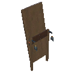|4e3360a689e17591fad418869af18690|$piece_drawbridge_dn|Timberwood Drawbridge|Both a bridge and a gate, how clever!|<ul><li>2 Flametal</li><li>2 Bloodgold</li><li>24 Timberwood</li></ul>|Wood|BuildingWorkbench|Building, Defence, Doors and Windows|
|piece_drawbridge_log 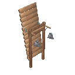|d6ad393a1634eeb488b34af2d3324260|$piece_drawbridge_log|Rustic Drawbridge|Convenient for crossing chasms, or for keeping enemies out.|<ul><li>2 Silver</li><li>2 Wolf Trophy</li><li>10 Corewood</li></ul>|Wood|BuildingWorkbench|Building, Defence, Doors and Windows|
|piece_icecube 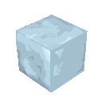|1e765f8c4ba6c854c884d98651bbb4ea|$piece_icecube|Ice Block|A solid chunk of ice.|<ul><li>2 Ice</li></ul>|Ice|BuildingStonecutter|Building, Flooring, Walls, Architecture|
|piece_cookingstation |a87cc4aca130d4d36a820342aaf7e360|$piece_cookingstation|Cooking Station|Perfect for grilling raw meat.|<ul><li>2 Wood</li></ul>|Wood|Crafting|Crafting|
|piece_cookingstation_iron |59f1065c85e319a45b152f023548e884|$piece_cookingstation_iron|Iron Cooking Station|Sturdy, with room to cook meat from larger creatures.|<ul><li>3 Iron</li><li>3 Chain</li></ul>|Iron|Crafting|Crafting|
|piece_workbench |8aa8f18747bb24033bac6d43da077cc7|$piece_workbench|Workbench|Crafting station  A workbench is necessary for any home. You need it to build wooden structures and craft new tools.|<ul><li>10 Wood</li></ul>|Wood|Crafting|Crafting|
|piece_workbench_ext1 |fb92736c0d7d644ce90ce2ab4ac2614a|$piece_workbench_ext1|Chopping Block|Workbench improvement  An axe is a very versatile tool for crafting.|<ul><li>10 Wood</li><li>10 Flint</li></ul>|Wood|Crafting|Crafting|
|piece_workbench_ext2 |e5a43250f224f4b208e3eca9965560a1|$piece_workbench_ext2|Tanning Rack|Workbench improvement  Leathers and hides need proper treatment before they can be used.|<ul><li>10 Wood</li><li>15 Flint</li><li>20 Leather Scraps</li><li>5 Deer Hide</li></ul>|Wood|Crafting|Crafting|
|piece_workbench_ext3 |4483597b84fa6824f9992d5af665d428|$piece_workbench_ext3|Adze|Workbench improvement  Sometimes you need to work the problem from a different angle.|<ul><li>10 Finewood</li><li>3 Bronze</li></ul>|Wood|Crafting|Crafting|
|piece_workbench_ext4 |2ec412a0b7b11a158b3ed1185865fb39|$piece_workbench_ext4|Tool Shelf|Workbench improvement  Fine detail work requires fine tools to match.|<ul><li>4 Iron</li><li>10 Finewood</li><li>4 Obsidian</li></ul>|Wood|Crafting|Crafting|
|piece_cauldron |f1bf7d6010e98462893b8543ae46856a|$piece_cauldron|Cauldron|Crafting station  Combine ingredients and cook yourself a tasty meal, important for all vikings!|<ul><li>10 Tin</li></ul>|Wood|Crafting|Crafting|
|cauldron_ext1_spice |5675ba4a776791741a471972985f1288|$piece_cauldron_ext1_spice|Spice Rack|Cauldron improvement  You need many ingredients for a varied and delicious diet.|<ul><li>3 Dandelion</li><li>2 Carrot</li><li>5 Mushroom</li><li>3 Thistle</li><li>3 Turnip</li></ul>|Wood|Crafting|Crafting|
|cauldron_ext3_butchertable |d68c8ee93dde6e343b453c986af053c2|$piece_cauldron_ext3_butchertable|Butcher's Table|Cauldron improvement  The finest dishes require the finest cuts.|<ul><li>2 Ancient Bark</li><li>4 Corewood</li><li>4 Finewood</li><li>2 Silver</li></ul>|Wood|Crafting|Crafting|
|cauldron_ext4_pots |995e1b9da1747d4449234e721df10e89|$piece_cauldron_ext4_pans|Pots and Pans|Cauldron improvement  Sometimes just a cauldron simply isn't enough.|<ul><li>5 Iron</li><li>5 Copper</li><li>5 Black Metal</li><li>10 Finewood</li></ul>|Wood|Crafting|Crafting|
|cauldron_ext5_mortarandpestle |bba2754101cfb9d42b00faa8891567c7|$piece_cauldron_ext5_mortarandpestle|Mortar and Pestle|Cauldron improvement  Some ingredients need to be ground into a fine powder before they can be used for cooking.|<ul><li>8 Black Marble</li><li>6 Finewood</li><li>4 Corewood</li></ul>|Wood|Crafting|Crafting|
|cauldron_ext6_rollingpins |3187f883c29dad54e888529748ce70a9|$piece_cauldron_ext6_rollingpins|Rolling Pins and Cutting Boards|Cauldron improvement  These always come in handy, particularly for baking.|<ul><li>8 Ashwood</li><li>6 Finewood</li><li>4 Flametal</li></ul>|Wood|Crafting|Crafting|
|cauldron_ext7_smoker 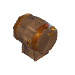|5f76eea7e8d87044da48efede9ba557d|$piece_cauldron_ext7_smoker|Smoker|Cauldron improvement  Smoked food will keep longer and taste better!|<ul><li>5 Bloodgold</li><li>6 Timberwood</li></ul>|Wood|Crafting|Crafting|
|forge |5983ba8568237480f9c931dac464dc0e|$piece_forge|Forge|Crafting station  When you want to work with metal, you need a forge.|<ul><li>4 Stone</li><li>4 Coal</li><li>10 Wood</li><li>6 Copper</li></ul>|Wood|Crafting|Crafting|
|forge_ext1 |35648e76441d44d9fa3219d1783cdc27|$piece_forge_ext1|Forge Bellows|Forge improvement  Pressing down on these bellows generates more heat, which is very helpful for smithing.|<ul><li>5 Wood</li><li>5 Deer Hide</li><li>4 Chain</li></ul>|Wood|Crafting|Crafting|
|forge_ext2 |3a599566e5b9b4a529c5afddbdaac6db|$piece_forge_ext2|Anvils|Forge improvement  For more detailed work, multiple kinds of anvils can come in handy.|<ul><li>5 Wood</li><li>2 Bronze</li></ul>|Wood|Crafting|Crafting|
|forge_ext3 |9aeb8a925b5644b3292e362f73eab508|$piece_forge_ext3|Grinding Wheel|Forge improvement  A grinding wheel is necessary for sharpening any kind of sword.|<ul><li>25 Wood</li><li>1 Sharpening Stone</li></ul>|Wood|Crafting|Crafting|
|forge_ext4 |9b504c4f3e5b54e70ab355fe864ef492|$piece_forge_ext4|Smith's Anvil|Forge improvement  A large anvil for working large items. Make sure it doesn't fall on your feet.|<ul><li>20 Iron</li><li>5 Wood</li></ul>|Wood|Crafting|Crafting|
|forge_ext5 |0d6f7df90e3df481abea89f337113de9|$piece_forge_ext5|Forge Cooler|Forge improvement  Once a creation is done, this barrel of water will bring the metal down to a manageable temperature.|<ul><li>25 Finewood</li><li>10 Copper</li></ul>|Wood|Crafting|Crafting|
|forge_ext6 |dc7235b5d46ac40bb8230472b6257e2e|$piece_forge_ext6|Forge Tool Rack|Forge improvement  You need lots of different tools to work with. These conveniently come with a rack for storage.|<ul><li>15 Iron</li><li>10 Wood</li></ul>|Wood|Crafting|Crafting|
|piece_artisanstation |47739655182154664b1927ba002afa11|$piece_artisanstation|Artisan Table|Crafting station  To build machinery and craft complicated designs, an artisan table is required.|<ul><li>10 Wood</li><li>2 Dragon Tear</li></ul>|Wood|Crafting|Crafting|
|artisan_ext1 |2ce632ba53495e740a4314bc0765f6e1|$piece_artisan_ext1|Artisan Press|Artisan Table improvement  This intricate tool is needed for crafting more advanced designs.|<ul><li>5 Black Marble</li><li>5 Bronze</li><li>1 Majestic Carapace</li></ul>|Wood|Crafting|Crafting|
|blackforge |b54ead43818db1b4ba019f9ad1211e90|$piece_blackforge|Black Forge|Crafting station  Certain metals, especially combined with other materials, need to be worked at a more advanced forge.|<ul><li>10 Black Marble</li><li>10 Yggdrasil Wood</li><li>5 Black Core</li></ul>|Wood|Crafting|Crafting|
|blackforge_ext1 |e23070000978e9d418f45e1e9e4bd144|$piece_blackforge_ext1|Black Forge Cooler|Black Forge improvement  Let your new creations cool off before you touch them.|<ul><li>5 Iron</li><li>5 Copper</li><li>4 Black Marble</li></ul>|Wood|Crafting|Crafting|
|blackforge_ext2_vise |e65a593a872c31743bc4213c75ba5793|$piece_blackforge_ext2|Vice|Black Forge improvement  It's convenient to have your project be held in place while you work.|<ul><li>5 Iron</li><li>8 Copper</li><li>2 Mechanical Spring</li></ul>|Wood|Crafting|Crafting|
|blackforge_ext3_metalcutter |a39f5bb6d05c0144481ae65c14f9268f|$piece_blackforge_ext3|Metal Cutter|Black Forge improvement  For precise splitting of metal. Mind the sharp edges!|<ul><li>5 Black Marble</li><li>5 Flametal</li><li>5 Ashwood</li><li>4 Charred Bone</li></ul>|Wood|Crafting|Crafting|
|blackforge_ext4_gemcutter |34e35d0424826f54fbbeb831ce363aa3|$piece_blackforge_ext4|Gem Cutter|Black Forge improvement  To work with gems, you need specific tools.|<ul><li>5 Flametal</li><li>8 Ashwood</li><li>2 Morgen Sinew</li><li>1 Bloodstone</li></ul>|Wood|Crafting|Crafting|
|blackforge_ext5_apron 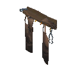|d99e2f417d9de6c4ca02a12d648351ac|$piece_blackforge_ext5|Smith's Aprons|Black Forge improvement  When dealing with extreme temperatures, workplace safety is of the highest import.|<ul><li>5 Bloodgold</li><li>8 Timberwood</li><li>2 Moose Hide</li></ul>|Wood|Crafting|Crafting|
|piece_magetable |524fccf4a011c0e92a337ff4d2065bae|$piece_magetable|Galdr Table|Crafting station  Mysterious galdr forces gather upon this altar. It's up to you to harness them...|<ul><li>20 Yggdrasil Wood</li><li>10 Black Metal</li><li>5 Black Core</li><li>5 Refined Eitr</li></ul>|Wood|Crafting|Crafting|
|piece_magetable_ext |e68a9104efe5a8b26b67f2acc229d630|$piece_magetable_ext|Rune Table|Galdr Table improvement  Runes are a well-known tool for channeling magic, if one knows how to read them.|<ul><li>10 Black Marble</li><li>5 Yggdrasil Wood</li><li>10 Refined Eitr</li></ul>|Wood|Crafting|Crafting|
|piece_magetable_ext2 |69d774b3eb02a014292cdf0570e55044|$piece_magetable_ext2|Unfading Candles|Galdr Table improvement  These candles emit a strange light, urging more potent magic to coalesce around them.|<ul><li>10 Black Marble</li><li>3 Skeleton Trophy</li><li>10 Refined Eitr</li><li>15 Resin</li></ul>|Wood|Crafting|Crafting|
|piece_magetable_ext3 |7e4d2789b54a0a94cb442fbc82b6614e|$piece_magetable_ext3|Feathery Wreath|Galdr Table improvement  An offering to the mysterious powers scattered across the realms. Perhaps they will lend themselves to you.|<ul><li>8 Celestial Feather</li><li>1 Asksvin Trophy</li><li>10 Refined Eitr</li><li>3 Ashwood</li></ul>|Wood|Crafting|Crafting|
|piece_magetable_ext4 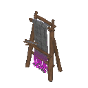|421c54ec071c5bf46b5459f2f598c9bc|$piece_magetable_ext4|Standing Loom|Galdr Table improvement  The Norns weave the threads of fate together in a magical tapestry. What shall you weave?|<ul><li>5 Timberwood</li><li>10 Nornathread</li></ul>|Wood|Crafting|Crafting|
|piece_preptable |0f1219e275dc9404295675abcc6114f0|$piece_preptable|Food Preparation Table|Crafting station  Not everything can be poured directly into the cauldron, so you need a good surface to work on!|<ul><li>5 Iron</li><li>20 Finewood</li><li>15 Leather Scraps</li></ul>|Wood|Crafting|Crafting|
|piece_MeadCauldron |05d06f4abf785ee4aa034e3fd47e61c7|$piece_meadcauldron|Mead Ketill|Crafting station  This copper pot holds the perfect temperature for mixing mead.|<ul><li>4 Tin</li><li>6 Copper</li><li>2 Leather Scraps</li></ul>|Wood|Crafting|Crafting|
|fermenter |931ace36de99947cc9a2afd23047791c|$piece_fermenter|Fermenter|Mead needs to sit and ferment for a while, for all its intended properties to emerge.|<ul><li>30 Finewood</li><li>5 Bronze</li><li>10 Resin</li></ul>|Wood|Crafting|Crafting|
|piece_oven |5cad8f7ab5567ec498f63dd0ef28a1e5|$piece_oven|Stone Oven|For all your baking needs.|<ul><li>15 Iron</li><li>20 Stone</li><li>4 Surtling Core</li></ul>|Stone|Crafting|Crafting|
|windmill |d20c541789946426f9483ca1df70bd4e|$piece_windmill|Windmill|Turns grain into flour. Works best on windy days!|<ul><li>20 Stone</li><li>30 Wood</li><li>30 Iron Nails</li></ul>|Stone|Crafting|Crafting|
|piece_stonecutter |b369b2d8a9e494d27b82902267829904|$piece_stonecutter|Stonecutter|Crafting station  If you want to build with stone, you'll need a stonecutter to work the material.|<ul><li>10 Wood</li><li>2 Iron</li><li>4 Stone</li></ul>|Wood|Crafting|Crafting|
|piece_spinningwheel |3ea2415d1aade44ac8e7cc0009e2e18e|$piece_spinningwheel|Spinning Wheel|This automated machine makes spinning fibres into thread a remarkably quick process.|<ul><li>20 Finewood</li><li>10 Iron Nails</li><li>5 Leather Scraps</li></ul>|Wood|Crafting|Crafting|
|piece_FrostFoundry 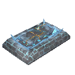|b26d76338456c064b8075ab036620695|$piece_frostfoundry|Frost Foundry|This foundry can be used to harden casts into proper items.|<ul><li>15 Iron</li><li>20 Stone</li><li>10 Frostcore</li></ul>|Stone|Crafting|Crafting|
|smelter |c04e7a906bef34e519e7c880b1dc54e4|$piece_smelter|Smelter|Fuel and ore go in, beautiful metal ingots come out.|<ul><li>20 Stone</li><li>5 Surtling Core</li></ul>|Stone|Crafting|Crafting|
|charcoal_kiln |12d273dd5f199490b969fd0a713675b2|$piece_charcoalkiln|Charcoal Kiln|Useful for turning any kind of wood into coal.|<ul><li>20 Stone</li><li>5 Surtling Core</li></ul>|Stone|Crafting|Crafting|
|blastfurnace |b9078e4a0160627e0a689bff9c20fc9b|$piece_blastfurnace|Blast Furnace|Some metals need higher temperatures to melt.|<ul><li>20 Stone</li><li>5 Surtling Core</li><li>10 Iron</li><li>20 Finewood</li></ul>|Stone|Crafting|Crafting|
|eitrrefinery |9633271e2f86cfc14b8b28fe21c2cb27|$piece_eitrrefinery|Eitr Refinery|This machine will turn soft tissue into the magical substance eitr. The process is quite volatile, however, so stand back!|<ul><li>20 Black Marble</li><li>5 Black Metal</li><li>10 Yggdrasil Wood</li><li>5 Black Core</li><li>3 Sap</li></ul>|Wood|Crafting|Crafting|
|piece_FrostKiln 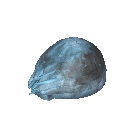|1353ffea92dbc0f4c9f51f9bde01ca28|$piece_frostkiln|Frigid Kiln|A strange and chilling process happens within this kiln, to produce a most potent fuel...|<ul><li>20 Stone</li><li>10 Frostcore</li><li>5 Ice</li></ul>|Stone|Crafting|Crafting|
|piece_sapcollector |10a037caf14b7724885a1f7b3a722f34|$piece_sapcollector|Sap Extractor|Extract sap from mysterious branches.|<ul><li>10 Yggdrasil Wood</li><li>5 Black Metal</li><li>1 Dvergr Extractor</li></ul>|Wood|Crafting|Crafting|
|piece_beehive |fa038959a79074658b8a6c1a6771a0e3|$piece_beehive|Beehive|When they're happy, the bees will produce tasty honey.|<ul><li>10 Wood</li><li>1 Queen Bee</li></ul>|Wood|Crafting|Crafting|
|piece_birdnest 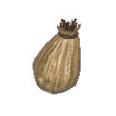|4d8b3d2e97e00214d98ecc8d5dada24c|$piece_birdnest|Birds' Nest|Healthy and happy birds might shed a feather or two.|<ul><li>2 Writhan Roots</li><li>3 Acorns</li><li>5 Thistle</li></ul>|Wood|Crafting|Crafting|
|piece_wisplure |f178fa4be9a2772528642ea5f4b589ac|$piece_wisplure|Wisp Fountain|Attracts wisps. They mostly come at night... mostly.|<ul><li>10 Stone</li><li>1 Torn Spirit</li></ul>|Stone|Crafting|Crafting|
|piece_EternalPyre 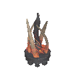|618cc8dc3d6645848bfa2d4f7fc1a609|$piece_faderember|Eternal Pyre|His rage and regret are at war with each other, and their struggle will fuel this fire until the very end.|<ul><li>10 Stone</li><li>1 Kindled Ribs</li></ul>|Stone|Crafting|Misc., Crafting, Lighting|
|incinerator |2bedae10b24758b479914984bdb89bd2|$piece_incinerator|Obliterator|Reduce, reuse, obliterate.|<ul><li>8 Iron</li><li>4 Copper</li><li>1 Thunder Stone</li></ul>|Iron|Crafting|Crafting|
|bed |7ea3d17319c0b4681a039adfa1fc2758|$piece_bed|Bed|When night falls, you'll want somewhere to sleep.|<ul><li>8 Wood</li></ul>|Wood|Furniture|Furniture|
|piece_bed02 |ff7ba57cc4d3474488dfd71fb8787b5b|$piece_bed02|Dragon Bed|Draped in furs, this bed is sure to give you a good night's sleep.|<ul><li>40 Finewood</li><li>7 Deer Hide</li><li>4 Wolf Pelt</li><li>10 Feathers</li><li>15 Iron Nails</li></ul>|Wood|Furniture|Furniture|
|ashwood_bed |6ce5c48522ee0304388d64bf6082cb5f|$piece_ashwood_bed|Ashwood Bed|Rest easy on this finely crafted bed, with asksvin hides to insulate you from heat and cold alike.|<ul><li>8 Ashwood</li><li>2 Lox Pelt</li><li>2 Asksvin Hide</li></ul>|Wood|Furniture|Furniture|
|piece_throne01 |9fd3ca7498c2938469b28255e309c0c9|$piece_throne01|Raven Throne|Perhaps this is what Odin's throne in Valhalla looks like... Either way, it's comfortable!|<ul><li>20 Finewood</li><li>10 Iron Nails</li></ul>|Wood|Furniture|Furniture|
|piece_throne02 |b8fca855ec6075f47bab49569c25fc9a|$piece_stonethrone|Stone Throne|A good leader must be firm like stone, yet they also need to know when to be soft like furs...|<ul><li>20 Stone</li><li>2 Deer Hide</li><li>2 Wolf Pelt</li></ul>|Stone|Furniture|Furniture|
|piece_blackmarble_throne |aba79e7b822f76743b600f896064b08b|$piece_blackmarble_throne|Black Marble Throne|A throne carved in authentic dvergr style, yet large enough for a human to sit comfortably upon.|<ul><li>20 Black Marble</li><li>4 Scale Hide</li><li>2 Deer Hide</li><li>5 Copper</li></ul>|Marble|Furniture|Furniture|
|piece_bone_throne |f60f461fe9e3e8a4d93abff0cac0e862|$piece_bone_throne|Bone Throne|This throne is sure to invoke respect in friends and foes alike.|<ul><li>15 Charred Bone</li><li>4 Flametal</li><li>20 Grausten</li><li>3 Charred Skull</li></ul>|Marble|Furniture|Furniture|
|piece_moose_throne 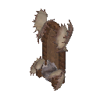|971d9e280adfdea44ba3a3d7ef896409|$piece_moose_throne|Antler Throne|Though rustic and sturdy, this throne is well suited even for the most noble of royalty.|<ul><li>15 Timberwood</li><li>1 Moose Trophy</li><li>5 Moose Hide</li></ul>|Wood|Furniture|Furniture|
|piece_chair |623c3a0c150684f68b2f2308e89c76b0|$piece_stool|Stool|A place to sit.|<ul><li>4 Finewood</li></ul>|Wood|Furniture|Furniture|
|piece_chair02 |0ab9e76210cbd4b4490f84bb206ce90b|$piece_chair|Wood Chair|Lean back and relax.|<ul><li>4 Finewood</li></ul>|Wood|Furniture|Furniture|
|piece_chair03 |7761f221d4764c64e93490dc53053711|$piece_darkwoodchair|Darkwood Chair|This chair is padded with furs, suitable for esteemed guests.|<ul><li>4 Finewood</li><li>1 Tar</li><li>5 Iron Nails</li><li>1 Deer Hide</li></ul>|Wood|Furniture|Furniture|
|piece_chair_runed 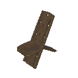|588cc8e45521c334ba77bd7375d50e99|$piece_chair_runed|Carved Chair|The shape of this chair might be simple, but its decorations are not.|<ul><li>4 Timberwood</li><li>1 Moose Sinew</li></ul>|Wood|DeepNorth|Furniture|
|piece_logbench01 |dced64900099c2a4f986b002424a0876|$piece_benchlog|Sitting Log|It's nothing fancy, but it's better than sitting on the ground.|<ul><li>2 Corewood</li></ul>|Wood|Furniture|Furniture|
|piece_bench01 |f3e9596916a030b4bb0e0e1df002b8ec|$piece_bench01|Wood Bench|If there is room in your heart, there is room for your butt.|<ul><li>6 Finewood</li></ul>|Wood|Furniture|Furniture|
|piece_blackmarble_bench |925d7c7f65a911c4597f0606d5870f7f|$piece_blackmarble_bench|Black Marble Bench|Sit with dignity on this bench, finely carved from black marble.|<ul><li>6 Black Marble</li><li>3 Copper</li></ul>|Marble|Furniture|Furniture|
|piece_blackwood_bench01 |e896889a751d4c7909a5e8260d690eb5|$piece_blackwoodbench01|Ashwood Bench|This bench has an elegant curve to it, to facilitate conversation.|<ul><li>6 Ashwood</li></ul>|Wood|Furniture|Furniture|
|piece_bench_runed 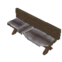|30ed2020d48937545a8161afd48e22c8|$piece_bench_runed|Carved Bench|A rustic yet comfortable place to sit.|<ul><li>6 Timberwood</li><li>1 Moose Hide</li></ul>|Wood|DeepNorth|Furniture|
|piece_table |b3f7f89f9e8234781acdb05fbc905e24|$piece_table|Table|A small but sturdy table.|<ul><li>6 Finewood</li></ul>|Wood|Furniture|Furniture|
|piece_table_oak |74d6caa163c042b43ba42987735bb7e5|$piece_table_oak|Long Heavy Table|This table is perfect for a large feast, with room for many different dishes!|<ul><li>20 Finewood</li><li>2 Tar</li><li>20 Iron Nails</li></ul>|Wood|Furniture|Furniture|
|piece_table_round |e0fcee9c06453ed4c9615a8eb3646552|$piece_table_round|Round Table|At a round table, no seat is more important than any other.|<ul><li>10 Finewood</li><li>2 Tar</li><li>20 Iron Nails</li></ul>|Wood|Furniture|Furniture|
|piece_blackmarble_table |22694a2dba4a19246b3cd160f3d7cfc0|$piece_blackmarble_table|Black Marble Table|Dine like a dwarf at this table!|<ul><li>6 Black Marble</li><li>3 Copper</li></ul>|Marble|Furniture|Furniture|
|piece_table_runed 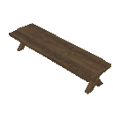|23381596b77e0084faaff0f4a47cf523|$piece_table_runed|Long Carved Table|The story carved into this table is excellent to read during long feasts.|<ul><li>20 Timberwood</li><li>2 Tar</li><li>20 Iron Nails</li></ul>|Wood|DeepNorth|Furniture|
|piece_table_runed_small 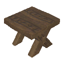|ac88527eefdab0842b9ae2cb7aecbd35|$piece_table_runed_small|Square Carved Table|A table for more intimate gatherings.|<ul><li>6 Timberwood</li><li>1 Tar</li><li>6 Iron Nails</li></ul>|Wood|DeepNorth|Furniture|
|piece_chest_wood |c98a482d15e7f4fada0909282da3747a|$piece_chestwood|Chest|A good place to store any items you don't need to carry with you.|<ul><li>10 Wood</li></ul>|Wood|Furniture|Furniture, Storage|
|piece_chest |3ddd9f38424df40dbb3ce37d9664d90d|$piece_chest|Reinforced Chest|A sturdier chest, with room for more storage.|<ul><li>10 Finewood</li><li>2 Iron</li></ul>|Wood|Furniture|Furniture, Storage|
|piece_chest_private |152ae1432e42544bca51272a6aba6c5a|$piece_chestprivate|Personal Chest|Some things you would rather lock away and keep for yourself.|<ul><li>10 Finewood</li><li>8 Iron</li></ul>|Wood|Furniture|Furniture, Storage|
|piece_chest_barrel |f6ac3d6708f0d9a43ba756289e33387e|$piece_chestbarrel|Barrel|A barrel is good for storing lots of things, including food and drink.|<ul><li>10 Wood</li><li>1 Barrel Hoops</li></ul>|Iron|Furniture|Furniture, Storage|
|piece_chest_treasure |2eea37180951eea48b57426be7198413|$piece_chesttreasure|Treasure Chest|What better way to display your wealth than a treasure chest spilling over with gold and jewels?|<ul><li>99 Coins</li><li>5 Ruby</li><li>2 Silver Necklace</li><li>8 Finewood</li><li>2 Silver</li></ul>|Wood|Misc|Furniture, Storage|
|piece_chest_blackmetal |6973dc356b19c404b8905acf5876c0bc|$piece_chestblackmetal|Black Metal Chest|The sturdy black metal that holds this chest together lets you put almost anything inside.|<ul><li>10 Wood</li><li>2 Tar</li><li>6 Black Metal</li></ul>|Iron|Furniture|Furniture, Storage|
|piece_chest_grausten 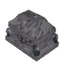|e1c539b830607144e8197111bf7790fe|$piece_chestgrausten|Grausten Chest|Stone and metal are sure to keep your belongings safe. The charred skulls help too.|<ul><li>10 Grausten</li><li>5 Warrior Trophy</li><li>2 Flametal</li></ul>|Iron|DeepNorth|Furniture, Storage|
|piece_pot1 |f12fcea1b4ce6ff20927fbd7f8a06173|$piece_pot_medium_green|Medium Green Pot|A piece of ceramic, deep enough to fit a thing or two inside.|<ul><li>4 Pot Shard</li><li>1 Charcoal Resin</li></ul>|Wood|Furniture|Decor, Storage|
|piece_pot2 |059ae1d064be4dd42be159c9deabd161|$piece_pot_large_green|Large Green Pot|A large statement piece of a pot! You could almost fit an entire viking in there.|<ul><li>5 Pot Shard</li><li>1 Charcoal Resin</li></ul>|Wood|Furniture|Decor, Storage|
|piece_pot3 |7ff68568dc53e0c65801508f3d82cd55|$piece_pot_small_green|Small Green Pot|A small piece of earthenware, with room for something inside.|<ul><li>3 Pot Shard</li><li>1 Charcoal Resin</li></ul>|Wood|Furniture|Decor, Storage|
|piece_chest_warderobe 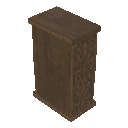|74a44250e6159004bbb3ceb75fcc3933|$piece_chestwarderobe|Wardrobe|An elegant place for storage.|<ul><li>10 Timberwood</li><li>2 Tar</li><li>6 Black Metal</li></ul>|Iron|DeepNorth|Furniture, Storage|
|piece_gift1 |737be72b7b0824d0db10992ae2cffee0|$piece_yuleklapp|Yuleklapp|A small gift for someone you like.|<ul><li>2 Finewood</li><li>1 Bone Fragments</li></ul>|Wood|Furniture|Decor, Storage, Seasonal Items|
|piece_gift2 |3b8c00290d3734a47ace68e94f63aeee|$piece_yuleklapp|Yuleklapp|A gift for someone who was nice this year.|<ul><li>3 Finewood</li><li>1 Dandelion</li></ul>|Wood|Furniture|Decor, Storage, Seasonal Items|
|piece_gift3 |7019b776725e84fd9b8f5177f52e5342|$piece_yuleklapp|Yuleklapp|A large gift for someone you appreciate a lot.|<ul><li>4 Finewood</li><li>1 Raspberries</li></ul>|Wood|Furniture|Decor, Storage, Seasonal Items|
|Cart |bd7ced1e1b7b94e7f8c59a0d7008a1d4|$tool_cart|Cart|Convenient when you need to move a lot of resources around.|<ul><li>20 Wood</li><li>10 Bronze Nails</li></ul>|Wood|Misc|Transportation|
|ArmorStand |759c31424d4e1514dbf67ca2fc388a01|$piece_armorstand|Armour Stand|Some clothes are just too nice to fold away. Why not put them on display instead?|<ul><li>8 Finewood</li><li>4 Iron Nails</li><li>2 Leather Scraps</li></ul>|Wood|Furniture|Decor, Storage|
|itemstand |5d470e476b829461e866c1176f3464cf|$piece_itemstand|Item Stand|Mount items on vertical surfaces with this item stand.|<ul><li>4 Finewood</li><li>1 Bronze Nails</li></ul>|Wood|Furniture|Decor, Storage|
|itemstandh |9703a862ea60346aeb308fcf95202477|$piece_itemstand|Item Stand|Place items on horizontal surfaces with this item stand.|<ul><li>4 Finewood</li><li>1 Bronze Nails</li></ul>|Wood|Furniture|Decor, Storage|
|sign |c7c6f01ba8a9147319cfdaef3ac89d36|$piece_sign|Sign|Disorder is a survivalist's worst enemy. Defend yourself against it by putting up signs.|<ul><li>2 Wood</li><li>1 Coal</li></ul>|Wood|Furniture|Decor|
|fire_pit |70ba4400e704e49b2a422575fb3ab661|$piece_firepit|Campfire|Useful for cooking, warmth, or just resting for a bit.|<ul><li>5 Stone</li><li>2 Wood</li></ul>|Wood|Misc|Furniture, Lighting|
|fire_pit_iron |ba64841fbb6c42f19ab51d0c862a1afa|$piece_firepit_iron|Iron Fire Pit|If you don't want to place a campfire directly onto the ground, this is a classy alternative.|<ul><li>1 Iron Pit</li><li>1 Wood</li></ul>|Wood|Misc|Furniture, Lighting|
|hearth |eb03631e573f54af483eecb02ddf1bb2|$piece_hearth|Hearth|A central part of any homestead.|<ul><li>15 Stone</li></ul>|Stone|Misc|Furniture, Lighting|
|bonfire |49687903c03a347e7ba3ad2a84cc268f|$piece_bonfire|Bonfire|For when a regular campfire just isn't impressive enough!|<ul><li>1 Surtling Core</li><li>5 Ancient Bark</li><li>5 Finewood</li><li>5 Corewood</li></ul>|Wood|Misc|Misc., Lighting, Decor|
|piece_groundtorch_wood |fe89c1d0dd6b143febbcdc20d1be6c89|$piece_groundtorchwood|Standing Wood Torch|A torch to stick in the ground, for when you need your hands free.|<ul><li>2 Wood</li><li>2 Resin</li></ul>|Wood|Furniture|Lighting|
|piece_groundtorch |add3320e6c15a4f8482e219dfee2fdce|$piece_groundtorch|Standing Iron Torch|A sturdy iron torch to light up your surroundings.|<ul><li>2 Iron</li><li>2 Resin</li></ul>|Wood|Furniture|Lighting|
|piece_groundtorch_blue |4a7b8bb81be70f076b226ffa8672d5ab|$piece_groundtorchblue|Standing Blue-burning Iron Torch|A sturdy iron torch, emitting an eerie blue light.|<ul><li>2 Iron</li><li>2 Greydwarf Eye</li></ul>|Wood|Furniture|Lighting|
|piece_groundtorch_green |fea47948882764ef1b62392c0bed89a8|$piece_groundtorchgreen|Standing Green-burning Iron Torch|A sturdy iron torch, burning with a green flame.|<ul><li>2 Iron</li><li>2 Guck</li></ul>|Wood|Furniture|Lighting|
|piece_groundtorch_mist |4a5ad5829f02c3f2c896ce1697ff48df|$piece_groundtorchdemister|Wisp Torch|Bind the wisp to a fixed spot, to ensure the place is always free of mist.|<ul><li>1 Yggdrasil Wood</li><li>1 Wisp</li></ul>|Wood|Furniture|Lighting, Defence|
|Candle_resin |47560b75db5d88e4bb7a7c7bf948e9ce|$piece_candle|Resin Candle|A small but incredibly cosy lightsource.|<ul><li>1 Resin</li><li>1 Candle Wick</li></ul>|Wood|Furniture|Lighting, Decor|
|piece_dvergr_lantern |1842baabc90516f479fe6a1425dde543|$piece_dvergr_lantern|Dvergr Wall Lantern|A finely wrought lantern, crafted by a true artisan. The wall mount is easy enough to figure out though!|<ul><li>2 Copper</li><li>1 Dvergr Lantern</li><li>1 Chain</li></ul>|Iron|Furniture|Lighting|
|piece_dvergr_lantern_pole |4187b20b206dfb106bfe1a7af7b1586c|$piece_dvergr_lantern_pole|Dvergr Pole Lantern|You can build a pole easy enough, but the lantern can only have been made by a true master.|<ul><li>3 Copper</li><li>1 Dvergr Lantern</li><li>1 Chain</li></ul>|Iron|Furniture|Lighting|
|piece_brazierfloor01 |d4ed67b1b0066ac6aabde0d0cc942ef9|$piece_brazierfloor01|Standing Brazier|A classy way to light up the room.|<ul><li>5 Bronze</li><li>2 Coal</li><li>3 Fenris Claw</li></ul>|Wood|Furniture|Lighting|
|piece_brazierfloor02 |b411a807ea3a906dd89b84a051a8f2a8|$piece_brazierfloor02|Blue Standing Brazier|It's hard to tell whether this flame burns incredibly hot or incredibly cold.|<ul><li>5 Bronze</li><li>5 Greydwarf Eye</li><li>3 Fenris Claw</li></ul>|Wood|Furniture|Lighting|
|piece_brazierceiling01 |9868abb743f0ae142b322b302b3dfd4c|$piece_brazierceiling01|Hanging Brazier|If your fire hangs from the ceiling, you can't accidentally stumble into it.|<ul><li>5 Bronze</li><li>2 Coal</li><li>1 Chain</li></ul>|Wood|Furniture|Lighting|
|piece_Lavalantern |6dd11b919498f3641aaf889a1dbed86d|$piece_lavalantern|Lava Lantern|It's...hypnotising to look at...|<ul><li>1 Flametal</li><li>1 Proustite Powder</li><li>1 Sulfur</li></ul>|Wood|Furniture|Lighting, Decor|
|piece_hoodedlantern 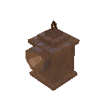|780fd3e6024bdc30d847989af9685c49|$piece_hoodedlantern|Hooded Lantern|Aimed in just one direction, the light grows more potent. Convenient for sneak thieves, or those who wish to leave a trail.|<ul><li>3 Timberwood</li><li>1 Luminous Larva</li></ul>|Wood|Misc|Lighting|
|piece_jackoturnip |5e754918ee5f4f1178a67f6936e51205|$piece_jackoturnip|Jack-o-turnip|The face carved into this vegetable...is it spooky or friendly?|<ul><li>4 Turnip</li><li>2 Resin</li></ul>|Wood|Furniture|Lighting, Decor, Seasonal Items|
|piece_snowlantern 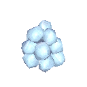|a6492fc6b99770c4daa9bdd0502aaf09|$piece_snowlantern|Snow Lantern|Adds a cosy touch to a wintry landscape.|<ul><li>8 Snowball</li></ul>|Wood|DeepNorth|Lighting, Decor|
|piece_walltorch |778da688a38474f53ac49b87e1169858|$piece_sconce|Sconce|Why stick a torch in the ground when you can hang it on your wall?|<ul><li>2 Wood</li><li>2 Copper</li><li>2 Resin</li></ul>|Wood|Furniture|Lighting|
|rug_deer |62798ecfa3f8340d9983c91eb5d2c503|$piece_rug_deer|Deer Rug|Protects your feet from wood splinters.|<ul><li>4 Deer Hide</li></ul>|Wood|Furniture|Decor|
|rug_Bjorn |997c322d142fc9b4b89c0a8156e1498c|$piece_rug_bjorn|Bearskin Rug|The fur is soft, though the teeth are still sharp.|<ul><li>1 Bear Hide</li><li>2 Bear Paw</li><li>1 Bear Trophy</li></ul>|Wood|Furniture|Decor|
|rug_wolf |c48bda679ae7ab44fb742b4f6f7127e0|$piece_rug_wolf|Wolf Rug|Warm and cosy, especially up in the mountains.|<ul><li>4 Wolf Pelt</li></ul>|Wood|Furniture|Decor|
|rug_fur |c80bc8ac3c7544f3198dabaf223942fd|$piece_rug_lox|Lox Rug|It's incredibly fluffy!|<ul><li>4 Lox Pelt</li></ul>|Wood|Furniture|Decor|
|rug_straw |e0741e5c4dd47c24fbb6bdac030a685e|$piece_rug_straw|Straw|Your animals will love this.|<ul><li>1 Barley</li><li>1 Flax</li></ul>|Wood|Furniture|Decor|
|rug_hare |e6504d64b34500c40ab6aa357a4a0d71|$piece_rug_hare|Hare Rug|It's a strange texture, but a very interesting piece of decor.|<ul><li>4 Scale Hide</li></ul>|Wood|Furniture|Decor|
|rug_asksvin |cb1d6f8d1565f644e94b1c9447327b4d|$piece_rug_asksvin|Asksvin Rug|With how lumpy asksvin hide is, it's hard to make anything useful from a single piece. Some assembly is required.|<ul><li>4 Asksvin Hide</li></ul>|Wood|Furniture|Decor|
|rug_seal 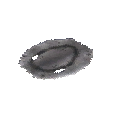|5c947e1d790e9804c9020b1330a50359|$piece_rug_seal|Sealskin Rug|This rug is so soft, soft like innocence.|<ul><li>4 Seal Pelt</li></ul>|Wood|DeepNorth|Decor|
|rug_moose 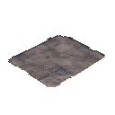|b1254b95e51a8cf4cb56407825c5c001|$piece_rug_moose|Moose Hide Carpet|This carpet is neatly sewn together, to ensure a large, soft surface.|<ul><li>4 Moose Hide</li></ul>|Wood|Furniture|Decor|
|jute_carpet |4c87351c227fb85ca855ba776f1a7a6c|$piece_jute_carpet|Red Jute Carpet|This coarse fabric is excellent for keeping the cold at bay.|<ul><li>4 Red Jute</li></ul>|Wood|Furniture|Decor|
|jute_carpet_blue |6a4ef9eb4bd2ea2b788c8c86fd29c69a|$piece_juteblue_carpet|Blue Jute Carpet|No matter how misty the air is, this carpet doesn't appear to get damp.|<ul><li>4 Blue Jute</li></ul>|Wood|Furniture|Decor|
|piece_cloth_hanging_door |df56dac48ab2895cdaf605b05404ed02|$piece_clothdoor|Red Jute Curtain|Heavy curtains of red jute, excellent for draping.|<ul><li>4 Red Jute</li><li>1 Finewood</li></ul>|Wood|Furniture|Decor|
|piece_cloth_hanging_door_blue |3dc01e010cc2b7a47bcd4acc1cbc6910|$piece_hanging_cloth_blue1|Blue Jute Drapes|Blue jute makes any building look official and important.|<ul><li>4 Blue Jute</li><li>1 Finewood</li></ul>|Wood|Furniture|Decor|
|piece_cloth_hanging_door_blue2 |57d32be19b0ff5748bfaa075fd42e46a|$piece_hanging_cloth_blue2|Blue Jute Curtain|Blue jute makes any building look official and important.|<ul><li>4 Blue Jute</li><li>1 Finewood</li></ul>|Wood|Furniture|Decor|
|piece_banner01 |287d856e336259f4e992dbdfdb370c09|$piece_banner01|Black Banner|A black banner, like the depths of Hel.|<ul><li>6 Leather Scraps</li><li>2 Finewood</li><li>4 Coal</li></ul>|Wood|Furniture|Decor|
|piece_banner02 |0c3b9e090babadb488b4bd400ff01e14|$piece_banner02|Blue Banner|A blue banner, like the oceans around Midgard.|<ul><li>6 Leather Scraps</li><li>2 Finewood</li><li>4 Blueberries</li></ul>|Wood|Furniture|Decor|
|piece_banner03 |dfb0d13eef872124ab088e23b7072dd8|$piece_banner03|White and Red Striped Banner|A red striped banner, like a sail for a ship.|<ul><li>6 Leather Scraps</li><li>2 Finewood</li><li>4 Raspberries</li></ul>|Wood|Furniture|Decor|
|piece_banner04 |0cb2dc89959fe8b41bc65b51e8b61fac|$piece_banner04|Red Banner|A red banner, like the blood of Odin's foes.|<ul><li>6 Leather Scraps</li><li>2 Finewood</li><li>1 Bloodbag</li></ul>|Wood|Furniture|Decor|
|piece_banner05 |1c4f98d13aec67044ae1fbf803181db2|$piece_banner05|Green Banner|A green banner, like the lush forests of Alfheim.|<ul><li>6 Leather Scraps</li><li>2 Finewood</li><li>1 Guck</li></ul>|Wood|Furniture|Decor|
|piece_banner06 |40fdc9ae3e634fd42a8092d11eef0eb2|$piece_banner06|Blue, Red and White Banner|A red and blue striped banner, because sometimes you can't pick a colour.|<ul><li>6 Leather Scraps</li><li>2 Finewood</li><li>2 Blueberries</li><li>2 Raspberries</li><li>1 Cloudberries</li></ul>|Wood|Furniture|Decor|
|piece_banner07 |bfd73687afdf561479dbb9d82973a801|$piece_banner07|White and Blue Striped Banner|A blue striped banner, like a sail for a ship.|<ul><li>6 Leather Scraps</li><li>2 Finewood</li><li>2 Blueberries</li><li>3 Cloudberries</li></ul>|Wood|Furniture|Decor|
|piece_banner08 |132270cc0d8bfdb43b1f9a5849e8f948|$piece_banner08|Yellow Banner|A yellow banner, like the golden fields of Vanaheim.|<ul><li>6 Leather Scraps</li><li>2 Finewood</li><li>4 Dandelion</li><li>2 Coal</li></ul>|Wood|Furniture|Decor|
|piece_banner09 |088c512b93911d448b0b08de1dfc778d|$piece_banner09|Purple Banner|A purple banner, like strange magics.|<ul><li>6 Leather Scraps</li><li>2 Finewood</li><li>2 Blueberries</li><li>3 Raspberries</li></ul>|Wood|Furniture|Decor|
|piece_banner10 |1aeba1501890e3841be1ae2e9311faac|$piece_banner10|Orange Banner|An orange banner, like the fires of Muspelheim.|<ul><li>6 Leather Scraps</li><li>2 Finewood</li><li>2 Carrot</li><li>3 Cloudberries</li></ul>|Wood|Furniture|Decor|
|piece_banner11 |a0e1963b61299f7438e9324573acf4fd|$piece_banner11|White Banner|A white banner, like the snow in Niflheim.|<ul><li>6 Leather Scraps</li><li>2 Finewood</li><li>2 Coal</li><li>4 Cloudberries</li></ul>|Wood|Furniture|Decor|
|piece_CelebrationGarland 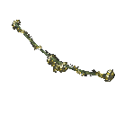|0b2eb84593c9e304bb7fd306492deac4|$piece_celebrationgarland|Flower Garland|Some flowers to brighten up your day!|<ul><li>2 Finewood</li><li>1 Dandelion</li></ul>|Wood|Furniture|Decor|
|piece_FairylightGarland |676d2670425d10049b2341e11c658dab|$piece_fairylightgarland|Fey Lights|Lends a gentle light to your festivities.|<ul><li>2 Finewood</li><li>1 Thistle</li></ul>|Wood|Furniture|Lighting, Decor|
|piece_maypole |228d5c5e4633041a69edc142fb00bc91|$piece_maypole|Maypole|On the longest day of the year, let this monument stretch towards the sun!|<ul><li>10 Wood</li><li>4 Dandelion</li><li>4 Thistle</li></ul>|Wood|Furniture|Decor, Seasonal Items|
|piece_mistletoe |468de38450691d49994f17f79b4093ea|$piece_mistletoe|Mistletoe|You can't help but to feel like there's something romantic about this...|<ul><li>1 Finewood</li><li>1 Red Jute</li></ul>|Wood|Furniture|Decor, Seasonal Items|
|piece_xmascrown |3817dc1b7e4b8e4dbb8d48d6c73a8fbf|$piece_yulecrown|Yule Wreath|It's hard to think of anything more festive than a wreath!|<ul><li>4 Pine Cone</li><li>1 Red Jute</li><li>1 Finewood</li></ul>|Wood|Furniture|Decor, Seasonal Items|
|piece_xmasgarland |897a02aeaa103d2f994c6fd6c36a7930|$piece_yulegarland|Yule Garland|Deck the halls!|<ul><li>2 Finewood</li><li>1 Pine Cone</li></ul>|Wood|Furniture|Decor, Seasonal Items|
|piece_xmastree |3ae8dd38b26a54204aab7436fd17e9cb|$piece_yuletree|Yule Tree|This fir tree has been given festive decorative lights.|<ul><li>10 Wood</li><li>1 Fir Cone</li></ul>|Wood|Furniture|Decor, Seasonal Items|
|Placeable_HardRock |f5042c7f7b27cb342af58a21fdf1638e|$item_hardrock|Mysterious Rock|It's just a rock...|<ul><li>1 Rock</li><li>1 Coal</li></ul>|Wood|Misc|Misc.|
|wood_stack |2cc4b9c6e6f654e44b70824accb1bac4|$piece_woodstack|Wood Stack|Put all that hard work on display!|<ul><li>50 Wood</li></ul>|Wood|Misc|Misc., Piles and Stacks|
|wood_fine_stack |19d7799370f19924e85773651ea54778|$piece_woodfinestack|Finewood Stack|This pile of wood is waiting to be turned into furniture.|<ul><li>50 Finewood</li></ul>|Wood|Misc|Misc., Piles and Stacks|
|wood_core_stack |6ff27bd580da57a40a2f05d44e7955a6|$piece_woodcorestack|Corewood Stack|A big pile of logs, fresh from the forest.|<ul><li>50 Corewood</li></ul>|Wood|Misc|Misc., Piles and Stacks|
|wood_yggdrasil_stack |97ca0fd8b81888557abf6eeb2ede448e|$piece_yggdrasilstack|Yggdrasil Wood Stack|Fine branches, thrumming with mysterious energy.|<ul><li>50 Yggdrasil Wood</li></ul>|HardWood|Misc|Misc., Piles and Stacks|
|blackwood_stack |404242e06d4e356628efc367513e4840|$piece_blackwoodstack|Ashwood Stack|No matter what, this stack of wood always feels warm.|<ul><li>50 Ashwood</li></ul>|Wood|Misc|Misc., Piles and Stacks|
|wood_frost_stack 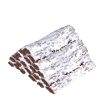|5d56d93cb43a41045b0a67041022da24|$piece_woodfroststack|Timberwood Stack|It's as if fresh snow just fell upon it...|<ul><li>50 Timberwood</li></ul>|Wood|Misc|Misc., Piles and Stacks|
|stone_pile |4c81ace38f76f4327be4f49c946dbf3b|$piece_stonepile|Stone Pile|It's a big pile of stone.|<ul><li>50 Stone</li></ul>|Wood|Misc|Misc., Piles and Stacks|
|flint_pile 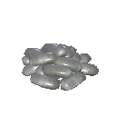|e83c8ccac251cf9fd93563251ea1ec02|$piece_flintpile|Flint Pile|Watch your step!|<ul><li>50 Flint</li></ul>|Wood|Misc|Misc., Piles and Stacks|
|blackmarble_pile |568a3bd9e41ae7a119aa5813ef236624|$piece_marblepile|Black Marble Pile|Perfect for Dvergr inspired construction.|<ul><li>50 Black Marble</li></ul>|Wood|Misc|Misc., Piles and Stacks|
|grausten_pile |bcdaf0b1b31a77939ac5559226e35137|$piece_graustenpile|Grausten Pile|Grausten, carefully placed into a pile.|<ul><li>50 Grausten</li></ul>|Wood|Misc|Misc., Piles and Stacks|
|bar_tin_stack 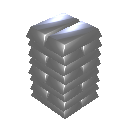|380df7a4705a46747b0ece7cbc270efa|$piece_tinbarstack|Tin Stack|You can make a lot of bronze with this...|<ul><li>30 Tin</li></ul>|Wood|Misc|Misc., Piles and Stacks|
|bar_copper_stack 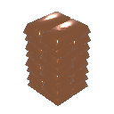|1197fa266681933089c4ee5450e2e7e3|$piece_copperbarstack|Copper Stack|Premium quality copper. Nothing to complain about!|<ul><li>30 Copper</li></ul>|Wood|Misc|Misc., Piles and Stacks|
|bar_bronze_stack 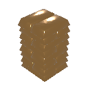|53d82bada63e17069a24198af35ae157|$piece_bronzebarstack|Bronze Stack|Beautiful, versatile... Now also stackable!|<ul><li>30 Bronze</li></ul>|Wood|Misc|Misc., Piles and Stacks|
|bar_iron_stack 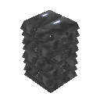|f1efecab2f90bcb43a9c24b03046226f|$piece_ironbarstack|Iron Stack|If you have iron, you have everything.|<ul><li>30 Iron</li></ul>|Wood|Misc|Misc., Piles and Stacks|
|bar_silver_stack 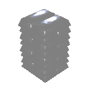|222c2b9aa10fbf30db7acf0f03b6cd9e|$piece_silverbarstack|Silver Stack|A tidy way of displaying your wealth.|<ul><li>30 Silver</li></ul>|Wood|Misc|Misc., Piles and Stacks|
|bar_blackmetal_stack 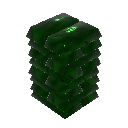|65a932092c8b57798b389b56bc332523|$piece_blackmetalbarstack|Black Metal Stack|Sure to be the envy of all fulings!|<ul><li>30 Black Metal</li></ul>|Wood|Misc|Misc., Piles and Stacks|
|bar_flametal_stack 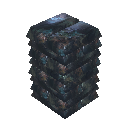|3605f7c947ad688d6bad0e756d1e3c18|$piece_flametalbarstack|Flametal Stack|The heat is practically radiating from this stack...|<ul><li>30 Flametal</li></ul>|Wood|Misc|Misc., Piles and Stacks|
|bar_gold_stack 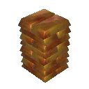|6e0b5a797c231e4a7b127318426d935a|$piece_bloodgoldbarstack|Bloodgold Stack|This metal does have a more sinister air than others, doesn't it?|<ul><li>30 Bloodgold</li></ul>|Wood|Misc|Misc., Piles and Stacks|
|coal_pile |e74c2a06eb4567f43815c60f0a216ec4|$piece_coalpile|Coal Pile|It never hurts to have a lot of fuel on hand.|<ul><li>50 Coal</li></ul>|Wood|Misc|Misc., Piles and Stacks|
|bone_stack |bbd62f65ebcfc3d829ae80c61c8eddc4|$piece_bonestack|Bone Stack|You never know when these might come in handy!|<ul><li>50 Bone Fragments</li></ul>|Wood|Misc|Misc., Piles and Stacks|
|skull_pile |30d2dc4d547bc8e5dbb47c8da6cf15b1|$piece_skullpile|Pile of Skulls|A certain proof of your prowess in combat.|<ul><li>50 Charred Skull</li></ul>|Wood|Misc|Misc., Piles and Stacks|
|treasure_stack |1c76bb3305c33b440a792928962480f0|$piece_treasure_stack|Coin Stack|It's important to keep count of your coins.|<ul><li>99 Coins</li></ul>|Wood|Misc|Misc., Piles and Stacks|
|treasure_pile |9d2da989f175a7d4595ec395585e1018|$piece_treasure_pile|Coin Pile|A small fortune, gleaming and glittering.|<ul><li>999 Coins</li></ul>|Wood|Misc|Misc., Piles and Stacks|
|piece_asksvinskeleton |6581240a0d276d84d84e6e8362d5aeba|$piece_asksvinskeleton|Asksvin Skeleton|Gruesome or decorative? That is up to you.|<ul><li>50 Bone Fragments</li><li>1 Asksvin Neck</li><li>1 Asksvin Pelvis</li><li>1 Asksvin Ribcage</li><li>1 Asksvin Skull</li></ul>|Wood|Furniture|Decor|
|portal_wood |72c23e1c29b4a426a9c38129ad389791|$piece_portal|Portal|Connects to another portal with equal or no tag.|<ul><li>10 Greydwarf Eye</li><li>20 Finewood</li><li>2 Surtling Core</li></ul>|Wood|Misc|Transportation|
|portal_stone |bb9b549991225de4ca2926bfeacf582b|$piece_portal_stone|Portal  Stone|The powerful energy source lets you pass through even with the most valuable of items.|<ul><li>10 Greydwarf Eye</li><li>30 Grausten</li><li>2 Molten Core</li></ul>|Stone|Misc|Transportation|
|Raft |b65169457de244e75b31b05da7d3d9dd|$ship_raft|Raft|It may not look like much, but a raft will get you farther than swimming!|<ul><li>20 Wood</li><li>6 Leather Scraps</li><li>6 Resin</li></ul>|Wood|Misc|Transportation|
|Karve |3b9f574b78ca248f28b7f25733995873|$ship_karve|Karve|A small and sleek ship, ready to set sail.|<ul><li>30 Finewood</li><li>10 Deer Hide</li><li>20 Resin</li><li>80 Bronze Nails</li></ul>|Wood|Misc|Transportation|
|VikingShip |b6effad31ba38473ea35ca303ad411d3|$ship_longship|Longship|A mighty viking ship for sailing to distant shores.|<ul><li>100 Iron Nails</li><li>10 Deer Hide</li><li>40 Finewood</li><li>40 Ancient Bark</li></ul>|Wood|Misc|Transportation|
|VikingShip_Ashlands |a420f61fbaae18048beb1dd3bdc223d2|$ship_longship_ashlands|Drakkar|A massive ship, sturdy enough to sail on even the most dangerous seas.|<ul><li>100 Iron Nails</li><li>30 Ceramic Plate</li><li>50 Finewood</li><li>25 Yggdrasil Wood</li></ul>|Wood|Misc|Transportation|
|piece_bathtub |e8de8d8939eef5b48be734ea6e082520|$piece_bathtub|Hot Tub|Respectable vikings bathe as often as once per week!|<ul><li>20 Wood</li><li>6 Tar</li><li>10 Iron</li><li>8 Stone</li></ul>|Wood|Furniture|Furniture|
|piece_barber |671bfc3cb4cfdf34084a45bee1f0b894|$piece_barber|Barber Station|Helps you stay up to date with the latest viking fashion.|<ul><li>10 Finewood</li><li>1 Barber Kit</li><li>5 Bronze Nails</li><li>5 Troll Hide</li></ul>|Wood|Furniture|Furniture|
|piece_cartographytable |3449de09ba416549383a0728fb2535a1|$piece_cartographytable|Cartography Table|Mark your discoveries on this map and share them with your friends.|<ul><li>10 Finewood</li><li>10 Bone Fragments</li><li>2 Bronze</li><li>5 Leather Scraps</li><li>4 Raspberries</li></ul>|Wood|Misc|Misc., Furniture|
|piece_TrainingDummy |43638f29248196d4db1026765de61f26|$piece_trainingdummy|T.W.I.G.|Step close at your own risk!|<ul><li>5 Finewood</li><li>10 Bronze Nails</li><li>5 Ectoplasm</li></ul>||Misc|Misc., Defence|
|piece_ArcheryTarget |2b9a03c795542b6419431001367e7625|$piece_archerytarget|Archery Target|Aim for the center.|<ul><li>4 Finewood</li><li>10 Leather Scraps</li></ul>|Wood|Misc|Misc.|
|guard_stone |9956b971c266b4e64b7c410027b87532|$piece_guardstone|Ward|Emits a magic seal on the nearby surroundings which prevents other players from constructing buildings or opening doors.|<ul><li>5 Finewood</li><li>5 Greydwarf Eye</li><li>1 Surtling Core</li></ul>|Stone|Misc|Decor, Defence|
|piece_shieldgenerator |c9f31857976c8ff499a1915491e3be2e|$piece_shieldgenerator|Shield Generator|Creates a shield to protect against weather and incoming projectiles. Fuelled by bones of any kind.|<ul><li>5 Iron</li><li>5 Copper</li><li>1 Shield Core</li></ul>|Stone|Misc|Defence|
|piece_trap_troll |24292e4fb57c6ab4a957c13b3ce04915|$piece_trap|Trap|This trap will clamp down on whatever steps on it. Careful!|<ul><li>5 Black Metal</li><li>10 Bronze Nails</li><li>1 Mechanical Spring</li></ul>|Iron|Misc|Defence|
|piece_turret |ce38c6d19c32b014d99a3518c8010674|$piece_turret|Ballista|Defensive structure that shoots missiles at anything that gets in its way.|<ul><li>10 Black Metal</li><li>10 Yggdrasil Wood</li><li>3 Mechanical Spring</li></ul>|Wood|Misc|Defence|
|BatteringRam |598c937f0b42a0b4fa8fb265b5298a3c|$tool_batteringram|Battering Ram|This is a force to be reckoned with. Fuel it up and bring it to your enemies' stronghold for a greater chance of success.|<ul><li>20 Ashwood</li><li>10 Flametal</li><li>2 Surtling Core</li></ul>|Wood|Misc|Defence|
|Catapult |93921a591a27a884e8c48125ea190084|$tool_catapult|Catapult|If you can't go through it, perhaps you can go over it...|<ul><li>20 Ashwood</li><li>10 Flametal</li><li>1 Charred Cogwheel</li></ul>|Wood|Misc|Defence|
## _HoePieceTable

|Piece |AssetID |Token |English Name |Description |Resources required |Material Type |Piece Category |Hammer Categories |
|---|---|---|---|---|---|---|---|---|
|mud_road_v2|ed80c66b8108b0c11a3bf68086e1c536|$piece_levelground|Level Ground|If the terrain is too lumpy, you can just flatten it.|<ul></ul>||Misc|Misc.|
|raise_v2|f44128242fde1b48ca3a91a577ee9872|$piece_raise|Raise Ground|Fill holes and create elevated platforms.|<ul><li>2 Stone</li></ul>||Misc|Misc.|
|path_v2|92740b48761f2a503bc68327aecc5a68|$piece_path|Pathen|Mark out the best way forward.|<ul></ul>||Misc|Misc.|
|paved_road_v2|11377d2a6ee724444be5e58d4479f95c|$piece_pavedroad|Paved Road|A sure mark of civilisation.|<ul><li>1 Stone</li></ul>||Misc|Misc.|
|Placeable_Stone |d29a5f6559d02af46835aa2c7cda1e0d|$item_stone|Stone|It's a rock.|<ul><li>1 Stone</li></ul>|Stone|Misc|Misc.|
|placeable_bigrock_02 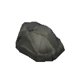|4c7f555bbcd35874f9196df7296be078|$piece_rock_02|Decorative Boulder|That is a nice boulder.|<ul><li>10 Stone</li></ul>||Misc|Misc.|
|placeable_bigrock_01 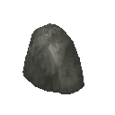|50d65c6755621c246aaa33c885fbc777|$piece_rock_01|Ornamental Boulder|Adds a rustic touch to any garden.|<ul><li>25 Stone</li></ul>||Misc|Misc.|
