# Character list
All of the Character prefabs currently in the game.
This file is automatically generated from Valheim 0.217.38 using the JotunnDoc mod found on our GitHub.

|Name |Components |DamageModifiers |Items |Drops |
|---|---|---|---|---|
|Abomination 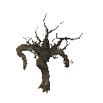|<ul><li>Transform</li><li>CapsuleCollider</li><li>Rigidbody</li><li>Humanoid</li><li>ZNetView</li><li>ZSyncTransform</li><li>ZSyncAnimation</li><li>MonsterAI</li><li>CharacterDrop</li><li>VisEquipment</li><li>FootStep</li></ul>|<ul><li>Blunt: Resistant</li><li>Slash: Normal</li><li>Pierce: VeryResistant</li><li>Chop: Ignore</li><li>Pickaxe: Ignore</li><li>Fire: Weak</li><li>Frost: Immune</li><li>Lightning: Normal</li><li>Poison: Immune</li><li>Spirit: Immune</li></ul>|Default Items: <ul><li>Abomination_attack1</li><li>Abomination_attack2</li><li>Abomination_attack3</li></ul>Random Weapon: Random Armor: Random Shield:|<ul><li>TrophyAbomination (50%)</li><li>Root (5x)</li><li>Guck (3-5x)</li></ul>|
|Bat 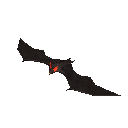|<ul><li>Transform</li><li>CapsuleCollider</li><li>Rigidbody</li><li>Humanoid</li><li>ZNetView</li><li>ZSyncTransform</li><li>ZSyncAnimation</li><li>MonsterAI</li><li>CharacterDrop</li></ul>|<ul><li>Blunt: Resistant</li><li>Slash: Resistant</li><li>Pierce: Resistant</li><li>Chop: Ignore</li><li>Pickaxe: Ignore</li><li>Fire: Weak</li><li>Frost: Immune</li><li>Lightning: Normal</li><li>Poison: Immune</li><li>Spirit: Weak</li></ul>|Default Items: <ul><li>bat_melee</li></ul>Random Weapon: Random Armor: Random Shield:|<ul><li>LeatherScraps (50%)</li></ul>|
|Blob 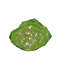|<ul><li>Transform</li><li>CapsuleCollider</li><li>Rigidbody</li><li>Humanoid</li><li>CharacterDrop</li><li>ZNetView</li><li>ZSyncTransform</li><li>ZSyncAnimation</li><li>MonsterAI</li><li>FootStep</li></ul>|<ul><li>Blunt: Weak</li><li>Slash: Resistant</li><li>Pierce: Resistant</li><li>Chop: Ignore</li><li>Pickaxe: Ignore</li><li>Fire: Resistant</li><li>Frost: Weak</li><li>Lightning: Weak</li><li>Poison: Immune</li><li>Spirit: Normal</li></ul>|Default Items: <ul><li>blob_attack_aoe</li></ul>Random Weapon: Random Armor: Random Shield:|<ul><li>TrophyBlob (10%)</li><li>Ooze (1-2x)</li></ul>|
|BlobElite 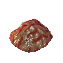|<ul><li>Transform</li><li>CapsuleCollider</li><li>Rigidbody</li><li>Humanoid</li><li>CharacterDrop</li><li>ZNetView</li><li>ZSyncTransform</li><li>ZSyncAnimation</li><li>MonsterAI</li><li>FootStep</li></ul>|<ul><li>Blunt: Weak</li><li>Slash: Resistant</li><li>Pierce: Resistant</li><li>Chop: Ignore</li><li>Pickaxe: Ignore</li><li>Fire: Resistant</li><li>Frost: Weak</li><li>Lightning: Weak</li><li>Poison: Immune</li><li>Spirit: Normal</li></ul>|Default Items: <ul><li>blobelite_attack_aoe</li></ul>Random Weapon: Random Armor: Random Shield:|<ul><li>Ooze (2-3x)</li><li>IronScrap (33%)</li><li>TrophyBlob (10%)</li><li>Blob (2x)</li></ul>|
|BlobTar 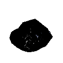|<ul><li>Transform</li><li>CapsuleCollider</li><li>Rigidbody</li><li>Humanoid</li><li>CharacterDrop</li><li>ZNetView</li><li>ZSyncTransform</li><li>ZSyncAnimation</li><li>MonsterAI</li><li>FootStep</li></ul>|<ul><li>Blunt: Weak</li><li>Slash: Resistant</li><li>Pierce: Resistant</li><li>Chop: Ignore</li><li>Pickaxe: Ignore</li><li>Fire: Weak</li><li>Frost: Resistant</li><li>Lightning: Normal</li><li>Poison: Immune</li><li>Spirit: Normal</li></ul>|Default Items: <ul><li>blobtar_attack</li></ul>Random Weapon: Random Armor: Random Shield:|<ul><li>TrophyGrowth (10%)</li><li>Tar (1x)</li></ul>|
|Boar 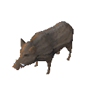|<ul><li>Transform</li><li>CapsuleCollider</li><li>Rigidbody</li><li>Humanoid</li><li>MonsterAI</li><li>CharacterDrop</li><li>ZNetView</li><li>ZSyncTransform</li><li>ZSyncAnimation</li><li>FootStep</li><li>Procreation</li><li>Tameable</li></ul>|<ul><li>Blunt: Normal</li><li>Slash: Normal</li><li>Pierce: Normal</li><li>Chop: Ignore</li><li>Pickaxe: Ignore</li><li>Fire: Normal</li><li>Frost: Normal</li><li>Lightning: Normal</li><li>Poison: Normal</li><li>Spirit: Immune</li></ul>|Default Items: <ul><li>boar_base_attack</li></ul>Random Weapon: Random Armor: Random Shield:|<ul><li>RawMeat (1x)</li><li>LeatherScraps (1x)</li><li>TrophyBoar (15%)</li></ul>|
|Boar_piggy 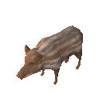|<ul><li>Transform</li><li>CapsuleCollider</li><li>Rigidbody</li><li>Humanoid</li><li>AnimalAI</li><li>ZNetView</li><li>ZSyncTransform</li><li>ZSyncAnimation</li><li>Growup</li></ul>|<ul><li>Blunt: Normal</li><li>Slash: Normal</li><li>Pierce: Normal</li><li>Chop: Ignore</li><li>Pickaxe: Ignore</li><li>Fire: Normal</li><li>Frost: Normal</li><li>Lightning: Normal</li><li>Poison: Normal</li><li>Spirit: Immune</li></ul>|Default Items: Random Weapon: Random Armor: Random Shield:||
|Bonemass 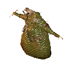|<ul><li>Transform</li><li>CapsuleCollider</li><li>Rigidbody</li><li>Humanoid</li><li>ZNetView</li><li>ZSyncTransform</li><li>ZSyncAnimation</li><li>MonsterAI</li><li>CharacterDrop</li><li>VisEquipment</li></ul>|<ul><li>Blunt: Weak</li><li>Slash: Resistant</li><li>Pierce: VeryResistant</li><li>Chop: Ignore</li><li>Pickaxe: Ignore</li><li>Fire: VeryResistant</li><li>Frost: Weak</li><li>Lightning: Normal</li><li>Poison: Immune</li><li>Spirit: Normal</li></ul>|Default Items: <ul><li>bonemass_attack_aoe</li><li>bonemass_attack_punch</li><li>bonemass_attack_throw</li></ul>Random Weapon: Random Armor: Random Shield:|<ul><li>TrophyBonemass (1x)</li><li>Wishbone (1x)</li></ul>|
|Chicken 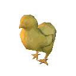|<ul><li>Transform</li><li>CapsuleCollider</li><li>Rigidbody</li><li>Humanoid</li><li>AnimalAI</li><li>ZNetView</li><li>ZSyncTransform</li><li>ZSyncAnimation</li><li>Growup</li><li>CharacterDrop</li></ul>|<ul><li>Blunt: Normal</li><li>Slash: Normal</li><li>Pierce: Normal</li><li>Chop: Ignore</li><li>Pickaxe: Ignore</li><li>Fire: Normal</li><li>Frost: Normal</li><li>Lightning: Normal</li><li>Poison: Normal</li><li>Spirit: Immune</li></ul>|Default Items: Random Weapon: Random Armor: Random Shield:|<ul><li>ChickenMeat (25%)</li><li>Feathers (50% 1-2x)</li></ul>|
|Deathsquito |<ul><li>Transform</li><li>CapsuleCollider</li><li>Rigidbody</li><li>Humanoid</li><li>ZNetView</li><li>ZSyncTransform</li><li>ZSyncAnimation</li><li>MonsterAI</li><li>CharacterDrop</li></ul>|<ul><li>Blunt: Normal</li><li>Slash: Normal</li><li>Pierce: Normal</li><li>Chop: Ignore</li><li>Pickaxe: Ignore</li><li>Fire: Normal</li><li>Frost: Normal</li><li>Lightning: Normal</li><li>Poison: Normal</li><li>Spirit: Immune</li></ul>|Default Items: <ul><li>Deathsquito_sting</li></ul>Random Weapon: Random Armor: Random Shield:|<ul><li>Needle (1x)</li><li>TrophyDeathsquito (5%)</li></ul>|
|Deer 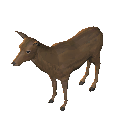|<ul><li>Transform</li><li>CapsuleCollider</li><li>Rigidbody</li><li>Character</li><li>CharacterDrop</li><li>ZNetView</li><li>ZSyncTransform</li><li>ZSyncAnimation</li><li>AnimalAI</li><li>FootStep</li></ul>|<ul><li>Blunt: Normal</li><li>Slash: Normal</li><li>Pierce: Normal</li><li>Chop: Ignore</li><li>Pickaxe: Ignore</li><li>Fire: Normal</li><li>Frost: Normal</li><li>Lightning: Normal</li><li>Poison: Normal</li><li>Spirit: Immune</li></ul>||<ul><li>DeerMeat (2x)</li><li>DeerHide (1-3x)</li><li>TrophyDeer (50%)</li></ul>|
|Dragon 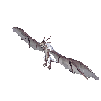|<ul><li>Transform</li><li>CapsuleCollider</li><li>Rigidbody</li><li>Humanoid</li><li>ZNetView</li><li>ZSyncTransform</li><li>ZSyncAnimation</li><li>MonsterAI</li><li>CharacterDrop</li><li>FootStep</li></ul>|<ul><li>Blunt: Normal</li><li>Slash: Normal</li><li>Pierce: Normal</li><li>Chop: Ignore</li><li>Pickaxe: Ignore</li><li>Fire: Weak</li><li>Frost: Immune</li><li>Lightning: Normal</li><li>Poison: Normal</li><li>Spirit: Immune</li></ul>|Default Items: <ul><li>dragon_taunt</li><li>dragon_bite</li><li>dragon_claw_left</li><li>dragon_claw_right</li><li>dragon_spit_shotgun</li><li>dragon_coldbreath</li></ul>Random Weapon: Random Armor: Random Shield:|<ul><li>TrophyDragonQueen (1x)</li><li>DragonTear (10x)</li></ul>|
|Draugr 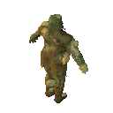|<ul><li>Transform</li><li>CapsuleCollider</li><li>Rigidbody</li><li>Humanoid</li><li>ZNetView</li><li>ZSyncTransform</li><li>ZSyncAnimation</li><li>MonsterAI</li><li>CharacterDrop</li><li>VisEquipment</li><li>FootStep</li></ul>|<ul><li>Blunt: Normal</li><li>Slash: Normal</li><li>Pierce: Normal</li><li>Chop: Ignore</li><li>Pickaxe: Ignore</li><li>Fire: Resistant</li><li>Frost: Normal</li><li>Lightning: Normal</li><li>Poison: Immune</li><li>Spirit: Normal</li></ul>|Default Items: Random Weapon: <ul><li>draugr_axe</li><li>draugr_axe</li><li>draugr_axe</li><li>draugr_bow</li></ul>Random Armor: Random Shield: <ul><li>ShieldWood</li><li>ShieldBanded</li></ul>|<ul><li>Entrails (1x)</li><li>TrophyDraugr (10%)</li></ul>|
|Draugr_Elite 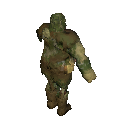|<ul><li>Transform</li><li>CapsuleCollider</li><li>Rigidbody</li><li>Humanoid</li><li>ZNetView</li><li>ZSyncTransform</li><li>ZSyncAnimation</li><li>MonsterAI</li><li>CharacterDrop</li><li>VisEquipment</li><li>FootStep</li></ul>|<ul><li>Blunt: Normal</li><li>Slash: Normal</li><li>Pierce: Normal</li><li>Chop: Ignore</li><li>Pickaxe: Ignore</li><li>Fire: Resistant</li><li>Frost: Normal</li><li>Lightning: Normal</li><li>Poison: Immune</li><li>Spirit: Normal</li></ul>|Default Items: Random Weapon: <ul><li>draugr_sword</li></ul>Random Armor: Random Shield:|<ul><li>Entrails (2-3x)</li><li>TrophyDraugrElite (10%)</li></ul>|
|Draugr_Ranged 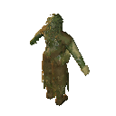|<ul><li>Transform</li><li>CapsuleCollider</li><li>Rigidbody</li><li>Humanoid</li><li>ZNetView</li><li>ZSyncTransform</li><li>ZSyncAnimation</li><li>MonsterAI</li><li>CharacterDrop</li><li>VisEquipment</li><li>FootStep</li></ul>|<ul><li>Blunt: Normal</li><li>Slash: Normal</li><li>Pierce: Normal</li><li>Chop: Ignore</li><li>Pickaxe: Ignore</li><li>Fire: Resistant</li><li>Frost: Normal</li><li>Lightning: Normal</li><li>Poison: Immune</li><li>Spirit: Normal</li></ul>|Default Items: Random Weapon: <ul><li>draugr_bow</li></ul>Random Armor: Random Shield:|<ul><li>Entrails (1x)</li><li>TrophyDraugr (10%)</li></ul>|
|Dverger |<ul><li>Transform</li><li>CapsuleCollider</li><li>Rigidbody</li><li>Humanoid</li><li>ZNetView</li><li>ZSyncTransform</li><li>ZSyncAnimation</li><li>MonsterAI</li><li>CharacterDrop</li><li>VisEquipment</li><li>FootStep</li><li>NpcTalk</li></ul>|<ul><li>Blunt: Normal</li><li>Slash: Normal</li><li>Pierce: Normal</li><li>Chop: Ignore</li><li>Pickaxe: Ignore</li><li>Fire: Normal</li><li>Frost: Normal</li><li>Lightning: Normal</li><li>Poison: Normal</li><li>Spirit: Immune</li></ul>|Default Items: <ul><li>DvergerArbalest</li><li>DvergerArbalest_shoot</li><li>Dverger_melee</li><li>DvergerSuitArbalest</li></ul>Random Weapon: Random Armor: Random Shield: <ul><li>DvergerHairMale</li><li>DvergerHairFemale</li></ul>|<ul><li>Softtissue (25% 1-2x)</li><li>BlackMarble (50% 1-2x)</li><li>Coins (2-15x)</li><li>TrophyDvergr (5%)</li></ul>|
|DvergerMage |<ul><li>Transform</li><li>CapsuleCollider</li><li>Rigidbody</li><li>Humanoid</li><li>ZNetView</li><li>ZSyncTransform</li><li>ZSyncAnimation</li><li>MonsterAI</li><li>CharacterDrop</li><li>VisEquipment</li><li>FootStep</li><li>NpcTalk</li></ul>|<ul><li>Blunt: Normal</li><li>Slash: Normal</li><li>Pierce: Normal</li><li>Chop: Ignore</li><li>Pickaxe: Ignore</li><li>Fire: Resistant</li><li>Frost: Resistant</li><li>Lightning: Normal</li><li>Poison: Normal</li><li>Spirit: Immune</li></ul>|Default Items: Random Weapon: Random Armor: Random Shield: <ul><li>DvergerHairMale</li><li>DvergerHairFemale</li></ul>|<ul><li>Softtissue (25% 1-2x)</li><li>BlackMarble (50% 1-2x)</li><li>Coins (2-15x)</li><li>TrophyDvergr (5%)</li></ul>|
|DvergerMageFire 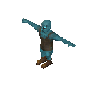|<ul><li>Transform</li><li>CapsuleCollider</li><li>Rigidbody</li><li>Humanoid</li><li>ZNetView</li><li>ZSyncTransform</li><li>ZSyncAnimation</li><li>MonsterAI</li><li>CharacterDrop</li><li>VisEquipment</li><li>FootStep</li><li>NpcTalk</li></ul>|<ul><li>Blunt: Normal</li><li>Slash: Normal</li><li>Pierce: Normal</li><li>Chop: Ignore</li><li>Pickaxe: Ignore</li><li>Fire: Resistant</li><li>Frost: Resistant</li><li>Lightning: Normal</li><li>Poison: Normal</li><li>Spirit: Immune</li></ul>|Default Items: <ul><li>Dverger_melee</li><li>DvergerStaffFire_fireball</li><li>DvergerStaffFire</li><li>DvergerSuitFire</li><li>DvergerStaffFire_clusterbomb</li></ul>Random Weapon: Random Armor: Random Shield: <ul><li>DvergerHairMale</li><li>DvergerHairFemale</li></ul>|<ul><li>Softtissue (25% 1-2x)</li><li>BlackMarble (50% 1-2x)</li><li>Coins (2-15x)</li><li>TrophyDvergr (5%)</li></ul>|
|DvergerMageIce |<ul><li>Transform</li><li>CapsuleCollider</li><li>Rigidbody</li><li>Humanoid</li><li>ZNetView</li><li>ZSyncTransform</li><li>ZSyncAnimation</li><li>MonsterAI</li><li>CharacterDrop</li><li>VisEquipment</li><li>FootStep</li><li>NpcTalk</li></ul>|<ul><li>Blunt: Normal</li><li>Slash: Normal</li><li>Pierce: Normal</li><li>Chop: Ignore</li><li>Pickaxe: Ignore</li><li>Fire: Resistant</li><li>Frost: Resistant</li><li>Lightning: Normal</li><li>Poison: Normal</li><li>Spirit: Immune</li></ul>|Default Items: <ul><li>Dverger_melee</li><li>DvergerStaffIce_icebolt</li><li>DvergerStaffNova</li><li>DvergerSuitIce</li><li>DvergerStaffIce</li></ul>Random Weapon: Random Armor: Random Shield: <ul><li>DvergerHairMale</li><li>DvergerHairFemale</li></ul>|<ul><li>Softtissue (25% 1-2x)</li><li>BlackMarble (50% 1-2x)</li><li>Coins (2-15x)</li><li>TrophyDvergr (5%)</li></ul>|
|DvergerMageSupport 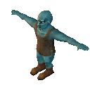|<ul><li>Transform</li><li>CapsuleCollider</li><li>Rigidbody</li><li>Humanoid</li><li>ZNetView</li><li>ZSyncTransform</li><li>ZSyncAnimation</li><li>MonsterAI</li><li>CharacterDrop</li><li>VisEquipment</li><li>FootStep</li><li>NpcTalk</li></ul>|<ul><li>Blunt: Normal</li><li>Slash: Normal</li><li>Pierce: Normal</li><li>Chop: Ignore</li><li>Pickaxe: Ignore</li><li>Fire: Resistant</li><li>Frost: Resistant</li><li>Lightning: Normal</li><li>Poison: Normal</li><li>Spirit: Immune</li></ul>|Default Items: <ul><li>DvergerStaffSupport_buff</li><li>DvergerStaffHeal</li><li>DvergerStaffHeal_heal</li><li>DvergerSuitSupport</li><li>DvergerMistile</li></ul>Random Weapon: Random Armor: Random Shield: <ul><li>DvergerHairMale</li><li>DvergerHairFemale</li></ul>|<ul><li>Softtissue (25% 1-2x)</li><li>BlackMarble (50% 1-2x)</li><li>Coins (2-15x)</li><li>TrophyDvergr (5%)</li></ul>|
|DvergerTest 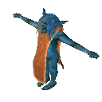|<ul><li>Transform</li><li>CapsuleCollider</li><li>Rigidbody</li><li>Humanoid</li><li>ZNetView</li><li>ZSyncTransform</li><li>ZSyncAnimation</li><li>MonsterAI</li><li>CharacterDrop</li><li>RandomAnimation</li><li>VisEquipment</li><li>FootStep</li><li>NpcTalk</li></ul>|<ul><li>Blunt: Normal</li><li>Slash: Normal</li><li>Pierce: Normal</li><li>Chop: Ignore</li><li>Pickaxe: Ignore</li><li>Fire: Normal</li><li>Frost: Normal</li><li>Lightning: Normal</li><li>Poison: Normal</li><li>Spirit: Immune</li></ul>|Default Items: <ul><li>GoblinShaman_attack_poke</li><li>GoblinShaman_attack_fireball</li></ul>Random Weapon: Random Armor: Random Shield:|<ul><li>Coins (25% 20-40x)</li><li>BlackMetalScrap (1-2x)</li><li>Pukeberries (1-2x)</li><li>TrophyGoblinShaman (10%)</li></ul>|
|Eikthyr 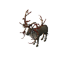|<ul><li>Transform</li><li>CapsuleCollider</li><li>Rigidbody</li><li>Humanoid</li><li>CharacterDrop</li><li>ZNetView</li><li>ZSyncTransform</li><li>ZSyncAnimation</li><li>RandomAnimation</li><li>MonsterAI</li><li>FootStep</li></ul>|<ul><li>Blunt: Normal</li><li>Slash: Normal</li><li>Pierce: Normal</li><li>Chop: Ignore</li><li>Pickaxe: Ignore</li><li>Fire: Normal</li><li>Frost: Normal</li><li>Lightning: Normal</li><li>Poison: Normal</li><li>Spirit: Normal</li></ul>|Default Items: <ul><li>Eikthyr_antler</li><li>Eikthyr_charge</li><li>Eikthyr_stomp</li></ul>Random Weapon: Random Armor: Random Shield:|<ul><li>TrophyEikthyr (1x)</li><li>HardAntler (3x)</li></ul>|
|Fenring 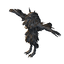|<ul><li>Transform</li><li>CapsuleCollider</li><li>Rigidbody</li><li>Humanoid</li><li>ZNetView</li><li>ZSyncTransform</li><li>ZSyncAnimation</li><li>MonsterAI</li><li>CharacterDrop</li><li>FootStep</li></ul>|<ul><li>Blunt: Normal</li><li>Slash: Normal</li><li>Pierce: Normal</li><li>Chop: Ignore</li><li>Pickaxe: Ignore</li><li>Fire: Weak</li><li>Frost: Normal</li><li>Lightning: Normal</li><li>Poison: Resistant</li><li>Spirit: Normal</li></ul>|Default Items: <ul><li>Fenring_taunt</li><li>Fenring_attack_claw</li><li>Fenring_attack_jump</li></ul>Random Weapon: Random Armor: Random Shield:|<ul><li>WolfFang (1-2x)</li><li>TrophyFenring (10%)</li></ul>|
|Fenring_Cultist 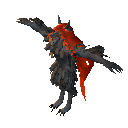|<ul><li>Transform</li><li>CapsuleCollider</li><li>Rigidbody</li><li>Humanoid</li><li>ZNetView</li><li>ZSyncTransform</li><li>ZSyncAnimation</li><li>MonsterAI</li><li>CharacterDrop</li><li>FootStep</li></ul>|<ul><li>Blunt: Normal</li><li>Slash: Normal</li><li>Pierce: Normal</li><li>Chop: Ignore</li><li>Pickaxe: Ignore</li><li>Fire: Immune</li><li>Frost: Normal</li><li>Lightning: Normal</li><li>Poison: Weak</li><li>Spirit: Normal</li></ul>|Default Items: <ul><li>Fenring_attack_fireclaw_double</li><li>Fenring_attack_fireclaw</li><li>Fenring_attack_flames</li></ul>Random Weapon: Random Armor: Random Shield:|<ul><li>JuteRed (1-3x)</li><li>TrophyCultist (10%)</li></ul>|
|Fenring_Cultist_Hildir 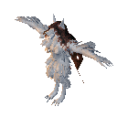|<ul><li>Transform</li><li>CapsuleCollider</li><li>Rigidbody</li><li>Humanoid</li><li>ZNetView</li><li>ZSyncTransform</li><li>ZSyncAnimation</li><li>MonsterAI</li><li>CharacterDrop</li><li>FootStep</li></ul>|<ul><li>Blunt: Normal</li><li>Slash: Normal</li><li>Pierce: Normal</li><li>Chop: Ignore</li><li>Pickaxe: Ignore</li><li>Fire: Weak</li><li>Frost: Immune</li><li>Lightning: Normal</li><li>Poison: Normal</li><li>Spirit: Normal</li></ul>|Default Items: <ul><li>Fenring_attack_iceclaw_double</li><li>Fenring_attack_iceclaw</li><li>Fenring_attack_frost</li><li>Fenring_attack_IceNova</li></ul>Random Weapon: Random Armor: Random Shield:|<ul><li>chest_hildir2 (1x)</li><li>TrophyCultist_Hildir (1x)</li></ul>|
|Fenring_Cultist_Hildir_nochest 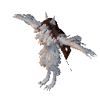|<ul><li>Transform</li><li>CapsuleCollider</li><li>Rigidbody</li><li>Humanoid</li><li>ZNetView</li><li>ZSyncTransform</li><li>ZSyncAnimation</li><li>MonsterAI</li><li>CharacterDrop</li><li>FootStep</li></ul>|<ul><li>Blunt: Normal</li><li>Slash: Normal</li><li>Pierce: Normal</li><li>Chop: Ignore</li><li>Pickaxe: Ignore</li><li>Fire: Weak</li><li>Frost: Immune</li><li>Lightning: Normal</li><li>Poison: Normal</li><li>Spirit: Normal</li></ul>|Default Items: <ul><li>Fenring_attack_iceclaw_double</li><li>Fenring_attack_iceclaw</li><li>Fenring_attack_frost</li><li>Fenring_attack_IceNova</li></ul>Random Weapon: Random Armor: Random Shield:|<ul><li>TrophyCultist_Hildir (1x)</li></ul>|
|gd_king |<ul><li>Transform</li><li>CapsuleCollider</li><li>Rigidbody</li><li>Humanoid</li><li>ZNetView</li><li>ZSyncTransform</li><li>ZSyncAnimation</li><li>MonsterAI</li><li>CharacterDrop</li><li>FootStep</li></ul>|<ul><li>Blunt: Normal</li><li>Slash: Normal</li><li>Pierce: Normal</li><li>Chop: Ignore</li><li>Pickaxe: Ignore</li><li>Fire: VeryWeak</li><li>Frost: Normal</li><li>Lightning: Normal</li><li>Poison: Immune</li><li>Spirit: Immune</li></ul>|Default Items: <ul><li>gd_king_rootspawn</li><li>gd_king_scream</li><li>gd_king_shoot</li><li>gd_king_stomp</li></ul>Random Weapon: Random Armor: Random Shield:|<ul><li>TrophyTheElder (1x)</li><li>CryptKey (1x)</li></ul>|
|Ghost |<ul><li>Transform</li><li>CapsuleCollider</li><li>Rigidbody</li><li>Humanoid</li><li>ZNetView</li><li>ZSyncTransform</li><li>ZSyncAnimation</li><li>MonsterAI</li><li>CharacterDrop</li><li>VisEquipment</li><li>FootStep</li></ul>|<ul><li>Blunt: Resistant</li><li>Slash: Resistant</li><li>Pierce: Resistant</li><li>Chop: Ignore</li><li>Pickaxe: Ignore</li><li>Fire: Normal</li><li>Frost: Normal</li><li>Lightning: Normal</li><li>Poison: Immune</li><li>Spirit: Weak</li></ul>|Default Items: Random Weapon: <ul><li>Ghost_attack</li></ul>Random Armor: Random Shield:|<ul></ul>|
|Gjall |<ul><li>Transform</li><li>CapsuleCollider</li><li>Rigidbody</li><li>Humanoid</li><li>ZNetView</li><li>ZSyncTransform</li><li>ZSyncAnimation</li><li>MonsterAI</li><li>CharacterDrop</li></ul>|<ul><li>Blunt: Normal</li><li>Slash: Normal</li><li>Pierce: Normal</li><li>Chop: Ignore</li><li>Pickaxe: Ignore</li><li>Fire: Resistant</li><li>Frost: Normal</li><li>Lightning: Normal</li><li>Poison: Normal</li><li>Spirit: Immune</li></ul>|Default Items: <ul><li>gjall_attack_spit</li><li>gjall_attack_egg</li><li>gjall_attack_shake</li><li>gjall_attack_taunt</li></ul>Random Weapon: Random Armor: Random Shield:|<ul><li>Bilebag (1x)</li><li>TrophyGjall (30%)</li></ul>|
|Goblin 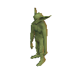|<ul><li>Transform</li><li>CapsuleCollider</li><li>Rigidbody</li><li>Humanoid</li><li>ZNetView</li><li>ZSyncTransform</li><li>ZSyncAnimation</li><li>MonsterAI</li><li>CharacterDrop</li><li>RandomAnimation</li><li>VisEquipment</li><li>FootStep</li></ul>|<ul><li>Blunt: Normal</li><li>Slash: Normal</li><li>Pierce: Normal</li><li>Chop: Ignore</li><li>Pickaxe: Ignore</li><li>Fire: Normal</li><li>Frost: Normal</li><li>Lightning: Normal</li><li>Poison: Normal</li><li>Spirit: Immune</li></ul>|Default Items: <ul><li>GoblinLoin</li></ul>Random Weapon: <ul><li>GoblinClub</li><li>GoblinClub</li><li>GoblinSpear</li><li>GoblinSword</li><li>GoblinSword</li><li>GoblinTorch</li></ul>Random Armor: <ul><li>GoblinHelmet</li><li>GoblinArmband</li><li>GoblinShoulders</li><li>GoblinLegband</li></ul>Random Shield: <ul><li>ShieldWood</li></ul>|<ul><li>Coins (25% 5-10x)</li><li>BlackMetalScrap (1-2x)</li><li>TrophyGoblin (10%)</li></ul>|
|GoblinArcher 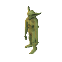|<ul><li>Transform</li><li>CapsuleCollider</li><li>Rigidbody</li><li>Humanoid</li><li>ZNetView</li><li>ZSyncTransform</li><li>ZSyncAnimation</li><li>MonsterAI</li><li>CharacterDrop</li><li>RandomAnimation</li><li>VisEquipment</li><li>FootStep</li></ul>|<ul><li>Blunt: Normal</li><li>Slash: Normal</li><li>Pierce: Normal</li><li>Chop: Ignore</li><li>Pickaxe: Ignore</li><li>Fire: Normal</li><li>Frost: Normal</li><li>Lightning: Normal</li><li>Poison: Normal</li><li>Spirit: Immune</li></ul>|Default Items: <ul><li>GoblinLoin</li></ul>Random Weapon: <ul><li>GoblinSpear</li></ul>Random Armor: <ul><li>GoblinHelmet</li><li>GoblinArmband</li><li>GoblinShoulders</li><li>GoblinLegband</li></ul>Random Shield: <ul><li>ShieldWood</li></ul>|<ul><li>Coins (25% 5-10x)</li><li>BlackMetalScrap (1-2x)</li><li>TrophyGoblin (10%)</li></ul>|
|GoblinBrute 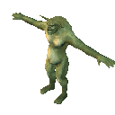|<ul><li>Transform</li><li>CapsuleCollider</li><li>Rigidbody</li><li>Humanoid</li><li>ZNetView</li><li>ZSyncTransform</li><li>ZSyncAnimation</li><li>MonsterAI</li><li>CharacterDrop</li><li>VisEquipment</li><li>FootStep</li></ul>|<ul><li>Blunt: Normal</li><li>Slash: Normal</li><li>Pierce: Normal</li><li>Chop: Ignore</li><li>Pickaxe: Ignore</li><li>Fire: Normal</li><li>Frost: Normal</li><li>Lightning: Normal</li><li>Poison: Normal</li><li>Spirit: Immune</li></ul>|Default Items: <ul><li>GoblinBrute_Attack</li><li>GoblinBrute_RageAttack</li><li>GoblinBrute_Taunt</li></ul>Random Weapon: Random Armor: Random Shield:|<ul><li>Coins (5-20x)</li><li>BlackMetalScrap (3-5x)</li><li>GoblinTotem (10%)</li><li>TrophyGoblinBrute (5%)</li></ul>|
|GoblinBrute_Hildir 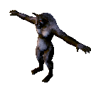|<ul><li>Transform</li><li>CapsuleCollider</li><li>Rigidbody</li><li>Humanoid</li><li>ZNetView</li><li>ZSyncTransform</li><li>ZSyncAnimation</li><li>MonsterAI</li><li>CharacterDrop</li><li>VisEquipment</li><li>FootStep</li></ul>|<ul><li>Blunt: Normal</li><li>Slash: Normal</li><li>Pierce: Normal</li><li>Chop: Ignore</li><li>Pickaxe: Ignore</li><li>Fire: Normal</li><li>Frost: Normal</li><li>Lightning: Normal</li><li>Poison: Normal</li><li>Spirit: Immune</li></ul>|Default Items: <ul><li>GoblinBrute_Attack</li><li>GoblinBrute_RageAttack</li><li>GoblinBrute_Taunt</li><li>GoblinBrute_HipCloth</li><li>GoblinBrute_ShoulderGuard</li></ul>Random Weapon: Random Armor: Random Shield:|<ul><li>chest_hildir3 (1x)</li></ul>|
|GoblinBruteBros 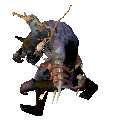|<ul><li>Transform</li><li>CapsuleCollider</li><li>Rigidbody</li><li>Humanoid</li><li>ZNetView</li><li>ZSyncTransform</li><li>ZSyncAnimation</li><li>MonsterAI</li><li>CharacterDrop</li><li>VisEquipment</li><li>FootStep</li></ul>|<ul><li>Blunt: Normal</li><li>Slash: Normal</li><li>Pierce: Normal</li><li>Chop: Ignore</li><li>Pickaxe: Ignore</li><li>Fire: Normal</li><li>Frost: Normal</li><li>Lightning: Normal</li><li>Poison: Normal</li><li>Spirit: Immune</li></ul>|Default Items: <ul><li>GoblinBruteBros_Attack</li><li>GoblinBruteBros_RageAttack</li><li>GoblinBrute_Taunt</li><li>GoblinBrute_HipCloth</li><li>GoblinBrute_ShoulderGuard</li><li>GoblinShaman_attack_fireball_hildir</li><li>GoblinShaman_attack_protect_hildir</li></ul>Random Weapon: Random Armor: Random Shield:|<ul><li>GoblinShaman_Hildir (1x)</li><li>TrophyGoblinBruteBrosBrute (1x)</li></ul>|
|GoblinBruteBros_nochest 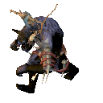|<ul><li>Transform</li><li>CapsuleCollider</li><li>Rigidbody</li><li>Humanoid</li><li>ZNetView</li><li>ZSyncTransform</li><li>ZSyncAnimation</li><li>MonsterAI</li><li>CharacterDrop</li><li>VisEquipment</li><li>FootStep</li></ul>|<ul><li>Blunt: Normal</li><li>Slash: Normal</li><li>Pierce: Normal</li><li>Chop: Ignore</li><li>Pickaxe: Ignore</li><li>Fire: Normal</li><li>Frost: Normal</li><li>Lightning: Normal</li><li>Poison: Normal</li><li>Spirit: Immune</li></ul>|Default Items: <ul><li>GoblinBruteBros_Attack</li><li>GoblinBruteBros_RageAttack</li><li>GoblinBrute_Taunt</li><li>GoblinBrute_HipCloth</li><li>GoblinBrute_ShoulderGuard</li><li>GoblinShaman_attack_fireball_hildir</li><li>GoblinShaman_attack_protect_hildir</li></ul>Random Weapon: Random Armor: Random Shield:|<ul><li>GoblinShaman_Hildir_nochest (1x)</li><li>TrophyGoblinBruteBrosBrute (1x)</li></ul>|
|GoblinKing 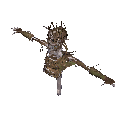|<ul><li>Transform</li><li>CapsuleCollider</li><li>Rigidbody</li><li>Humanoid</li><li>ZNetView</li><li>ZSyncTransform</li><li>ZSyncAnimation</li><li>MonsterAI</li><li>CharacterDrop</li><li>FootStep</li><li>LODGroup</li></ul>|<ul><li>Blunt: Normal</li><li>Slash: Normal</li><li>Pierce: VeryResistant</li><li>Chop: Ignore</li><li>Pickaxe: Ignore</li><li>Fire: Resistant</li><li>Frost: Normal</li><li>Lightning: Normal</li><li>Poison: Immune</li><li>Spirit: Normal</li></ul>|Default Items: <ul><li>GoblinKing_Beam</li><li>GoblinKing_Meteors</li><li>GoblinKing_Nova</li><li>GoblinKing_Taunt</li></ul>Random Weapon: Random Armor: Random Shield:|<ul><li>TrophyGoblinKing (1x)</li><li>YagluthDrop (3x)</li></ul>|
|GoblinShaman 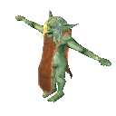|<ul><li>Transform</li><li>CapsuleCollider</li><li>Rigidbody</li><li>Humanoid</li><li>ZNetView</li><li>ZSyncTransform</li><li>ZSyncAnimation</li><li>MonsterAI</li><li>CharacterDrop</li><li>RandomAnimation</li><li>VisEquipment</li><li>FootStep</li></ul>|<ul><li>Blunt: Normal</li><li>Slash: Normal</li><li>Pierce: Normal</li><li>Chop: Ignore</li><li>Pickaxe: Ignore</li><li>Fire: Normal</li><li>Frost: Normal</li><li>Lightning: Normal</li><li>Poison: Normal</li><li>Spirit: Immune</li></ul>|Default Items: <ul><li>GoblinShaman_attack_protect</li><li>GoblinShaman_attack_poke</li><li>GoblinShaman_attack_fireball</li></ul>Random Weapon: Random Armor: Random Shield:|<ul><li>Coins (25% 20-40x)</li><li>BlackMetalScrap (1-2x)</li><li>Pukeberries (1-2x)</li><li>TrophyGoblinShaman (10%)</li></ul>|
|GoblinShaman_Hildir |<ul><li>Transform</li><li>CapsuleCollider</li><li>Rigidbody</li><li>Humanoid</li><li>ZNetView</li><li>ZSyncTransform</li><li>ZSyncAnimation</li><li>MonsterAI</li><li>CharacterDrop</li><li>RandomAnimation</li><li>VisEquipment</li><li>FootStep</li></ul>|<ul><li>Blunt: Normal</li><li>Slash: Normal</li><li>Pierce: Normal</li><li>Chop: Ignore</li><li>Pickaxe: Ignore</li><li>Fire: Normal</li><li>Frost: Normal</li><li>Lightning: Normal</li><li>Poison: Normal</li><li>Spirit: Immune</li></ul>|Default Items: <ul><li>GoblinShaman_attack_protect</li><li>GoblinShaman_attack_poke</li><li>GoblinShaman_attack_fireball</li><li>GoblinShaman_Staff_Hildir</li></ul>Random Weapon: Random Armor: Random Shield:|<ul><li>chest_hildir3 (1x)</li><li>TrophyGoblinBruteBrosShaman (1x)</li></ul>|
|GoblinShaman_Hildir_nochest 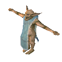|<ul><li>Transform</li><li>CapsuleCollider</li><li>Rigidbody</li><li>Humanoid</li><li>ZNetView</li><li>ZSyncTransform</li><li>ZSyncAnimation</li><li>MonsterAI</li><li>CharacterDrop</li><li>RandomAnimation</li><li>VisEquipment</li><li>FootStep</li></ul>|<ul><li>Blunt: Normal</li><li>Slash: Normal</li><li>Pierce: Normal</li><li>Chop: Ignore</li><li>Pickaxe: Ignore</li><li>Fire: Normal</li><li>Frost: Normal</li><li>Lightning: Normal</li><li>Poison: Normal</li><li>Spirit: Immune</li></ul>|Default Items: <ul><li>GoblinShaman_attack_protect</li><li>GoblinShaman_attack_poke</li><li>GoblinShaman_attack_fireball</li><li>GoblinShaman_Staff_Hildir</li></ul>Random Weapon: Random Armor: Random Shield:|<ul><li>TrophyGoblinBruteBrosShaman (1x)</li></ul>|
|Greydwarf 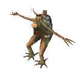|<ul><li>Transform</li><li>CapsuleCollider</li><li>Rigidbody</li><li>Humanoid</li><li>ZNetView</li><li>ZSyncTransform</li><li>ZSyncAnimation</li><li>MonsterAI</li><li>CharacterDrop</li><li>FootStep</li></ul>|<ul><li>Blunt: Normal</li><li>Slash: Normal</li><li>Pierce: Normal</li><li>Chop: Ignore</li><li>Pickaxe: Ignore</li><li>Fire: VeryWeak</li><li>Frost: Normal</li><li>Lightning: Normal</li><li>Poison: Resistant</li><li>Spirit: Immune</li></ul>|Default Items: <ul><li>Greydwarf_attack</li><li>Greydwarf_throw</li></ul>Random Weapon: Random Armor: Random Shield:|<ul><li>GreydwarfEye (50%)</li><li>Stone (1x)</li><li>Wood (1x)</li><li>Resin (1x)</li><li>TrophyGreydwarf (5%)</li></ul>|
|Greydwarf_Elite 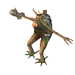|<ul><li>Transform</li><li>CapsuleCollider</li><li>Rigidbody</li><li>Humanoid</li><li>ZNetView</li><li>ZSyncTransform</li><li>ZSyncAnimation</li><li>MonsterAI</li><li>CharacterDrop</li><li>FootStep</li></ul>|<ul><li>Blunt: Normal</li><li>Slash: Normal</li><li>Pierce: Normal</li><li>Chop: Ignore</li><li>Pickaxe: Ignore</li><li>Fire: VeryWeak</li><li>Frost: Normal</li><li>Lightning: Normal</li><li>Poison: Resistant</li><li>Spirit: Immune</li></ul>|Default Items: <ul><li>Greydwarf_elite_attack</li></ul>Random Weapon: Random Armor: Random Shield:|<ul><li>GreydwarfEye (50% 2x)</li><li>Stone (2x)</li><li>Wood (3-5x)</li><li>Dandelion (1x)</li><li>AncientSeed (33%)</li><li>TrophyGreydwarfBrute (10%)</li></ul>|
|Greydwarf_Shaman 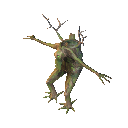|<ul><li>Transform</li><li>CapsuleCollider</li><li>Rigidbody</li><li>Humanoid</li><li>ZNetView</li><li>ZSyncTransform</li><li>ZSyncAnimation</li><li>MonsterAI</li><li>CharacterDrop</li><li>FootStep</li></ul>|<ul><li>Blunt: Normal</li><li>Slash: Normal</li><li>Pierce: Normal</li><li>Chop: Ignore</li><li>Pickaxe: Ignore</li><li>Fire: VeryWeak</li><li>Frost: Normal</li><li>Lightning: Normal</li><li>Poison: Resistant</li><li>Spirit: Immune</li></ul>|Default Items: <ul><li>Greydwarf_shaman_attack</li><li>Greydwarf_attack</li><li>Greydwarf_shaman_heal</li></ul>Random Weapon: Random Armor: Random Shield:|<ul><li>GreydwarfEye (50%)</li><li>Wood (1x)</li><li>Resin (1-2x)</li><li>TrophyGreydwarfShaman (10%)</li><li>Pukeberries (1-2x)</li></ul>|
|Greyling 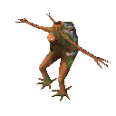|<ul><li>Transform</li><li>CapsuleCollider</li><li>Rigidbody</li><li>Humanoid</li><li>ZNetView</li><li>ZSyncTransform</li><li>ZSyncAnimation</li><li>MonsterAI</li><li>CharacterDrop</li><li>FootStep</li></ul>|<ul><li>Blunt: Normal</li><li>Slash: Normal</li><li>Pierce: Normal</li><li>Chop: Ignore</li><li>Pickaxe: Ignore</li><li>Fire: VeryWeak</li><li>Frost: Normal</li><li>Lightning: Normal</li><li>Poison: Resistant</li><li>Spirit: Immune</li></ul>|Default Items: <ul><li>Greyling_attack</li></ul>Random Weapon: Random Armor: Random Shield:|<ul><li>Resin (1x)</li></ul>|
|Hare 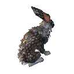|<ul><li>Transform</li><li>CapsuleCollider</li><li>Rigidbody</li><li>Character</li><li>CharacterDrop</li><li>ZNetView</li><li>ZSyncTransform</li><li>ZSyncAnimation</li><li>AnimalAI</li><li>FootStep</li></ul>|<ul><li>Blunt: Normal</li><li>Slash: Normal</li><li>Pierce: Normal</li><li>Chop: Ignore</li><li>Pickaxe: Ignore</li><li>Fire: Normal</li><li>Frost: Normal</li><li>Lightning: Normal</li><li>Poison: Normal</li><li>Spirit: Immune</li></ul>||<ul><li>HareMeat (1x)</li><li>ScaleHide (1-3x)</li><li>TrophyHare (5%)</li></ul>|
|Hatchling 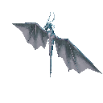|<ul><li>Transform</li><li>CapsuleCollider</li><li>Rigidbody</li><li>Humanoid</li><li>ZNetView</li><li>ZSyncTransform</li><li>ZSyncAnimation</li><li>MonsterAI</li><li>CharacterDrop</li></ul>|<ul><li>Blunt: Normal</li><li>Slash: Normal</li><li>Pierce: Normal</li><li>Chop: Ignore</li><li>Pickaxe: Ignore</li><li>Fire: Weak</li><li>Frost: Immune</li><li>Lightning: Normal</li><li>Poison: Normal</li><li>Spirit: Immune</li></ul>|Default Items: <ul><li>hatchling_spit_cold</li></ul>Random Weapon: Random Armor: Random Shield:|<ul><li>TrophyHatchling (10%)</li><li>FreezeGland (1-2x)</li></ul>|
|Hen 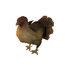|<ul><li>Transform</li><li>CapsuleCollider</li><li>Rigidbody</li><li>Humanoid</li><li>MonsterAI</li><li>CharacterDrop</li><li>ZNetView</li><li>ZSyncTransform</li><li>ZSyncAnimation</li><li>FootStep</li><li>Procreation</li><li>Tameable</li></ul>|<ul><li>Blunt: Normal</li><li>Slash: Normal</li><li>Pierce: Normal</li><li>Chop: Ignore</li><li>Pickaxe: Ignore</li><li>Fire: Normal</li><li>Frost: Normal</li><li>Lightning: Normal</li><li>Poison: Normal</li><li>Spirit: Immune</li></ul>|Default Items: <ul><li>boar_base_attack</li></ul>Random Weapon: Random Armor: Random Shield:|<ul><li>ChickenMeat (1x)</li><li>Feathers (1-3x)</li></ul>|
|Hive 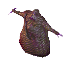|<ul><li>Transform</li><li>CapsuleCollider</li><li>Rigidbody</li><li>Humanoid</li><li>ZNetView</li><li>ZSyncTransform</li><li>ZSyncAnimation</li><li>MonsterAI</li><li>CharacterDrop</li><li>VisEquipment</li></ul>|<ul><li>Blunt: Weak</li><li>Slash: Resistant</li><li>Pierce: VeryResistant</li><li>Chop: Ignore</li><li>Pickaxe: Ignore</li><li>Fire: VeryResistant</li><li>Frost: Weak</li><li>Lightning: Normal</li><li>Poison: Immune</li><li>Spirit: Normal</li></ul>|Default Items: <ul><li>hive_attack_aoe</li><li>hive_attack_punch</li><li>hive_attack_throw</li><li>hive_attack_ranged</li></ul>Random Weapon: Random Armor: Random Shield:|<ul><li>TrophySeekerQueen (1x)</li><li>QueenDrop (1x)</li></ul>|
|Leech 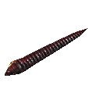|<ul><li>Transform</li><li>CapsuleCollider</li><li>Rigidbody</li><li>Humanoid</li><li>ZNetView</li><li>ZSyncTransform</li><li>ZSyncAnimation</li><li>MonsterAI</li><li>CharacterDrop</li></ul>|<ul><li>Blunt: Normal</li><li>Slash: Normal</li><li>Pierce: Normal</li><li>Chop: Ignore</li><li>Pickaxe: Ignore</li><li>Fire: Immune</li><li>Frost: Normal</li><li>Lightning: Normal</li><li>Poison: Resistant</li><li>Spirit: Immune</li></ul>|Default Items: <ul><li>Leech_BiteAttack</li></ul>Random Weapon: Random Armor: Random Shield:|<ul><li>TrophyLeech (10%)</li><li>Bloodbag (1x)</li></ul>|
|Leech_cave |<ul><li>Transform</li><li>CapsuleCollider</li><li>Rigidbody</li><li>Humanoid</li><li>ZNetView</li><li>ZSyncTransform</li><li>ZSyncAnimation</li><li>MonsterAI</li><li>CharacterDrop</li></ul>|<ul><li>Blunt: Normal</li><li>Slash: Normal</li><li>Pierce: Normal</li><li>Chop: Ignore</li><li>Pickaxe: Ignore</li><li>Fire: Immune</li><li>Frost: Normal</li><li>Lightning: Normal</li><li>Poison: Resistant</li><li>Spirit: Immune</li></ul>|Default Items: <ul><li>Leech_BiteAttack</li></ul>Random Weapon: Random Armor: Random Shield:|<ul><li>TrophyLeech (10%)</li><li>Bloodbag (1x)</li></ul>|
|Lox 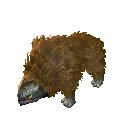|<ul><li>Transform</li><li>CapsuleCollider</li><li>Rigidbody</li><li>Humanoid</li><li>MonsterAI</li><li>CharacterDrop</li><li>ZNetView</li><li>ZSyncTransform</li><li>ZSyncAnimation</li><li>FootStep</li><li>Tameable</li><li>Procreation</li><li>MovementDamage</li></ul>|<ul><li>Blunt: Resistant</li><li>Slash: Resistant</li><li>Pierce: Normal</li><li>Chop: Ignore</li><li>Pickaxe: Ignore</li><li>Fire: Weak</li><li>Frost: Resistant</li><li>Lightning: Normal</li><li>Poison: Normal</li><li>Spirit: Immune</li></ul>|Default Items: <ul><li>lox_bite</li><li>lox_stomp</li></ul>Random Weapon: Random Armor: Random Shield:|<ul><li>LoxMeat (4-6x)</li><li>TrophyLox (10%)</li><li>LoxPelt (2-3x)</li></ul>|
|Lox_Calf 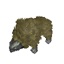|<ul><li>Transform</li><li>CapsuleCollider</li><li>Rigidbody</li><li>Humanoid</li><li>AnimalAI</li><li>ZNetView</li><li>ZSyncTransform</li><li>ZSyncAnimation</li><li>Growup</li><li>CharacterDrop</li></ul>|<ul><li>Blunt: Resistant</li><li>Slash: Resistant</li><li>Pierce: Normal</li><li>Chop: Ignore</li><li>Pickaxe: Ignore</li><li>Fire: Weak</li><li>Frost: Resistant</li><li>Lightning: Normal</li><li>Poison: Normal</li><li>Spirit: Immune</li></ul>|Default Items: Random Weapon: Random Armor: Random Shield:|<ul><li>LoxMeat (1x)</li></ul>|
|Mistile |<ul><li>Transform</li><li>CapsuleCollider</li><li>Rigidbody</li><li>Humanoid</li><li>ZNetView</li><li>ZSyncTransform</li><li>ZSyncAnimation</li><li>MonsterAI</li><li>CharacterTimedDestruction</li></ul>|<ul><li>Blunt: Normal</li><li>Slash: Normal</li><li>Pierce: Normal</li><li>Chop: Ignore</li><li>Pickaxe: Ignore</li><li>Fire: Normal</li><li>Frost: Normal</li><li>Lightning: Normal</li><li>Poison: Normal</li><li>Spirit: Immune</li></ul>|Default Items: <ul><li>Mistile_kamikaze</li></ul>Random Weapon: Random Armor: Random Shield:||
|Neck 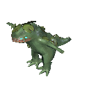|<ul><li>Transform</li><li>CapsuleCollider</li><li>Rigidbody</li><li>Humanoid</li><li>ZNetView</li><li>ZSyncTransform</li><li>ZSyncAnimation</li><li>MonsterAI</li><li>CharacterDrop</li></ul>|<ul><li>Blunt: Normal</li><li>Slash: Normal</li><li>Pierce: Normal</li><li>Chop: Ignore</li><li>Pickaxe: Ignore</li><li>Fire: Weak</li><li>Frost: Normal</li><li>Lightning: Normal</li><li>Poison: Resistant</li><li>Spirit: Immune</li></ul>|Default Items: <ul><li>Neck_BiteAttack</li></ul>Random Weapon: Random Armor: Random Shield:|<ul><li>NeckTail (70%)</li><li>TrophyNeck (5%)</li></ul>|
|Player 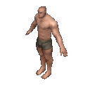|<ul><li>Transform</li><li>CapsuleCollider</li><li>Rigidbody</li><li>PlayerController</li><li>Player</li><li>ZNetView</li><li>ZSyncTransform</li><li>ZSyncAnimation</li><li>Talker</li><li>VisEquipment</li><li>Skills</li><li>FootStep</li></ul>|<ul><li>Blunt: Normal</li><li>Slash: Normal</li><li>Pierce: Normal</li><li>Chop: Immune</li><li>Pickaxe: Immune</li><li>Fire: Normal</li><li>Frost: Normal</li><li>Lightning: Normal</li><li>Poison: Normal</li><li>Spirit: Immune</li></ul>|Default Items: <ul><li>Torch</li><li>ArmorRagsChest</li></ul>Random Weapon: Random Armor: Random Shield:||
|Seeker 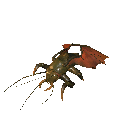|<ul><li>Transform</li><li>CapsuleCollider</li><li>Rigidbody</li><li>Humanoid</li><li>ZNetView</li><li>ZSyncTransform</li><li>ZSyncAnimation</li><li>MonsterAI</li><li>CharacterDrop</li><li>FootStep</li></ul>|<ul><li>Blunt: Resistant</li><li>Slash: Resistant</li><li>Pierce: Resistant</li><li>Chop: Ignore</li><li>Pickaxe: Ignore</li><li>Fire: Normal</li><li>Frost: Normal</li><li>Lightning: Normal</li><li>Poison: Normal</li><li>Spirit: Immune</li></ul>|Default Items: <ul><li>seeker_takeoff</li><li>seeker_land</li><li>seeker_pincers</li><li>seeker_claw_left</li><li>seeker_claw_right</li><li>seeker_groundslam</li><li>seeker_groundslam_flying</li></ul>Random Weapon: Random Armor: Random Shield:|<ul><li>BugMeat (1-2x)</li><li>Carapace (1-2x)</li><li>TrophySeeker (5%)</li></ul>|
|SeekerBrood 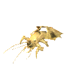|<ul><li>Transform</li><li>CapsuleCollider</li><li>Rigidbody</li><li>Humanoid</li><li>ZNetView</li><li>ZSyncTransform</li><li>ZSyncAnimation</li><li>MonsterAI</li><li>CharacterDrop</li><li>FootStep</li></ul>|<ul><li>Blunt: Resistant</li><li>Slash: Resistant</li><li>Pierce: Resistant</li><li>Chop: Ignore</li><li>Pickaxe: Ignore</li><li>Fire: Normal</li><li>Frost: Normal</li><li>Lightning: Normal</li><li>Poison: Normal</li><li>Spirit: Immune</li></ul>|Default Items: <ul><li>babyseeker_attack</li></ul>Random Weapon: Random Armor: Random Shield:|<ul><li>RoyalJelly (50%)</li></ul>|
|SeekerBrute 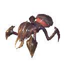|<ul><li>Transform</li><li>CapsuleCollider</li><li>Rigidbody</li><li>Humanoid</li><li>ZNetView</li><li>ZSyncTransform</li><li>ZSyncAnimation</li><li>MonsterAI</li><li>CharacterDrop</li><li>FootStep</li></ul>|<ul><li>Blunt: Resistant</li><li>Slash: Resistant</li><li>Pierce: Resistant</li><li>Chop: Ignore</li><li>Pickaxe: Ignore</li><li>Fire: Normal</li><li>Frost: Normal</li><li>Lightning: Normal</li><li>Poison: Normal</li><li>Spirit: Immune</li></ul>|Default Items: <ul><li>SeekerBrute_Taunt</li><li>SeekerBrute_ram</li><li>SeekerBrute_bite</li><li>SeekerBrute_groundslam</li></ul>Random Weapon: Random Armor: Random Shield:|<ul><li>BugMeat (1-2x)</li><li>Carapace (2-4x)</li><li>TrophySeekerBrute (5%)</li><li>Mandible (1-2x)</li></ul>|
|SeekerQueen 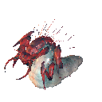|<ul><li>Transform</li><li>CapsuleCollider</li><li>Rigidbody</li><li>Humanoid</li><li>ZNetView</li><li>ZSyncTransform</li><li>ZSyncAnimation</li><li>MonsterAI</li><li>CharacterDrop</li><li>FootStep</li><li>MovementDamage</li></ul>|<ul><li>Blunt: Normal</li><li>Slash: Normal</li><li>Pierce: Resistant</li><li>Chop: Ignore</li><li>Pickaxe: Ignore</li><li>Fire: Normal</li><li>Frost: Normal</li><li>Lightning: Normal</li><li>Poison: Normal</li><li>Spirit: Immune</li></ul>|Default Items: <ul><li>SeekerQueen_Teleport</li><li>SeekerQueen_Rush</li><li>SeekerQueen_Bite</li><li>SeekerQueen_Call</li><li>SeekerQueen_Spit</li><li>SeekerQueen_Slap</li><li>SeekerQueen_PierceAOE</li></ul>Random Weapon: Random Armor: Random Shield:|<ul><li>TrophySeekerQueen (1x)</li><li>QueenDrop (3x)</li></ul>|
|Serpent 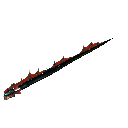|<ul><li>Transform</li><li>CapsuleCollider</li><li>Rigidbody</li><li>Humanoid</li><li>ZNetView</li><li>ZSyncTransform</li><li>ZSyncAnimation</li><li>MonsterAI</li><li>CharacterDrop</li><li>Tail</li></ul>|<ul><li>Blunt: Normal</li><li>Slash: Normal</li><li>Pierce: Normal</li><li>Chop: Ignore</li><li>Pickaxe: Ignore</li><li>Fire: Immune</li><li>Frost: Weak</li><li>Lightning: Normal</li><li>Poison: Resistant</li><li>Spirit: Immune</li></ul>|Default Items: <ul><li>Serpent_attack</li><li>Serpent_taunt</li></ul>Random Weapon: Random Armor: Random Shield:|<ul><li>TrophySerpent (33%)</li><li>SerpentMeat (6-8x)</li><li>SerpentScale (8-10x)</li></ul>|
|Skeleton 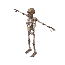|<ul><li>Transform</li><li>CapsuleCollider</li><li>Rigidbody</li><li>Humanoid</li><li>ZNetView</li><li>ZSyncTransform</li><li>ZSyncAnimation</li><li>MonsterAI</li><li>CharacterDrop</li><li>VisEquipment</li><li>FootStep</li></ul>|<ul><li>Blunt: Weak</li><li>Slash: Normal</li><li>Pierce: Resistant</li><li>Chop: Ignore</li><li>Pickaxe: Ignore</li><li>Fire: Weak</li><li>Frost: Resistant</li><li>Lightning: Normal</li><li>Poison: Immune</li><li>Spirit: Normal</li></ul>|Default Items: Random Weapon: <ul><li>skeleton_sword</li><li>skeleton_sword</li><li>skeleton_bow</li><li>skeleton_sword</li><li>skeleton_sword</li></ul>Random Armor: Random Shield: <ul><li>ShieldWood</li><li>ShieldBronzeBuckler</li></ul>|<ul><li>TrophySkeleton (10%)</li><li>BoneFragments (1x)</li></ul>|
|Skeleton_Friendly |<ul><li>Transform</li><li>CapsuleCollider</li><li>Rigidbody</li><li>Humanoid</li><li>ZNetView</li><li>ZSyncTransform</li><li>ZSyncAnimation</li><li>MonsterAI</li><li>VisEquipment</li><li>FootStep</li><li>Tameable</li></ul>|<ul><li>Blunt: Weak</li><li>Slash: Normal</li><li>Pierce: Resistant</li><li>Chop: Ignore</li><li>Pickaxe: Ignore</li><li>Fire: Weak</li><li>Frost: Resistant</li><li>Lightning: Normal</li><li>Poison: Immune</li><li>Spirit: Normal</li></ul>|Default Items: Random Weapon: <ul><li>skeleton_sword2</li><li>skeleton_sword2</li><li>skeleton_bow2</li><li>skeleton_sword2</li><li>skeleton_sword2</li></ul>Random Armor: Random Shield: <ul><li>ShieldWood</li><li>ShieldBronzeBuckler</li></ul>||
|Skeleton_Hildir |<ul><li>Transform</li><li>CapsuleCollider</li><li>Rigidbody</li><li>Humanoid</li><li>ZNetView</li><li>ZSyncTransform</li><li>ZSyncAnimation</li><li>MonsterAI</li><li>CharacterDrop</li><li>VisEquipment</li><li>FootStep</li></ul>|<ul><li>Blunt: Weak</li><li>Slash: Normal</li><li>Pierce: Resistant</li><li>Chop: Ignore</li><li>Pickaxe: Ignore</li><li>Fire: Immune</li><li>Frost: Weak</li><li>Lightning: Normal</li><li>Poison: Immune</li><li>Spirit: Normal</li></ul>|Default Items: <ul><li>skeleton_sword_hildir</li><li>skeleton_hildir_firenova</li></ul>Random Weapon: Random Armor: Random Shield:|<ul><li>chest_hildir1 (1x)</li><li>TrophySkeletonHildir (1x)</li></ul>|
|Skeleton_Hildir_nochest |<ul><li>Transform</li><li>CapsuleCollider</li><li>Rigidbody</li><li>Humanoid</li><li>ZNetView</li><li>ZSyncTransform</li><li>ZSyncAnimation</li><li>MonsterAI</li><li>CharacterDrop</li><li>VisEquipment</li><li>FootStep</li></ul>|<ul><li>Blunt: Weak</li><li>Slash: Normal</li><li>Pierce: Resistant</li><li>Chop: Ignore</li><li>Pickaxe: Ignore</li><li>Fire: Immune</li><li>Frost: Weak</li><li>Lightning: Normal</li><li>Poison: Immune</li><li>Spirit: Normal</li></ul>|Default Items: <ul><li>skeleton_sword_hildir</li><li>skeleton_hildir_firenova</li></ul>Random Weapon: Random Armor: Random Shield:|<ul><li>TrophySkeletonHildir (1x)</li></ul>|
|Skeleton_NoArcher |<ul><li>Transform</li><li>CapsuleCollider</li><li>Rigidbody</li><li>Humanoid</li><li>ZNetView</li><li>ZSyncTransform</li><li>ZSyncAnimation</li><li>MonsterAI</li><li>CharacterDrop</li><li>VisEquipment</li><li>FootStep</li></ul>|<ul><li>Blunt: Weak</li><li>Slash: Normal</li><li>Pierce: Resistant</li><li>Chop: Ignore</li><li>Pickaxe: Ignore</li><li>Fire: Weak</li><li>Frost: Resistant</li><li>Lightning: Normal</li><li>Poison: Immune</li><li>Spirit: Normal</li></ul>|Default Items: Random Weapon: <ul><li>skeleton_sword</li></ul>Random Armor: Random Shield: <ul><li>ShieldWood</li><li>ShieldBronzeBuckler</li></ul>|<ul><li>TrophySkeleton (10%)</li><li>BoneFragments (1x)</li></ul>|
|Skeleton_Poison |<ul><li>Transform</li><li>CapsuleCollider</li><li>Rigidbody</li><li>Humanoid</li><li>ZNetView</li><li>ZSyncTransform</li><li>ZSyncAnimation</li><li>MonsterAI</li><li>CharacterDrop</li><li>VisEquipment</li><li>FootStep</li></ul>|<ul><li>Blunt: Weak</li><li>Slash: Normal</li><li>Pierce: Resistant</li><li>Chop: Ignore</li><li>Pickaxe: Ignore</li><li>Fire: Weak</li><li>Frost: Resistant</li><li>Lightning: Normal</li><li>Poison: Immune</li><li>Spirit: Normal</li></ul>|Default Items: <ul><li>skeleton_mace</li></ul>Random Weapon: Random Armor: Random Shield:|<ul><li>TrophySkeletonPoison (10%)</li><li>BoneFragments (3x)</li></ul>|
|StoneGolem |<ul><li>Transform</li><li>CapsuleCollider</li><li>Rigidbody</li><li>Humanoid</li><li>ZNetView</li><li>ZSyncTransform</li><li>ZSyncAnimation</li><li>MonsterAI</li><li>CharacterDrop</li><li>VisEquipment</li><li>FootStep</li></ul>|<ul><li>Blunt: Normal</li><li>Slash: Resistant</li><li>Pierce: Resistant</li><li>Chop: Ignore</li><li>Pickaxe: VeryWeak</li><li>Fire: Immune</li><li>Frost: Immune</li><li>Lightning: Normal</li><li>Poison: Immune</li><li>Spirit: Immune</li></ul>|Default Items: Random Weapon: Random Armor: <ul><li>StoneGolem_hat</li></ul>Random Shield:|<ul><li>TrophySGolem (5%)</li><li>Stone (5-10x)</li><li>Crystal (8-12x)</li></ul>|
|Surtling |<ul><li>Transform</li><li>CapsuleCollider</li><li>Rigidbody</li><li>Humanoid</li><li>ZNetView</li><li>ZSyncAnimation</li><li>MonsterAI</li><li>CharacterDrop</li><li>ZSyncTransform</li></ul>|<ul><li>Blunt: Normal</li><li>Slash: Normal</li><li>Pierce: Normal</li><li>Chop: Ignore</li><li>Pickaxe: Ignore</li><li>Fire: Immune</li><li>Frost: Weak</li><li>Lightning: Normal</li><li>Poison: Immune</li><li>Spirit: Immune</li></ul>|Default Items: <ul><li>imp_fireball_attack</li></ul>Random Weapon: Random Armor: Random Shield:|<ul><li>Coal (4-5x)</li><li>SurtlingCore (50%)</li><li>TrophySurtling (5%)</li></ul>|
|TentaRoot |<ul><li>Transform</li><li>CapsuleCollider</li><li>Rigidbody</li><li>Humanoid</li><li>ZNetView</li><li>ZSyncTransform</li><li>ZSyncAnimation</li><li>MonsterAI</li><li>CharacterTimedDestruction</li></ul>|<ul><li>Blunt: Normal</li><li>Slash: Normal</li><li>Pierce: Normal</li><li>Chop: Ignore</li><li>Pickaxe: Ignore</li><li>Fire: Weak</li><li>Frost: Resistant</li><li>Lightning: Normal</li><li>Poison: Immune</li><li>Spirit: Normal</li></ul>|Default Items: Random Weapon: <ul><li>tentaroot_attack</li></ul>Random Armor: Random Shield: <ul><li>ShieldWood</li><li>ShieldBronzeBuckler</li></ul>||
|TheHive |<ul><li>Transform</li><li>CapsuleCollider</li><li>Rigidbody</li><li>Humanoid</li><li>ZNetView</li><li>ZSyncTransform</li><li>ZSyncAnimation</li><li>MonsterAI</li><li>CharacterDrop</li></ul>|<ul><li>Blunt: Immune</li><li>Slash: Immune</li><li>Pierce: Immune</li><li>Chop: Ignore</li><li>Pickaxe: Ignore</li><li>Fire: Immune</li><li>Frost: Immune</li><li>Lightning: Immune</li><li>Poison: Immune</li><li>Spirit: Immune</li></ul>|Default Items: <ul><li>gjall_attack_spit</li><li>gjall_attack_egg</li></ul>Random Weapon: Random Armor: Random Shield:|<ul><li>TrophyHatchling (10%)</li><li>FreezeGland (1-2x)</li></ul>|
|Tick |<ul><li>Transform</li><li>CapsuleCollider</li><li>Rigidbody</li><li>Humanoid</li><li>MonsterAI</li><li>CharacterDrop</li><li>ZNetView</li><li>ZSyncTransform</li><li>ZSyncAnimation</li><li>FootStep</li></ul>|<ul><li>Blunt: Normal</li><li>Slash: Normal</li><li>Pierce: Weak</li><li>Chop: Ignore</li><li>Pickaxe: Ignore</li><li>Fire: Normal</li><li>Frost: Normal</li><li>Lightning: Normal</li><li>Poison: Normal</li><li>Spirit: Immune</li></ul>|Default Items: <ul><li>tick_attack_attach</li></ul>Random Weapon: Random Armor: Random Shield:|<ul><li>GiantBloodSack (1x)</li><li>TrophyTick (5%)</li></ul>|
|TrainingDummy |<ul><li>Transform</li><li>CapsuleCollider</li><li>Rigidbody</li><li>Humanoid</li><li>ZNetView</li><li>ZSyncTransform</li><li>ZSyncAnimation</li><li>MonsterAI</li><li>CharacterDrop</li><li>VisEquipment</li><li>FootStep</li></ul>|<ul><li>Blunt: Normal</li><li>Slash: Normal</li><li>Pierce: Normal</li><li>Chop: Normal</li><li>Pickaxe: Normal</li><li>Fire: Normal</li><li>Frost: Normal</li><li>Lightning: Normal</li><li>Poison: Normal</li><li>Spirit: Normal</li></ul>|Default Items: Random Weapon: Random Armor: Random Shield:|<ul><li>Entrails (50%)</li><li>TrophyDraugr (10%)</li></ul>|
|Troll |<ul><li>Transform</li><li>CapsuleCollider</li><li>Rigidbody</li><li>Humanoid</li><li>ZNetView</li><li>ZSyncTransform</li><li>ZSyncAnimation</li><li>MonsterAI</li><li>CharacterDrop</li><li>VisEquipment</li><li>FootStep</li></ul>|<ul><li>Blunt: Resistant</li><li>Slash: Normal</li><li>Pierce: Weak</li><li>Chop: Ignore</li><li>Pickaxe: Ignore</li><li>Fire: Normal</li><li>Frost: Normal</li><li>Lightning: Normal</li><li>Poison: Normal</li><li>Spirit: Immune</li></ul>|Default Items: Random Weapon: Random Armor: Random Shield:|<ul><li>Coins (20-30x)</li><li>TrophyFrostTroll (50%)</li><li>TrollHide (5x)</li></ul>|
|Ulv |<ul><li>Transform</li><li>CapsuleCollider</li><li>Rigidbody</li><li>Humanoid</li><li>CharacterDrop</li><li>ZNetView</li><li>ZSyncTransform</li><li>ZSyncAnimation</li><li>MonsterAI</li><li>FootStep</li></ul>|<ul><li>Blunt: Normal</li><li>Slash: Normal</li><li>Pierce: Normal</li><li>Chop: Ignore</li><li>Pickaxe: Ignore</li><li>Fire: VeryResistant</li><li>Frost: Normal</li><li>Lightning: Normal</li><li>Poison: Weak</li><li>Spirit: Normal</li></ul>|Default Items: <ul><li>Ulv_attack1_bite</li><li>Ulv_attack2_slash</li></ul>Random Weapon: Random Armor: Random Shield:|<ul><li>WolfFang (50% 1-2x)</li><li>TrophyUlv (10%)</li></ul>|
|Wolf |<ul><li>Transform</li><li>CapsuleCollider</li><li>Rigidbody</li><li>Humanoid</li><li>CharacterDrop</li><li>ZNetView</li><li>ZSyncTransform</li><li>ZSyncAnimation</li><li>MonsterAI</li><li>FootStep</li><li>Tameable</li><li>Procreation</li></ul>|<ul><li>Blunt: Normal</li><li>Slash: Normal</li><li>Pierce: Normal</li><li>Chop: Ignore</li><li>Pickaxe: Ignore</li><li>Fire: Normal</li><li>Frost: Normal</li><li>Lightning: Normal</li><li>Poison: Normal</li><li>Spirit: Immune</li></ul>|Default Items: <ul><li>Wolf_Attack1</li><li>Wolf_Attack2</li><li>Wolf_Attack3</li></ul>Random Weapon: Random Armor: Random Shield:|<ul><li>TrophyWolf (10%)</li><li>WolfMeat (1x)</li><li>WolfPelt (1-2x)</li><li>WolfFang (40%)</li></ul>|
|Wolf_cub |<ul><li>Transform</li><li>CapsuleCollider</li><li>Rigidbody</li><li>Humanoid</li><li>ZNetView</li><li>ZSyncTransform</li><li>ZSyncAnimation</li><li>FootStep</li><li>AnimalAI</li><li>Growup</li></ul>|<ul><li>Blunt: Normal</li><li>Slash: Normal</li><li>Pierce: Normal</li><li>Chop: Ignore</li><li>Pickaxe: Ignore</li><li>Fire: Normal</li><li>Frost: Normal</li><li>Lightning: Normal</li><li>Poison: Normal</li><li>Spirit: Immune</li></ul>|Default Items: Random Weapon: Random Armor: Random Shield:||
|Wraith |<ul><li>Transform</li><li>CapsuleCollider</li><li>Rigidbody</li><li>Humanoid</li><li>ZNetView</li><li>ZSyncTransform</li><li>ZSyncAnimation</li><li>MonsterAI</li><li>CharacterDrop</li></ul>|<ul><li>Blunt: Resistant</li><li>Slash: Resistant</li><li>Pierce: Resistant</li><li>Chop: Ignore</li><li>Pickaxe: Ignore</li><li>Fire: Weak</li><li>Frost: Immune</li><li>Lightning: Normal</li><li>Poison: Immune</li><li>Spirit: Weak</li></ul>|Default Items: <ul><li>wraith_melee</li></ul>Random Weapon: Random Armor: Random Shield:|<ul><li>TrophyWraith (5%)</li><li>Chain (1x)</li></ul>|
