# Locations
All of the locations currently in the game.
This file is automatically generated from Valheim using the JotunnDoc mod found on our GitHub.
# Locations
## No group
|Location |Biome |BiomeArea |Quantity |Exterior radius |Properties |Filters |Interior |
|---|---|---|---|---|---|---|---|
|StartTemple |<ul><li>Meadows</li></ul>|<ul><li>Median</li></ul>|1|25|<ul><li>Prioritized</li><li>Place in center first</li><li>Clear area</li></ul>|<ul><li>Altitude: 3</li><li>Terrain Delta: 0 - 3</li></li></li></li></ul>||
|Eikthyrnir |<ul><li>Meadows</li></ul>|<ul><li>Median</li></ul>|3|10|<ul><li>Prioritized</li><li>Clear area</li></ul>|<ul><li>Altitude: 1</li><li>Terrain Delta: 0 - 3</li></li><li>Forest Threshold: 1 - 5</li></li></ul>||
|Dragonqueen |<ul><li>Mountain</li></ul>|<ul><li>Median</li></ul>|3|12|<ul><li>Prioritized</li><li>Clear area</li></ul>|<ul><li>Altitude: 150</li><li>Terrain Delta: 0 - 4</li></li><li>Forest Threshold: 0 - 1</li><li>MinDistanceFromSimilar: 3000</li></ul>||
|GoblinKing |<ul><li>Plains</li></ul>|<ul><li>Median</li></ul>|4|32|<ul><li>Prioritized</li><li>Clear area</li></ul>|<ul><li>Altitude: 1</li><li>Terrain Delta: 0 - 4</li></li><li>Forest Threshold: 1 - 5</li><li>MinDistanceFromSimilar: 3000</li></ul>||
|GDKing |<ul><li>BlackForest</li></ul>|<ul><li>Median</li></ul>|4|25|<ul><li>Prioritized</li><li>Clear area</li></ul>|<ul><li>Altitude: 1</li><li>Terrain Delta: 0 - 5</li><li>Min Distance: 1000</li><li>Forest Threshold: 1 - 5</li><li>MinDistanceFromSimilar: 3000</li></ul>||
|Bonemass |<ul><li>Swamp</li></ul>|<ul><li>Median</li></ul>|5|19.79|<ul><li>Prioritized</li><li>Clear area</li></ul>|<ul><li>Altitude: 0</li><li>Terrain Delta: 0 - 4</li><li>Min Distance: 2000</li><li>Forest Threshold: 1 - 5</li><li>MinDistanceFromSimilar: 3000</li></ul>||
|Vendor_BlackForest |<ul><li>BlackForest</li></ul>|<ul><li>Median</li></ul>|10|12|<ul><li>Prioritized</li><li>Unique</li><li>Clear area</li></ul>|<ul><li>Altitude: 1</li><li>Terrain Delta: 0 - 2</li><li>Min Distance: 1500</li><li>Forest Threshold: 0 - 1</li><li>MinDistanceFromSimilar: 512</li></ul>||
|SunkenCrypt4 |<ul><li>Swamp</li></ul>|<ul><li>Median</li></ul>|400|12|<ul><li>Prioritized</li><li>Clear area</li><li>Spawns Draugr</li><li>Spawns BlobElite</li></ul>|<ul><li>Altitude: 0</li><li>Terrain Delta: 0 - 4</li></li><li>Forest Threshold: 0 - 1</li><li>MinDistanceFromSimilar: 64</li></ul>|<ul><li>Name: InteriorEnvironmentZone</li><li>Radius: 14</li><li>Environment: SunkenCrypt</li></ul>|
|WoodHouse1 |<ul><li>Meadows</li></ul>|<ul><li>Edge</li><li>Median</li></ul>|20|8|<ul></ul>|<ul><li>Altitude: 1</li><li>Terrain Delta: 0 - 4</li></li><li>Forest Threshold: 0 - 1</li></li></ul>||
|WoodHouse2 |<ul><li>Meadows</li></ul>|<ul><li>Edge</li><li>Median</li></ul>|20|8|<ul></ul>|<ul><li>Altitude: 1</li><li>Terrain Delta: 0 - 4</li></li><li>Forest Threshold: 0 - 1</li></li></ul>||
|WoodHouse3 |<ul><li>Meadows</li></ul>|<ul><li>Edge</li><li>Median</li></ul>|20|10|<ul></ul>|<ul><li>Altitude: 1</li><li>Terrain Delta: 0 - 4</li></li><li>Forest Threshold: 0 - 1</li></li></ul>||
|WoodHouse4 |<ul><li>Meadows</li></ul>|<ul><li>Edge</li><li>Median</li></ul>|20|8|<ul></ul>|<ul><li>Altitude: 1</li><li>Terrain Delta: 0 - 4</li></li><li>Forest Threshold: 0 - 1</li></li></ul>||
|WoodHouse5 |<ul><li>Meadows</li></ul>|<ul><li>Edge</li><li>Median</li></ul>|20|8|<ul></ul>|<ul><li>Altitude: 1</li><li>Terrain Delta: 0 - 4</li></li><li>Forest Threshold: 0 - 1</li></li></ul>||
|WoodHouse6 |<ul><li>Meadows</li></ul>|<ul><li>Edge</li><li>Median</li></ul>|20|8|<ul></ul>|<ul><li>Altitude: 1</li><li>Terrain Delta: 0 - 4</li></li><li>Forest Threshold: 0 - 1</li></li></ul>||
|WoodHouse7 |<ul><li>Meadows</li></ul>|<ul><li>Edge</li><li>Median</li></ul>|20|8|<ul></ul>|<ul><li>Altitude: 1</li><li>Terrain Delta: 0 - 4</li></li><li>Forest Threshold: 0 - 1</li></li></ul>||
|WoodHouse8 |<ul><li>Meadows</li></ul>|<ul><li>Edge</li><li>Median</li></ul>|20|10|<ul></ul>|<ul><li>Altitude: 1</li><li>Terrain Delta: 0 - 4</li></li><li>Forest Threshold: 0 - 1</li></li></ul>||
|WoodHouse9 |<ul><li>Meadows</li></ul>|<ul><li>Edge</li><li>Median</li></ul>|20|8|<ul></ul>|<ul><li>Altitude: 1</li><li>Terrain Delta: 0 - 4</li></li><li>Forest Threshold: 0 - 1</li></li></ul>||
|WoodHouse10 |<ul><li>Meadows</li></ul>|<ul><li>Edge</li><li>Median</li></ul>|20|8|<ul></ul>|<ul><li>Altitude: 1</li><li>Terrain Delta: 0 - 4</li></li><li>Forest Threshold: 0 - 1</li></li></ul>||
|WoodHouse11 |<ul><li>Meadows</li></ul>|<ul><li>Edge</li><li>Median</li></ul>|20|8|<ul></ul>|<ul><li>Altitude: 1</li><li>Terrain Delta: 0 - 4</li></li><li>Forest Threshold: 0 - 1</li></li></ul>||
|WoodHouse12 |<ul><li>Meadows</li></ul>|<ul><li>Edge</li><li>Median</li></ul>|20|6|<ul></ul>|<ul><li>Altitude: 1</li><li>Terrain Delta: 0 - 4</li></li><li>Forest Threshold: 0 - 1</li></li></ul>||
|WoodHouse13 |<ul><li>Meadows</li></ul>|<ul><li>Edge</li><li>Median</li></ul>|20|9|<ul></ul>|<ul><li>Altitude: 1</li><li>Terrain Delta: 0 - 4</li></li><li>Forest Threshold: 0 - 1</li></li></ul>||
|StoneCircle |<ul><li>Meadows</li></ul>|<ul><li>Edge</li><li>Median</li></ul>|25|16|<ul><li>Clear area</li></ul>|<ul><li>Altitude: 1</li><li>Terrain Delta: 0 - 3</li></li><li>Forest Threshold: 1 - 5</li><li>MinDistanceFromSimilar: 200</li></ul>||
|SwampWell1 |<ul><li>Swamp</li></ul>|<ul><li>Edge</li><li>Median</li></ul>|25|10|<ul><li>Spawns Draugr_Elite</li></ul>|<ul><li>Altitude: -1</li><li>Terrain Delta: 0 - 3</li></li><li>Forest Threshold: 0 - 1</li><li>MinDistanceFromSimilar: 1024</li></ul>||
|MountainWell1 |<ul><li>Mountain</li></ul>|<ul><li>Edge</li><li>Median</li></ul>|25|14|<ul></ul>|<ul><li>Altitude: 100</li><li>Terrain Delta: 0 - 3</li></li><li>Forest Threshold: 0 - 1</li><li>MinDistanceFromSimilar: 256</li></ul>||
|SwampRuin1 |<ul><li>Swamp</li></ul>|<ul><li>Median</li></ul>|50|12|<ul><li>Spawns Draugr_Elite</li><li>Spawns Draugr</li></ul>|<ul><li>Altitude: 0</li><li>Terrain Delta: 0 - 3</li></li><li>Forest Threshold: 0 - 1</li><li>MinDistanceFromSimilar: 512</li></ul>||
|SwampRuin2 |<ul><li>Swamp</li></ul>|<ul><li>Median</li></ul>|50|10|<ul><li>Clear area</li><li>Spawns Draugr_Elite</li><li>Spawns Draugr</li></ul>|<ul><li>Altitude: 0</li><li>Terrain Delta: 0 - 3</li></li><li>Forest Threshold: 0 - 1</li><li>MinDistanceFromSimilar: 512</li></ul>||
|Dolmen03 |<ul><li>Meadows</li><li>BlackForest</li></ul>|<ul><li>Edge</li><li>Median</li></ul>|50|10|<ul><li>Spawns Skeleton_NoArcher</li></ul>|<ul><li>Altitude: 1</li><li>Terrain Delta: 0 - 2</li></li><li>Forest Threshold: 0 - 1</li></li></ul>||
|Waymarker01 |<ul><li>Mountain</li></ul>|<ul><li>Edge</li><li>Median</li></ul>|50|3|<ul><li>Clear area</li></ul>|<ul><li>Altitude: 100</li><li>Terrain Delta: 0 - 2</li></li><li>Forest Threshold: 0 - 1</li></li></ul>||
|Waymarker02 |<ul><li>Mountain</li></ul>|<ul><li>Edge</li><li>Median</li></ul>|50|3|<ul><li>Clear area</li></ul>|<ul><li>Altitude: 100</li><li>Terrain Delta: 0 - 2</li></li><li>Forest Threshold: 0 - 1</li></li></ul>||
|Dolmen01 |<ul><li>Meadows</li><li>BlackForest</li></ul>|<ul><li>Edge</li><li>Median</li></ul>|100|8|<ul><li>Spawns Skeleton_NoArcher</li></ul>|<ul><li>Altitude: 1</li><li>Terrain Delta: 0 - 2</li></li><li>Forest Threshold: 0 - 1</li></li></ul>||
|Dolmen02 |<ul><li>Meadows</li><li>BlackForest</li></ul>|<ul><li>Edge</li><li>Median</li></ul>|100|8|<ul><li>Spawns Skeleton_NoArcher</li></ul>|<ul><li>Altitude: 1</li><li>Terrain Delta: 0 - 2</li></li><li>Forest Threshold: 0 - 1</li></li></ul>||
|ShipSetting01 |<ul><li>Meadows</li></ul>|<ul><li>Edge</li><li>Median</li></ul>|100|24|<ul></ul>|<ul><li>Altitude: 1</li><li>Terrain Delta: 0 - 3</li></li><li>Forest Threshold: 0 - 1</li><li>MinDistanceFromSimilar: 128</li></ul>||
|MountainGrave01 |<ul><li>Mountain</li></ul>|<ul><li>Edge</li><li>Median</li></ul>|100|3.93|<ul><li>Clear area</li></ul>|<ul><li>Altitude: 100</li><li>Terrain Delta: 0 - 2</li></li><li>Forest Threshold: 0 - 1</li><li>MinDistanceFromSimilar: 50</li></ul>||
|Grave1 |<ul><li>Swamp</li></ul>|<ul><li>Median</li></ul>|200|12.04|<ul><li>Clear area</li></ul>|<ul><li>Altitude: 0.5</li><li>Terrain Delta: 0 - 3</li></li><li>Forest Threshold: 0 - 1</li></li></ul>||
|FireHole |<ul><li>Swamp</li></ul>|<ul><li>Median</li></ul>|200|5.2|<ul><li>Clear area</li><li>Spawns Surtling</li></ul>|<ul><li>Altitude: 0.5</li><li>Terrain Delta: 0 - 3</li></li><li>Forest Threshold: 0 - 1</li></li></ul>||
|Crypt2 |<ul><li>BlackForest</li></ul>|<ul><li>Edge</li><li>Median</li></ul>|200|12|<ul><li>Clear area</li><li>Spawns Skeleton</li></ul>|<ul><li>Altitude: 1</li><li>Terrain Delta: 0 - 2</li></li><li>Forest Threshold: 0 - 1</li><li>MinDistanceFromSimilar: 128</li></ul>|<ul><li>Name: InteriorEnvironmentZone</li><li>Radius: 21</li><li>Environment: Crypt</li></ul>|
|Ruin1 |<ul><li>BlackForest</li></ul>|<ul><li>Edge</li><li>Median</li></ul>|200|10.7|<ul><li>Spawns Greydwarf_Shaman</li><li>Spawns Greydwarf</li></ul>|<ul><li>Altitude: 1</li><li>Terrain Delta: 0 - 3</li></li><li>Forest Threshold: 0 - 1</li></li></ul>||
|Ruin2 |<ul><li>BlackForest</li></ul>|<ul><li>Edge</li><li>Median</li></ul>|200|9.89|<ul><li>Clear area</li><li>Spawns Greydwarf_Elite</li><li>Spawns Greydwarf</li></ul>|<ul><li>Altitude: 1</li><li>Terrain Delta: 0 - 3</li></li><li>Forest Threshold: 0 - 1</li></li></ul>||
|StoneHouse3 |<ul><li>BlackForest</li></ul>|<ul><li>Edge</li><li>Median</li></ul>|200|6|<ul><li>Spawns Greydwarf</li></ul>|<ul><li>Altitude: 1</li><li>Terrain Delta: 0 - 3</li></li><li>Forest Threshold: 0 - 1</li></li></ul>||
|StoneHouse4 |<ul><li>BlackForest</li></ul>|<ul><li>Edge</li><li>Median</li></ul>|200|7|<ul><li>Spawns Greydwarf</li></ul>|<ul><li>Altitude: 1</li><li>Terrain Delta: 0 - 3</li></li><li>Forest Threshold: 0 - 1</li></li></ul>||
|GoblinCamp2|<ul><li>Plains</li></ul>|<ul><li>Edge</li><li>Median</li></ul>|200|30|<ul><li>Clear area</li></ul>|<ul><li>Altitude: 2</li><li>Terrain Delta: 0 - 3</li></li><li>Forest Threshold: 0 - 1</li><li>MinDistanceFromSimilar: 250</li></ul>||
|Crypt3 |<ul><li>BlackForest</li></ul>|<ul><li>Edge</li><li>Median</li></ul>|200|11|<ul><li>Clear area</li><li>Spawns Skeleton</li></ul>|<ul><li>Altitude: 3</li><li>Terrain Delta: 0 - 2</li></li><li>Forest Threshold: 0 - 1</li><li>MinDistanceFromSimilar: 128</li></ul>|<ul><li>Name: InteriorEnvironmentZone</li><li>Radius: 21</li><li>Environment: Crypt</li></ul>|
|Crypt4 |<ul><li>BlackForest</li></ul>|<ul><li>Edge</li><li>Median</li></ul>|200|18|<ul><li>Spawns Skeleton</li></ul>|<ul><li>Altitude: 1</li><li>Terrain Delta: 0 - 2</li></li><li>Forest Threshold: 0 - 1</li><li>MinDistanceFromSimilar: 128</li></ul>|<ul><li>Name: InteriorEnvironmentZone</li><li>Radius: 21</li><li>Environment: Crypt</li></ul>|
|DrakeNest01 |<ul><li>Mountain</li></ul>|<ul><li>Edge</li><li>Median</li></ul>|200|5|<ul><li>Clear area</li><li>Spawns Hatchling</li></ul>|<ul><li>Altitude: 100</li><li>Terrain Delta: 0 - 3</li></li><li>Forest Threshold: 0 - 1</li><li>MinDistanceFromSimilar: 100</li></ul>||
|TrollCave02 |<ul><li>BlackForest</li></ul>|<ul><li>Median</li></ul>|250|12|<ul><li>Clear area</li><li>Spawns Troll</li></ul>|<ul><li>Altitude: 3</li><li>Terrain Delta: 5 - 10</li></li><li>Forest Threshold: 0 - 1</li><li>MinDistanceFromSimilar: 256</li></ul>|<ul><li>Name: InteriorEnvironmentZone</li><li>Radius: 24</li><li>Environment: Crypt</li></ul>|
|Greydwarf_camp1 |<ul><li>BlackForest</li></ul>|<ul><li>Median</li></ul>|300|10|<ul><li>Clear area</li></ul>|<ul><li>Altitude: 1</li><li>Terrain Delta: 0 - 3</li></li><li>Forest Threshold: 0 - 1</li><li>MinDistanceFromSimilar: 128</li></ul>||
|Meteorite |<ul><li>AshLands</li></ul>|<ul><li>Edge</li><li>Median</li></ul>|500|5.2|<ul><li>Clear area</li><li>Spawns Surtling</li></ul>|<ul><li>Altitude: 1</li><li>Terrain Delta: 0 - 4</li></li><li>Forest Threshold: 1 - 5</li></li></ul>||
|InfestedTree01 |<ul><li>Swamp</li></ul>|<ul><li>Edge</li><li>Median</li></ul>|700|5|<ul></ul>|<ul><li>Altitude: -1</li><li>Terrain Delta: 0 - 3</li></li><li>Forest Threshold: 0 - 1</li></li></ul>||
## Abandonedcabin
|Location |Biome |BiomeArea |Quantity |Exterior radius |Properties |Filters |Interior |
|---|---|---|---|---|---|---|---|
|AbandonedLogCabin02 |<ul><li>Mountain</li></ul>|<ul><li>Edge</li><li>Median</li></ul>|33|10.51|<ul><li>Clear area</li><li>Spawns StoneGolem</li></ul>|<ul><li>Altitude: 100</li><li>Terrain Delta: 0 - 3</li></li><li>Forest Threshold: 0 - 1</li><li>MinDistanceFromSimilar: 128</li></ul>||
|AbandonedLogCabin03 |<ul><li>Mountain</li></ul>|<ul><li>Edge</li><li>Median</li></ul>|33|10|<ul><li>Clear area</li><li>Spawns StoneGolem</li><li>Spawns Skeleton</li></ul>|<ul><li>Altitude: 100</li><li>Terrain Delta: 0 - 3</li></li><li>Forest Threshold: 0 - 1</li><li>MinDistanceFromSimilar: 128</li></ul>||
|AbandonedLogCabin04 |<ul><li>Mountain</li></ul>|<ul><li>Edge</li><li>Median</li></ul>|50|10|<ul><li>Clear area</li><li>Spawns StoneGolem</li><li>Spawns Skeleton</li></ul>|<ul><li>Altitude: 100</li><li>Terrain Delta: 0 - 3</li></li><li>Forest Threshold: 0 - 1</li><li>MinDistanceFromSimilar: 128</li></ul>||
## Goblintower
|Location |Biome |BiomeArea |Quantity |Exterior radius |Properties |Filters |Interior |
|---|---|---|---|---|---|---|---|
|Ruin3 |<ul><li>Plains</li></ul>|<ul><li>Edge</li><li>Median</li></ul>|50|10|<ul><li>Clear area</li><li>Spawns Goblin</li></ul>|<ul><li>Altitude: 1</li><li>Terrain Delta: 0 - 3</li></li><li>Forest Threshold: 0 - 1</li><li>MinDistanceFromSimilar: 512</li></ul>||
|StoneTower1 |<ul><li>Plains</li></ul>|<ul><li>Edge</li><li>Median</li></ul>|50|14|<ul><li>Clear area</li><li>Spawns Goblin</li></ul>|<ul><li>Altitude: 1</li><li>Terrain Delta: 0 - 3</li></li><li>Forest Threshold: 0 - 1</li><li>MinDistanceFromSimilar: 512</li></ul>||
|StoneTower3 |<ul><li>Plains</li></ul>|<ul><li>Edge</li><li>Median</li></ul>|50|14|<ul><li>Clear area</li><li>Spawns Goblin</li></ul>|<ul><li>Altitude: 1</li><li>Terrain Delta: 0 - 3</li></li><li>Forest Threshold: 0 - 1</li><li>MinDistanceFromSimilar: 512</li></ul>||
## Mountainruin
|Location |Biome |BiomeArea |Quantity |Exterior radius |Properties |Filters |Interior |
|---|---|---|---|---|---|---|---|
|StoneTowerRuins04 |<ul><li>Mountain</li></ul>|<ul><li>Edge</li><li>Median</li></ul>|50|12.28|<ul><li>Clear area</li><li>Spawns Skeleton</li><li>Spawns Draugr</li></ul>|<ul><li>Altitude: 150</li><li>Terrain Delta: 6 - 40</li></li><li>Forest Threshold: 0 - 1</li><li>MinDistanceFromSimilar: 128</li></ul>||
|StoneTowerRuins05 |<ul><li>Mountain</li></ul>|<ul><li>Edge</li><li>Median</li></ul>|50|22|<ul><li>Clear area</li><li>Spawns Skeleton</li></ul>|<ul><li>Altitude: 150</li><li>Terrain Delta: 6 - 40</li></li><li>Forest Threshold: 0 - 1</li><li>MinDistanceFromSimilar: 128</li></ul>||
## Runestones
|Location |Biome |BiomeArea |Quantity |Exterior radius |Properties |Filters |Interior |
|---|---|---|---|---|---|---|---|
|Runestone_Greydwarfs |<ul><li>BlackForest</li></ul>|<ul><li>Edge</li><li>Median</li></ul>|25|8|<ul><li>Clear area</li></ul>|<ul><li>Altitude: 1</li><li>Terrain Delta: 0 - 3</li></li><li>Forest Threshold: 1 - 99</li><li>MinDistanceFromSimilar: 128</li></ul>||
|Runestone_Draugr |<ul><li>Swamp</li></ul>|<ul><li>Edge</li><li>Median</li></ul>|50|8|<ul><li>Clear area</li><li>Spawns Draugr</li></ul>|<ul><li>Altitude: 0.5</li><li>Terrain Delta: 0 - 3</li></li><li>Forest Threshold: 0 - 1</li><li>MinDistanceFromSimilar: 128</li></ul>||
|DrakeLorestone |<ul><li>Mountain</li></ul>|<ul><li>Edge</li><li>Median</li></ul>|50|4|<ul><li>Clear area</li></ul>|<ul><li>Altitude: 100</li><li>Terrain Delta: 0 - 3</li></li><li>Forest Threshold: 0 - 1</li><li>MinDistanceFromSimilar: 128</li></ul>||
|Runestone_Boars |<ul><li>Meadows</li></ul>|<ul><li>Edge</li><li>Median</li></ul>|50|8|<ul><li>Clear area</li><li>Spawns Boar</li></ul>|<ul><li>Altitude: 1</li><li>Terrain Delta: 0 - 3</li></li><li>Forest Threshold: 0 - 1</li><li>MinDistanceFromSimilar: 128</li></ul>||
|Runestone_BlackForest |<ul><li>BlackForest</li></ul>|<ul><li>Edge</li><li>Median</li></ul>|50|8|<ul><li>Clear area</li></ul>|<ul><li>Altitude: 1</li><li>Terrain Delta: 0 - 3</li></li><li>Forest Threshold: 0 - 1</li><li>MinDistanceFromSimilar: 128</li></ul>||
|Runestone_Meadows |<ul><li>Meadows</li></ul>|<ul><li>Edge</li><li>Median</li></ul>|100|8|<ul><li>Clear area</li></ul>|<ul><li>Altitude: 1</li><li>Terrain Delta: 0 - 3</li></li><li>Forest Threshold: 0 - 1</li><li>MinDistanceFromSimilar: 128</li></ul>||
|Runestone_Swamps |<ul><li>Swamp</li></ul>|<ul><li>Edge</li><li>Median</li></ul>|100|8|<ul><li>Clear area</li></ul>|<ul><li>Altitude: 0</li><li>Terrain Delta: 0 - 3</li></li><li>Forest Threshold: 0 - 1</li><li>MinDistanceFromSimilar: 128</li></ul>||
|Runestone_Mountains |<ul><li>Mountain</li></ul>|<ul><li>Edge</li><li>Median</li></ul>|100|8|<ul><li>Clear area</li></ul>|<ul><li>Altitude: 100</li><li>Terrain Delta: 0 - 3</li></li><li>Forest Threshold: 0 - 1</li><li>MinDistanceFromSimilar: 128</li></ul>||
|Runestone_Plains |<ul><li>Plains</li></ul>|<ul><li>Edge</li><li>Median</li></ul>|100|8|<ul><li>Clear area</li></ul>|<ul><li>Altitude: 1</li><li>Terrain Delta: 0 - 3</li></li><li>Forest Threshold: 0 - 1</li><li>MinDistanceFromSimilar: 128</li></ul>||
## Shipwreck
|Location |Biome |BiomeArea |Quantity |Exterior radius |Properties |Filters |Interior |
|---|---|---|---|---|---|---|---|
|ShipWreck01 |<ul><li>Swamp</li><li>BlackForest</li><li>Plains</li><li>Ocean</li></ul>|<ul><li>Edge</li><li>Median</li></ul>|25|10|<ul><li>Clear area</li></ul>|<ul><li>Altitude: -1</li><li>Terrain Delta: 0 - 10</li></li><li>Forest Threshold: 0 - 1</li><li>MinDistanceFromSimilar: 1024</li></ul>||
|ShipWreck02 |<ul><li>Swamp</li><li>BlackForest</li><li>Plains</li><li>Ocean</li></ul>|<ul><li>Edge</li><li>Median</li></ul>|25|10|<ul><li>Clear area</li></ul>|<ul><li>Altitude: -1</li><li>Terrain Delta: 0 - 10</li></li><li>Forest Threshold: 0 - 1</li><li>MinDistanceFromSimilar: 1024</li></ul>||
|ShipWreck03 |<ul><li>Swamp</li><li>BlackForest</li><li>Plains</li><li>Ocean</li></ul>|<ul><li>Edge</li><li>Median</li></ul>|25|10|<ul><li>Clear area</li></ul>|<ul><li>Altitude: -1</li><li>Terrain Delta: 0 - 10</li></li><li>Forest Threshold: 0 - 1</li><li>MinDistanceFromSimilar: 1024</li></ul>||
|ShipWreck04 |<ul><li>Swamp</li><li>BlackForest</li><li>Plains</li><li>Ocean</li></ul>|<ul><li>Edge</li><li>Median</li></ul>|25|14|<ul><li>Clear area</li></ul>|<ul><li>Altitude: -1</li><li>Terrain Delta: 0 - 10</li></li><li>Forest Threshold: 0 - 1</li><li>MinDistanceFromSimilar: 1024</li></ul>||
## Stonehenge
|Location |Biome |BiomeArea |Quantity |Exterior radius |Properties |Filters |Interior |
|---|---|---|---|---|---|---|---|
|StoneHenge1 |<ul><li>Plains</li></ul>|<ul><li>Edge</li><li>Median</li></ul>|5|30|<ul><li>Clear area</li><li>Spawns GoblinBrute</li></ul>|<ul><li>Altitude: 5</li><li>Terrain Delta: 0 - 3</li></li><li>Forest Threshold: 0 - 1</li><li>MinDistanceFromSimilar: 1000</li></ul>||
|StoneHenge2 |<ul><li>Plains</li></ul>|<ul><li>Edge</li><li>Median</li></ul>|5|30|<ul><li>Clear area</li><li>Spawns GoblinBrute</li></ul>|<ul><li>Altitude: 5</li><li>Terrain Delta: 0 - 3</li></li><li>Forest Threshold: 0 - 1</li><li>MinDistanceFromSimilar: 1000</li></ul>||
|StoneHenge3 |<ul><li>Plains</li></ul>|<ul><li>Edge</li><li>Median</li></ul>|5|30|<ul><li>Clear area</li><li>Spawns GoblinBrute</li></ul>|<ul><li>Altitude: 5</li><li>Terrain Delta: 0 - 3</li></li><li>Forest Threshold: 0 - 1</li><li>MinDistanceFromSimilar: 1000</li></ul>||
|StoneHenge4 |<ul><li>Plains</li></ul>|<ul><li>Edge</li><li>Median</li></ul>|5|30|<ul><li>Clear area</li><li>Spawns GoblinBrute</li></ul>|<ul><li>Altitude: 5</li><li>Terrain Delta: 0 - 3</li></li><li>Forest Threshold: 0 - 1</li><li>MinDistanceFromSimilar: 1000</li></ul>||
|StoneHenge5 |<ul><li>Plains</li></ul>|<ul><li>Edge</li><li>Median</li></ul>|20|16|<ul><li>Clear area</li><li>Spawns Goblin</li></ul>|<ul><li>Altitude: 2</li><li>Terrain Delta: 0 - 3</li></li><li>Forest Threshold: 0 - 1</li><li>MinDistanceFromSimilar: 500</li></ul>||
|StoneHenge6 |<ul><li>Plains</li></ul>|<ul><li>Edge</li><li>Median</li></ul>|20|16|<ul><li>Clear area</li></ul>|<ul><li>Altitude: 2</li><li>Terrain Delta: 0 - 3</li></li><li>Forest Threshold: 0 - 1</li><li>MinDistanceFromSimilar: 500</li></ul>||
## Stonetowerruins
|Location |Biome |BiomeArea |Quantity |Exterior radius |Properties |Filters |Interior |
|---|---|---|---|---|---|---|---|
|StoneTowerRuins03 |<ul><li>BlackForest</li></ul>|<ul><li>Edge</li><li>Median</li></ul>|80|9|<ul><li>Clear area</li><li>Spawns Skeleton</li><li>Spawns Greydwarf_Elite</li><li>Spawns Greydwarf</li></ul>|<ul><li>Altitude: 2</li><li>Terrain Delta: 0 - 2</li></li><li>Forest Threshold: 0 - 1</li><li>MinDistanceFromSimilar: 200</li></ul>||
|StoneTowerRuins07 |<ul><li>BlackForest</li></ul>|<ul><li>Edge</li><li>Median</li></ul>|80|9|<ul><li>Clear area</li><li>Spawns Skeleton</li></ul>|<ul><li>Altitude: 2</li><li>Terrain Delta: 0 - 2</li></li><li>Forest Threshold: 0 - 1</li><li>MinDistanceFromSimilar: 200</li></ul>||
|StoneTowerRuins08 |<ul><li>BlackForest</li></ul>|<ul><li>Edge</li><li>Median</li></ul>|80|9|<ul><li>Clear area</li><li>Spawns Skeleton</li></ul>|<ul><li>Altitude: 2</li><li>Terrain Delta: 0 - 2</li></li><li>Forest Threshold: 0 - 1</li><li>MinDistanceFromSimilar: 200</li></ul>||
|StoneTowerRuins09 |<ul><li>BlackForest</li></ul>|<ul><li>Edge</li><li>Median</li></ul>|80|7|<ul><li>Clear area</li><li>Spawns Skeleton</li></ul>|<ul><li>Altitude: 2</li><li>Terrain Delta: 0 - 2</li></li><li>Forest Threshold: 0 - 1</li><li>MinDistanceFromSimilar: 200</li></ul>||
|StoneTowerRuins10 |<ul><li>BlackForest</li></ul>|<ul><li>Edge</li><li>Median</li></ul>|80|7|<ul><li>Clear area</li><li>Spawns Skeleton</li></ul>|<ul><li>Altitude: 2</li><li>Terrain Delta: 0 - 2</li></li><li>Forest Threshold: 0 - 1</li><li>MinDistanceFromSimilar: 200</li></ul>||
## Swamphut
|Location |Biome |BiomeArea |Quantity |Exterior radius |Properties |Filters |Interior |
|---|---|---|---|---|---|---|---|
|SwampHut5 |<ul><li>Swamp</li></ul>|<ul><li>Edge</li><li>Median</li></ul>|25|10|<ul><li>Clear area</li><li>Spawns Wraith</li></ul>|<ul><li>Altitude: -1</li><li>Terrain Delta: 0 - 3</li></li><li>Forest Threshold: 0 - 1</li><li>MinDistanceFromSimilar: 128</li></ul>||
|SwampHut1 |<ul><li>Swamp</li></ul>|<ul><li>Edge</li><li>Median</li></ul>|50|8|<ul><li>Spawns Wraith</li></ul>|<ul><li>Altitude: -2</li><li>Terrain Delta: 0 - 3</li></li><li>Forest Threshold: 0 - 1</li><li>MinDistanceFromSimilar: 128</li></ul>||
|SwampHut2 |<ul><li>Swamp</li></ul>|<ul><li>Edge</li><li>Median</li></ul>|50|8|<ul><li>Spawns Wraith</li></ul>|<ul><li>Altitude: 2</li><li>Terrain Delta: 0 - 3</li></li><li>Forest Threshold: 0 - 1</li><li>MinDistanceFromSimilar: 128</li></ul>||
|SwampHut3 |<ul><li>Swamp</li></ul>|<ul><li>Edge</li><li>Median</li></ul>|50|8|<ul><li>Spawns Wraith</li></ul>|<ul><li>Altitude: 2</li><li>Terrain Delta: 0 - 3</li></li><li>Forest Threshold: 0 - 1</li><li>MinDistanceFromSimilar: 128</li></ul>||
|SwampHut4 |<ul><li>Swamp</li></ul>|<ul><li>Edge</li><li>Median</li></ul>|50|8|<ul><li>Spawns Draugr_Ranged</li><li>Spawns Draugr</li></ul>|<ul><li>Altitude: -1</li><li>Terrain Delta: 0 - 3</li></li><li>Forest Threshold: 0 - 1</li><li>MinDistanceFromSimilar: 128</li></ul>||
## tarpit
|Location |Biome |BiomeArea |Quantity |Exterior radius |Properties |Filters |Interior |
|---|---|---|---|---|---|---|---|
|TarPit1 |<ul><li>Plains</li></ul>|<ul><li>Median</li></ul>|100|20|<ul><li>Clear area</li><li>Spawns BlobTar</li></ul>|<ul><li>Altitude: 5</li><li>Terrain Delta: 0 - 1.5</li></li><li>Forest Threshold: 0</li><li>MinDistanceFromSimilar: 128</li></ul>||
|TarPit2 |<ul><li>Plains</li></ul>|<ul><li>Median</li></ul>|100|25|<ul><li>Clear area</li><li>Spawns BlobTar</li></ul>|<ul><li>Altitude: 5</li><li>Terrain Delta: 0 - 1.5</li></li><li>Forest Threshold: 0</li><li>MinDistanceFromSimilar: 128</li></ul>||
|TarPit3 |<ul><li>Plains</li></ul>|<ul><li>Median</li></ul>|100|14|<ul><li>Clear area</li><li>Spawns BlobTar</li></ul>|<ul><li>Altitude: 5</li><li>Terrain Delta: 0 - 1.5</li></li><li>Forest Threshold: 0</li><li>MinDistanceFromSimilar: 128</li></ul>||
## woodvillage
|Location |Biome |BiomeArea |Quantity |Exterior radius |Properties |Filters |Interior |
|---|---|---|---|---|---|---|---|
|WoodFarm1|<ul><li>Meadows</li></ul>|<ul><li>Edge</li><li>Median</li></ul>|10|32|<ul><li>Clear area</li></ul>|<ul><li>Altitude: 1</li><li>Terrain Delta: 0 - 4</li><li>Min Distance: 500</li><li>Forest Threshold: 0 - 1</li><li>MinDistanceFromSimilar: 128</li></ul>||
|WoodVillage1|<ul><li>Meadows</li></ul>|<ul><li>Edge</li><li>Median</li></ul>|15|32|<ul><li>Clear area</li></ul>|<ul><li>Altitude: 1</li><li>Terrain Delta: 0 - 4</li><li>Min Distance: 2000</li><li>Forest Threshold: 0 - 1</li><li>MinDistanceFromSimilar: 256</li></ul>||
# Unused locations
## No group
|Location |Biome |BiomeArea |Quantity |Exterior radius |Properties |Filters |Interior |
|---|---|---|---|---|---|---|---|
|Pillar1 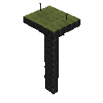|<ul><li>BlackForest</li></ul>|<ul><li>Edge</li><li>Median</li></ul>|0|8|<ul><li>Clear area</li></ul>|<ul><li>Altitude: 1</li><li>Terrain Delta: 0 - 3</li></li><li>Forest Threshold: 0 - 1</li></li></ul>||
|Pillar2 |<ul><li>BlackForest</li></ul>|<ul><li>Edge</li><li>Median</li></ul>|0|8|<ul><li>Clear area</li></ul>|<ul><li>Altitude: 1</li><li>Terrain Delta: 0 - 3</li></li><li>Forest Threshold: 0 - 1</li></li></ul>||
|StoneHouse1_heath |<ul><li>Plains</li></ul>|<ul><li>Edge</li><li>Median</li></ul>|0|6|<ul><li>Clear area</li><li>Spawns Goblin</li></ul>|<ul><li>Altitude: 1</li><li>Terrain Delta: 0 - 3</li></li><li>Forest Threshold: 0 - 1</li></li></ul>||
|StoneHouse2_heath |<ul><li>Plains</li></ul>|<ul><li>Edge</li><li>Median</li></ul>|0|6|<ul><li>Clear area</li><li>Spawns Goblin</li></ul>|<ul><li>Altitude: 1</li><li>Terrain Delta: 0 - 3</li></li><li>Forest Threshold: 0 - 1</li></li></ul>||
|StoneHouse5_heath |<ul><li>Plains</li></ul>|<ul><li>Edge</li><li>Median</li></ul>|0|7|<ul><li>Clear area</li></ul>|<ul><li>Altitude: 1</li><li>Terrain Delta: 0 - 3</li></li><li>Forest Threshold: 0 - 1</li></li></ul>||
|SunkenCrypt1 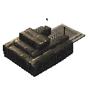|<ul><li>Swamp</li></ul>|<ul><li>Edge</li><li>Median</li></ul>|0|12|<ul><li>Clear area</li><li>Spawns Draugr</li><li>Spawns Blob</li></ul>|<ul><li>Altitude: -1</li><li>Terrain Delta: 0 - 4</li></li><li>Forest Threshold: 0 - 1</li></li></ul>|<ul><li>Name: InteriorEnvironmentZone</li><li>Radius: 20</li><li>Environment: SunkenCrypt</li></ul>|
|SunkenCrypt2 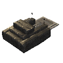|<ul><li>Swamp</li></ul>|<ul><li>Edge</li><li>Median</li></ul>|0|15|<ul><li>Clear area</li><li>Spawns Wraith</li><li>Spawns Greydwarf_Elite</li><li>Spawns Draugr_Ranged</li><li>Spawns Draugr</li><li>Spawns Blob</li></ul>|<ul><li>Altitude: -1</li><li>Terrain Delta: 0 - 4</li></li><li>Forest Threshold: 0 - 1</li></li></ul>|<ul><li>Name: InteriorEnvironmentZone</li><li>Radius: 29</li><li>Environment: SunkenCrypt</li></ul>|
|SunkenCrypt3 |<ul><li>Swamp</li></ul>|<ul><li>Edge</li><li>Median</li></ul>|0|12|<ul><li>Clear area</li><li>Spawns Wraith</li><li>Spawns Draugr</li><li>Spawns Blob</li></ul>|<ul><li>Altitude: -1</li><li>Terrain Delta: 0 - 4</li></li><li>Forest Threshold: 0 - 1</li></li></ul>|<ul><li>Name: InteriorEnvironmentZone</li><li>Radius: 28</li><li>Environment: SunkenCrypt</li></ul>|
|Hugintest 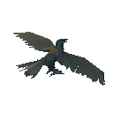|<ul><li>Meadows</li></ul>|<ul><li>Edge</li><li>Median</li></ul>|0|16|<ul></ul>|<ul><li>Altitude: -1000</li><li>Terrain Delta: 0 - 2</li></li><li>Forest Threshold: 0 - 1</li></li></ul>||
|DevHouse1 |<ul></ul>|<ul><li>Edge</li><li>Median</li></ul>|0|8|<ul></ul>|<ul><li>Altitude: -1000</li><li>Terrain Delta: 0 - 2</li></li><li>Forest Threshold: 0 - 1</li></li></ul>||
|Greydwarf_camp2 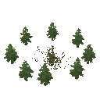|<ul><li>BlackForest</li></ul>|<ul><li>Edge</li><li>Median</li></ul>|50|10.7|<ul><li>Clear area</li></ul>|<ul><li>Altitude: 1</li><li>Terrain Delta: 0 - 3</li></li><li>Forest Threshold: 0 - 1</li></li></ul>||
|Greydwarf_camp3 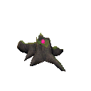|<ul><li>BlackForest</li></ul>|<ul><li>Edge</li><li>Median</li></ul>|100|15|<ul><li>Clear area</li></ul>|<ul><li>Altitude: 1</li><li>Terrain Delta: 0 - 3</li></li><li>Forest Threshold: 0 - 1</li></li></ul>||
|StoneTower2 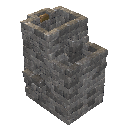|<ul><li>Plains</li></ul>|<ul><li>Edge</li><li>Median</li></ul>|100|10|<ul><li>Clear area</li><li>Spawns Goblin</li></ul>|<ul><li>Altitude: 1</li><li>Terrain Delta: 0 - 3</li></li><li>Forest Threshold: 0 - 1</li><li>MinDistanceFromSimilar: 500</li></ul>||
|StoneTower4 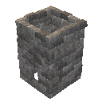|<ul><li>Plains</li></ul>|<ul><li>Edge</li><li>Median</li></ul>|100|10|<ul><li>Clear area</li><li>Spawns Goblin</li></ul>|<ul><li>Altitude: 1</li><li>Terrain Delta: 0 - 3</li></li><li>Forest Threshold: 0 - 1</li><li>MinDistanceFromSimilar: 500</li></ul>||
|TrollCave 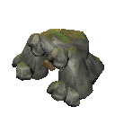|<ul><li>BlackForest</li></ul>|<ul><li>Median</li></ul>|100|9|<ul><li>Clear area</li><li>Spawns Troll</li></ul>|<ul><li>Altitude: 1</li><li>Terrain Delta: 5 - 10</li></li><li>Forest Threshold: 0 - 1</li></li></ul>||
|GoblinCamp1 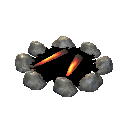|<ul><li>Plains</li></ul>|<ul><li>Edge</li><li>Median</li></ul>|200|8|<ul><li>Clear area</li><li>Spawns Goblin</li></ul>|<ul><li>Altitude: 1</li><li>Terrain Delta: 0 - 3</li></li><li>Forest Threshold: 0 - 1</li></li></ul>||
|MountainCave01 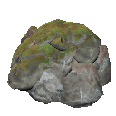|<ul><li>Mountain</li></ul>|<ul><li>Edge</li><li>Median</li></ul>|500|10|<ul><li>Clear area</li></ul>|<ul><li>Altitude: 100</li><li>Terrain Delta: 0 - 20</li></li><li>Forest Threshold: 0 - 1</li></li></ul>|<ul><li>Name: InteriorEnvironmentZone</li><li>Radius: 32</li><li>Environment: Crypt</li></ul>|
