# Vegetation
All of the vegetation currently in the game.
This file is automatically generated from Valheim using the JotunnDoc mod found on our GitHub.
|Vegetation |Biome |BiomeArea |Quantity per zone |Properties |Filters |
|---|---|---|---|---|---|
|rock4_coast 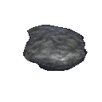|<ul><li>Meadows</li><li>BlackForest</li><li>AshLands</li><li>DeepNorth</li><li>Ocean</li><li>Mistlands</li></ul>|<ul><li>Edge</li><li>Median</li></ul>|<ul><li>3 groups of 3</li><li>Group Radius: 20</li></ul>|<ul><li>Random scale: 0.6 - 1.2</li></li></ul>|<ul><li>Altitude: -2 - -0.5</li><li>Terrain Delta: 0 - 2</li><li>Terrain Delta Radius: 0</li><li>Ocean Depth: 2 - 30</li><li>Tilt: 0 - 90</li></li></ul>|
|rock4_heath 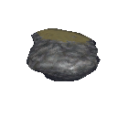|<ul><li>Plains</li></ul>|<ul><li>Edge</li><li>Median</li></ul>|4 - 10|<ul><li>Random scale: 0.8 - 1</li><li>Ground offset: -3</li></ul>|<ul><li>Altitude: 4 - 1000</li><li>Terrain Delta: 0 - 2</li><li>Terrain Delta Radius: 0</li><li>Ocean Depth: 0</li><li>Tilt: 15 - 45</li></li></ul>|
|HeathRockPillar 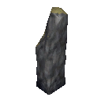|<ul><li>Plains</li></ul>|<ul><li>Edge</li><li>Median</li></ul>|0 - 0.1|<ul><li>Random scale: 0.8 - 1.3</li><li>Ground offset: -2</li></ul>|<ul><li>Altitude: 0 - 1000</li><li>Terrain Delta: 0 - 2</li><li>Terrain Delta Radius: 0</li><li>Ocean Depth: 0</li><li>Tilt: 0 - 30</li></li></ul>|
|rock2_heath 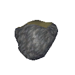|<ul><li>Plains</li></ul>|<ul><li>Edge</li><li>Median</li></ul>|0 - 1|<ul><li>Random scale: 1 - 1.5</li></li></ul>|<ul><li>Altitude: 0 - 1000</li><li>Terrain Delta: 0 - 2</li><li>Terrain Delta Radius: 0</li><li>Ocean Depth: 0</li><li>Tilt: 0 - 20</li></li></ul>|
|HugeRoot1 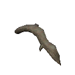|<ul><li>Mistlands</li></ul>|<ul><li>Edge</li><li>Median</li></ul>|5|<ul><li>Random scale: 1 - 2</li></li></ul>|<ul><li>Altitude: 0 - 1000</li><li>Terrain Delta: 0 - 2</li><li>Terrain Delta Radius: 0</li><li>Ocean Depth: 0</li><li>Tilt: 0 - 30</li></li></ul>|
|SwampTree2_darkland 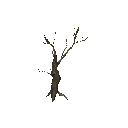|<ul><li>Mistlands</li></ul>|<ul><li>Edge</li><li>Median</li></ul>|10|<ul><li>Random scale: 3 - 5</li></li></ul>|<ul><li>Altitude: 1 - 1000</li><li>Terrain Delta: 0 - 2</li><li>Terrain Delta Radius: 0</li><li>Ocean Depth: 0</li><li>Tilt: 0 - 25</li></li></ul>|
|rock3_mountain 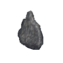|<ul><li>Mountain</li></ul>|<ul><li>Median</li></ul>|0 - 2|<ul><li>Random scale: 1 - 1.5</li><li>Ground offset: -5</li></ul>|<ul><li>Altitude: -1000 - 1000</li><li>Terrain Delta: 0 - 2</li><li>Terrain Delta Radius: 0</li><li>Ocean Depth: 0</li><li>Tilt: 10 - 50</li></li></ul>|
|silvervein 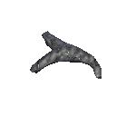|<ul><li>Mountain</li></ul>|<ul><li>Median</li></ul>|1|<ul><li>Ground offset: -4</li></ul>|<ul><li>Altitude: 120 - 1000</li><li>Terrain Delta: 0 - 3</li><li>Terrain Delta Radius: 9</li><li>Ocean Depth: 0</li><li>Tilt: 0 - 30</li></li></ul>|
|rock1_mountain 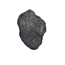|<ul><li>Mountain</li></ul>|<ul><li>Median</li></ul>|5 - 8|<ul><li>Random scale: 1 - 1.5</li><li>Ground offset: -6</li></ul>|<ul><li>Altitude: -1000 - 1000</li><li>Terrain Delta: 0 - 2</li><li>Terrain Delta Radius: 0</li><li>Ocean Depth: 0</li><li>Tilt: 30 - 80</li></li></ul>|
|rock2_mountain 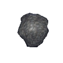|<ul><li>Mountain</li></ul>|<ul><li>Median</li></ul>|5 - 8|<ul><li>Random scale: 1 - 1.5</li><li>Ground offset: -5</li></ul>|<ul><li>Altitude: -1000 - 1000</li><li>Terrain Delta: 0 - 2</li><li>Terrain Delta Radius: 0</li><li>Ocean Depth: 0</li><li>Tilt: 30 - 80</li></li></ul>|
|Rock_4 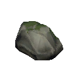|<ul><li>Swamp</li></ul>|<ul><li>Edge</li><li>Median</li></ul>|0 - 20|<ul><li>Random scale: 1 - 2</li></li></ul>|<ul><li>Altitude: -1000 - 1000</li><li>Terrain Delta: 0 - 2</li><li>Terrain Delta Radius: 0</li><li>Ocean Depth: 0</li><li>Tilt: 0 - 90</li></li></ul>|
|mudpile_beacon 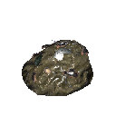|<ul><li>Swamp</li></ul>|<ul><li>Edge</li><li>Median</li></ul>|0 - 5|<ul><li>Random scale: 1 - 2</li><li>Ground offset: -3</li></ul>|<ul><li>Altitude: 0.5 - 1000</li><li>Terrain Delta: 0 - 2</li><li>Terrain Delta Radius: 0</li><li>Ocean Depth: 0</li><li>Tilt: 0 - 90</li></li></ul>|
|Rock_4 |<ul><li>Meadows</li><li>Mountain</li></ul>|<ul><li>Edge</li><li>Median</li></ul>|10 - 40|<ul><li>Random scale: 1 - 2</li></li></ul>|<ul><li>Altitude: -10 - 1000</li><li>Terrain Delta: 0 - 2</li><li>Terrain Delta Radius: 0</li><li>Ocean Depth: 0</li><li>Tilt: 0 - 90</li></li></ul>|
|Rock_4_plains 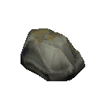|<ul><li>Plains</li></ul>|<ul><li>Edge</li><li>Median</li></ul>|5 - 30|<ul><li>Random scale: 1 - 2</li></li></ul>|<ul><li>Altitude: -10 - 1000</li><li>Terrain Delta: 0 - 2</li><li>Terrain Delta Radius: 0</li><li>Ocean Depth: 0</li><li>Tilt: 0 - 90</li></li></ul>|
|Rock_3 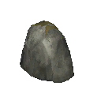|<ul><li>Meadows</li><li>Mountain</li></ul>|<ul><li>Edge</li><li>Median</li></ul>|0 - 15|<ul><li>Random scale: 2 - 4</li><li>Ground offset: -0.5</li></ul>|<ul><li>Altitude: -1000 - 1000</li><li>Terrain Delta: 0 - 2</li><li>Terrain Delta Radius: 0</li><li>Ocean Depth: 0</li><li>Tilt: 0 - 90</li></li></ul>|
|rock4_forest 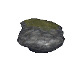|<ul><li>BlackForest</li></ul>|<ul><li>Edge</li><li>Median</li></ul>|1 - 2|<ul><li>Random scale: 0.8 - 1</li><li>Ground offset: -2</li></ul>|<ul><li>Altitude: 4 - 1000</li><li>Terrain Delta: 0 - 2</li><li>Terrain Delta Radius: 0</li><li>Ocean Depth: 0</li><li>Tilt: 5 - 45</li></li></ul>|
|rock4_copper 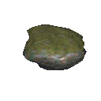|<ul><li>BlackForest</li></ul>|<ul><li>Edge</li><li>Median</li></ul>|0 - 1|<ul><li>Ground offset: -2</li></ul>|<ul><li>Altitude: 4 - 1000</li><li>Terrain Delta: 0 - 2</li><li>Terrain Delta Radius: 0</li><li>Ocean Depth: 0</li><li>Tilt: 5 - 45</li></li></ul>|
|MineRock_Tin 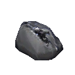|<ul><li>BlackForest</li></ul>|<ul><li>Edge</li><li>Median</li></ul>|20|<ul><li>Ground offset: -0.5</li></ul>|<ul><li>Altitude: -0.6 - 1.5</li><li>Terrain Delta: 0 - 2</li><li>Terrain Delta Radius: 0</li><li>Ocean Depth: 0</li><li>Tilt: 0 - 90</li></li></ul>|
|Rock_4 |<ul><li>BlackForest</li></ul>|<ul><li>Edge</li><li>Median</li></ul>|20|<ul><li>Random scale: 1 - 3</li></li></ul>|<ul><li>Altitude: -1000 - 1000</li><li>Terrain Delta: 0 - 2</li><li>Terrain Delta Radius: 0</li><li>Ocean Depth: 0</li><li>Tilt: 0 - 45</li></li></ul>|
|Rock_4 |<ul><li>Mistlands</li></ul>|<ul><li>Edge</li><li>Median</li></ul>|20|<ul><li>Random scale: 1 - 3</li></li></ul>|<ul><li>Altitude: 0 - 1000</li><li>Terrain Delta: 0 - 2</li><li>Terrain Delta Radius: 0</li><li>Ocean Depth: 0</li><li>Tilt: 0 - 45</li></li></ul>|
|Rock_3 |<ul><li>BlackForest</li></ul>|<ul><li>Edge</li><li>Median</li></ul>|5 - 15|<ul><li>Random scale: 3 - 6</li></li></ul>|<ul><li>Altitude: -1000 - 1000</li><li>Terrain Delta: 0 - 2</li><li>Terrain Delta Radius: 0</li><li>Ocean Depth: 0</li><li>Tilt: 0 - 25</li></li></ul>|
|Rock_3 |<ul><li>Mistlands</li></ul>|<ul><li>Edge</li><li>Median</li></ul>|5 - 15|<ul><li>Random scale: 3 - 6</li></li></ul>|<ul><li>Altitude: 0 - 1000</li><li>Terrain Delta: 0 - 2</li><li>Terrain Delta Radius: 0</li><li>Ocean Depth: 0</li><li>Tilt: 0 - 25</li></li></ul>|
|vfx_swamp_mist |<ul><li>Swamp</li></ul>|<ul><li>Edge</li><li>Median</li></ul>|10|<ul><li>Snap to water</li></li></ul>|<ul><li>Altitude: -5 - 5</li><li>Terrain Delta: 0 - 2</li><li>Terrain Delta Radius: 0</li><li>Ocean Depth: 0</li><li>Tilt: 0 - 90</li></li></ul>|
|vfx_edge_clouds |<ul></ul>|<ul><li>Edge</li><li>Median</li></ul>|1|<ul><li>Snap to water</li></li></ul>|<ul><li>Altitude: -1000 - 0</li><li>Terrain Delta: 0 - 2</li><li>Terrain Delta Radius: 0</li><li>Ocean Depth: 0</li><li>Tilt: 0 - 90</li></li></ul>|
|Beech1 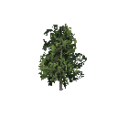|<ul><li>Meadows</li></ul>|<ul><li>Edge</li><li>Median</li></ul>|40|<ul><li>Random scale: 0.8 - 1.5</li></li></ul>|<ul><li>Altitude: 0.2 - 1000</li><li>Terrain Delta: 0 - 2</li><li>Terrain Delta Radius: 0</li><li>Ocean Depth: 0 - 2</li><li>Tilt: 0 - 30</li></li></ul>|
|Birch1 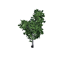|<ul><li>Meadows</li></ul>|<ul><li>Edge</li><li>Median</li></ul>|5|<ul><li>Random scale: 0.5 - 1</li></li></ul>|<ul><li>Altitude: 0.2 - 1000</li><li>Terrain Delta: 0 - 2</li><li>Terrain Delta Radius: 0</li><li>Ocean Depth: 0 - 2</li><li>Tilt: 0 - 30</li></li></ul>|
|Birch1_aut 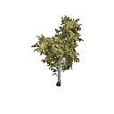|<ul><li>Plains</li></ul>|<ul><li>Edge</li><li>Median</li></ul>|30|<ul><li>Random scale: 0.5 - 1</li></li></ul>|<ul><li>Altitude: 0.1 - 1000</li><li>Terrain Delta: 0 - 2</li><li>Terrain Delta Radius: 0</li><li>Ocean Depth: 0</li><li>Tilt: 0 - 30</li><li>Forest Threshold: 0 - 0.8</li></ul>|
|Birch2 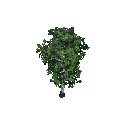|<ul><li>Meadows</li></ul>|<ul><li>Edge</li><li>Median</li></ul>|0 - 3|<ul><li>Random scale: 0.5 - 1</li></li></ul>|<ul><li>Altitude: 0.2 - 1000</li><li>Terrain Delta: 0 - 2</li><li>Terrain Delta Radius: 0</li><li>Ocean Depth: 0 - 2</li><li>Tilt: 0 - 30</li></li></ul>|
|Oak1 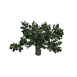|<ul><li>Meadows</li></ul>|<ul><li>Edge</li><li>Median</li></ul>|0 - 1|<ul><li>Random scale: 0.8 - 1</li></li></ul>|<ul><li>Altitude: 0.5 - 1000</li><li>Terrain Delta: 0 - 2</li><li>Terrain Delta Radius: 0</li><li>Ocean Depth: 0 - 2</li><li>Tilt: 0 - 20</li><li>Forest Threshold: 1 - 3</li></ul>|
|Birch2_aut 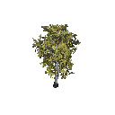|<ul><li>Plains</li></ul>|<ul><li>Edge</li><li>Median</li></ul>|10|<ul><li>Random scale: 1 - 1.5</li></li></ul>|<ul><li>Altitude: 0.1 - 1000</li><li>Terrain Delta: 0 - 2</li><li>Terrain Delta Radius: 0</li><li>Ocean Depth: 0</li><li>Tilt: 0 - 30</li><li>Forest Threshold: 0 - 0.8</li></ul>|
|FirTree 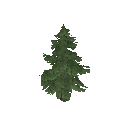|<ul><li>BlackForest</li></ul>|<ul><li>Edge</li><li>Median</li></ul>|5|<ul><li>Random scale: 2 - 2.5</li></li></ul>|<ul><li>Altitude: 0.1 - 1000</li><li>Terrain Delta: 0 - 2</li><li>Terrain Delta Radius: 0</li><li>Ocean Depth: 0 - 2</li><li>Tilt: 0 - 30</li></li></ul>|
|FirTree |<ul><li>BlackForest</li></ul>|<ul><li>Edge</li></ul>|40|<ul><li>Random scale: 2 - 2.5</li></li></ul>|<ul><li>Altitude: 0.1 - 1000</li><li>Terrain Delta: 0 - 2</li><li>Terrain Delta Radius: 0</li><li>Ocean Depth: 0 - 2</li><li>Tilt: 0 - 30</li></li></ul>|
|Pinetree_01 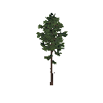|<ul><li>BlackForest</li></ul>|<ul><li>Median</li></ul>|60|<ul><li>Random scale: 1 - 2.5</li></li></ul>|<ul><li>Altitude: 0.1 - 1000</li><li>Terrain Delta: 0 - 2</li><li>Terrain Delta Radius: 0</li><li>Ocean Depth: 0 - 1.5</li><li>Tilt: 0 - 30</li></li></ul>|
|Pinetree_01 |<ul><li>Mistlands</li></ul>|<ul><li>Median</li></ul>|5|<ul><li>Random scale: 2 - 2.5</li></li></ul>|<ul><li>Altitude: 0.1 - 1000</li><li>Terrain Delta: 0 - 2</li><li>Terrain Delta Radius: 0</li><li>Ocean Depth: 0</li><li>Tilt: 0 - 30</li></li></ul>|
|Beech_small1 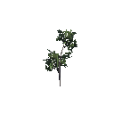|<ul><li>Meadows</li></ul>|<ul><li>Edge</li><li>Median</li></ul>|100|<ul><li>Random scale: 1 - 1.5</li></li></ul>|<ul><li>Altitude: 1 - 1000</li><li>Terrain Delta: 0 - 2</li><li>Terrain Delta Radius: 0</li><li>Ocean Depth: 0</li><li>Tilt: 0 - 30</li><li>Forest Threshold: 1.1 - 1.15</li></ul>|
|Beech_small2 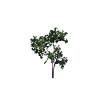|<ul><li>Meadows</li></ul>|<ul><li>Edge</li><li>Median</li></ul>|100|<ul><li>Random scale: 1 - 2</li></li></ul>|<ul><li>Altitude: 1 - 1000</li><li>Terrain Delta: 0 - 2</li><li>Terrain Delta Radius: 0</li><li>Ocean Depth: 0</li><li>Tilt: 0 - 30</li><li>Forest Threshold: 1.1 - 1.15</li></ul>|
|Beech_small1 |<ul><li>Meadows</li></ul>|<ul><li>Edge</li><li>Median</li></ul>|80|<ul><li>Random scale: 1 - 1.5</li></li></ul>|<ul><li>Altitude: 1 - 1000</li><li>Terrain Delta: 0 - 2</li><li>Terrain Delta Radius: 0</li><li>Ocean Depth: 0</li><li>Tilt: 0 - 30</li></li></ul>|
|Beech_small2 |<ul><li>Meadows</li></ul>|<ul><li>Edge</li><li>Median</li></ul>|80|<ul><li>Random scale: 1 - 2</li></li></ul>|<ul><li>Altitude: 1 - 1000</li><li>Terrain Delta: 0 - 2</li><li>Terrain Delta Radius: 0</li><li>Ocean Depth: 0</li><li>Tilt: 0 - 30</li></li></ul>|
|Bush02_en 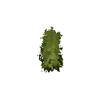|<ul><li>Plains</li></ul>|<ul><li>Edge</li><li>Median</li></ul>|<ul><li>1 - 3 groups of 8 - 20</li><li>Group Radius: 15</li></ul>|<ul><li>Random scale: 0.5 - 1.5</li></li></ul>|<ul><li>Altitude: 1 - 1000</li><li>Terrain Delta: 0 - 2</li><li>Terrain Delta Radius: 0</li><li>Ocean Depth: 0</li><li>Tilt: 0 - 30</li></li></ul>|
|CloudberryBush 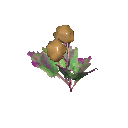|<ul><li>Plains</li></ul>|<ul><li>Edge</li><li>Median</li></ul>|<ul><li>1 - 3 groups of 15 - 20</li><li>Group Radius: 6</li></ul>|<ul></li></ul>|<ul><li>Altitude: 2 - 50</li><li>Terrain Delta: 0 - 2</li><li>Terrain Delta Radius: 0</li><li>Ocean Depth: 0</li><li>Tilt: 0 - 30</li></li></ul>|
|FirTree_small_dead 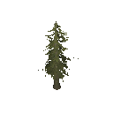|<ul><li>Swamp</li></ul>|<ul><li>Edge</li><li>Median</li></ul>|60|<ul><li>Random scale: 0.3 - 0.8</li></li></ul>|<ul><li>Altitude: 0.5 - 1000</li><li>Terrain Delta: 0 - 2</li><li>Terrain Delta Radius: 0</li><li>Ocean Depth: 0</li><li>Tilt: 0 - 25</li></li></ul>|
|SwampTree1 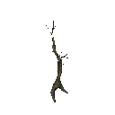|<ul><li>Swamp</li></ul>|<ul><li>Edge</li><li>Median</li></ul>|40|<ul><li>Random scale: 0.7 - 1.3</li></li></ul>|<ul><li>Altitude: -0.5 - 1000</li><li>Terrain Delta: 0 - 2</li><li>Terrain Delta Radius: 0</li><li>Ocean Depth: 0 - 2</li><li>Tilt: 0 - 30</li></li></ul>|
|SwampTree2 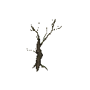|<ul><li>Swamp</li></ul>|<ul><li>Edge</li><li>Median</li></ul>|10 - 20|<ul><li>Random scale: 1.5 - 2</li></li></ul>|<ul><li>Altitude: -0.5 - 1000</li><li>Terrain Delta: 0 - 2</li><li>Terrain Delta Radius: 0</li><li>Ocean Depth: 0 - 2</li><li>Tilt: 0 - 35</li></li></ul>|
|SwampTree2_log 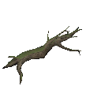|<ul><li>Swamp</li></ul>|<ul><li>Edge</li><li>Median</li></ul>|1 - 3|<ul><li>Random scale: 1.5 - 2</li></li></ul>|<ul><li>Altitude: -0.5 - 1000</li><li>Terrain Delta: 0 - 2</li><li>Terrain Delta Radius: 0</li><li>Ocean Depth: 0 - 2</li><li>Tilt: 0 - 35</li></li></ul>|
|Flies |<ul><li>Swamp</li></ul>|<ul><li>Edge</li><li>Median</li></ul>|20|<ul><li>Random scale: 0.5 - 1.5</li></li></ul>|<ul><li>Altitude: 0 - 1000</li><li>Terrain Delta: 0 - 2</li><li>Terrain Delta Radius: 0</li><li>Ocean Depth: 0</li><li>Tilt: 0 - 25</li></li></ul>|
|FirTree_small 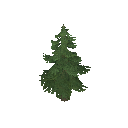|<ul><li>BlackForest</li></ul>|<ul><li>Edge</li><li>Median</li></ul>|30|<ul><li>Random scale: 0.3 - 0.7</li></li></ul>|<ul><li>Altitude: 0.5 - 1000</li><li>Terrain Delta: 0 - 2</li><li>Terrain Delta Radius: 0</li><li>Ocean Depth: 0</li><li>Tilt: 0 - 30</li></li></ul>|
|FirTree_small |<ul><li>Mountain</li></ul>|<ul><li>Edge</li><li>Median</li></ul>|30|<ul><li>Random scale: 0.3 - 0.7</li></li></ul>|<ul><li>Altitude: 0 - 280</li><li>Terrain Delta: 0 - 2</li><li>Terrain Delta Radius: 0</li><li>Ocean Depth: 0</li><li>Tilt: 0 - 30</li></li></ul>|
|FirTree_small_dead |<ul><li>Mistlands</li></ul>|<ul><li>Edge</li><li>Median</li></ul>|30|<ul><li>Random scale: 0.3 - 0.7</li></li></ul>|<ul><li>Altitude: 0 - 1000</li><li>Terrain Delta: 0 - 2</li><li>Terrain Delta Radius: 0</li><li>Ocean Depth: 0</li><li>Tilt: 0 - 30</li></li></ul>|
|vertical_web |<ul><li>Mistlands</li></ul>|<ul><li>Edge</li><li>Median</li></ul>|10|<ul><li>Random scale: 0.8 - 1.2</li></li></ul>|<ul><li>Altitude: 0 - 1000</li><li>Terrain Delta: 0 - 2</li><li>Terrain Delta Radius: 0</li><li>Ocean Depth: 0</li><li>Tilt: 0 - 30</li></li></ul>|
|horizontal_web |<ul><li>Mistlands</li></ul>|<ul><li>Edge</li><li>Median</li></ul>|10|<ul><li>Random scale: 0.8 - 1.2</li><li>Ground offset: 30</li></ul>|<ul><li>Altitude: 0 - 1000</li><li>Terrain Delta: 0 - 2</li><li>Terrain Delta Radius: 0</li><li>Ocean Depth: 0</li><li>Tilt: 0 - 30</li></li></ul>|
|tunnel_web 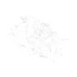|<ul><li>Mistlands</li></ul>|<ul><li>Edge</li><li>Median</li></ul>|5|<ul><li>Random scale: 0.8 - 1</li></li></ul>|<ul><li>Altitude: 0 - 1000</li><li>Terrain Delta: 0 - 2</li><li>Terrain Delta Radius: 0</li><li>Ocean Depth: 0</li><li>Tilt: 0 - 30</li></li></ul>|
|FirTree_small |<ul><li>BlackForest</li></ul>|<ul><li>Edge</li></ul>|60|<ul><li>Random scale: 0.3 - 0.7</li></li></ul>|<ul><li>Altitude: 0.5 - 1000</li><li>Terrain Delta: 0 - 2</li><li>Terrain Delta Radius: 0</li><li>Ocean Depth: 0</li><li>Tilt: 0 - 30</li></li></ul>|
|FirTree_oldLog 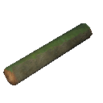|<ul><li>BlackForest</li></ul>|<ul><li>Edge</li><li>Median</li></ul>|6|<ul><li>Random scale: 0.9 - 1.3</li></li></ul>|<ul><li>Altitude: 0 - 1000</li><li>Terrain Delta: 0 - 2</li><li>Terrain Delta Radius: 0</li><li>Ocean Depth: 0</li><li>Tilt: 0 - 25</li></li></ul>|
|stubbe |<ul><li>Meadows</li></ul>|<ul><li>Edge</li><li>Median</li></ul>|1 - 3|<ul><li>Random scale: 0.8 - 1.2</li></li></ul>|<ul><li>Altitude: 0 - 1000</li><li>Terrain Delta: 0 - 2</li><li>Terrain Delta Radius: 0</li><li>Ocean Depth: 0 - 2</li><li>Tilt: 0 - 20</li></li></ul>|
|stubbe |<ul><li>Swamp</li></ul>|<ul><li>Edge</li><li>Median</li></ul>|4|<ul><li>Random scale: 1 - 2</li></li></ul>|<ul><li>Altitude: 0 - 1000</li><li>Terrain Delta: 0 - 2</li><li>Terrain Delta Radius: 0</li><li>Ocean Depth: 0 - 2</li><li>Tilt: 0 - 20</li></li></ul>|
|StatueEvil 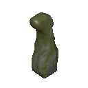|<ul><li>Swamp</li></ul>|<ul><li>Edge</li><li>Median</li></ul>|2|<ul></li></ul>|<ul><li>Altitude: 0 - 1000</li><li>Terrain Delta: 0 - 2</li><li>Terrain Delta Radius: 0</li><li>Ocean Depth: 0</li><li>Tilt: 0 - 20</li></li></ul>|
|FirTree_oldLog |<ul><li>Meadows</li></ul>|<ul><li>Edge</li><li>Median</li></ul>|1 - 4|<ul><li>Random scale: 1 - 1.2</li></li></ul>|<ul><li>Altitude: -1000 - 1000</li><li>Terrain Delta: 0 - 2</li><li>Terrain Delta Radius: 0</li><li>Ocean Depth: 0</li><li>Tilt: 0 - 20</li></li></ul>|
|FirTree_oldLog |<ul><li>Swamp</li></ul>|<ul><li>Edge</li><li>Median</li></ul>|6|<ul><li>Random scale: 1 - 1.2</li></li></ul>|<ul><li>Altitude: -1 - 1000</li><li>Terrain Delta: 0 - 2</li><li>Terrain Delta Radius: 0</li><li>Ocean Depth: 0</li><li>Tilt: 0 - 20</li></li></ul>|
|stubbe |<ul><li>BlackForest</li></ul>|<ul><li>Edge</li><li>Median</li></ul>|15|<ul><li>Random scale: 0.8 - 1.4</li></li></ul>|<ul><li>Altitude: 0 - 1000</li><li>Terrain Delta: 0 - 2</li><li>Terrain Delta Radius: 0</li><li>Ocean Depth: 0 - 2</li><li>Tilt: 0 - 20</li></li></ul>|
|stubbe |<ul><li>Mistlands</li></ul>|<ul><li>Edge</li><li>Median</li></ul>|15|<ul><li>Random scale: 0.8 - 1.4</li></li></ul>|<ul><li>Altitude: 0 - 1000</li><li>Terrain Delta: 0 - 2</li><li>Terrain Delta Radius: 0</li><li>Ocean Depth: 0</li><li>Tilt: 0 - 20</li></li></ul>|
|Bush01 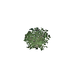|<ul><li>Meadows</li></ul>|<ul><li>Edge</li><li>Median</li></ul>|60 - 80|<ul><li>Random scale: 1 - 1.5</li></li></ul>|<ul><li>Altitude: 1 - 1000</li><li>Terrain Delta: 0 - 2</li><li>Terrain Delta Radius: 0</li><li>Ocean Depth: 0</li><li>Tilt: 0 - 90</li><li>Forest Threshold: 1 - 1.15</li></ul>|
|Bush01_heath 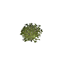|<ul><li>Plains</li></ul>|<ul><li>Edge</li><li>Median</li></ul>|60 - 80|<ul></li></ul>|<ul><li>Altitude: 0 - 1000</li><li>Terrain Delta: 0 - 2</li><li>Terrain Delta Radius: 0</li><li>Ocean Depth: 0</li><li>Tilt: 0 - 90</li><li>Forest Threshold: 1 - 1.15</li></ul>|
|shrub_2_heath 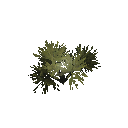|<ul><li>Plains</li></ul>|<ul><li>Edge</li><li>Median</li></ul>|20|<ul><li>Random scale: 0.5 - 1</li></li></ul>|<ul><li>Altitude: 0 - 1000</li><li>Terrain Delta: 0 - 2</li><li>Terrain Delta Radius: 0</li><li>Ocean Depth: 0</li><li>Tilt: 0 - 90</li><li>Forest Threshold: 1 - 1.15</li></ul>|
|shrub_2_heath |<ul><li>Swamp</li></ul>|<ul><li>Edge</li><li>Median</li></ul>|20|<ul><li>Random scale: 0.5 - 1</li></li></ul>|<ul><li>Altitude: 0 - 1000</li><li>Terrain Delta: 0 - 2</li><li>Terrain Delta Radius: 0</li><li>Ocean Depth: 0 - 2</li><li>Tilt: 0 - 90</li></li></ul>|
|Pickable_Thistle |<ul><li>Swamp</li><li>BlackForest</li></ul>|<ul><li>Median</li></ul>|<ul><li>1 - 2 groups of 2 - 5</li><li>Group Radius: 4</li></ul>|<ul><li>Random scale: 0.5 - 1</li></li></ul>|<ul><li>Altitude: 0 - 1000</li><li>Terrain Delta: 0 - 2</li><li>Terrain Delta Radius: 0</li><li>Ocean Depth: 0</li><li>Tilt: 0 - 20</li></li></ul>|
|shrub_2 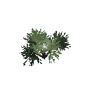|<ul><li>BlackForest</li></ul>|<ul><li>Edge</li><li>Median</li></ul>|100|<ul><li>Random scale: 0.5 - 1</li></li></ul>|<ul><li>Altitude: 1 - 1000</li><li>Terrain Delta: 0 - 2</li><li>Terrain Delta Radius: 0</li><li>Ocean Depth: 0</li><li>Tilt: 0 - 90</li></li></ul>|
|BlueberryBush 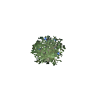|<ul><li>BlackForest</li></ul>|<ul><li>Median</li></ul>|<ul><li>1 groups of 1 - 8</li><li>Group Radius: 8</li></ul>|<ul></li></ul>|<ul><li>Altitude: 1 - 1000</li><li>Terrain Delta: 0 - 2</li><li>Terrain Delta Radius: 0</li><li>Ocean Depth: 0 - 2</li><li>Tilt: 0 - 90</li></li></ul>|
|RaspberryBush 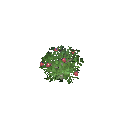|<ul><li>Meadows</li></ul>|<ul><li>Edge</li><li>Median</li></ul>|<ul><li>1 - 2 groups of 3 - 8</li><li>Group Radius: 8</li></ul>|<ul></li></ul>|<ul><li>Altitude: 1 - 1000</li><li>Terrain Delta: 0 - 2</li><li>Terrain Delta Radius: 0</li><li>Ocean Depth: 0</li><li>Tilt: 0 - 45</li><li>Forest Threshold: 1 - 1.2</li></ul>|
|Pickable_Mushroom 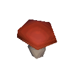|<ul><li>Meadows</li><li>Swamp</li><li>BlackForest</li></ul>|<ul><li>Edge</li><li>Median</li></ul>|<ul><li>1 - 2 groups of 3 - 6</li><li>Group Radius: 5</li></ul>|<ul><li>Random scale: 1 - 1.5</li></li></ul>|<ul><li>Altitude: 1 - 1000</li><li>Terrain Delta: 0 - 2</li><li>Terrain Delta Radius: 0</li><li>Ocean Depth: 0 - 2</li><li>Tilt: 0 - 25</li></li></ul>|
|Pickable_Dandelion |<ul><li>Meadows</li></ul>|<ul><li>Edge</li><li>Median</li></ul>|<ul><li>8 - 10 groups of 1 - 3</li><li>Group Radius: 3</li></ul>|<ul></li></ul>|<ul><li>Altitude: 1 - 1000</li><li>Terrain Delta: 0 - 2</li><li>Terrain Delta Radius: 0</li><li>Ocean Depth: 0</li><li>Tilt: 0 - 15</li></li></ul>|
|Pickable_Flint 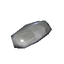|<ul><li>Meadows</li></ul>|<ul><li>Edge</li><li>Median</li></ul>|30|<ul></li></ul>|<ul><li>Altitude: -2 - 1</li><li>Terrain Delta: 0 - 2</li><li>Terrain Delta Radius: 0</li><li>Ocean Depth: 0</li><li>Tilt: 0 - 90</li></li></ul>|
|Pickable_Branch |<ul><li>Meadows</li><li>Swamp</li><li>BlackForest</li></ul>|<ul><li>Edge</li><li>Median</li></ul>|15|<ul></li></ul>|<ul><li>Altitude: 0 - 1000</li><li>Terrain Delta: 0 - 2</li><li>Terrain Delta Radius: 0</li><li>Ocean Depth: 0</li><li>Tilt: 0 - 90</li></li></ul>|
|Pickable_Stone 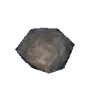|<ul><li>Meadows</li><li>Swamp</li><li>BlackForest</li><li>Plains</li></ul>|<ul><li>Edge</li><li>Median</li></ul>|<ul><li>30 groups of 2 - 3</li><li>Group Radius: 2</li></ul>|<ul></li></ul>|<ul><li>Altitude: 0 - 1000</li><li>Terrain Delta: 0 - 2</li><li>Terrain Delta Radius: 0</li><li>Ocean Depth: 0</li><li>Tilt: 22 - 90</li></li></ul>|
|Pickable_Stone |<ul><li>Meadows</li><li>Swamp</li></ul>|<ul><li>Edge</li><li>Median</li></ul>|5|<ul></li></ul>|<ul><li>Altitude: -3 - 1000</li><li>Terrain Delta: 0 - 2</li><li>Terrain Delta Radius: 0</li><li>Ocean Depth: 0</li><li>Tilt: 0 - 90</li></li></ul>|
|FirTree |<ul><li>Mountain</li></ul>|<ul><li>Edge</li><li>Median</li></ul>|5 - 20|<ul><li>Random scale: 1.5 - 3</li></li></ul>|<ul><li>Altitude: 2 - 280</li><li>Terrain Delta: 0 - 2</li><li>Terrain Delta Radius: 0</li><li>Ocean Depth: 0</li><li>Tilt: 0 - 30</li></li></ul>|
|ice1 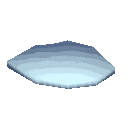|<ul><li>DeepNorth</li></ul>|<ul><li>Edge</li><li>Median</li></ul>|10 - 20|<ul><li>Snap to water</li></li></ul>|<ul><li>Altitude: -1000 - -1</li><li>Terrain Delta: 0 - 2</li><li>Terrain Delta Radius: 0</li><li>Ocean Depth: 0</li><li>Tilt: 0 - 90</li></li></ul>|
|ice_rock1 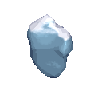|<ul><li>DeepNorth</li></ul>|<ul><li>Edge</li><li>Median</li></ul>|0 - 1|<ul><li>Snap to water</li><li>Ground offset: -2</li></ul>|<ul><li>Altitude: -1000 - -1</li><li>Terrain Delta: 0 - 2</li><li>Terrain Delta Radius: 0</li><li>Ocean Depth: 0</li><li>Tilt: 0 - 90</li></li></ul>|
|Skull1 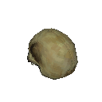|<ul><li>Mistlands</li></ul>|<ul><li>Edge</li><li>Median</li></ul>|20|<ul></li></ul>|<ul><li>Altitude: 1 - 1000</li><li>Terrain Delta: 0 - 2</li><li>Terrain Delta Radius: 0</li><li>Ocean Depth: 0</li><li>Tilt: 0 - 45</li></li></ul>|
|Skull2 |<ul><li>Mistlands</li></ul>|<ul><li>Edge</li><li>Median</li></ul>|0 - 3|<ul><li>Random scale: 0.8 - 1.2</li></li></ul>|<ul><li>Altitude: 1 - 1000</li><li>Terrain Delta: 0 - 2</li><li>Terrain Delta Radius: 0</li><li>Ocean Depth: 0</li><li>Tilt: 0 - 45</li></li></ul>|
|MineRock_Obsidian 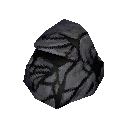|<ul><li>Mountain</li></ul>|<ul><li>Edge</li><li>Median</li></ul>|10 - 15|<ul><li>Random scale: 0.9 - 1</li></li></ul>|<ul><li>Altitude: 100 - 1000</li><li>Terrain Delta: 0 - 2</li><li>Terrain Delta Radius: 0</li><li>Ocean Depth: 0</li><li>Tilt: 0 - 90</li></li></ul>|
|Pickable_SeedTurnip |<ul><li>Swamp</li></ul>|<ul><li>Edge</li><li>Median</li></ul>|<ul><li>0 - 0.5 groups of 1 - 2</li><li>Group Radius: 5</li></ul>|<ul><li>Random scale: 1 - 1.5</li></li></ul>|<ul><li>Altitude: 0 - 1000</li><li>Terrain Delta: 0 - 2</li><li>Terrain Delta Radius: 0</li><li>Ocean Depth: 0</li><li>Tilt: 0 - 25</li></li></ul>|
|Pickable_SeedCarrot |<ul><li>BlackForest</li></ul>|<ul><li>Edge</li><li>Median</li></ul>|<ul><li>0 - 0.5 groups of 1 - 2</li><li>Group Radius: 5</li></ul>|<ul><li>Random scale: 1 - 1.5</li></li></ul>|<ul><li>Altitude: 1 - 1000</li><li>Terrain Delta: 0 - 2</li><li>Terrain Delta Radius: 0</li><li>Ocean Depth: 0</li><li>Tilt: 0 - 25</li></li></ul>|
|Leviathan |<ul><li>Ocean</li></ul>|<ul><li>Median</li></ul>|0 - 0.01|<ul><li>Snap to water</li></li></ul>|<ul><li>Altitude: -1000 - -30</li><li>Terrain Delta: 0 - 2</li><li>Terrain Delta Radius: 0</li><li>Ocean Depth: 0</li><li>Tilt: 0 - 90</li></li></ul>|
