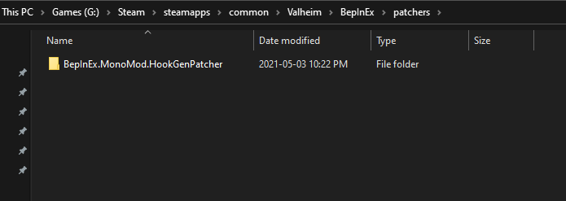
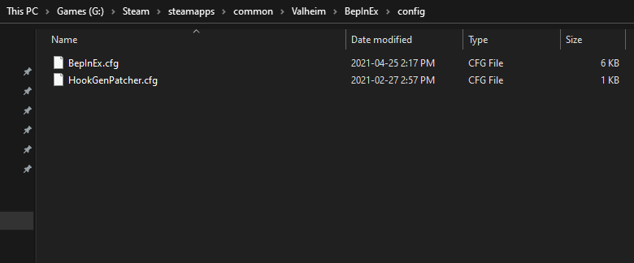
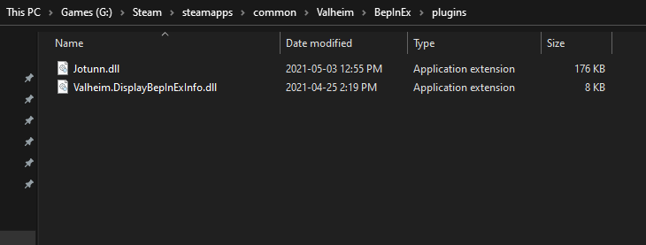
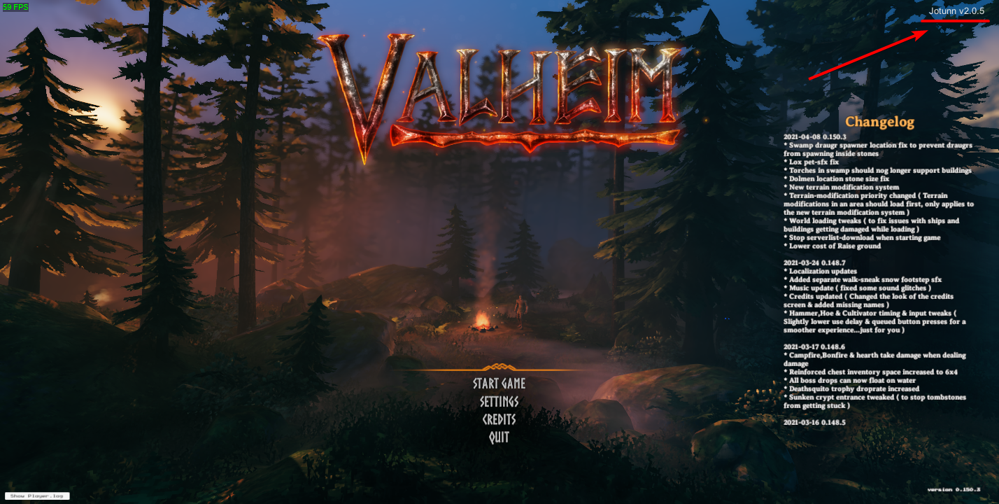

# Manual Installation Guide

This section will cover how to manually install Jötunn, without using a mod manager.

## 0. Installing BepInEx

Before we even start, be sure that you have [BepInEx](https://valheim.thunderstore.io/package/denikson/BepInExPack_Valheim/) downloaded and installed correctly. (If you have any other mods, odds are you'll have this installed.)

If this is a manual install, extract the ZIP archive and move everything from `BepInEx_Valheim` into your Valheim directory (eg. `C:\<PathToYourSteamLibary>\steamapps\common\Valheim`).
It should look something like this:

## 1. Downloading Jötunn

First, download Jötunn from your prefered public mirror (Note: You can find test builds through the public Discord):
- [Nexus Mods](https://www.nexusmods.com/valheim/mods/1138)
- [Thunderstore](https://valheim.thunderstore.io/package/ValheimModding/Jotunn/)

Secondly, download the MMHookGen dependency, if you have not already got it:
- [Nexus Mods](https://www.nexusmods.com/valheim/mods/505)
- [Thunderstore](https://valheim.thunderstore.io/package/ValheimModding/HookGenPatcher/)

If you downloaded both, you should have two ZIP files like so (names may vary depending on download source and version, but contents should be the same):

## 2. Extracting

Now that you have everything downloaded, you'll need to extract them in order to use the data inside them, uncompressed.  

First, navigate to your Valheim BepInEx directory (eg. `C:\<PathToYourSteamLibary>\steamapps\common\Valheim\BepInEx`). Now, we can extract them:

**For MMHookGen**: Extract the ZIP and put the `patchers` and `config` folders inside your BepInEx folder. These folders, in a clean installation, should look like so:

**For Jötunn**: Extract the ZIP, and put the `Jotunn.dll` file into your BepInEx `plugins` folder. These folders, in a clean installation, should look like so:

## 3. Launch Valheim

That's it, you're done! Now you can launch Valheim and enjoy your modding!  

You can tell it worked by either looking at the console output, or if you see `Jotunn Vx.x.x` in the top-right corner of the main menu, like so:

> [!NOTE]
> Your first run of the game may take a few seconds longer than it would without any mods. **This is normal.** This is due to MMHookGen creating the MMHook DLL files that are needed for Jötunn and various mods to run. This will only take longer on first install, and after Valheim updates.
