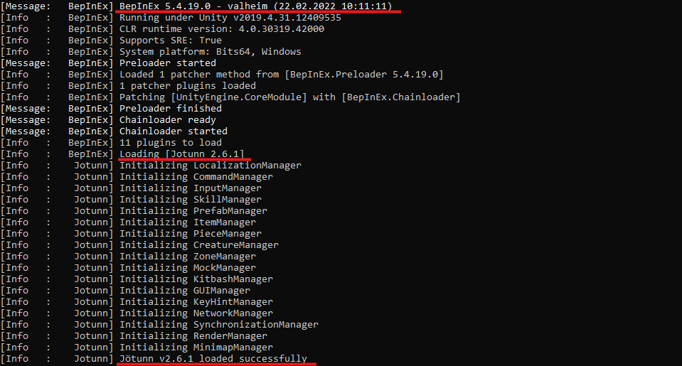

# Manual Installation Guide

This section will cover how to manually install Jötunn, without using a mod manager. This guide applies to client installations as well as installations on a dedicated server, though paths on a dedicated server installation might vary slighty depending on the server's operating system.

## 0. Installing BepInEx

Before we even start, be sure that you have [BepInEx](https://valheim.thunderstore.io/package/denikson/BepInExPack_Valheim/) downloaded and installed correctly. (If you have any other mods or rented a "modding enabled" server, odds are you'll have this installed.)

If this is a manual install, extract the ZIP archive and move everything from `BepInEx_Valheim` into your Valheim directory (eg. `C:\<PathToYourSteamLibary>\steamapps\common\Valheim`).
It should look something like this:

## 1. Downloading Jötunn

Download Jötunn from your prefered public mirror (Note: You can find test builds through the public Discord):
- [Nexus Mods](https://www.nexusmods.com/valheim/mods/1138)
- [Thunderstore](https://valheim.thunderstore.io/package/ValheimModding/Jotunn/)

Now you should have the ZIP file like so (names may vary depending on download source and version, but contents should be the same):

## 2. Extracting

Now that you have everything downloaded, you'll need to extract them in order to use the data inside them, uncompressed.  

First, navigate to your Valheim BepInEx directory (eg. `C:\<PathToYourSteamLibary>\steamapps\common\Valheim\BepInEx`). Now, we can extract them:

**For Jötunn**: Extract the ZIP, and put the `Jotunn.dll` file into your BepInEx `plugins` folder. These folders, in a clean installation, should look like so:

## 3. Launch Valheim

That's it, you're done! Now you can launch Valheim and enjoy your modding!  

You can tell it worked by looking at the console output, which, depending on your environment, should look something like this, telling you it loaded BepInEx and Jötunn:

