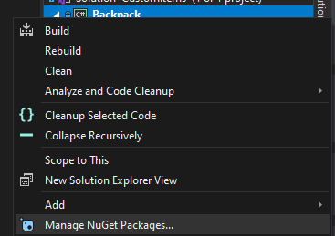

# Developer's Quickstart

These are the basic steps to integrate Jötunn into a new or existing project.

## Install Jötunn via NuGet

If you just want to use the library and none of its automations, all you'll need to do is install the latest release of Jötunn from [nuget.org](https://www.nuget.org/packages/JotunnLib) into your project and start using it. 

Adding a Nuget in Visual Studio is pretty simple. Let's take a look:'

- Right click on your project, and select *Manage Nuget Packages* <br />
- Click on *Browse* tab in the main pane, then type Jotunn to search for our nuget. Ensure that *Include Pre-Release* is unchecked.<br /> and then select *Install* in the right hand pane.
- Jötunn should now be installed as a dependency for your project, and the `Jotunn` namespace should be resolved.

## Jötunn dependencies

Jötunn uses `MMHooks`, which are event subscription wrappers generated by [MonoMod](https://github.com/MonoMod/MonoMod)which provide an intuitive interface for interacting with runtime detours, for patching methods. 

It is also recommended that you use publicized versions of the game's assemblies to make the modding more convenient as you don't have to use code reflection to access private methods or otherwise inaccessible members.

You can generate these dependencies manually and add them to your project, or let Jötunn's PreBuild task handle that for you.

## Manual dependency generation

You can generate your own MMHook's by downloading [HookGenPatcher](https://valheim.thunderstore.io/package/ValheimModding/HookGenPatcher/). To activate the hook generation, put the contents of the archive into their respective folders within `Valheim/BepInEx`. When launching the game, the assembly wrappers inside of `Valheim/BepInEx/Plugins/MMHook` are generated, which can then be added as references/dependencies to your project.

Publicized assemblies are manually generated with [AssemblyPublicizer](https://github.com/CabbageCrow/AssemblyPublicizer). Please follow the instructions found on GitHub using the Valheim assembly DLLs found under `Valheim/valheim_Data/Managed`.

## Activate PreBuild automations

### Add project references

Jötunn can automatically reference and resolve all dependencies that may be needed for the development process. To use this feature browse to your solution directory. Create a new file called `Environment.props` and place the following contents inside, modifying your `<VALHEIM_INSTALL>` to point to your game directory. This sets up references in your project to BepInEx, the publicized dlls and MMHook dlls.

```xml
<?xml version="1.0" encoding="utf-8"?>
<Project ToolsVersion="Current" xmlns="http://schemas.microsoft.com/developer/msbuild/2003">
  <PropertyGroup>
    <!-- Needs to be your path to the base Valheim folder -->
    <VALHEIM_INSTALL>X:\PathToYourSteamLibary\steamapps\common\Valheim</VALHEIM_INSTALL>
    <!-- This is the folder where your build gets copied to when using the post-build automations -->
    <MOD_DEPLOYPATH>$(VALHEIM_INSTALL)\BepInEx\plugins\blabla</MOD_DEPLOYPATH>
  </PropertyGroup>
</Project>
```

**WARNING:** _If you already have references to BepInEx and Valheim, this task will most certainly duplicate them._

### Publicize and MMHook Valheim assemblies

Jötunn can automatically create the publicized and MMHook assemblies for you. To use this feature you must have the `Environment.props` file from the last step. Additionally you need to create a new file called `DoPrebuild.props` in your solution directory.

```xml
<?xml version="1.0" encoding="utf-8"?>
<Project ToolsVersion="Current" xmlns="http://schemas.microsoft.com/developer/msbuild/2003">
  <PropertyGroup>
    <ExecutePrebuild>true</ExecutePrebuild>
  </PropertyGroup>
</Project>
```

**WARNING:** _This prebuild task will automate the generation of monomod method detours and publicising of game assemblies. By enabling this, you understand that you will be generating new publicised assemblies and method detours upon PreBuild **IF** the binaries have been updated since the last time the PreBuild has run._

## First build dependency acquisition
Even if you have errors in your project, you should still build the solution to ensure that the PreBuild task has run and completed successfully. You can ensure it has run by deleting the MMHook directory inside of `Plugins` and watch it regenerate as you build the solution.

After the PreBuild has run, and dependencies have been generated, they are automatically referenced via Jötunn. They are generated inside of your game directory, and will ensure that your mods are always built against the latest version of the game.

Done! You should now have all of your required dependencies resolved, such as BepInEx, Harmony, Monomod, Publicised assemblies, Unity corelibs, and Jotunn!

## BepInDependency

Don't forget to add dependency tags for bepin and compatibility! This will certify your mod throws an error if ever installed without Jötunn. Click for more information about [NetworkCompatibilty](../tutorials/networkcompatibility.md).
```cs
[BepInDependency(Jotunn.Main.ModGuid)]
[NetworkCompatibilty(CompatibilityLevel.EveryoneMustHaveMod, VersionStrictness.Minor)]
```