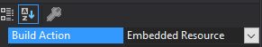

# Loading Assets

_Assets_ are resources imported into the game besides the dll file holding our plugin code. They can be images, localization files or complete asset bundles exported from Unity to import into the game. There are two different ways of loading your assets, commonly known as _side loaded_ and _embedded_.

**Note**: The code snippets are taken from our [example mod](https://github.com/Valheim-Modding/JotunnModExample).

### Side loading

Side loading would be where the assets are packaged alongside your plugin.dll. 

You may have noticed that we include a postbuild command into the [example mod](https://github.com/Valheim-Modding/JotunnModExample) to copy the `Assets` directory into the games plugin directory. Although this allows for easy development iteration though being able to change assets without recompilation, it is not so easily distributable to users, and must be packaged side by side with your released plugin, and exposes your assets to being directly modified by the user.

The example mod's post build action is a simple XCOPY command: `<Exec Command="xcopy &quot;$(ProjectDir)Assets&quot; &quot;$(VALHEIM_INSTALL)\BepInEx\plugins\JotunnModExample\Assets\&quot; /S /Y" />`

### Embedded resource

Another option is to embed our resources inside the binary itself. You may do this by right clicking a folder inside of your project, and add an existing item. Once it has been added, right click the item, select properties, and set the build action to embedded resource:




### Referencing our assets

In order to load our resources, we can utilise Jötunn's [AssetUtils](xref:Jotunn.Utils.AssetUtils) helper methods, such as [LoadTexture](xref:Jotunn.Utils.AssetUtils.LoadTexture(System.String,System.Boolean)), [LoadAssetBundle](xref:Jotunn.Utils.AssetUtils.LoadAssetBundle(System.String)), [LoadAssetBundleFromResources](xref:Jotunn.Utils.AssetUtils.LoadAssetBundleFromResources(System.String,System.Reflection.Assembly)). The method below showcases a number of ways to load your assets into various forms of objects.

```cs
private void LoadAssets()
{
    // Load texture from the filesystem
    testTex = AssetUtils.LoadTexture("JotunnModExample/Assets/test_tex.jpg");
    testSprite = Sprite.Create(testTex, new Rect(0f, 0f, testTex.width, testTex.height), Vector2.zero);

    // Load asset bundle from the filesystem
    testAssets = AssetUtils.LoadAssetBundle("JotunnModExample/Assets/jotunnlibtest");
    Jotunn.Logger.LogInfo(testAssets);

    // Load asset bundle from embedded resources
    embeddedResourceBundle = AssetUtils.LoadAssetBundleFromResources("eviesbackpacks");
    backpackPrefab = embeddedResourceBundle.LoadAsset<GameObject>("Assets/Evie/CapeSilverBackpack.prefab");
    Jotunn.Logger.LogInfo($"Embedded resources: {string.Join(",", typeof(JotunnModExample).Assembly.GetManifestResourceNames())}");
}
```