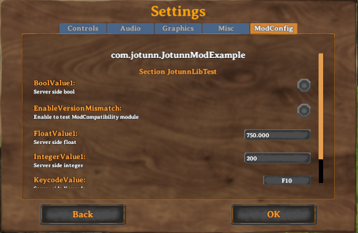

# Persistent & Synced Configurations

Jötunn itself does not provide any implementations or abstractions for persisent configurations. We do however respect [BepInEx.ConfigEntry](https://bepinex.github.io/bepinex_docs/master/articles/dev_guide/plugin_tutorial/3_configuration.html)'s, their various properties, as well as their [ConfigurationManager](https://github.com/BepInEx/BepInEx.ConfigurationManager) properties. Furthermore we have implemented a method of enforcing server side sync on specific configs via the `ConfigurationManagerAttributes` `IsAdminOnly` flag.

**Note:** `IsAdminOnly` is provided via JVL, not BepInEx.

Jötunn also provides a possibility to edit your configuration values via the settings dialogue of Valheim. That only applies to configuration created with mods using Jötunn.



**Note**: The code snippets are taken from our [example mod](https://github.com/Valheim-Modding/JotunnModExample).

## Binding and accessing configurations

Configurations are defined by "binding" a configuration. Refer to the [BepInEx documentation](https://docs.bepinex.dev/master/articles/dev_guide/plugin_tutorial/3_configuration.html) about configurations to learn more about that.

```cs
// Create some sample configuration values
private void CreateConfigValues()
{
    Config.SaveOnConfigSet = true;

    // Add client config which can be edited in every local instance independently
    StringConfig = Config.Bind("Client config", "LocalString", "Some string", "Client side string");
    FloatConfig = Config.Bind("Client config", "LocalFloat", 0.5f, new ConfigDescription("Client side float with a value range", new AcceptableValueRange<float>(0f, 1f)));
    IntegerConfig = Config.Bind("Client config", "LocalInteger", 2, new ConfigDescription("Client side integer without a range"));
    BoolConfig = Config.Bind("Client config", "LocalBool", false, new ConfigDescription("Client side bool / checkbox"));
}
```

To access the configuration entries either use properties or cast the boxed value to the value type:

```cs
// Examples for reading and writing configuration values
private void ReadAndWriteConfigValues()
{
    // Reading configuration entry
    string readValue = StringConfig.Value;
    // or
    float readBoxedValue = (float)Config["Client config", "LocalFloat"].BoxedValue;

    // Writing configuration entry
    IntegerConfig.Value = 150;
    // or
    Config["Client config", "LocalBool"].BoxedValue = true;
}
```

**Note**: Setting the `Value` property behaves differently to setting the `BoxedValue` property: Setting `Value` will apply value ranges (defined in the `ConfigurationManagerAttributes` via `AcceptableValueRange` for example) while `BoxedValue` will have no checks.

## Synced configurations

We can sync a client configuration with the server by setting the `IsAdminOnly` flag on the configuration like so:

```cs
// Create some sample configuration values to check server sync
private void CreateConfigValues()
{
    Config.SaveOnConfigSet = true;

    // Add server config which gets pushed to all clients connecting and can only be edited by admins
    // In local/single player games the player is always considered the admin
    Config.Bind("Server config", "StringValue1", "StringValue", new ConfigDescription("Server side string", null, new ConfigurationManagerAttributes { IsAdminOnly = true }));
    Config.Bind("Server config", "FloatValue1", 750f, new ConfigDescription("Server side float", new AcceptableValueRange<float>(0f, 1000f), new ConfigurationManagerAttributes { IsAdminOnly = true }));
    Config.Bind("Server config", "IntegerValue1", 200, new ConfigDescription("Server side integer", null, new ConfigurationManagerAttributes { IsAdminOnly = true }));
    Config.Bind("Server config", "BoolValue1", false, new ConfigDescription("Server side bool", null, new ConfigurationManagerAttributes { IsAdminOnly = true }));
}
```

This allows admins defined in the servers adminlist.txt to change the values on the fly, however clients without admin have no control over this configs. Every client connecting to that server using the same mod will receive the configuration values from the server. Local settings will be overriden by the servers values as long as the client is connected to that server.

## Synced admin status

Upon connection to a server, Jötunn checks the admin status of the connecting player on that server, given that Jötunn is installed on both sides. The admin status of a player is determined by the adminlist.txt file of Valheim. If the player has admin status on a server, that player is able to change configuration values declared as `IsAdminOnly` as described before. If that status changes on the server because of changes on the adminlist.txt, Jötunn will automatically synchronize that change to any affected client. This unlocks or locks the players ability to change admin configuration. Mods using Jötunn can query the admin status locally and dont need to rely on a RPC call to check the players status on the connected server. The current admin status of a player can be read from [SynchronizationManager.PlayerIsAdmin](xref:Jotunn.Managers.SynchronizationManager.PlayerIsAdmin).

**Note**: When starting a local game the local player always gains admin status regardless of any given adminlist.txt values.

**Note**: At the start scene / main menu the player is not an admin per default. This means that admin only configuration can never be changed in the main menu.

## Additional config attributes

Besides the `IsAdminOnly` attribute, Jötunn provides several additional custom attributes for config entries:

* EntryColor: Changes the default color of the config key in the settings GUI for that entry.
* DescriptionColor: Changes the default color of the description text in the settings GUI for that entry.
* Browsable: When set to `false`, that entry is not accessible through the settings GUI but will be created in the file and also synced, when `IsAdminOnly` is set to `true`.

```cs
private void CreateConfigValues()
{
    Config.SaveOnConfigSet = true;

    // Colored text configs
    Config.Bind("Client config", "ColoredValue", false,
        new ConfigDescription("Colored key and description text", null, new ConfigurationManagerAttributes { EntryColor = Color.blue, DescriptionColor = Color.yellow }));

    // Invisible configs
    Config.Bind("Client config", "InvisibleInt", 150,
        new ConfigDescription("Invisible int, testing browsable=false", null, new ConfigurationManagerAttributes() { Browsable = false }));
}
```

## Config synced event

Jötunn provides an event in the SynchronizationManager you can subscribe to: [SynchronizationManager.OnConfigurationSynchronized](xref:Jotunn.Managers.SynchronizationManager.OnConfigurationSynchronized). It fires when configuration is synced from a server to the client. Upon connection there is always an initial sync event. If configuration is changed and distributed during a game session, the event is fired every time you receive or send configuration. This applies to server side configuration only (i.e. `AdminOnly = true`). To distinguish between the initial and recurring config sync use the [ConfigurationSynchronizationEventArgs](xref:Jotunn.Utils.ConfigurationSynchronizationEventArgs).

```cs
SynchronizationManager.OnConfigurationSynchronized += (obj, attr) =>
{
    if (attr.InitialSynchronization)
    {
        Jotunn.Logger.LogMessage("Initial Config sync event received");
    }
    else
    {
        Jotunn.Logger.LogMessage("Config sync event received");
    }
};
```