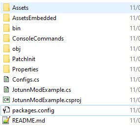

# Loading Assets, the Jotunn way


Inside of our `Awake` in our `BaseUnityPlugin` we will invoke a new method `loadAssets();` which will load the prefabs from our asset bundles and resources into our plugin. To facilitate this we will first need to define some fields as such:

```cs
public AssetBundle TestAssets;
public AssetBundle BlueprintRuneBundle;
public Skills.SkillType TestSkillType = 0;
private Texture2D testTex;
private Sprite testSprite;
private GameObject backpackPrefab;
private AssetBundle embeddedResourceBundle;
```

To acquire the references we will be using here you may [download](JotunnModExample.zip) them and place inside your project root: 



Next, we must import our assets into our project, and ensure they are packed into, or with our plugin. There are a number of ways to do this, such as:


### Side loading

Side loading would be where the assets are packaged alongside your plugin.dll. 

You may have noticed that we include a postbuild command to copy the `Assets` directory into the games plugin directory. Although this allows for easy development iteration though being able to change assets without recompilation, it is not so easily distributable to users, and must be packaged side by side with your released plugin, and exposes your assets to being directly modified by the user.

`<Exec Command="xcopy &quot;$(ProjectDir)Assets&quot; &quot;$(VALHEIM_INSTALL)\BepInEx\plugins\JotunnModExample\Assets\&quot; /S /Y" />`

### Embedded resource

Right click our solution, then add a new directory named `AssetsEmbedded`. Right click the directory and select `Add existing` and select the files we placed inside from the download link provided.

Another option is to embed our resources inside the binary itself. You may do this by right clicking a folder inside of your project, and add an existing item. Once it has been added, right click the item, select properties, and set the build action to embedded resource: 


### Referencing our assets
In order to load our resources, we can utilise Jotunn's [AssetUtils](xref:JotunnLib.AssetUtils) helper methods, such as [LoadTexture](xref:JotunnLib.AssetUtils.LoadTexture), [LoadAssetBundle](xref:JotunnLib.AssetUtils.LoadAssetBundle), [LoadAssetBundleFromResources](xref:JotunnLib.AssetUtils.LoadAssetBundleFromResources). The method bellow showcases a number of ways to load your assets into various forms of objects.

```cs
private void loadAssets()
{
    // Load texture
    testTex = AssetUtils.LoadTexture("JotunnModExample/Assets/test_tex.jpg");
    testSprite = Sprite.Create(testTex, new Rect(0f, 0f, testTex.width, testTex.height), Vector2.zero);

    // Load asset bundle from filesystem
    TestAssets = AssetUtils.LoadAssetBundle("JotunnModExample/Assets/jotunnlibtest");
    JotunnLib.Logger.LogInfo(TestAssets);

    // Load asset bundle from filesystem
    BlueprintRuneBundle = AssetUtils.LoadAssetBundle("JotunnModExample/Assets/blueprints");
    JotunnLib.Logger.LogInfo(BlueprintRuneBundle);
    
    //Load embedded resources
    embeddedResourceBundle = AssetUtils.LoadAssetBundleFromResources("capeironbackpack");
    backpackPrefab = embeddedResourceBundle.LoadAsset<GameObject>("Assets/Evie/CapeIronBackpack.prefab");

    // Embedded Resources
    JotunnLib.Logger.LogInfo($"Embedded resources: {string.Join(",", Assembly.GetExecutingAssembly().GetManifestResourceNames())}");
}
```