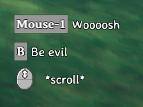

# Custom Inputs
Custom inputs can be registered through the [InputManager](xref:Jotunn.Managers.InputManager) singleton.

## Example
First, within `Awake` in your mod class, call a method to create and add all your custom key bindings to the [InputManager](xref:Jotunn.Managers.InputManager). You can have key bindings defined "on the fly" which binds a specific key to an artificial button name. To be more versatile you can have the custom binding be defined in a configuration file and let the user change it to his preference. In our [JotunnModExample](https://github.com/Valheim-Modding/JotunnModExample) we have both options implemented like this:

```cs
// Add custom key bindings
private void AddInputs()
{
    // Add key bindings on the fly
    InputManager.Instance.AddButton(PluginGUID, "JotunnModExample_Menu", KeyCode.Insert);

    // Add key bindings backed by a config value
    // Create a ButtonConfig to also add it as a custom key hint in AddClonedItems
    evilSwordSpecial = new ButtonConfig
    {
        Name = "EvilSwordSpecialAttack",
        Key = (KeyCode)Config["Client config", "EvilSwordSpecialAttack"].BoxedValue,
        HintToken = "$evilsword_beevil"
    };
    InputManager.Instance.AddButton(PluginGUID, evilSwordSpecial);
}
```

Now, to use our input, we can use the `ZInput` class provided by Valheim.

Note that `AddButton` takes your PluginGUID as the first parameter. For now this is how Jötunn tries to avoid conflicts between multiple plugins which might bind the same key. This is still a workaround and will be adressed in future Jötunn releases.

```cs
// Called every frame
private void Update()
{
    // Since our Update function in our BepInEx mod class will load BEFORE Valheim loads,
    // we need to check that ZInput is ready to use first.
    if (ZInput.instance != null)
    {
        // Check if our button is pressed. This will only return true ONCE, right after our button is pressed.
        // If we hold the button down, it won't spam toggle our menu.
        if (ZInput.GetButtonDown("JotunnModExample_Menu"))
        {
            showGUI = !showGUI;
        }
        
        // Use the name of the ButtonConfig to identify the button pressed
        if (ZInput.GetButtonDown(evilSwordSpecial.Name) && MessageHud.instance.m_msgQeue.Count == 0)
        {
            MessageHud.instance.ShowMessage(MessageHud.MessageType.Center, "$evilsword_beevilmessage");
        }
    }
}
```

## Custom KeyHints

Key hints are displayed in Valheim when you equip weapons or tools to show which keys execute a certain action. With Jötunn you can add your own key hints for your custom weapons and tools by the means of the same ButtonConfig class you can use to define custom key bindings. You need to create a [KeyHintConfig](xref:Jotunn.Configs.KeyHintConfig) with one or more instances of [ButtonConfig](xref:Jotunn.Configs.ButtonConfig) in it. In our [JotunnModExample](https://github.com/Valheim-Modding/JotunnModExample) we use the custom key bindings from the EvilSword to display a key hint for it and also override vanilla Valheim key hint messages. 

```cs
// Implementation of key hints replacing vanilla keys and using custom keys
private void KeyHintsEvilSword()
{
    // Create custom KeyHints for the item
    KeyHintConfig KHC = new KeyHintConfig
    {
        Item = "EvilSword",
        ButtonConfigs = new[]
        {
            // Override vanilla "Attack" key text
            new ButtonConfig { Name = "Attack", HintToken = "$evilsword_shwing" },
            // New custom input
            evilSwordSpecial,
            // Override vanilla "Mouse Wheel" text
            new ButtonConfig { Name = "Scroll", Axis = "Up", HintToken = "$evilsword_scroll" }
        }
    };
    GUIManager.Instance.AddKeyHint(KHC);
}
```

The resulting KeyHints look like this



Note that all texts are tokenized and translated ingame. The translations are also provided by Jötunn. Read the [tutorial on Localizations](localization.md) for more information on that topic.