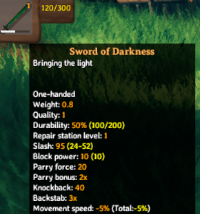

# Localization
Localizations are string conversions for language tokens that are bound to in-game objects. These language tokens are replaced at runtime by their specified localization, and can be thought of as a key value dataset. An example of a localization token may be `$item_stoneAxe`, which might have multiple localizations to translate into different languages at runtime.

JVL provides a number of different methods to interface with our localization system, to allow both developers as well as the community at large to provide localizations for both custom items, as well as non supported languages.

## Preparing your assets
In order to facilitate our localizations, we must prepare our assets to ensure they are able to accept our localization strings. The game follows the convention that language tokens are prefixed with a `$` to signify the string is a token due for replacement. Common properties which accept tokens are things such as names, descriptions, and flavourtext. The following name thereafter must be unique, but can follow any format the user desires.

Convention within the game however states that items follow the `$item_{name}` `$item_{name}_description` formats, similarly buildable items are prefixed with `$piece_` instead.

## Format
The format for localizations is a standard json collection as such:
```cs
{ "item_evilsword", "Sword of Darkness" },
{ "item_evilsword_desc", "Bringing the light" }
```

## Side loading localizations
Localizations can be provide through loading side by side with your plugin. The folder structure which will be queried will be `Translations/{LanguageName}/{anyname}.json`, and can be placed in any sub directory within your plugin.
An example of a path which will be read for localization at run time may be: `BepInEx/plugins/JotunnModExample/Assets/Translations/English/backpack.json`. All .json files within such a directory will be iterated through and localizations added for each of those languages.

## Hardcoding
Localizations may also be hardcoded into your plugin by invoking the [AddLocalization](xref:JotunnLib.Managers.LocalizationManager.AddLocalization) method.

```cs
// Add translations for the custom item in addClonedItems
LocalizationManager.Instance.AddLocalization(new LocalizationConfig("English")
{
    Translations =
    {
        { "item_evilsword", "Sword of Darkness" },
        { "item_evilsword_desc", "Bringing the light" }
    }
});

// Add translations for the custom piece in addEmptyItems
LocalizationManager.Instance.AddLocalization(new LocalizationConfig("English")
{
    Translations =
    {
        { "piece_lul", "Lulz" }
    }
});
```



## Prefabs
It is also possible to package `TextAsset`'s inside of your asset bundles, and to load them into game at runtime. In this example, we use our filenames to provide the language which we wish to add the translations for:

```cs
 TextAsset[] textAssets = BlueprintRuneBundle.LoadAllAssets<TextAsset>();
foreach (var textAsset in textAssets)
{
    var lang = textAsset.name.Replace(".json", null);
    LocalizationManager.Instance.AddJson(lang, textAsset.ToString());
}
```

