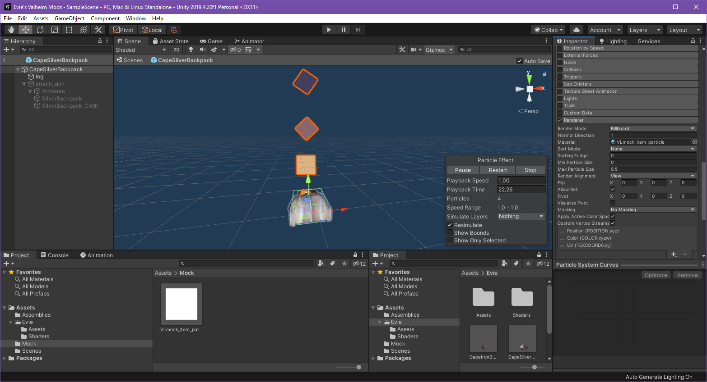

# Mock References

What are mock references? What do they do? What do they solve?

Mock's are placeholder objects which you create inside of asset bundles, and prepend the specific `JVLmock_` prefix to the name of an already existing prefab. When we load our assets at runtime, any references to mock objects will be recursively resolved until a depth of 3. When resolving references, we iterate through scene objects attempting to match our objects name with an existing one in the scene, and then duplicate the asset such that we may use it for our own purposes, without needing to copy copyrighted content within our own custom assets! Neat right?! And better yet, we don't even need to code anything ourselves to do this, just make sure that you set the fixRef bool on any `Custom*` entities to true and the mock reference will automatically be resolved at runtime.

## Faked objects
We'll start by creating a folder that will hold all our mocks, let's call it `Mock`, we now want to drag and drop the existing asset from the ripped game project to our custom item project. Let's do that for the Harpooned Status Effect, you should end up with the Harpooned `ScriptableObject` asset like this :
 


Now we want to fix the script references like so


Be sure to **fix the script references for all items that you've brought into the new project** including ItemDrop, etc.

We also want to prefix the asset name with `JVLmock_` so we now we end up with an asset called `JVLmock_Harpooned`

One last thing, we need to tell JVL to fix the references for us, for that, when creating the instance of our `CustomItem` in code, we want to have the FixReference parameter set to true, like so : 

```cs
CustomItem = new CustomItem(AssetHelper.LeadPrefab, fixReference : true);
```

Good, we now have our mock and we can use it for reference in our ItemDrop component ! That was easy.

`Attack Projectile`, the `SharedData` can also reference an attack projectile, and we happen to want one here, but this time we want it a bit modified, I only want the `trail`, without the `fangspear` in its GameObject hierarchy, we could hack it up directly from the Unity Project, but I found it easier to do from code, so let's do that here :

[The relevant piece of code](https://github.com/xiaoxiao921/Lead/blob/master/Lead/Util/AssetHelper.cs#L28)

We use the [OnItemsRegistered](xref:Jotunn.Managers.ItemManager.OnItemsRegistered) event subscription provided by JVL. OnItemsRegistered is fired once after the `ObjectDB` is has loaded all its native AND custom assets. That's perfect for us ! We want to do this just once : clone the prefab, so that we don't modify the original, remove the GameObject in the hierarchy that we don't want, and then we do the `m_attackProjectile assignment`.

If you have been following the Unity Asset Creation guide, you can return back to where you left off [here](unity.md#assetbundle).

## Referencing native assets from within an asset

**Note**: This example requires [assets](assets.md) to be loaded, as well as [localizations](localization.md).

As well as mocking assets to use for referencing, it is also possible to reference native assets from within an asset. The Recursive Reference Resolver will dig through children of an asset, querying for any prefabs with the `JVLmock_` prefix, it will strip the prefix and then try to resolve the name to an existing asset.

Bellow you can see that we have a custom item, and we want to reference the native particle effect that exists in valheim. To do so, we create a new material, set the name to `JVLmock_item_particle`, and then reference this new material in the asset. There is no need to configure the material itself, only the particle system renderer.


