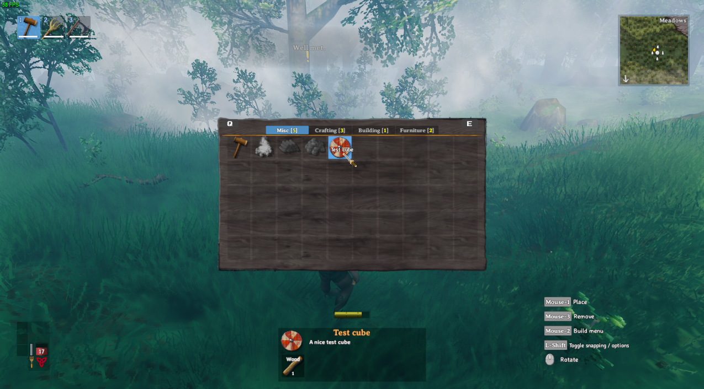
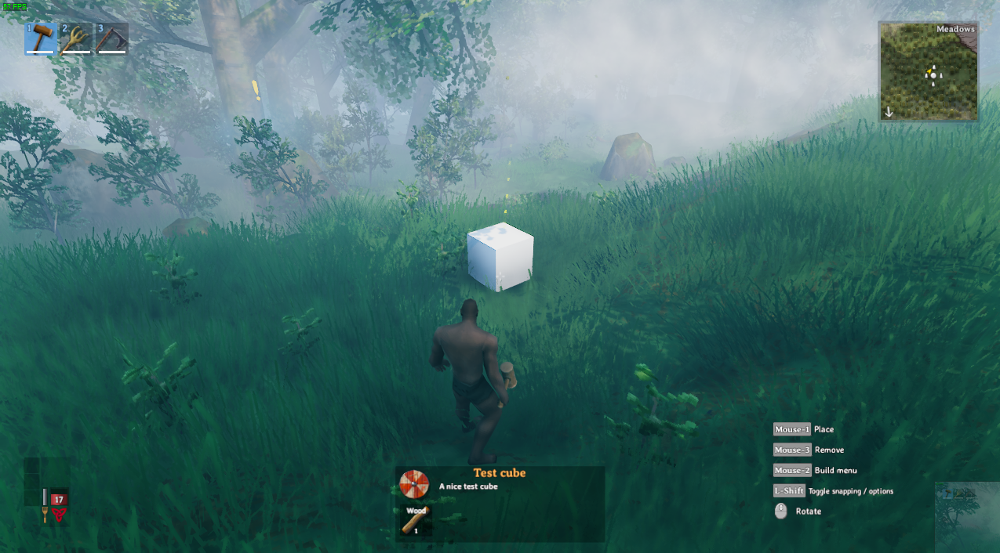

# Registering custom pieces
_Pieces_ in Valheim are anything that can be built in the game, through means such as the Hammer, Cultivator, or Hoe. This includes things such as plant sapplings, the workbench, and walls. Custom pieces are handled by the [PieceManager](xref:JotunnLib.Managers.PieceManager) singleton class.  

**Note:** You **must** only use names of existing prefabs (either ones you created or default Valheim ones). This can be prefabs that have already been registered by another mod, or that already exist in the game.  

In order for a prefab to be a _piece_, it must have the `Piece` component attached to the prefab.


## Example
First, we need to create a prefab, and add the `Piece` component to it. Here, we use the AddPiece util function from our [PrefabConfig](xref:JotunnLib.Entities.PrefabConfig) to make it a bit easier to create our piece component with requirements.  
(For more info on creating prefabs, check the [Prefabs](prefabs.md) section).

```cs
public class TestCubePrefab : PrefabConfig
{
    // Create a prefab called "TestCube" with no base
    public TestCubePrefab() : base("TestCube")
    {
        // Nothing to  do here
    }

    public override void Register()
    {
        // Add piece component so that we can register this as a piece
        // This function is just a util function that will add a piece, and help setup some of the basic requirements of it
        Piece piece = AddPiece(new PieceConfig()
        {
            // The name that shows up in game
            Name = "Test cube",

            // The description that shows up in game
            Description = "A nice test cube",

            // What items we'll need to build it
            Requirements = new PieceRequirementConfig[]
            {
                new PieceRequirementConfig()
                {
                    // Name of item prefab we need
                    Item = "Wood",
                    
                    // Amount we need
                    Amount = 1
                }
            }
        });

        // Additional piece config if you need here...
    }
}
```

Next, in our mod's `Awake` function, we need to create an event handler for [PrefabRegister](xref:JotunnLib.Managers.PrefabManager.PrefabRegister) to register our prefab, and [PieceRegister](xref:JotunnLib.Managers.PieceManager.PieceRegister) to register our Piece

```cs
private void Awake()
{
    PrefabManager.Instance.PrefabRegister += registerPrefabs;
    PieceManager.Instance.PieceRegister += registerPieces;
}
```

Finally, we need to implement those handlers and register our prefab and piece

```cs
// Register new prefabs
private void registerPrefabs(object sender, EventArgs e)
{
    PrefabManager.Instance.RegisterPrefab(new TestCubePrefab());
}

// Register new pieces
private void registerPieces(object sender, EventArgs e)
{
    // Register our piece in the "Hammer", using the "TestCube" prefab
    PieceManager.Instance.RegisterPiece("Hammer", "TestCube");
}
```

That's all! Now, if we pick up a piece of Wood in game we'll get the recipe, and can now build our cube using the hammer!  


