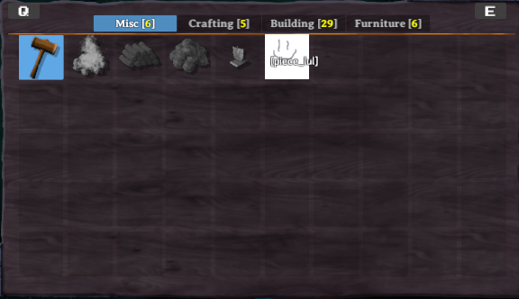

# Pieces, Tables, and Tabs
This example requires [assets](assets.md) to be loaded, as well as [localizations](localization.md).

## Tables & Tabs

PieceTables can be associated with items such as Hammer, Cultivator, and Hoe. Each have their own set of [categories](piececategories.md) which can act as tabs to organise content within a certain PieceTable. 

TODO: prefab component requirement description

see: [AddPieceTable](xref:JotunnLib.Managers.PieceTables.AddPieceTable)
```cs
PieceManager.Instance.AddPieceTable(BlueprintRuneBundle.LoadAsset<GameObject>("_BlueprintPieceTable"));
```

[Tabs/Categories](categories.md) are something we are looking to provide interfaces and abstractions for in our v1.1 release, so key an eye out for any updates from JVL.

## Pieces
_Pieces_ in Valheim are anything that can be built in the game, through means such as the Hammer, Cultivator, or Hoe. This includes things such as plant sapplings, the workbench, and walls. Custom pieces are handled by the [PieceManager](xref:JotunnLib.Managers.PieceManager) singleton.  

**Note:** You **must** only use names of existing prefabs (either ones you created or default Valheim ones). This can be prefabs that have already been registered by another mod, or that already exist in the game.  

In order for a prefab to be a _piece_, it must have the `Piece` component attached to the prefab.

### "Empty piece" example

In this example we will create a stubbed piece to act as a demonstration for the minimal implementation for pieces, which will allow a piece to be selected and placed into the environment as a networked object.

```cs
private void addEmptyItems()
{
    CustomPiece CP = new CustomPiece("$piece_lul", "Hammer");
    var piece = CP.Piece;
    piece.m_icon = testSprite;
    var prefab = CP.PiecePrefab;
    prefab.GetComponent<MeshRenderer>().material.mainTexture = testTex;
    PieceManager.Instance.AddPiece(CP);
}
```
 


### `Blueprint Rune` pieces.

The Blueprint rune, a custom item one of our developers has been working on, is intended to duplicate existing structures. In order to keep this example simple, we are not including this functionality, but are utilising these assets to provide an example of loading pieces via prefabs, so please bear in mind that while the code bellow is perfectly functional, there is no mesh/model associated with the following pieces due to the nature of their intended function.

With that said, we will load two new pieces into the previously created blueprint piecetable via [PieceConfig's](xref:JotunnLib.Configs.PieceConfig). As with RecipeConfigs, PieceConfig's provide an abstraction to simplify access to properties required to setup piece build requirements. The basic idea is similar. We load our asset, define our PieceConfig, and then add the resultant config via the manager's [AddPiece](xref:JotunnLib.Managers.PieceManager.AddPiece):

```cs
private void CreateRunePieces()
{
    // Create and add custom pieces
    GameObject makebp_prefab = BlueprintRuneBundle.LoadAsset<GameObject>("make_blueprint");
    CustomPiece makebp = new CustomPiece(makebp_prefab, new PieceConfig
    {
        PieceTable = "_BlueprintPieceTable",
        AllowedInDungeons = false
    });
    PieceManager.Instance.AddPiece(makebp);
    GameObject placebp_prefab = BlueprintRuneBundle.LoadAsset<GameObject>("piece_blueprint");
    CustomPiece placebp = new CustomPiece(placebp_prefab, new PieceConfig
    {
        PieceTable = "_BlueprintPieceTable",
        AllowedInDungeons = true,
        Requirements = new PieceRequirementConfig[]
        {
            new PieceRequirementConfig {Item = "Wood", Amount = 2}
        }
    });
    PieceManager.Instance.AddPiece(placebp);
}
```

And here we have our final results: 

