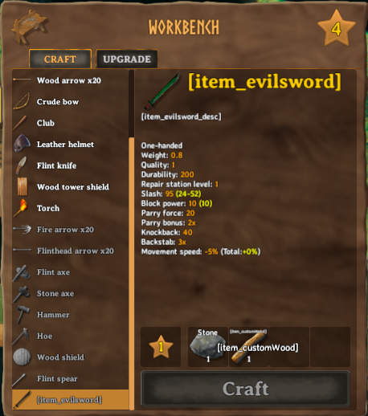

# Registering custom recipes
_Recipes_ in Valheim are coupling the items a player can craft to the various crafting stations. They also define if and at which cost items can be upgraded as well as the crafting station which can repair items. Creation of custom recipes is done through the [ItemManager](xref:JotunnLib.Managers.ItemManager) singleton class.

All recipes will always be loaded **after** all items. However, recipes will be loaded in the order that you call the `AddRecipe` function.

You have two options for adding custom recipes in Jötunn. You either use a [RecipeConfig](xref:JotunnLib.Configs.RecipeConfig) where you can define the ingame objects your recipe should reference via strings of the object names. Or you can create the `Recipe` ScriptableObject on your own. If the game has already loaded it's own assets, you can reference the objects in the recipe via Jötunns ([Prefab Cache](xref:JotunnLib.Managers.PrefabManager.Cache)) or create [Mocks](mocks.md) and let Jötunn fix the references at runtime.

**Note:** You **must** only use names of existing prefabs (either ones you created or default Valheim ones). This can be prefabs that have already been registered by another mod, or that already exist in the game.

## Example (RecipeConfig)

When you are loading your mod assets before Valheim loads it's vanilla assets into the game (in your Mods `Awake()` for example) you need to use the [RecipeConfig](xref:JotunnLib.Configs.RecipeConfig) class to create a custom recipe. You define the referenced prefabs via their names by string, instantiate a [CustomRecipe](xref:JotunnLib.Entities.CustomRecipe) with that and let Jötunn resolve the correct references at runtime for you.

```cs
CustomRecipe runeRecipe = new CustomRecipe(new RecipeConfig()
{
    Item = "BlueprintRune",                 // name of the item prefab to be crafted
    CraftingStation = "piece_workbench"     // name of the crafting station prefab where the item can be crafted
    Requirements = new RequirementConfig[]  // resources and amount needed for it to be crafted
    {
        new RequirementConfig {Item = "Stone", Amount = 2},  
        new RequirementConfig {Item = "Wood", Amount = 1}
    }
});
ItemManager.Instance.AddRecipe(runeRecipe);
```

Please take a look at the actual implementation of [RecipeConfig](xref:JotunnLib.Configs.RecipeConfig) for all properties you can set in the config.

## Example (Recipe & Prefab Cache)

The [JotunnModExample](https://github.com/Valheim-Modding/JotunnModExample) creates a cloned item "EvilSword" in the method `AddClonedItem()`. For the user to be able to craft the sword at the workbench we define a recipe as an actual Valheim Recipe class using the Prefab Cache of Jötunn and add it to the [ItemManager](xref:JotunnLib.Managers.ItemManager) as a [CustomRecipe](xref:JotunnLib.Entities.CustomRecipe) like this:

```cs
// Implementation of assets via using manual recipe creation and prefab cache's
private static void RecipeEvilSword(ItemDrop itemDrop)
{
    Recipe recipe = ScriptableObject.CreateInstance<Recipe>();
    recipe.name = "Recipe_EvilSword";
    recipe.m_item = itemDrop;
    recipe.m_craftingStation = PrefabManager.Cache.GetPrefab<CraftingStation>("piece_workbench");
    recipe.m_resources = new Piece.Requirement[]
    {
            new Piece.Requirement()
            {
                m_resItem = PrefabManager.Cache.GetPrefab<ItemDrop>("Stone"),
                m_amount = 1
            },
            new Piece.Requirement()
            {
                m_resItem = PrefabManager.Cache.GetPrefab<ItemDrop>("CustomWood"),
                m_amount = 1
            }
    };
    CustomRecipe CR = new CustomRecipe(recipe, false, false);
    ItemManager.Instance.AddRecipe(CR);
}
```

