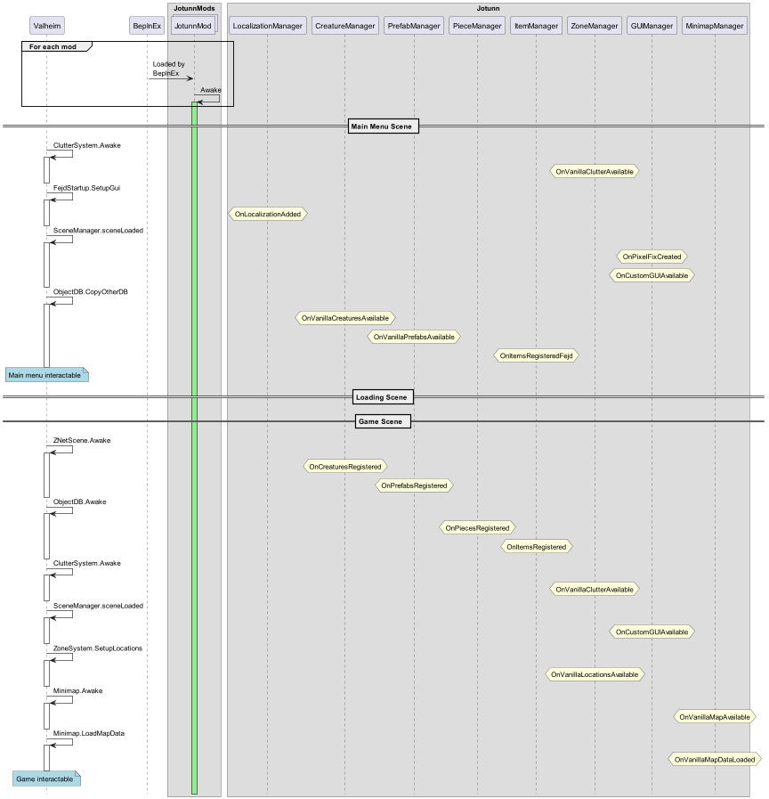

## Jötunn Events

Jötunn provides different events to execute the right code at the right time.

### Subscribe to Events
The provided events are direct C# events, meaning no heavy patching is needed.
If you have to choose between an event and a patch, it is recommended to go for the event if possible.
Sometimes this is not the case if you need to be compatible with certain mods.
Also note that the event execution order of subscribed methods is not guaranteed by C#.

Depending on your use case and the event, you may have to unsubscribe to only execute your code once.
For this, created a named method, subscribe in your Awake and unsubscribe inside the method again.

```cs
void Awake() {
    PrefabManager.OnPrefabsRegistered += PrefabsAvailable;
}

void PrefabsAvailable() {
    // do stuff

    // unsubscribe to only execute once
    PrefabManager.OnPrefabsRegistered -= PrefabsAvailable;
}
```

### Event Flow

The following diagram shows the order of events and when they are executed in the game:


