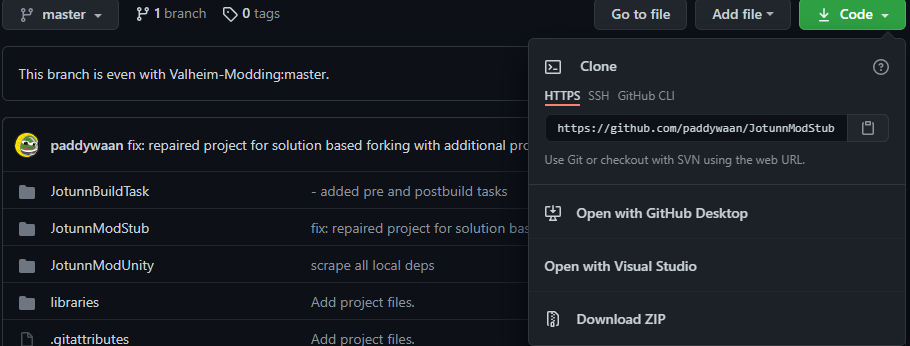
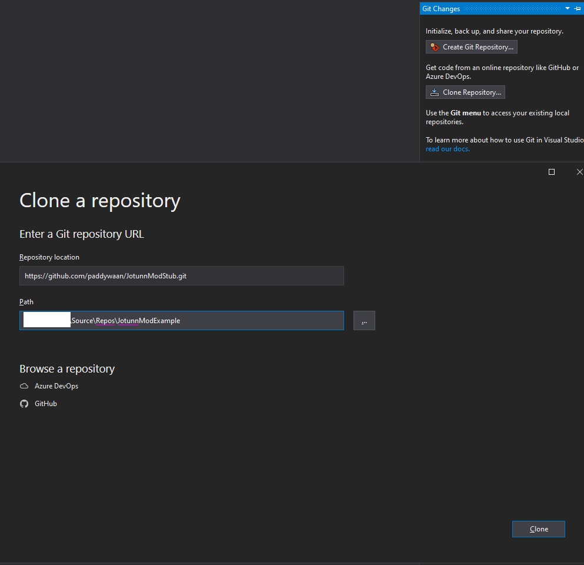
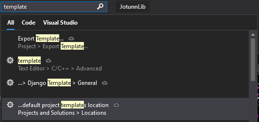
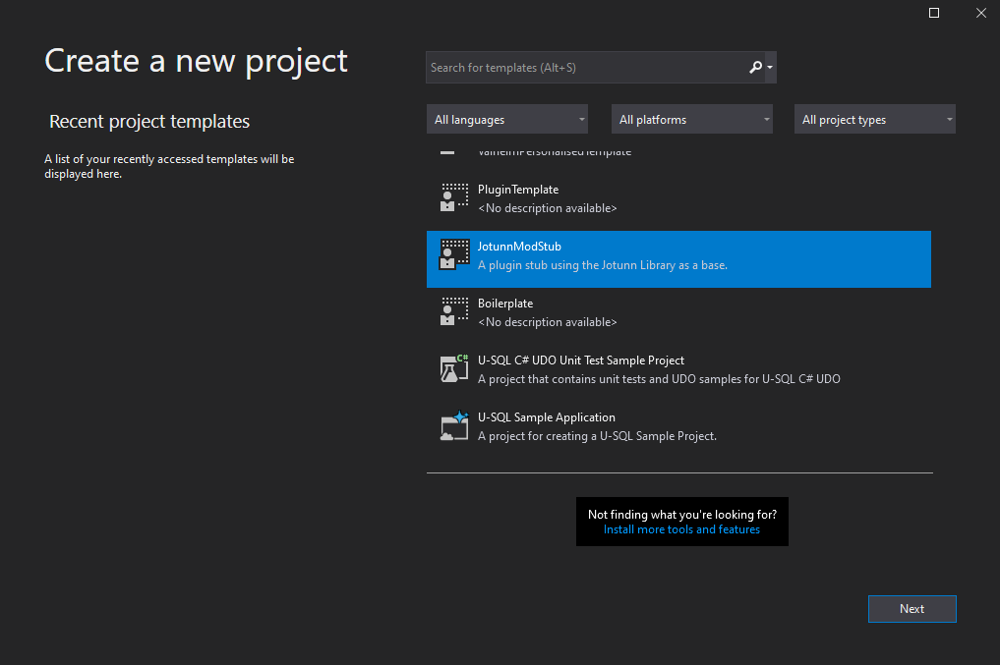

# Getting started

If you already have a mod for Valheim and want to switch to Jötunn or did use legacy JötunnLib or ValheimLib before all you need to do is to install the latest release of Jötunn from [nuget.org](https://www.nuget.org/packages/JotunnLib) into your project and start using it. Jötunn uses [MMHooks](https://github.com/MonoMod/MonoMod), so make sure you have build the detour dlls and referenced them in your project.

Jötunn offers some PreBuild and PostBuild tasks to automate certain housekeeping duties for you. If you already have a development environment setup but still want to learn about the automations read the sections [PreBuild automations](#prebuild-automations) and [PostBuild automations](#postbuild-automations).

If you want step-by-step instructions to start a Valheim mod from scratch using Jötunn continue reading as we guide you through the process of setting up everything you need to get going.

# Development Environment

* We begin by downloading [BepInEx for Valheim](https://valheim.thunderstore.io/package/denikson/BepInExPack_Valheim/) and extract the zip file into your root Valheim directory.

* Inside the visual studio installer, ensure that `.NET Desktop Development` and `.NET Core Cross-Platform Development` are installed, then click on the `Individual Components` tab and select `.NET Framework 4.6.2`:<br />


* Fork our [ModStub](https://github.com/Valheim-Modding/JotunnModStub) from github, and copy the link to the git<br />


* In Visual Studio, in the right hand toobar, select `Git Changes`, and then `Clone Repository`, and paste the URL provided by the previous step. Name your project and place it accordingly.<br />


# PreBuild automations

## Add project references

Jötunn can automatically generate, reference, and resolve all dependencies that may be needed for the development process, including `MonoMod`'s hooks, and publicized assemblies. To use this feature browse to your solution directory. Create a new file called `Environment.props` and place the following contents inside, modifying your `<VALHEIM_INSTALL>` to point to your game directory. This sets up references in your project to BepInEx, the publicized dlls and MMHook dlls.

```xml
<?xml version="1.0" encoding="utf-8"?>
<Project ToolsVersion="Current" xmlns="http://schemas.microsoft.com/developer/msbuild/2003">
  <PropertyGroup>
    <!-- Needs to be your path to the base Valheim folder -->
    <VALHEIM_INSTALL>X:\PathToYourSteamLibary\steamapps\common\Valheim</VALHEIM_INSTALL>
  </PropertyGroup>
</Project>
```


## Publicize and MMHook Valheim assemblies

Jötunn can automatically create the publicized and MMHook assemblies for you. To use this feature you must have the `Environment.props` file from the last step. Additionally you need to create a new file called `DoPrebuild.props` in your solution directory. If you are using the ModStub the file will already be there so just change `ExecutePrebuild` to `true`. If you opt not to utilise this automation, you will need to generate your method detours and publicised assemblies, and add them to your projects references manually.

```xml
<?xml version="1.0" encoding="utf-8"?>
<Project ToolsVersion="Current" xmlns="http://schemas.microsoft.com/developer/msbuild/2003">
  <PropertyGroup>
    <ExecutePrebuild>true</ExecutePrebuild>
  </PropertyGroup>
</Project>
```
**WARNING:** _If you already have references to BepInEX and Valheim, this task will most certainly duplicate them._

**WARNING:** _This prebuild task will automate the generation of monomod method detours and publicising of game assemblies. By enabling this, you understand that you will be generating new publicised assemblies and method detours upon PreBuild **IF** the binaries have been updated since the last time the PreBuild has run._

## Manual setup

If for whatever reason you disable the prebuild, you will need to:
- acquire and install [HookGen](https://valheim.thunderstore.io/package/ValheimModding/HookGenPatcher/)
- launch the game to generate event wrappers
- add the `/BepInEx/plugins/MMHook/assembly_*` files to your project references. 
- grab the [Assembly Publicizer](https://github.com/CabbageCrow/AssemblyPublicizer) *(drag drop your `/BepInEx/plugins/MMHook/assembly_*` files ontop of the publiciser)* and add the resulting assemblies to your stub project.
- Build the stub, make sure it compiles and automates the postbuild tasks, producing compiled binaries in your plugin directory `BepInEx/plugins/yourtestmod/` folder and also generated a `yourtestmod.dll.mdb` monodebug symbols file.
- You may now proceed to one of the [Tutorials](intro.md)

# Customising the ModStub project

* Once you have your base project, select the solution in the solution explorer, hit F2 to rename the solution as required. Rename your plugin project, an all namespace references, then right click your project settings and ensure the assembly name has also been changed.

* Rename the `PluginGUID` `PluginName`, and `PluginVersion` to match your intended base release metadata. Your PluginGUID should contain your github username/organisation.

* Grab the [Project Template](https://github.com/Valheim-Modding/JotunnModStub/blob/master/JotunnModStub.zip) which you can use to add new projects to your current solution, based on the mod stub boilerplate.

* Place the project template into your<br />


* Restart visual studio. You can now create a new project using the imported templated. Right click your solution, add, new project, then scroll to the bottom where you will find the template:<br />


* Your project base is now ready for use! You can proceed to []() or select a specific section to learn about from our [Tutorials]()


# PostBuild automations

Included in the ModStub and ModExample repos is a PowerShell script `publish.ps1`. The script is referenced in the project file as a post build event. Depending on the chosen configuration in Visual Studio the script executes the following actions.

## Building Debug

* The compiled dll file for this project is copied to `<ValheimDir>\BepInEx\plugins`.
* A .mdb file is generated for the compiled project dll and copied to `<ValheimDir>\BepInEx\plugins`.
* `<ValheimModStub>\libraries\Debug\mono-2.0-bdwgc.dll` is copied to `<ValheimDir>\MonoBleedingEdge\EmbedRuntime` replacing the original file (a backup is created before).

## Building Release

* The README.md in `SolutionDir/ProjectDir/package/README.md` is copied to `SolutionDir/ProjectDir/README.md` so that it is present and readable in single-solution-multi-project githubs to give an overview of the project.
* The compiled binary is placed inside of `SolutionDir/ProjectDir/package/plugins`
* The contents of `SolutionDir/ProjectDir/package/*` is archived into a zip, ready for thunderstore upload.

## Debugging with Visual Studio

Please see: [this article](https://github.com/Valheim-Modding/Wiki/wiki/Debugging-Plugins-via-IDE)
