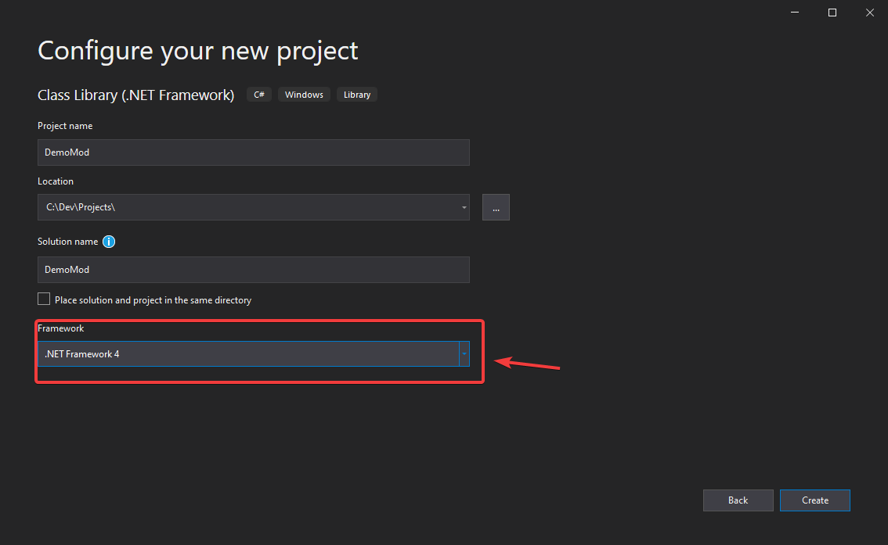

# Getting started


## Setting up development environment
Setting up development environment to create a mod using JotunnLib and Visual studio:

1. Download [BepInEx for Valheim](https://valheim.thunderstore.io/package/download/denikson/BepInExPack_Valheim/5.4.701/) and extract the zip file into your root Valheim directory.
2. Create a new Visual Studio project of type `Class Library (.NET Framework)`. Make sure that you select `.NET Framework 4` as the target framework. **Do not** select any higher version, as it will be incompatible with Valheim, since it's compiled using .NET Framework 4.

3. Adding references to the project:
    - Click `References > Add reference`

    - Navigate to your Valheim folder (should be `<Steam path>/steamapps/common/Valheim/unstripped_corlib`). Add all of the DLLs there _except_ for `Mono.security.dll`, `mscorlib.dll`, `System.configuration.dll`, `System.dll`, and `System.xml.dll`.
    
    
    - Navigate to your BepInEx core folder in Valheim (should be `<Steam path>/steamapps/common/Valheim/BepInEx/core`). Add all of the DLLs there _except_ for `0Harmony20.dll`.
    

    - Lastly, navigate to your BepInEx plugins folder, and add `JotunnLib.dll` as an assembly.
4. Using the `NuGet Packge Manager`, download and install `HarmonyX` as a dependency.

## Creating your mod
To use JotunnLib, you must add it as a BepInEx dependency. If possible, please use our `JotunnLib.JotunnLib.ModGuid` variable to reference our mod, to prevent against any issues if this changes in the future.

```cs
namespace TestMod
{
    [BepInPlugin("com.bepinex.plugins.testmod", "JotunnLib Test Mod", "0.0.1")]
    [BepInDependency(JotunnLib.JotunnLib.ModGuid)]
    public class TestMod : BaseUnityPlugin
    {
        // ...
    }
}
```

That's it! Now you can go about creating your mod as normal, using any HarmonyX or JotunnLib functionality as you wish.  
Refer to the following sections for guides on how to use JotunnLib to add custom data to the game.

## Installing your mod
Just like any other BepInEx mod, you can install it by just putting the mod DLL file in `BepInEx/plugins`, along with any other assets it may need.