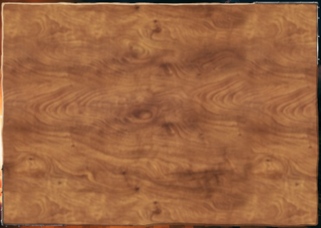
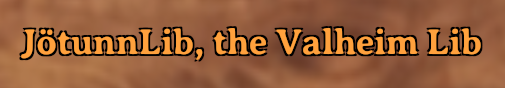
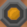

# GUI

To add custom GUI elements to the game it is necessary to add the prefabs or generate the GUI components in code respecting the [Unity UI guidelines](https://docs.unity3d.com/Packages/com.unity.ugui@1.0/manual/index.html).

## GUI event and PixelFix

Valheim creates new clones of the whole menu and ingame GUI everytime the scene changes from start to main and vice versa. So if you dont want to create and draw on your own canvas, you have to add your custom stuff to the right path on every scene change, too. Additionally, Valheim implemented a scaling feature for high resolution display (4K output or high DPI screens) called the PixelFix. Both concepts can be accessed easily via shortcuts through Jötunn. You can subscribe to the event [GUIManager.OnPixelFixCreated](xref:Jotunn.Managers.GUIManager.OnPixelFixCreated) which gets called everytime the scene changed and Jötunn has created and resolved the current PixelFix path in the scene. In that event call you can load / create your custom GUI components and add them in the transform hierarchy of the [GUIManager.PixelFix](xref:Jotunn.Managers.GUIManager.PixelFix) GameObject.

## Block input for GUI

When drawing GUI elements Valheim does not stop interpreting the Mouse/Keyboard inputs in any way per default. So if you want to interact with your GUI, you would have to interrupt the receiving of input for the player, camera, etc. Jötunn provides a shortcut to enable or disable player and camera input as the convenient method [GUIManager.BlockInput(bool)](xref:Jotunn.Managers.GUIManager.BlockInput(System.Boolean)). When passing `true`, all input to the player is intercepted and the mouse is released from the camera so you can actually click on your custom GUI elements. You **must** call the method passing `false` again to release the input yourself upon closing your GUI components. Jötunn does not handle the release automatically.

## Determine a headless instance

A dedicated server running without GUI is commonly referred to as a headless server. Valheim provides methods in ZNet to determine if the current instance is a dedicated server, a "local" server (aka local game that others can connect to) or a client to another server. Jötunn also provides shortcuts to these via [ZNetExtension](xref:Jotunn.ZNetExtension). Problem is that both approaches require ZNet to be instantiated which is not the case on your mods Awake(). If you need that information early on, the GUIManager provides a method for that: [GUIManager.IsHeadless()](xref:Jotunn.Managers.GUIManager.IsHeadless) returns true if the current game instance is a dedicated/headless server without relying on ZNet. Jötunn also does not register GUI or Input hooks in that case to save on unnecessarily allocated resources.

## Valheim style GUI elements

The [GUIManager](xref:Jotunn.Managers.GUIManager) provides useful methods to create buttons, text element and more at runtime using the original Valheim assets to create a seamless look for your custom GUI components.

### ColorPicker and GradientPicker


Jötunn uses a custom made ColorPicker for its ModSettings dialogue which is also available for mods to use. Additionaly there is also a GradientPicker available.

ColorPickerExample:
```cs
GUIManager.Instance.CreateColorPicker(
    new Vector2(0.5f, 0.5f), new Vector2(0.5f, 0.5f), new Vector2(0.5f, 0.5f),
    r.sharedMaterial.color,  // Initial selected color in the picker
    "Choose your poison",  // Caption of the picker window
    SetColor,  // Callback delegate when the color in the picker changes
    ColorChosen,  // Callback delegate when the window is closed
    true  // Whether or not the alpha channel should be editable
);
```

GradientPicker example:
```cs
GUIManager.Instance.CreateGradientPicker(
    new Vector2(0.5f, 0.5f), new Vector2(0.5f, 0.5f), new Vector2(0, 0),
    new Gradient(),  // Initial gradient being used
    "Gradiwut?",  // Caption of the GradientPicker window
    SetGradient,  // Callback delegate when the gradient changes
    GradientFinished  // Callback delegate when thw window is closed
);
```

A more explanatory example can be found in our [example mod](https://github.com/Valheim-Modding/JotunnModExample).

### Wood panels



Woodpanels, nicely usable as containers for other gui elements.

Example:
```cs
var panel = GUIManager.Instance.CreateWoodpanel(
    GUIManager.PixelFix.transform, 
    new Vector2(0.5f, 0.5f), 
    new Vector2(0.5f, 0.5f), 
    new Vector2(0f, 0f), 
    400f, 
    300f);
```

### Buttons


To create buttons, provide text, the parent's transform, min and max anchors, the position and it's size (width and height).

Example:
```cs
var button = GUIManager.Instance.CreateButton("A Test Button", testPanel.transform, new Vector2(0.5f, 0.5f), new Vector2(0.5f, 0.5f), new Vector2(0, 0), 250, 100);
```

### Text elements



Example:
```cs
var text = GUIManager.Instance.CreateText("JötunnLib, the Valheim Lib", GUIManager.PixelFix.transform,new Vector2(0.5f, 0.5f), new Vector2(0.5f, 0.5f),
    new Vector2(0f, 0f), GUIManager.Instance.AveriaSerifBold, 18, GUIManager.Instance.ValheimOrange, true, Color.black, 400f, 30f, false);
```

### Checkboxes



Example:
```cs
var checkbox = GUIManager.Instance.CreateToggle(GUIManager.PixelFix.transform, new Vector2(0f, 0f), f, 40f);
```

### Getting sprites

Gets sprites from the textureatlas by name. You find a list of the sprite names [here](../data/gui/sprite-list.md).

```cs
var sprite = GUIManager.Instance.GetSprite("text_field");
```

### Instance properties

The [GUIManager](xref:Jotunn.Managers.GUIManager) also comes with some useful instance properties for your custom assets to resemble the vanilla Valheim style.

- Font AveriaSerif
- Font AveriaSerifBold (the default Valheim font)
- Color ValheimOrange

## Example

In our [example mod](https://github.com/Valheim-Modding/JotunnModExample) we use a [custom button](inputs.md) to toggle a simple panel with a button on it. That button also gets a listener added to close the panel again. Also the input is blocked for the player and camera while the panel is active so we can actually use the mouse and cant control the player any more.

```cs
// Toggle our test panel with button
private void TogglePanel()
{
    // Create the panel if it does not exist
    if (TestPanel == null)
    {
        if (GUIManager.Instance == null)
        {
            Logger.LogError("GUIManager instance is null");
            return;
        }

        if (GUIManager.PixelFix == null)
        {
            Logger.LogError("GUIManager pixelfix is null");
            return;
        }

        // Create the panel object
        TestPanel = GUIManager.Instance.CreateWoodpanel(GUIManager.PixelFix.transform, new Vector2(0.5f, 0.5f), new Vector2(0.5f, 0.5f),
            new Vector2(0, 0), 850, 600);
        TestPanel.SetActive(false);

        // Create the button object
        GameObject buttonObject = GUIManager.Instance.CreateButton("A Test Button - long dong schlongsen text", TestPanel.transform,
            new Vector2(0.5f, 0.5f), new Vector2(0.5f, 0.5f), new Vector2(0, 0), 250, 100);
        buttonObject.SetActive(true);

        // Add a listener to the button to close the panel again
        Button button = buttonObject.GetComponent<Button>();
        button.onClick.AddListener(() =>
        {
            TogglePanel();
        });
    }

    // Switch the current state
    bool state = !TestPanel.activeSelf;
            
    // Set the active state of the panel
    TestPanel.SetActive(state);

    // Disable input for the player and camera while displaying the GUI
    GUIManager.BlockInput(state);
}
```