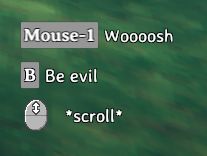

# Inputs

_Inputs_ (or "Buttons") in Valheim are virtual mappings of strings to either keyboard/mouse or gamepad inputs. Custom buttons can be registered through the [InputManager](xref:Jotunn.Managers.InputManager) singleton using Jötunn's abstraction [ButtonConfig](xref:Jotunn.Configs.ButtonConfig).

The code snippets are taken from our [example mod](https://github.com/Valheim-Modding/JotunnModExample).

## Creating custom inputs

First, define [ButtonConfig](xref:Jotunn.Configs.ButtonConfig) members in your mod class for all buttons you want to use in your mod. Having a reference to the defined buttons makes it easier for us to poll for button presses. These can also be used to add custom [KeyHints](#creating-custom-keyhints) for your buttons to the game later on.

You can have key bindings defined "on the fly" which binds a specific key to an artificial button name. To be more versatile you can have the custom binding be defined in a BepInEx configuration file and let the user change it to his preference.

Jötunn supports multiple types of key bindings. You can use Unity's "KeyCode" or BepInEx' KeyboardShortcut and/or a GamepadButton, which is provided via Jötunn's [InputManager](xref:Jotunn.Managers.InputManager.GamepadButton).

```cs
// Fixed buttons
private ButtonConfig ShowGUIButton;
private ButtonConfig RaiseSkillButton;

// Variable button backed by a KeyCode and a GamepadButton config
private ConfigEntry<KeyCode> EvilSwordSpecialConfig;
private ConfigEntry<InputManager.GamepadButton> EvilSwordGamepadConfig;
private ButtonConfig EvilSwordSpecialButton;

// Variable BepInEx Shortcut backed by a config
private ConfigEntry<KeyboardShortcut> ShortcutConfig;
private ButtonConfig ShortcutButton;
```

For the configuration backed button, you will need to create the configuration binding *before* creating and adding the actual button. For more information on configuration bindings see [our configuration tutorial](config.md).

```cs
// Create configuration values
private void CreateConfigValues()
{
    Config.SaveOnConfigSet = true;

    // Add a client side custom input key for the EvilSword
    EvilSwordSpecialConfig = Config.Bind("Client config", "EvilSword Special Attack", KeyCode.B, new ConfigDescription("Key to unleash evil with the Evil Sword"));
    // Also add an alternative Gamepad button for the EvilSword
    EvilSwordGamepadConfig = Config.Bind("Client config", "EvilSword Special Attack Gamepad", InputManager.GamepadButton.ButtonSouth,
        new ConfigDescription("Button to unleash evil with the Evil Sword"));

    // BepInEx' KeyboardShortcut class is supported, too
    ShortcutConfig = Config.Bind("Client config", "Keycodes with modifiers",
        new KeyboardShortcut(KeyCode.L, KeyCode.LeftControl, KeyCode.LeftAlt),
        new ConfigDescription("Secret key combination"));
}
```

To actually register your custom inputs to the game, instantiate all [ButtonConfig's](xref:Jotunn.Configs.ButtonConfig) and add them to Jötunn's [InputManager](xref:Jotunn.Managers.InputManager). Note that the configuration backed button uses the reference to the ConfigEntry member instead of directly assigning a KeyCode value.

> [!NOTE]
> For configurable buttons it is mandatory to add a ButtonConfig to the InputManager in order to be able to use the key binding feature in the mod settings.

```cs
// Add custom key bindings
private void AddInputs()
{
    // Add key bindings on the fly
    ShowGUIButton = new ButtonConfig
    {
        Name = "JotunnModExample_Menu",
        Key = KeyCode.Insert,
        ActiveInCustomGUI = true  // Enable this button in custom GUI
    };
    InputManager.Instance.AddButton(PluginGUID, ShowGUIButton);

    RaiseSkillButton = new ButtonConfig
    {
        Name = "JotunnExampleMod_RaiseSkill",
        Key = KeyCode.RightControl,
        ActiveInGUI = true,    // Enable this button in vanilla GUI (e.g. the console)
        ActiveInCustomGUI = true  // Enable this button in custom GUI
    };
    InputManager.Instance.AddButton(PluginGUID, RaiseSkillButton);


    // Add key bindings backed by a config value
    // Also adds the alternative Config for the gamepad button
    // The HintToken is used for the custom KeyHint of the EvilSword
    EvilSwordSpecialButton = new ButtonConfig
    {
        Name = "EvilSwordSpecialAttack",
        Config = EvilSwordSpecialConfig,        // Keyboard input
        GamepadConfig = EvilSwordGamepadConfig, // Gamepad input
        HintToken = "$evilsword_beevil",        // Displayed KeyHint
        BlockOtherInputs = true   // Blocks all other input for this Key / Button
    };
    InputManager.Instance.AddButton(PluginGUID, EvilSwordSpecialButton);

    // Supply your KeyboardShortcut configs to ShortcutConfig instead.
    ShortcutButton = new ButtonConfig
    {
        Name = "SecretShortcut",
        ShortcutConfig = ShortcutConfig,
        HintToken = "$lulzcut"
    };
    InputManager.Instance.AddButton(PluginGUID, ShortcutButton);
}
```

Note that `AddButton` takes your PluginGUID as the first parameter. This is how Jötunn tries to avoid conflicts between multiple plugins which might create the same button. Internally the GUID of the mod is appended to the button's name. That means you can be sure that you receive your defined button when polling for it using your button config reference and other mods can't overwrite your binding when adding a button with the same name.

Now, to use our input, we can use the `ZInput` class provided by Valheim. 
> [!WARNING]
> When you set BlockOtherInputs = true in your ButtonConfig, every call to ZInput checking for your custom key will prevent other mods or the base game from receiving those key events - even if you don't actually react to it. It is important that you only call any ZInput.GetButton method for those buttons, if you actually intend to react to it. That functionality is intended for custom input also using GamepadButton, since gamepad input is very limited. __If you don't use GamepadButton, don't set BlockOtherInputs = true__.

```cs
// Called every frame
private void Update()
{
    // Since our Update function in our BepInEx mod class will load BEFORE Valheim loads,
    // we need to check that ZInput is ready to use first.
    if (ZInput.instance != null)
    {
        // Check if our button is pressed. This will only return true ONCE, right after our button is pressed.
        // If we hold the button down, it won't spam toggle our menu.
        if (ZInput.GetButtonDown(ShowGUIButton.Name))
        {
            TogglePanel();
        }

        // Raise the test skill
        if (Player.m_localPlayer != null && ZInput.GetButtonDown(RaiseSkillButton.Name))
        {
            Player.m_localPlayer.RaiseSkill(TestSkill);
        }

        // Use the name of the ButtonConfig to identify the button pressed
        // without knowing what key the user bound to this button in his configuration.
        // Our button is configured to block all other input, so we just want to query
        // ZInput when our custom item is equipped.
        if (EvilSwordSpecialButton != null && MessageHud.instance != null && 
            Player.m_localPlayer != null && Player.m_localPlayer.m_visEquipment.m_rightItem == "EvilSword")
        {
            if (ZInput.GetButton(EvilSwordSpecialButton.Name) && MessageHud.instance.m_msgQeue.Count == 0)
            {
                MessageHud.instance.ShowMessage(MessageHud.MessageType.Center, "$evilsword_beevilmessage");
            }
        }

        // KeyboardShortcuts are also injected into the ZInput system
        if (ShortcutButton != null && MessageHud.instance != null)
        {
            if (ZInput.GetButtonDown(ShortcutButton.Name) && MessageHud.instance.m_msgQeue.Count == 0)
            {
                MessageHud.instance.ShowMessage(MessageHud.MessageType.Center, "$lulzcut_message");
            }
        }
    }
}
```

## Creating custom KeyHints

Key hints are displayed in Valheim when you equip weapons or tools to show which keys execute a certain action. With Jötunn you can add your own key hints for your custom weapons and tools by the means of the same [ButtonConfig](xref:Jotunn.Configs.ButtonConfig) class you can use to define custom key bindings. You need to create a [KeyHintConfig](xref:Jotunn.Configs.KeyHintConfig) with one or more instances of [ButtonConfig](xref:Jotunn.Configs.ButtonConfig) in it and add it to the [KeyHintManager](xref:Jotunn.Managers.KeyHintManager). In our [example mod](https://github.com/Valheim-Modding/JotunnModExample) we use the custom key bindings from the EvilSword to display a key hint for it and also override vanilla Valheim key hint messages. 

Note the use of the special Axis "Mouse ScrollWheel" to override the Valheim scroll icon text.

```cs
// Implementation of key hints replacing vanilla keys and using custom keys.
// KeyHints appear in the same order in which they are defined in the config.
private void KeyHintsEvilSword()
{
    // Create custom KeyHints for the item
    KeyHintConfig KHC = new KeyHintConfig
    {
        Item = "EvilSword",
        ButtonConfigs = new[]
        {
            // Override vanilla "Attack" key text
            new ButtonConfig { Name = "Attack", HintToken = "$evilsword_shwing" },
            // User our custom button defined earlier, syncs with the backing config value
            EvilSwordSpecialButton,
            // Override vanilla "Mouse ScrollWheel" text
            new ButtonConfig { Name = "Scroll", Axis = "Mouse ScrollWheel", HintToken = "$evilsword_scroll" }
        }
    };
    KeyHintManager.Instance.AddKeyHint(KHC);
}
```

The resulting KeyHints look like this for Keyboard and Gamepad input respectively

 

Note that all texts are tokenized and translated ingame. The translations are also provided by Jötunn. Read the [tutorial on Localizations](localization.md) for more information on that topic.

### Other use cases

It is also possible to have "empty" KeyHints which override the vanilla hints to none or KeyHints per item and building piece for tools.

```cs
// Override "default" KeyHint with an empty config
KeyHintConfig KHC_base = new KeyHintConfig
{
    Item = "BlueprintTestRune"
};
KeyHintManager.Instance.AddKeyHint(KHC_base);

// Add custom KeyHints for specific pieces
KeyHintConfig KHC_make = new KeyHintConfig
{
    Item = "BlueprintTestRune",
    Piece = "make_testblueprint",
    ButtonConfigs = new[]
    {
        // Override vanilla "Attack" key text
        new ButtonConfig { Name = "Attack", HintToken = "$bprune_make" }
    }
};
KeyHintManager.Instance.AddKeyHint(KHC_make);

KeyHintConfig KHC_piece = new KeyHintConfig
{
    Item = "BlueprintTestRune",
    Piece = "piece_testblueprint",
    ButtonConfigs = new[]
    {
        // Override vanilla "Attack" key text
        new ButtonConfig { Name = "Attack", HintToken = "$bprune_piece" }
    }
};
KeyHintManager.Instance.AddKeyHint(KHC_piece);
```