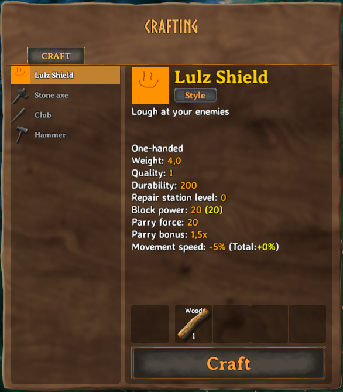
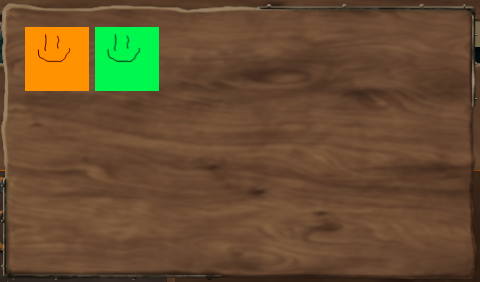
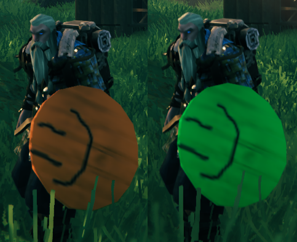

# Item Variants

An _item variant_ in Valheim is an item which can be crafted with varying textures on the same item/model. Although the game _theoretically_ supports variants for all equippable items, they virtually limited that feature to shields and capes at the moment. But fear not, Jötunn enables you to add variants to all equippable items. Adding of custom item variants is achieved through JVLs [ItemConfig](xref:Jotunn.Configs.ItemConfig).

## Warning 

Valheim's style variants are implemented using a custom shader. That means enabling this feature for custom made items __will replace whatever shader a renderer on that prefab used before__. Valheim uses its own `Custom/Creature` shader for this feature, which seems to be the Unity standard shader with some added functionality. So if you stick with the standard shader, all your configuration will be retained. For information on the shader's properties see [our shader dump list](../data/prefabs/shader-list.md).

## Adding custom variants

In this example, we will clone a vanilla shield and a sword which the user can equip and add custom variants. In order to do this, we will need to reference already instantiated game assets. One method of doing so is by using an event provided by Jötunn. The event is fired when the vanilla items are in memory and thus clonable (more precisely in the start scene before the initial ObjectDB is cloned).

```cs
private void Awake()
{
    PrefabManager.OnVanillaPrefabsAvailable += AddVariants;
}
```

Inside the method we load different sprites for the variant icons and a sprite atlas texture using Jötunn's [AssetUtils](xref:Jotunn.Utils.AssetUtils). Using the [ItemConfig's](xref:Jotunn.Configs.ItemConfig) properties `Icons` and `StyleTex`, we tell Jötunn that an item has variants (variant count always equals the icon array size) and to use the texture provided as the texture atlas for the two variants.

```cs
// Clone the wooden shield and the bronze sword and add own variations to it
private void AddVariants()
{
    Sprite var1 = AssetUtils.LoadSpriteFromFile("JotunnModExample/Assets/test_var1.png");
    Sprite var2 = AssetUtils.LoadSpriteFromFile("JotunnModExample/Assets/test_var2.png");
    Sprite var3 = AssetUtils.LoadSpriteFromFile("JotunnModExample/Assets/test_var3.png");
    Sprite var4 = AssetUtils.LoadSpriteFromFile("JotunnModExample/Assets/test_var4.png");
    Texture2D styleTex = AssetUtils.LoadTexture("JotunnModExample/Assets/test_varpaint.png");

    ItemConfig shieldConfig = new ItemConfig();
    shieldConfig.Name = "$lulz_shield";
    shieldConfig.Description = "$lulz_shield_desc";
    shieldConfig.AddRequirement(new RequirementConfig("Wood", 1));
    shieldConfig.Icons = new Sprite[] { var1, var2, var3, var4 };
    shieldConfig.StyleTex = styleTex;
    ItemManager.Instance.AddItem(new CustomItem("item_lulzshield", "ShieldWood", shieldConfig));

    ItemConfig swordConfig = new ItemConfig();
    swordConfig.Name = "$lulz_sword";
    swordConfig.Description = "$lulz_sword_desc";
    swordConfig.AddRequirement(new RequirementConfig("Stone", 1));
    swordConfig.Icons = new Sprite[] { var1, var2, var3, var4 };
    swordConfig.StyleTex = styleTex;
    ItemManager.Instance.AddItem(new CustomItem("item_lulzsword", "SwordBronze", swordConfig));

    // You want that to run only once, Jotunn has the item cached for the game session
    PrefabManager.OnVanillaPrefabsAvailable -= AddVariants;
}
```

As a result we can build a new shield with our custom variants, indicated by the "Style" button on the crafting menu. 
<br />


After clicking the style button, we can choose between our two variants.
<br />


Each variation gets its own texture applied to the material.
<br />
