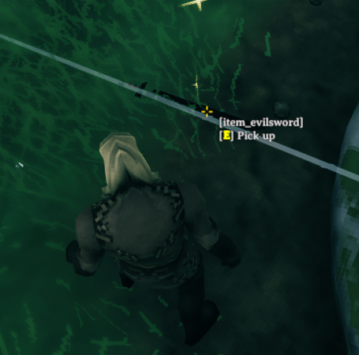
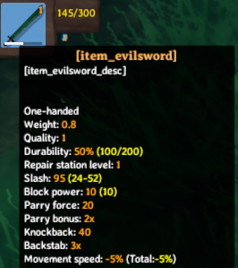

# Items

_Items_ can be equipment, resources, or building pieces.
In this tutorial you will learn how to set up custom items within the game, either based upon existing assets, or through the creation of entirely custom assets.

This example requires [assets](asset-loading.md) to be loaded.
The code snippets are taken from our [example mod](https://github.com/Valheim-Modding/JotunnModExample).

> [!NOTE]
> You **must** only use names of existing prefabs. This can be prefabs you created, that have already been registered by another mod, or that already exist in the game.

## Vanilla Crafting Stations

| GameObject Name      | Localized Name |
|----------------------|----------------|
| blackforge           | Black forge    |
| forge                | Forge          |
| piece_artisanstation | Artisan table  |
| piece_cauldron       | Cauldron       |
| piece_magetable      | Galdr table    |
| piece_stonecutter    | Stonecutter    |
| piece_workbench      | Workbench      |

To set what crafting station is needed to craft your item, the GameObject name has to be used.
This works with custom crafting stations as well.
```cs
ItemConfig itemConfig = new ItemConfig();
itemConfig.CraftingStation = "piece_workbench";
```

## Cloning existing prefabs

In this example, we will clone a resource and a weapon which the user may equip.
In order to do this, we will need to reference already instantiated game assets.
One method of doing so is by using the "vanilla prefabs available" event provided by Jötunn.
The event is fired when the vanilla items are in memory and thus clonable (more precisely in the start scene before the initial ObjectDB is cloned).

```cs
private void Awake()
{
    PrefabManager.OnVanillaPrefabsAvailable += AddClonedItems;
}
```
First we use the [ItemConfig](xref:Jotunn.Configs.ItemConfig) constructor to define the name of our item, and the existing prefab name which it should be cloned from.
An [CustomItem](xref:Jotunn.Entities.CustomItem) can then be created from this config and immediately added via the [AddItem](xref:Jotunn.Managers.ItemManager.AddItem(Jotunn.Entities.CustomItem)) method, and then modified to make our clone a little bit more unique.

```cs
private void AddClonedItems()
{
    // Create and add a custom item based on SwordBlackmetal
    ItemConfig evilSwordConfig = new ItemConfig();
    evilSwordConfig.Name = "$item_evilsword";
    evilSwordConfig.Description = "$item_evilsword_desc";
    evilSwordConfig.CraftingStation = "piece_workbench";
    evilSwordConfig.AddRequirement(new RequirementConfig("Stone", 1));
    evilSwordConfig.AddRequirement(new RequirementConfig("Wood", 1));

    CustomItem evilSword = new CustomItem("EvilSword", "SwordBlackmetal", evilSwordConfig);
    ItemManager.Instance.AddItem(evilSword);

    // Show a different KeyHint for the sword.
    KeyHintsEvilSword();

    // You want that to run only once, Jotunn has the item cached for the game session
    PrefabManager.OnVanillaPrefabsAvailable -= AddClonedItems;
}
```

If we load up the game, type `devcommands` into the console (F5), and `spawn EvilSword` we can now see that we have a new item available to us:

 

As you may notice, our item does not hold the display text we might prefer.
In order to resolve this you can read our [localization](localization.md) tutorial.

There is also a custom key hint added in the `KeyHintEvilSword()` method.
To learn about the custom key hints, refer to our [input tutorial](inputs.md#creating-custom-keyhints).

## Instantiating items from prefabs

In the previous examples we saw that its possible to easily clone existing items and customise our recipe's required for the items, however these examples are rather verbose, and requires a fair amount of setup.
In order to better facilitate configurations such as these, we have introduced the [ItemConfig](xref:Jotunn.Configs.ItemConfig) abstraction, which exposes common properties such as the ItemDrop, CraftingStation, and needed Resources via [RequirementConfig's](xref:Jotunn.Configs.RequirementConfig).

Similarly in this example instead of cloning our prefabs, we are just going to import a custom prefab directly from an asset bundle (for more information about asset loading see our [asset loading tutorial](asset-loading.md)). Using the `*Config` classes we create the [CustomItem](xref:Jotunn.Entities.CustomItem) and the corresponding recipe in one call and finally add it to the ItemManager.

```cs
// Implementation of items and recipes via configs
private void CreateBlueprintRune()
{
    // Create and add a custom item
    ItemConfig runeConfig = new ItemConfig();
    runeConfig.Amount = 1;
    runeConfig.AddRequirement(new RequirementConfig("Stone", 1));

    // Prefab did not use mocked refs so no need to fix them
    var runeItem = new CustomItem(BlueprintRuneBundle, "BlueprintTestRune", fixReference: false, runeConfig);
    ItemManager.Instance.AddItem(runeItem);
}
```

 

As in the example before, our item does not hold the display text we might prefer.
In order to resolve this you can read our [localization](localization.md) tutorial.

We have now added two custom items, both of which can be equipped, as well as a custom resource which is used to create items.
This concludes the items tutorial. [Go back to the index](overview.md).
