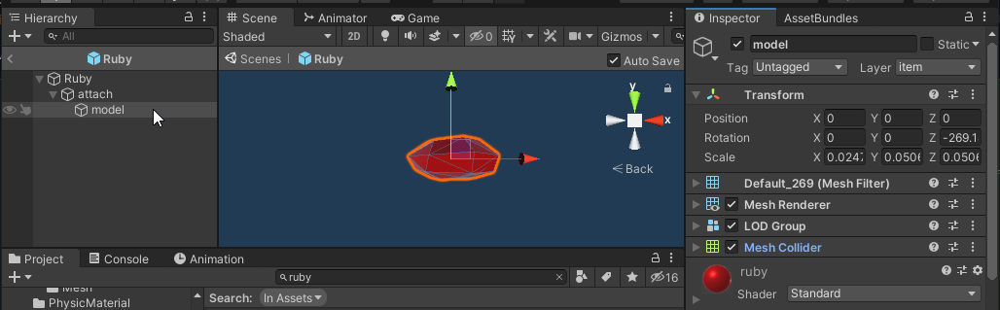
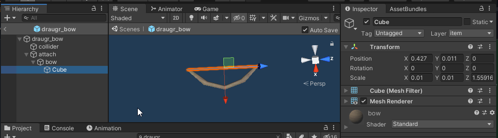

# Kitbash
[Kitbashing](https://en.wikipedia.org/wiki/Kitbashing) refers to using (parts of) existing prefabs to creating a new prefab for use in your mod.

## Setup
You will need the ripped Unity project, follow [these instructions](https://github.com/Valheim-Modding/Wiki/wiki/Valheim-Unity-Project-Guide) (You only need to follow it up to the ILSpy part which is optional for what we do here) if you have not set this up yet.


Prefabs you want to import from an AssetBundle should not be created in the ripped project, but in your own Unity project, to avoid accidentally importing copyrighted assets!
 
## KitBashing the ripped Unity project
Create an empty GameObject to assemble your master copy.
This object will be used as reference for position, rotation and scale of the KitBashSourceConfigs.

### Simple kitbash piece
For the first example, we won't be using AssetBundles, only the ripped Unity project as reference.

We use the "empty" CustomPiece as a base, so let's recreate that in Unity.

Create a new folder in the ripped project, so we don't get confused about what's vanilla and what's not.

Create an empty GameObject in the ripped project by right-clicking on the hierarchy in any scene/prefab and select **Create empty**. Drag this new GameObject into the new folder for our Kitbashes. The GameObject in the hierarchy will turn blue, remove it from the hierarchy, it is no longer needed here.

Rename your new GameObject to `simple_kitbash` and add a Cube (**3D Object > Cube**).

You should now have something like this:


We can now start adding other pieces from vanilla assets! 

Open a prefab and look for the lowest (in the hierarchy) GameObject that has everything that you want.

For example, the Ruby:


We don't need every GameObject in this prefab, we only want the visual (MeshRenderer) and usually also any Colliders.
For the Ruby this means that we should copy the `model` gameObject, right click and select **Copy**.

Create a new `KitbashSourceConfig` for each time you copy a part, so you don't forget where it came from.
```cs
new KitbashSourceConfig
{
    name = "eye_1",
    sourcePrefab = "Ruby",
    sourcePath = "attach/model"
}
```

Go back to `simple_kitbash` and paste the copied GameObject.
Unity seems to paste 50 units above the source location, so either zoom out or edit that manually to see the pasted part.
Move & scale the GameObject however you want, you can edit all properties of the Transform

Once everything is in position, add the position, rotation and scale of the GameObject in the KitbashSourceConfig:

```cs
new KitbashSourceConfig
{
    name = "eye_1",
    sourcePrefab = "Ruby",
    sourcePath = "attach/model",
    position = new Vector3(0.528f, 0.1613345f, -0.253f),
    rotation = Quaternion.Euler(0, 180, 0f),
    scale = new Vector3(0.02473f, 0.05063999f, 0.05064f)
}
```

You can also have entire trees of GameObjects as the source, for example the Draugr Bow:



In this case the visuals are in 2 pieces, we need both `bow` and its child `Cube` (the drawstring)

To do this, we simply use the parent `bow` as the source, the child will be copied along, just like in the Unity editor.
```cs
new KitbashSourceConfig
{
    name = "mouth",
    sourcePrefab = "draugr_bow",
    sourcePath = "attach/bow",
}
```

Again, paste the `bow` into `simple_kitbash` and position it until we have created our masterpiece

```cs
new KitbashSourceConfig
{
    name = "mouth",
    sourcePrefab = "draugr_bow",
    sourcePath = "attach/bow",
    position = new Vector3(0.53336f, -0.315f, -0.001953f),
    rotation = Quaternion.Euler(-0.06500001f, -2.213f, -272.086f),
    scale = new Vector3(0.41221f, 0.41221f, 0.41221f)
}
```

We now have all the KitbashSourceConfigs we need, so we can put it all together:
```cs
var simpleKitbashPiece = new CustomPiece("piece_simple_kitbash", "Hammer"); 
var piece = simpleKitbashPiece.Piece;
piece.m_icon = testSprite; 
simpleKitbashPiece.FixReference = true;
PieceManager.Instance.AddPiece(simpleKitbashPiece);
KitbashManager.Instance.Kitbash(simpleKitbashPiece.PiecePrefab, new KitbashConfig { 
    layer = "piece",
    KitbashSources = new List<KitbashSourceConfig>
    {
        new KitbashSourceConfig
        {
            name = "eye_1",
            sourcePrefab = "Ruby",
            sourcePath = "attach/model",
            position = new Vector3(0.528f, 0.1613345f, -0.253f),
            rotation = Quaternion.Euler(0, 180, 0f),
            scale = new Vector3(0.02473f, 0.05063999f, 0.05064f)
        },
        new KitbashSourceConfig
        {
            name = "eye_2",
            sourcePrefab = "Ruby",
            sourcePath = "attach/model",
            position = new Vector3(0.528f, 0.1613345f, 0.253f),
            rotation = Quaternion.Euler(0, 180, 0f),
            scale = new Vector3(0.02473f, 0.05063999f, 0.05064f)
        },
        new KitbashSourceConfig
        {
            name = "mouth",
            sourcePrefab = "draugr_bow",
            sourcePath = "attach/bow",
            position = new Vector3(0.53336f, -0.315f, -0.001953f),
            rotation = Quaternion.Euler(-0.06500001f, -2.213f, -272.086f),
            scale = new Vector3(0.41221f, 0.41221f, 0.41221f)
        }
    }
}); 
```

That's it! We can now place our kitbashed piece in game!
