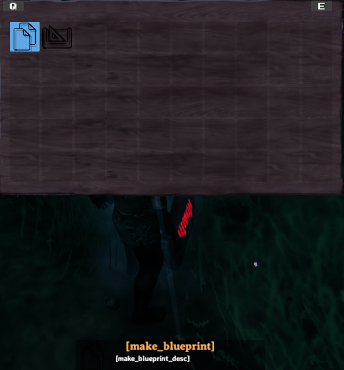

# Pieces and PieceTables

_Pieces_ in Valheim are anything that can be built in the game, through means such as the Hammer, Cultivator, Hoe or your own custom tool items.
This includes things such as plant sapplings, the workbench, and walls.
In order for a prefab to be a _piece_, it must have the `Piece` component attached to the prefab.

_Piece Tables_ in Valheim are connecting the buildable pieces to the tools used for building.
They also define the build categories and if a tool can remove pieces again.
In vanilla Valheim you only can use four building categories or none on a piece table.
Jötunn adds the ability to use custom categories on vanilla tools or completely own categories on custom tool items.
In order for a prefab to be a _piece table_, it must have the `PieceTable` component attached to the prefab.

Custom pieces and piece tables are handled by the [PieceManager](xref:Jotunn.Managers.PieceManager) singleton.

This example requires [assets](asset-loading.md) to be loaded.
The code snippets are taken from our [example mod](https://github.com/Valheim-Modding/JotunnModExample).

> [!NOTE]
> You **must** only use names of existing prefabs.
> This can be prefabs you created, that have already been registered by another mod, or that already exist in the game.

## Creating custom pieces with prefabs

The `Blueprint Rune`, a custom item one of our developers has been working on, is intended to duplicate existing structures.
In order to keep this example simple, we are not including this functionality, but are utilising these assets to provide an example of loading pieces via prefabs.
So please bear in mind that while the code below is perfectly functional, there is no mesh/model associated with the following pieces due to the nature of their intended function.

### Custom item

Loading the `Blueprint Rune` item is covered in the [items tutorial](items.md).
Refer to this if you want to learn how to add your custom tool item first and return to this tutorial afterwards.

### Custom piece table

After loading our custom item, we will load a piece table GameObject from our example asset bundle, create a [CustomPieceTable](xref:Jotunn.Entities.CustomPieceTable) from it and add it to the [PieceManager](xref:Jotunn.Managers.PieceManager).

```cs
private void CreateRunePieceTable()
{
    GameObject tablePrefab = blueprintRuneBundle.LoadAsset<GameObject>("_BlueprintTestTable");
    CustomPieceTable CPT = new CustomPieceTable(tablePrefab);
    PieceManager.Instance.AddPieceTable(CPT);
}
```

### Custom pieces using PieceConfigs

Now we will load two new pieces into the previously created blueprint piecetable.
In order to better facilitate creation of pieces we have introduced the abstractions of [PieceConfig's](xref:Jotunn.Configs.PieceConfig) and [RequirementConfig](xref:Jotunn.Configs.RequirementConfig).
These allow us to quickly and easily define common properties for pieces, such as the table they belong too, any restrictions or resources required.

```cs
private void CreateRuneMakePiece()
{
    // Create and add a custom piece for the rune. Add the prefab name of the PieceTable to the config.
    var makePrefab = BlueprintRuneBundle.LoadAsset<GameObject>("make_testblueprint");

    PieceConfig makeConfig = new PieceConfig();
    makeConfig.PieceTable = "_BlueprintTestTable";

    PieceManager.Instance.AddPiece(new CustomPiece(makePrefab, fixReference: false, makeConfig));
}
```

```cs
private void CreateRunePiecePiece()
{
    // Load, create and add another custom piece for the rune. This piece uses more properties
    // of the PieceConfig - it can now be build in dungeons and has actual requirements to build it.
    var placePrefab = BlueprintRuneBundle.LoadAsset<GameObject>("piece_testblueprint");

    PieceConfig placeConfig = new PieceConfig();
    placeConfig.PieceTable = "_BlueprintTestTable";
    placeConfig.AllowedInDungeons = true;
    placeConfig.AddRequirement(new RequirementConfig("Wood", 2, 0, true));

    PieceManager.Instance.AddPiece(new CustomPiece(placePrefab, fixReference: false, placeConfig));
}
```

And here we have our final results:<br />


As you can see in the screenshot the name and description are not yet localized.
To read more about localization/translation head over to the [localization tutorial pages](localization.md).

## Adding custom piece table categories to vanilla tables

With [PieceConfig's](xref:Jotunn.Configs.PieceConfig) it is possible to add your pieces to a vanilla or even custom piece table category.
For this example we create "empty" pieces (GameObjects with just a cube model and a Piece component) and add them to a new category "Lulzies" on the Hammer.

```cs
// Implementation of custom pieces from an "empty" prefab with new piece categories
private void AddPieceCategories()
{
    var testTexture = AssetUtils.LoadTexture("TestMod/Assets/test_tex.jpg");

    GameObject cube = PrefabManager.Instance.CreateEmptyPrefab("piece_lul");
    // Add our test texture to the Unity MeshRenderer
    cube.GetComponent<MeshRenderer>().material.mainTexture = testTexture;

    PieceConfig lulConfig = new PieceConfig();
    lulConfig.Name = "$piece_lul";
    lulConfig.Description = "$piece_lul_description";
    lulConfig.Icon = RenderManager.Instance.Render(cube, RenderManager.IsometricRotation); // render a new icon at runtime
    lulConfig.PieceTable = "Hammer";
    lulConfig.ExtendStation = "piece_workbench"; // Makes this piece a station extension
    lulConfig.Category = "Lulzies";  // Adds a custom category for the Hammer
    PieceManager.Instance.AddPiece(new CustomPiece(cube, false, lulConfig));
}
```

The result is a new category added to the piece table of the Hammer:<br />

<br />
One of the pieces placed in the world:<br />


## Creating completely new categories using PieceTableConfigs

While adding pieces with custom categories to existing piece tables (such as the Hammer), you can also create custom items with piece tables using only custom categories.
For that you will need to use [PieceTableConfig's](xref:Jotunn.Configs.PieceTableConfig) when creating a [CustomPieceTable](xref:Jotunn.Entities.CustomPieceTable).
This example is not used in our example mod but in our TestMod for Jötunn.
Keep that in mind as you will not find the code in the example mod.
We are still using the piece table of the example `Blueprint Rune` but this time add the custom pieces to own categories.

```cs
private void AddItemsWithConfigs()
{
    // Add a custom piece table with custom categories
    var tablePrefab = BlueprintRuneBundle.LoadAsset<GameObject>("_BlueprintTestTable");

    PieceTableConfig runeTable = new PieceTableConfig();
    runeTable.CanRemovePieces = false;
    runeTable.UseCategories = false;
    runeTable.UseCustomCategories = true;
    runeTable.CustomCategories = new string[] { "Make", "Place" };

    PieceManager.Instance.AddPieceTable(new CustomPieceTable(tablePrefab, runeTable));

    // Create and add a custom item
    var runePrefab = BlueprintRuneBundle.LoadAsset<GameObject>("BlueprintTestRune");
    ItemConfig runePrefabConfig = new ItemConfig();
    runePrefabConfig.Amount = 1;
    runePrefabConfig.AddRequirement(new RequirementConfig("Stone", 1));

    // Prefab did not use mocked refs so no need to fix them
    ItemManager.Instance.AddItem(new CustomItem(runePrefab, fixReference: false, runePrefabConfig));

    // Create and add custom pieces
    var makePrefab = BlueprintRuneBundle.LoadAsset<GameObject>("make_testblueprint");
    PieceConfig makeConfig = new PieceConfig();
    makeConfig.PieceTable = "_BlueprintTestTable";
    makeConfig.Category = "Make";

    PieceManager.Instance.AddPiece(new CustomPiece(makePrefab, fixReference: false, makeConfig));

    var placePrefab = BlueprintRuneBundle.LoadAsset<GameObject>("piece_testblueprint");
    var place = new PieceConfig();
    place.PieceTable = "_BlueprintTestTable";
    place.Category = "Place";
    place.AllowedInDungeons = true;
    place.AddRequirement(new RequirementConfig("Wood", 2));

    PieceManager.Instance.AddPiece(new CustomPiece(placePrefab, fixReference: false, place));

}
```

The result is a tool with two completely custom categories:<br />


## Translating your custom categories

You can provide localized versions of your custom categories.
Please see our [localization tutorial](localization.md#localizable-content-in-jötunn) on how to do this.
