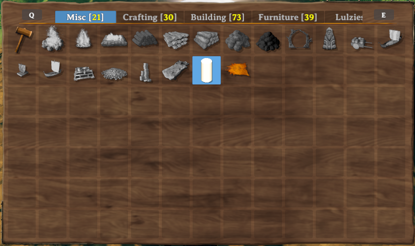
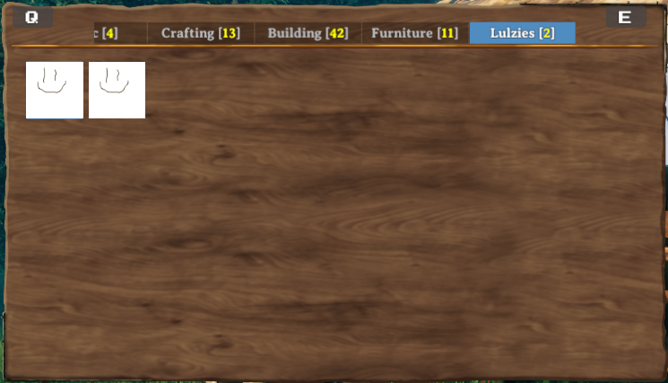
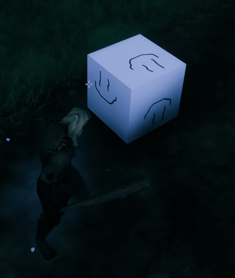

# Pieces and PieceTables

_Pieces_ in Valheim are anything that can be built in the game, through means such as the Hammer, Cultivator, Hoe or your own custom tool items.
This includes things such as plant sapplings, the workbench, and walls.
In order for a prefab to be a _piece_, it must have the `Piece` component attached to the prefab.

_Piece Tables_ in Valheim are connecting the buildable pieces to the tools used for building.
They also define the build categories and if a tool can remove pieces again.
In vanilla Valheim you only can use four building categories or none on a piece table.
Jötunn adds the ability to use custom categories on vanilla tools or completely own categories on custom tool items.
In order for a prefab to be a _piece table_, it must have the `PieceTable` component attached to the prefab.

Custom pieces and piece tables are handled by the [PieceManager](xref:Jotunn.Managers.PieceManager) singleton.

This example requires [assets](asset-loading.md) to be loaded.
The code snippets are taken from our [example mod](https://github.com/Valheim-Modding/JotunnModExample).

> [!NOTE]
> You **must** only use names of existing prefabs.
> This can be prefabs you created, that have already been registered by another mod, or that already exist in the game.

## Creating custom pieces

### Custom pieces using PieceConfigs

Now we will load a new piece from an asset bundle.
In order to better facilitate creation of pieces we have introduced the abstractions of [PieceConfig's](xref:Jotunn.Configs.PieceConfig) and [RequirementConfig](xref:Jotunn.Configs.RequirementConfig).
These allow us to quickly and easily define common properties for pieces, such as the table they belong too, any restrictions or resources required.

```cs
private void Awake()
{
    AssetBundle pieceBundle = AssetUtils.LoadAssetBundleFromResources("pieces");

    PieceConfig cylinder = new PieceConfig();
    cylinder.Name = "$cylinder_display_name";
    cylinder.Description = "$cylinder_description";
    cylinder.PieceTable = PieceTables.Hammer;
    cylinder.CraftingStation = CraftingStations.Workbench;
    cylinder.Category = PieceCategories.Misc;
    cylinder.AddRequirement(new RequirementConfig("Wood", 2, 0, true));

    PieceManager.Instance.AddPiece(new CustomPiece(pieceBundle, "Cylinder", fixReference: false, cylinder));
}
```

To clone an existing pieces, they first have to be loaded by the game and are not available in `Awake`.
Jötunn provides the `PrefabManager.OnVanillaPrefabsAvailable` event where vanilla prefabs are loaded.
This event is called every time before a new <see cref="ObjectDB"/> is copied.
This means we have to unregister after adding our custom pieces, because Jötunn already cached the custom piece.
```cs
private void Awake()
{
    PrefabManager.OnVanillaPrefabsAvailable += CreateDeerRugPiece;
}

private void CreateDeerRugPiece()
{
    PieceConfig rug = new PieceConfig();
    rug.Name = "$our_rug_deer_display_name";
    rug.PieceTable = PieceTableNames.Hammer;
    rug.Category = PieceCategoryNames.Misc;
    rug.AddRequirement(new RequirementConfig("Wood", 2, 0, true));

    PieceManager.Instance.AddPiece(new CustomPiece("our_rug_deer", "rug_deer", rug));

    // You want that to run only once, Jotunn has the piece cached for the game session
    PrefabManager.OnVanillaPrefabsAvailable -= CreateDeerRugPiece;
}
```

And here we have our final results:<br />


As you can see in the screenshot the name and description are not yet localized.
To read more about localization/translation head over to the [localization tutorial pages](localization.md).

> [!NOTE]
> A `PieceConfig` has an empty array of requirements by default and doesn't change original requirements of that piece unless requirements were explicitely added to the `PieceConfig` object. So in case you really want to remove all requirements from a specific piece (for example a cloned vanilla piece), you have to do it manually: `CustomPiece.Piece.m_resources = Array.Empty<Piece.Requirement>();`

## Adding custom piece table categories to vanilla tables

With [PieceConfig's](xref:Jotunn.Configs.PieceConfig) it is possible to add your pieces to a vanilla or even custom piece table category.
For this example we create "empty" pieces (GameObjects with just a cube model and a Piece component) and add them to a new category "Lulzies" on the Hammer.

```cs
// Implementation of custom pieces from an "empty" prefab with new piece categories
private void AddPieceCategories()
{
    // load a test texture from out mod folder
    var testTexture = AssetUtils.LoadTexture("TestMod/Assets/test_tex.jpg");

    GameObject cube = PrefabManager.Instance.CreateEmptyPrefab("piece_lul");
    // Add our test texture to the Unity MeshRenderer
    cube.GetComponent<MeshRenderer>().material.mainTexture = testTexture;

    PieceConfig lulConfig = new PieceConfig();
    lulConfig.Name = "$piece_lul";
    lulConfig.Description = "$piece_lul_description";
    lulConfig.PieceTable = PieceTableNames.Hammer;
    lulConfig.Icon = RenderManager.Instance.Render(cube, RenderManager.IsometricRotation); // render a new icon at runtime
    lulConfig.ExtendStation = CraftingStations.Workbench; // Makes this piece a station extension
    lulConfig.Category = "Lulzies";  // Adds a custom category for the Hammer
    PieceManager.Instance.AddPiece(new CustomPiece(cube, false, lulConfig));
}
```

The result is a new category added to the piece table of the Hammer:<br />


One of the pieces placed in the world:<br />


### Custom piece table

After loading our custom item, we will load a piece table GameObject from our example asset bundle, create a [CustomPieceTable](xref:Jotunn.Entities.CustomPieceTable) from it and add it to the [PieceManager](xref:Jotunn.Managers.PieceManager).

```cs
private void CreateRunePieceTable()
{
    GameObject tablePrefab = blueprintRuneBundle.LoadAsset<GameObject>("_BlueprintTestTable");
    CustomPieceTable CPT = new CustomPieceTable(tablePrefab);
    PieceManager.Instance.AddPieceTable(CPT);
}
```

## Creating completely new categories using PieceTableConfigs

While adding pieces with custom categories to existing piece tables (such as the Hammer), you can also create custom items with piece tables using only custom categories.
For that you will need to use [PieceTableConfig's](xref:Jotunn.Configs.PieceTableConfig) when creating a [CustomPieceTable](xref:Jotunn.Entities.CustomPieceTable).
This example is not used in our example mod but in our TestMod for Jötunn.
Keep that in mind as you will not find the code in the example mod.
We are still using the piece table of the example `Blueprint Rune` but this time add the custom pieces to own categories.

```cs
private void AddItemsWithConfigs()
{
    // Add a custom piece table with custom categories
    PieceTableConfig runeTable = new PieceTableConfig();
    runeTable.CanRemovePieces = false;
    runeTable.UseCategories = false;
    runeTable.UseCustomCategories = true;
    runeTable.CustomCategories = new string[] { "Make", "Place" };
    PieceManager.Instance.AddPieceTable(new CustomPieceTable(BlueprintRuneBundle, "_BlueprintTestTable", runeTable));

    // Create and add a custom item
    ItemConfig runeConfig = new ItemConfig();
    runeConfig.Amount = 1;
    runeConfig.AddRequirement(new RequirementConfig("Stone", 1));
    // Prefab did not use mocked refs so no need to fix them
    var runeItem = new CustomItem(BlueprintRuneBundle, "BlueprintTestRune", fixReference: false, runeConfig);
    ItemManager.Instance.AddItem(runeItem);

    // Create and add custom pieces
    PieceConfig makeConfig = new PieceConfig();
    makeConfig.PieceTable = "_BlueprintTestTable";
    makeConfig.Category = "Make";
    var makePiece = new CustomPiece(BlueprintRuneBundle, "make_testblueprint", fixReference: false, makeConfig);
    PieceManager.Instance.AddPiece(makePiece);

    var placeConfig = new PieceConfig();
    placeConfig.PieceTable = "_BlueprintTestTable";
    placeConfig.Category = "Place";
    placeConfig.AllowedInDungeons = true;
    placeConfig.AddRequirement(new RequirementConfig("Wood", 2));
    var placePiece = new CustomPiece(BlueprintRuneBundle, "piece_testblueprint", fixReference: false, placeConfig);
    PieceManager.Instance.AddPiece(placePiece);
}
```

The result is a tool with two completely custom categories:<br />


## Translating your custom categories

You can provide localized versions of your custom categories.
Please see our [localization tutorial](localization.md#localizable-content-in-jötunn) on how to do this.
