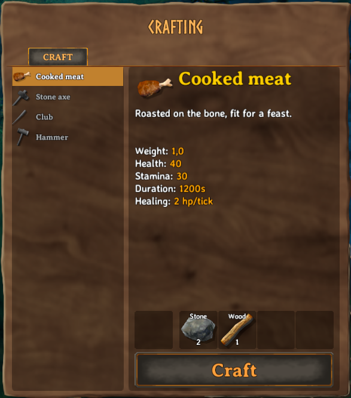
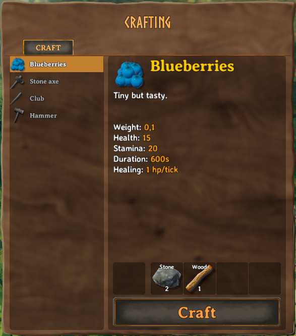

# Recipes
_Recipes_ in Valheim are coupling the items a player can craft to the various crafting stations. They also define if and at which cost items can be upgraded as well as the crafting station which can repair items. Creation of custom recipes is done through the [ItemManager](xref:Jotunn.Managers.ItemManager) singleton class.

All recipes will always be loaded **after** all items. However, recipes will be loaded in the order that you call the `AddRecipe` function.

You have three options for adding custom recipes in Jötunn:
- Use a [RecipeConfig](xref:Jotunn.Configs.RecipeConfig) where you can define the ingame objects your recipe should reference via strings of the object names.
- Use a JSON file to define an array of [RecipeConfig](xref:Jotunn.Configs.RecipeConfig) objects, then load them when your mod starts.
- Create the `Recipe` ScriptableObject on your own. If the game has already loaded it's own assets, you can reference the objects in the recipe via Jötunns [Prefab Cache](xref:Jotunn.Managers.PrefabManager.Cache) or create [Mocks](asset-mocking.md) and let Jötunn fix the references at runtime.

These three approaches can be mixed and used as you please, as they will accomplish the same goal.

This example requires [assets](asset-loading.md) to be loaded. The code snippets are taken from our [example mod](https://github.com/Valheim-Modding/JotunnModExample).

> [!NOTE]
> You **must** only use names of existing prefabs. This can be prefabs you created, that have already been registered by another mod, or that already exist in the game.

## Adding a recipe using RecipeConfig

When you are loading your mod assets before Valheim loads it's vanilla assets into the game (in your Mods `Awake()` for example) you need to use the [RecipeConfig](xref:Jotunn.Configs.RecipeConfig) class to create a custom recipe. You define the referenced prefabs via their names by string, instantiate a [CustomRecipe](xref:Jotunn.Entities.CustomRecipe) with that and let Jötunn resolve the correct references at runtime for you.

```cs
// Add custom recipes
private void AddRecipes()
{
    // Create a custom recipe with a RecipeConfig
    CustomRecipe meatRecipe = new CustomRecipe(new RecipeConfig()
    {
        Item = "CookedMeat",                    // Name of the item prefab to be crafted
        Requirements = new RequirementConfig[]  // Resources and amount needed for it to be crafted
        {
            new RequirementConfig { Item = "Stone", Amount = 2 },
            new RequirementConfig { Item = "Wood", Amount = 1 }
        }
    });
    ItemManager.Instance.AddRecipe(meatRecipe);
}
```

Please take a look at the actual implementation of [RecipeConfig](xref:Jotunn.Configs.RecipeConfig) for all properties you can set in the config.

Now we are able to craft ourself some CookedMeat from Stone and Wood (yum!):
<br />


## Adding a recipe using JSON
First, we must create a JSON file which will keep an array of all the recipes we wish to add. This JSON file should contain an array of [RecipeConfig](xref:Jotunn.Configs.RecipeConfig) objects (note, this _must_ be an array). This can be done like so:
```json
[
  {
    "Item": "Blueberries",
    "Amount": 1,
    "Requirements": [
      {
        "Item": "Stone",
        "Amount": 2
      },
      {
        "Item": "Wood",
         "Amount": 1
      }
    ]
  }
]
```
Please take a look at the actual implementation of [RecipeConfig](xref:Jotunn.Configs.RecipeConfig) for all properties you can set in the config.

Next, we need to tell Jötunn where our JSON file is. If the JSON file is not in an AssetBundle, we can load it like so:

```cs
// Add custom recipes
private void AddRecipes()
{
    // Load recipes from JSON file
    ItemManager.Instance.AddRecipesFromJson("TestMod/Assets/recipes.json");
}
```

Now we are able to craft ourself some Blueberries from Stone and Wood (yum!):
<br />


## Adding a recipe using Valheim Recipe & Prefab Cache

The [example mod](https://github.com/Valheim-Modding/JotunnModExample) creates a cloned item "EvilSword", which is also used as an example in the [items tutorial](items.md). For the user to be able to craft the sword at the workbench, we create a method named `RecipeEvilSword` which adds a new crafting bench recipe for our custom item. In particular, this recipe includes a custom resource. We will use the native `Recipe` object and instantiate a new instance, and then define some basic properties of the recipe, such as the item which it produces, the piece where it can be crafted, and the resources required to craft the product. You will notice that before we add our native recipe that we wrap it inside of a [CustomRecipe](xref:Jotunn.Entities.CustomRecipe). This wrapper is mostly to facilitate Jötunn's FixReferences for prefabs which include [mock references](asset-mocking.md) but does not really have any affect for this specific scenario. Notice both fixRef params are set to false, this is because we will use the [PrefabManager's](xref:Jotunn.Managers.PrefabManager.GetPrefab(System.String)) cache to acquire a reference to native assets such as the crafting bench, and required resources to define the recipe's conditions.

```cs
private static void RecipeEvilSword(ItemDrop itemDrop)
{
    // Create and add a recipe for the copied item
    Recipe recipe = ScriptableObject.CreateInstance<Recipe>();
    recipe.name = "Recipe_EvilSword";
    recipe.m_item = itemDrop;
    recipe.m_craftingStation = PrefabManager.Cache.GetPrefab<CraftingStation>("piece_workbench");
    recipe.m_resources = new Piece.Requirement[]
    {
            new Piece.Requirement()
            {
                m_resItem = PrefabManager.Cache.GetPrefab<ItemDrop>("Stone"),
                m_amount = 1
            },
            new Piece.Requirement()
            {
                m_resItem = PrefabManager.Cache.GetPrefab<ItemDrop>("CustomWood"),
                m_amount = 1
            }
    };

    // Since we got the prefabs from the cache, no referencing is needed
    CustomRecipe CR = new CustomRecipe(recipe, fixReference: false, fixRequirementReferences: false);
    ItemManager.Instance.AddRecipe(CR);
}
```
This is what our recipe looks like in-game:
<br />


As you may notice, our item does not hold the display text we might prefer. In order to resolve this you can read our [localization](localization.md) tutorial.