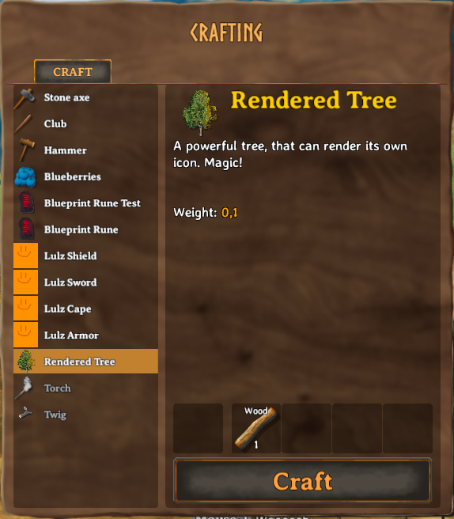

# Render Queue
Jötunn's [RenderManager](xref:Jotunn.Managers.RenderManager) allows you to pass a GameObject into a Queue and let Jötunn render the visual parts into a Sprite for you.

**Note**: The code snippets are taken from our [example mod](https://github.com/Valheim-Modding/JotunnModExample).

## Creating a Sprite as an icon for a cloned prefab

In this example, we will clone a tree seed and create an icon for it from a grown tree prefab.
In order to do this, we will need to reference already instantiated game assets.
One method of doing so is by using the "vanilla prefabs available" event provided by Jötunn.
The event is fired when the vanilla items are in memory and thus clonable (more precisely in the start scene before the initial ObjectDB is cloned).

```cs
private void Awake()
{
    // Add a cloned item with a runtime-rendered icon
    PrefabManager.OnVanillaPrefabsAvailable += AddItemsWithRenderedIcons;
}
```

In our method we render an icon of the Beech1 with [RenderManager.Render](xref:Jotunn.Managers.RenderManager.Render(Jotunn.Managers.RenderManager.RenderRequest)).
Here we clone the vanilla BeechSeeds to a new [CustomItem](xref:Jotunn.Entities.CustomItem) (see our [tutorial on items](items.md) for more information about cloning vanilla prefabs).

```cs
// Create rendered icons from prefabs
private void AddItemsWithRenderedIcons()
{
    try
    {
        // use the vanilla beech tree prefab to render our icon from
        GameObject beech = PrefabManager.Instance.GetPrefab("Beech1");

        // create the custom item with the rendered icon
        CustomItem treeItem = new CustomItem("item_MyTree", "BeechSeeds", new ItemConfig
        {
            Name = "$rendered_tree",
            Description = "$rendered_tree_desc",
            Icons = new[]
            {
                RenderManager.Instance.Render(beech)
            },
            Requirements = new[]
            {
                new RequirementConfig { Item = "Wood", Amount = 1, Recover = true }
            }
        });
        ItemManager.Instance.AddItem(treeItem);
    }
    catch (Exception ex)
    {
        Jotunn.Logger.LogError($"Error while adding item with rendering: {ex}");
    }
    finally
    {
        // You want that to run only once, Jotunn has the item cached for the game session
        PrefabManager.OnVanillaPrefabsAvailable -= AddItemsWithRenderedIcons;
    }
}
```

Note that all texts are tokenized and translated ingame. The translations are also provided by Jötunn. Read the [tutorial on Localizations](localization.md) for more information on that topic.

The resulting item with the rendered icon in game:


