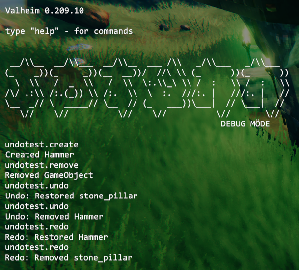

# Undo/Redo Queue
Jötunn's [UndoManager](xref:Jotunn.Managers.UndoManager) provides a simple interface to record, roll back and replay any actions in the game while managing the history of the queue for you as well as providing multiple queues which can be used by multiple mods simultaneously.

**Note**: The code snippets are taken from our [example mod](https://github.com/Valheim-Modding/JotunnModExample).

## Using pre-defined UndoActions

Jötunn provides some common actions for you to use in your mods, found in the [UndoActions](xref:Jotunn.Utils.UndoActions) class. Those actions include creation and removal of ZDOs as well as an action for terrain manipulation. To be able to revert or replay those actions in the game, you will have to collect the data you are manipulating and create an action with those. After passing it to the UndoManager, you can use the public API of the manager to undo or redo the actions you recorded.

For this example we created multiple console commands using Jötunn's [CommandManager](xref:Jotunn.Managers.CommandManager) to be able to create or remove stuff from the game and commands to execute the undo and redo commands.

Jötunn supports multiple independent undo queues which are distinguished by their name. So the first thing we make is to define our queue's name.

> [!NOTE]
> Every mod that uses the same queue name shares that queue. So it is possible for multiple mods to have a common undo queue without having to depend on each other.

```cs
// Defining a queue name for the UndoManager that is shared by all our actions
private const string QueueName = "TestUndo";
```

Next we will create our console commands to create and remove stuff from the game.

```cs
public class TestCreateCommand : ConsoleCommand
{
    public override string Name => "undotest.create";

    public override string Help => "Creates stuff to test the undo manager";

    public override void Run(string[] args)
    {
        // Do some validation
        if (!Player.m_localPlayer)
        {
            Console.instance.Print("Can be used in game only!");
            return;
        }

        // Get a random prefab from the game
        GameObject prefab = PrefabManager.Instance.GetPrefab("Hammer");
        if (!prefab)
        {
            Console.instance.Print("Can't find prefab");
            return;
        }

        // Instantiate that prefab in the game
        var obj = Instantiate(prefab, Player.m_localPlayer.transform.position + Player.m_localPlayer.transform.forward * 2f + Vector3.up, Quaternion.identity);

        // Create an UndoCreate action with the ZDO of the prefab
        var action = new UndoActions.UndoCreate(new[] { obj.GetComponent<ZNetView>().GetZDO() });
        UndoManager.Instance.Add(QueueName, action);

        // Do some console output
        Console.instance.Print("Created Hammer");
    }
}

public class TestRemoveCommand : ConsoleCommand
{
    public override string Name => "undotest.remove";

    public override string Help => "Remove hovered stuff to test the undo manager";

    public override void Run(string[] args)
    {
        // Do some validation
        if (!Player.m_localPlayer)
        {
            Console.instance.Print("Can be used in game only!");
            return;
        }

        // Get the current hovered object's ZDO
        if (!Player.m_localPlayer.GetHoverObject())
        {
            Console.instance.Print("Nothing hovered!");
            return;
        }
        var hoverObject = Player.m_localPlayer.GetHoverObject();
        var zNetView = hoverObject.GetComponentInParent<ZNetView>();
        if (!zNetView || !zNetView.IsValid())
        {
            return;
        }
                
        // Create an UndoRemove action with that ZDO
        var action = new UndoActions.UndoRemove(new[] { zNetView.GetZDO() });
        UndoManager.Instance.Add(QueueName, action);

        // Remove the ZDO from the game
        zNetView.GetZDO().SetOwner(ZDOMan.instance.GetMyID());
        ZNetScene.instance.Destroy(zNetView.gameObject);
        
        // Do some console output
        Console.instance.Print("Removed GameObject");
    }
}

```

We will also need commands to undo and redo our added actions.

```cs
public class TestUndoCommand : ConsoleCommand
{
    public override string Name => "undotest.undo";

    public override string Help => "Undo the stuff";

    public override void Run(string[] args)
    {
        if (!Player.m_localPlayer)
        {
            Console.instance.Print("Can be used in game only!");
            return;
        }

        // Calling Undo() on the manager using the queue's name will
        // undo your last added action to that queue
        UndoManager.Instance.Undo(QueueName);
    }
}

public class TestRedoCommand : ConsoleCommand
{
    public override string Name => "undotest.redo";

    public override string Help => "Redo the stuff";

    public override void Run(string[] args)
    {
        if (!Player.m_localPlayer)
        {
            Console.instance.Print("Can be used in game only!");
            return;
        }
                
        // Calling Redo() on the manager using the queue's name will
        // redo the last action which was removed by using Undo() from that queue
        UndoManager.Instance.Redo(QueueName);
    }
}
```

To be able to use those commands in the game it is important to also add them to the [CommandManager](xref:Jotunn.Managers.CommandManager). If you want to learn more about console commands, check out the [command tutorial](console-commands.md).

```cs
private void Awake()
{
    // Add custom commands for testing the UndoManager
    CommandManager.Instance.AddConsoleCommand(new TestCreateCommand());
    CommandManager.Instance.AddConsoleCommand(new TestRemoveCommand());
    CommandManager.Instance.AddConsoleCommand(new TestUndoCommand());
    CommandManager.Instance.AddConsoleCommand(new TestRedoCommand());
}
```

Using our commands in the game gets us this console output. First we created and spawned a new hammer prefab, then we removed a built stone pillar by using the `undotest.create` and `undotest.remove` commands. After that we used the `undotest.undo` command two times, first reverting the removal of the stone pillar, then reverting the spawning of the hammer. Then we replayed those actions again using the `undotest.redo` command, effectively spawning the hammer and removing the stone pillar again.



## Creating your own UndoActions

Instead of using the very few pre-defined actions provided by Jötunn, mods can create their own actions to use in the undo queue. The manager's `Add()` method accepts any class that implements the provided [IUndoAction](xref:Jotunn.Managers.UndoManager.IUndoAction) interface. Please refer to Jötunn's API documentation and check out the [pre-defined UndoActions](https://github.com/Valheim-Modding/Jotunn/blob/dev/JotunnLib/Utils/UndoActions.cs) to learn how to make your own.