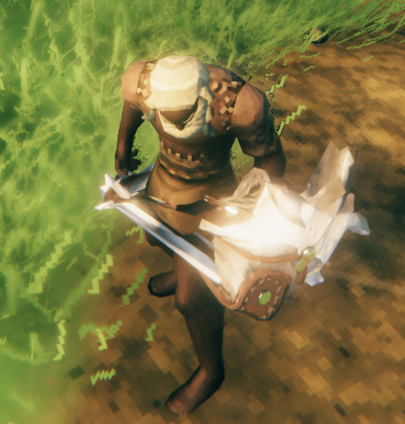
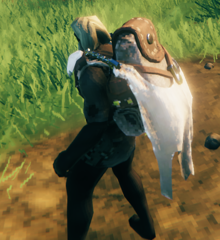

# Bone Reorder
One issue many developers face when importing meshes into unity is that unity does not preserve the boneorder during the import process. While we may be able to correctly attach objects to player models in editor, when the asset is loaded at runtime there is a differing numeric ordering of bones, which causes a disconnect between what the designer intends and what appears ingame.

 

What a mess!

Thanks to [GoldenJude](https://github.com/GoldenJude), we have borrowed his bone reorder script from [Blacksmith Tools](https://www.nexusmods.com/valheim/mods/566).

Plugin developers can simply invoke [ApplyOnEqupmentChanged](xref:Jotunn.Utils.BoneReorder.ApplyOnEquipmentChanged) during Awake(): `BoneReorder.ApplyOnEquipmentChanged();`. This will register some hooks with the VisEquipment method which will reorder the bones of the SkinnedMeshRenderer when the user equips a different item. While we could automatically have this hook invoked, we felt it best if the developer specifies its requirement, however once one developer has invoked the usage, the bone reorder will be applied for the rest of the lifetime of the gameplay session on all equip events.

Much better!