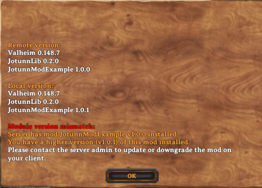
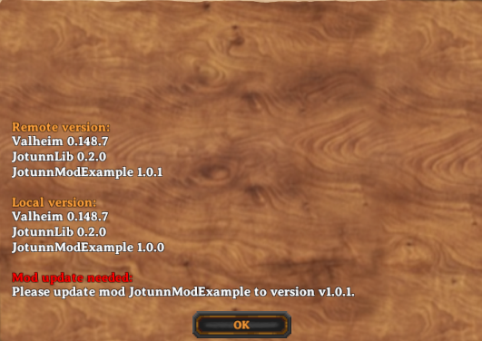

# NetworkCompatibility

[NetworkCompatibility](xref:JotunnLib.Utils.NetworkCompastibilityAttribute) is an attribute developers can attach to their `BaseUnityPlugin` which will allow them to specify and configure the specific network requirements their plugin requires to maintain client<->client interoperability, consistency, and synchronisation. One example of this may be a mod which uses a custom asset. While one client may be able to create, use, and interact with the object in the environment, if no other clients have the asset mod then they will experience a difference in gameplay from the client with the asset.

In order to quote *"enforce"* network compatibility, a version check is initiated when the client connects to the server, where each client will compare their plugins, and the requirements specified by each, and the server will decide depending on the requirements of each plugin, if the client is permissible. If there is a version mismatch, the client will be disconnected with a version mismatch error, that details the pluginGUID'd and the offending version string, and the requirement. The client may then satisfy the requirements and reconnect successfully.

### CompatibilityLevel & Version Strictness
The [NetworkCompatibility](xref:JotunnLib.Utils.NetworkCompastibilityAttribute) privdes two parameters, one for [[CompatibilityLevel](xref:JotunnLib.Utils.NetworkCompastibilityAttribute.CompatibilityLevel)] (`NoNeedForSync`,`EveryoneMustHaveMod`), and one for [VersionStrictness]([NetworkCompatibility](xref:JotunnLib.Utils.NetworkCompastibilityAttribute).VersionStrictness) (`None`,`Major`,`Minor`,`Build`).

These options for the most part are self explanatory, however version strictness is a little complex, so lets take a further look at how this interacts over two devices, a dedicated server and a client:

**No NetworkCompatibility in any plugin, client or server**: Vanilla version checking.

**Clientside NetworkCompatibility plugin, none server**: Client Version mismatch from additional plugin:
TODO image

**Clientside none, NetworkCompatibilityPlugin server**: Server version mismatch from additional plugin:
TODO image

**VersionStrictness unequal, client>server**: server version mismatch from major,minor,build:

**VersionStrictness unequal, server>client**: client version mismatch from major,minor,build:

### Semantic versioning and NetworkCompatibility.

[Semantic Versioning](https://semver.org/) is the process of assigning versions to states in the form of `Major.Minor.Build`. In general, bug fixes are usually placed within the build version, feature additions are placed within the minor version, and breaking changes are placed within the major version.

**Major**:
When applying this to network compatibility module, the "safe"/normal use case is to enforce minor version strictness. One use case for this may be for instance an asset/item mod, which introduces new items every minor version. In this case it is important to maintain minor version strictness to ensure network sync of item assets with the server and other clients.

**Minor**:
Another use case might be an overhaul which tweaks many different settings and client inputs/UX/interactions, and for the most part although minor features are frequently pushed, they do not require version synchronisation on such a granular level. In this scenario, the developer might opt for major version strictness.

**Build**:
Generally, it is not advised to enforce version strictness on builds, however we do not dictate how developers control their versioning, and as thus we expose this version for network compatibility should the developer only choose to increment builds.