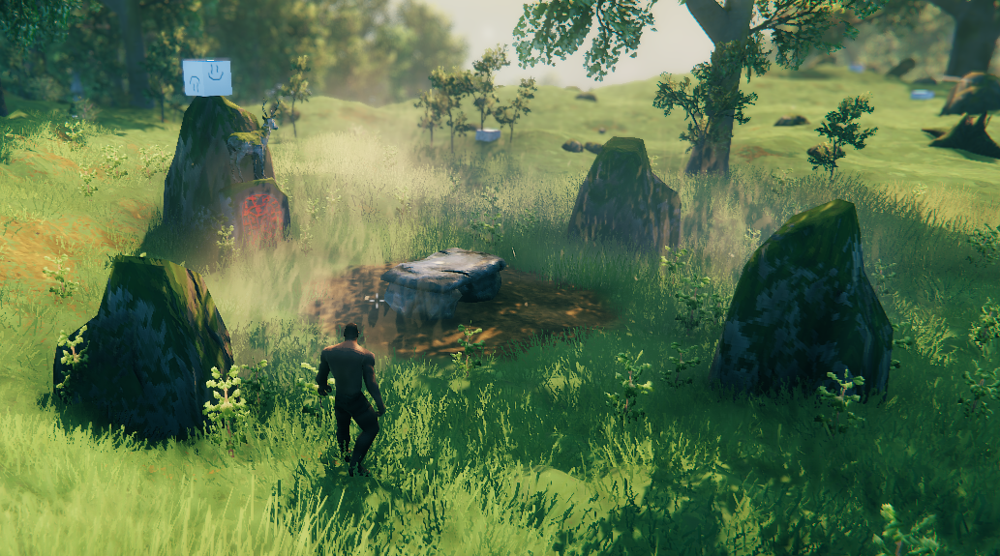
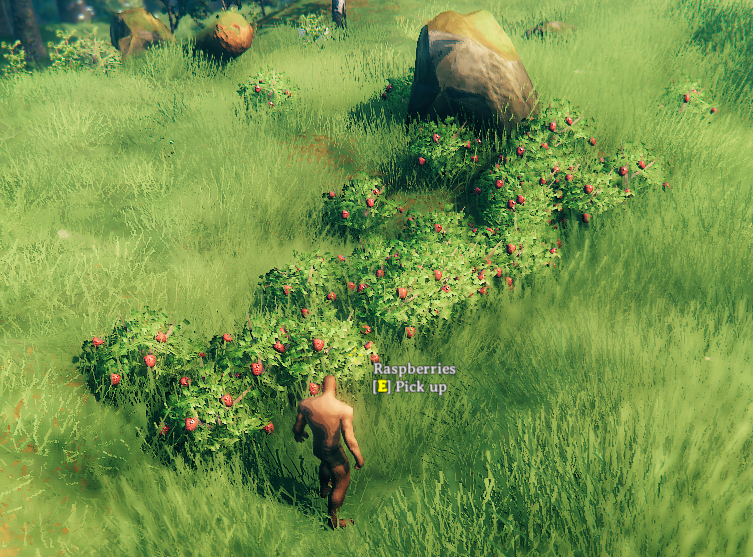

# Zones
The world of Valheim is split up into **Zones**, each 64 by 64 meters, controlled by the **ZoneSystem**. Each **Zone** can potentially have a single **Location** instance, and many **Vegetation** instances.

## Locations

Locations are bundles of objects that are placed randomly during world generation. These include the boss altars, crypts , Fulin villages and more. For a full overview, check the [Locations list](../data/zones/location-list.md)

These are unpacked only when a player gets close to the position of a placed location. Once unpacked, the GameObjects are saved like regular pieces.

Only GameObjects with a `ZNetView.m_persistent = true` will be saved and instantiated on load after unpacking.

Each Zone can contain only 1 location. This means that the number of slots is limited. Try to keep the total number of locations added low so everything has a chance to place.

## Vegetation

Vegetation are singular prefabs that are scattered in a Zone. This is most of the spawned objects:
 - Plants & trees
 - Rocks: both normal stone & ore spawns
 - Leviathans
 - Ice in the Deep North
 - Non-interactable effects like fireflies & mist

There is no limit to the number of vegetation in a single zone.

## World generation in Valheim
The world of Valheim is split up into Zones, each 64 by 64 meters.

### Locations
When a new world is generated, the game goes through the list of available locations. The list is sorted so all locations with `Prioritized = true` are handled first.
 
The game will attempt to place `Quantity` instances of each location, it will attempt up to 100.000 times, or even 200.000 if it is Prioritized!

Every time it selects a random Zone and checks if there are no other location instances in this zone already and if the Zone matches the BiomeArea (in the middle of a Biome, or on the edge between different biomes)

If these checks succeed, it will then attempt to actually fit the location into the terrain up to 20 times (for this selected zone)

This is when the filters are used, everything is checked on the center of the location:

|Property|Effect|
|---|---|
|MinDistance<br>MaxDistance|The distance between the center of the world and this location should be between these values<br>Configuring value 0 will match any distance
|Biome|The location must be in a biome that matches this field. You can specify multiple biomes for a single location, any of these will match.
|MinAltitude<br>MaxAltitude|The height of the location should be between these values. 0 is the shoreline.
|InForest<br>ForestThresholdMin<br>ForestThresholdMax|If enabled, the value of the forest fractal in the seed of this location must be between these values<br>0 is the center of the forest.<br>1 is on the edge of the forest<br>Above 1 will move the location further from the forest edge
|MinTerrainDelta<br>MaxTerrainDelta|The game will sample 10 random points in the circle defined by `ExteriorRadius` and calculate the local mininum and maximum height. The difference between these values is the TerrainDelta, which should be between the configured values.
|DistanceFromSimilar|Check for other instances of the same location, or from the same `Group` if configured, if any are found within this range, this filter will fail<br>This is disabled by default with value 0

Once a location passes all the checks it is registered to that location.

If a location fails to place all `Quantity` instances, the game will print a warning in the log.

When a player gets close to this zone for the first time, the location prefab is placed with these properties

|Property|Effect|
|---|---|
|SnapToWater|If enabled, spawns the location at the water level height instead of ground height (only useful if Altitude checks < 0)
|ClearArea|Mark the area defined by `ExteriorRadius` to not spawn _any_ Vegetation
|SlopeRotation|If enabled, will rotate the location to face the slope. Priotized over RandomRotation
|RandomRotation|If enabled, will rotate the location randomly. Will be ignored if SlopeRotation is enabled


### Vegetation
Vegetation is placed when a Zone is first discovered. The game will go through all available Vegetation, and attempt to place each type according to its configuration.

The number of attempts is determined by:

|Property|Effect|
|---|---|
|Max|Maximum amount of groups in the zone<br>Values between 0 - 1 are used as a percentage chance to spawn a single group in this zone
|Min|If the value of Max is above 1, this is used as the minimum number of groups
|GroupSizeMin<br>GroupSizeMax|Number of instances in each group. The game will attempt to place this many, but there are no guarantees any will actually place

Every attempt to place an instance of a Vegetation will go through these checks:

|Property|Effect|
|---|---|
|BlockCheck|If enabled, does a raycast down and check if there are no objects in the way on these layers<ul><li>Default</li><li>static_solid</li><li>Default_small</li><li>piece</li></ul>These objects are either part of a Location, or another Vegetation that was already placed
|Biome|The vegetation must be in a biome that matches this field. You can specify multiple biomes for a single vegeation, any of these will match.
|BiomeArea|Check the position within a Biome, either in the middle of a Biome, or on the edge between different biomes
|MinAltitude<br>MaxAltitude|The height of the vegetation should be between these values. 0 is the shoreline.
|MinOceanDepth<br>MaxOceanDepth|If these values are not equal, check that the value of the OceanDepth from the seed is between these values.<br>This is not the same as Altitude, not entirely sure how to interpret this
|MinTilt<br>MaxTilt|Checks the slope of the terrain mesh at this point, using the normal of the mesh<br>In degrees: 0 is flat ground, 90 is a vertical wall
|MinTerrainDelta<br>MaxTerrainDelta|Only enabled if the `TerrainDeltaRadius` is not 0<br>The game will sample 10 random points in the circle defined by `TerrainDeltaRadius` and calculate the local mininum and maximum height. The difference between these values is the TerrainDelta, which should be between the configured values.
|InForest<br>ForestThresholdMin<br>ForestThresholdMax|If enabled, the value of the forest fractal in the seed of this vegetation must be between these values<br>0 is the center of the forest.<br>1 is on the edge of the forest<br>Above 1 will move the vegetation further from the forest edge

Locations have a property `ClearArea`, enabling this will prevent _any_ vegetation from spawning in the `ExteriorRadius` of the location.


# Timing

Locations and Vegetation are loaded during world load. Use the event `ZoneManager.OnVanillaLocationsAvailable` to get a callback when the locations are available for use.
This is called every time a world loads, so make sure to only add your custom locations & vegetations once.

Modifications to vanilla locations & vegetation must be repeated every time!

# ZoneManager
 
## Locations

Jötunn uses the [LocationConfig](xref:Jotunn.Configs.LocationConfig) together with [CustomLocation](xref:Jotunn.Entities.CustomLocation) to define new Locations that will be injected into the world generation.

### Modifying existing locations
Use `ZoneManager.Instance.GetZoneLocation` to get a reference to the `ZoneLocation`.

You can add prefabs to the `m_locationPrefab` to add them wherever this location is placed:
```cs
var eikhtyrLocation = ZoneManager.Instance.GetZoneLocation("Eikthyrnir");
var lulzCubePrefab = PrefabManager.Instance.GetPrefab("piece_lul");

var eikhtyrCube = Instantiate(lulzCubePrefab, eikhtyrLocation.m_prefab.transform);
eikhtyrCube.transform.localPosition = new Vector3(-8.52f, 5.37f, -0.92f);
```



### Creating copies of existing locations
Use `ZoneManager.Instance.CreateClonedLocation` to clone a location. The cloned location is automatically added.
```cs
CustomLocation myEikthyrLocation = ZoneManager.Instance.CreateClonedLocation("MyEikthyrAltar", "Eikthyrnir");
myEikthyrLocation.ZoneLocation.m_exteriorRadius = 1f; // Easy to place :D
myEikthyrLocation.ZoneLocation.m_quantity = 20; //MOAR
```

### Creating empty Location containers
To create new locations in code, use the `ZoneManager.Instance.CreateLocationContainer`. This will create a GameObject that is attached to a disabled internal container GameObject.
This means you can instantiate prefabs without enabling them immediately. It only creates the container, it still needs to be registered with `ZoneManager.Instance.AddCustomLocation`

```cs
GameObject cubesLocation = ZoneManager.Instance.CreateLocationContainer("lulzcube_location");

// Stack of lulzcubes to easily spot the instances
for (int i = 0; i < 10; i++)
{
    var lulzCube = Instantiate(lulzCubePrefab, cubesLocation.transform);
    lulzCube.transform.localPosition = new Vector3(0, i + 3, 0);
    lulzCube.transform.localRotation = Quaternion.Euler(0, i * 30, 0);
}

ZoneManager.Instance.AddCustomLocation(new CustomLocation(cubesLocation, new LocationConfig
{
    Biome = Heightmap.Biome.Meadows,
    Quantity = 5,
    Priotized = true,
    ExteriorRadius = 2f,
    ClearArea = true,
}));
```

### Creating locations from AssetBundles
You can also create your locations in Unity, it should have a Location component.

You can use `JVLmock_<prefab_name>` GameObjects to reference vanilla prefabs in your location by adding an optional `true` to the CreateLocationContainer constructor.
You can have multiple instances of the same `JVLmock_<prefab> (<number>)`, these will all be replaced by the `prefab`.
```cs
var cubeArchLocation = ZoneManager.Instance.CreateLocationContainer(locationsAssetBundle.LoadAsset<GameObject>("CubeArchLocation"), true);
ZoneManager.Instance.AddCustomLocation(new CustomLocation(cubeArchLocation, new LocationConfig
{
    Biome = Heightmap.Biome.BlackForest,
    Quantity = 200,
    Priotized = true,
    ExteriorRadius = 2f,
    MinAltitude = 1f,
    ClearArea = true,
}));
```


## Vegetation
 
Jötunn uses the [VegetationConfig](xref:Jotunn.Configs.VegetationConfig) together with [CustomVegetation](xref:Jotunn.Entities.CustomVegetation) to define new Vegetation that will be injected into the world generation.

### Modifying existing vegetation
Modify existing Vegetation configuration to increase the group size:
```cs
var raspberryBush = ZoneManager.Instance.GetZoneVegetation("RaspberryBush");
raspberryBush.m_groupSizeMin = 10;
raspberryBush.m_groupSizeMax = 30;
```


### Adding vegetation
Any prefab can be added as vegetation:
```cs
CustomVegetation customVegetation = new CustomVegetation(lulzCubePrefab, new VegetationConfig
{
    Biome = Heightmap.Biome.Meadows,
    BlockCheck = true
});
```
This example defines very little filters, so this prefab will be found all over every Meadows.

